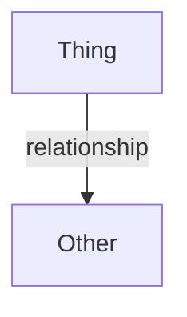

# Writing Bernini subsystem docs

Bernini's `docs/` markdown is read **mainly by AI agents**. Write for that audience.

## Core principle: map, not mirror

An agent that edits or calls the code opens the real source/header anyway. So:

- **Never reproduce full function signatures or class definitions.** Mirrored signatures are
  read twice (wasted tokens) and drift from the header (two sources of truth).
- Document only what an agent **cannot** cheaply reconstruct from a single header: cross-cutting
  design decisions, ownership/lifetime rules, threading, data flow between components, and the
  *non-obvious* method contracts.
- The header at each linked path is the source of truth. Say so, and point the agent there.
- Never document internal source code directly. Only the public API.

## Workflow

1. **Read the real source first.** Read every relevant header/impl before writing. Do not
   document from memory or from the old doc.
2. **Identify the interface layer, skip the noise.** Document the public/used API only. For the
   RHI that means the `bgl::I*` interfaces — **skip** the `bgl_d3d12` backend, the `detail::`
   namespace, private helpers, and utility functions. Prefer what passes/examples actually call.
3. **Extract the design choices** — the decisions that span files (e.g. "GPU resources are
   `uint32_t` generation index handles owned by a manager, not ref-counted pointers";
   fence-based deferred destruction; barriers owned by the FrameGraph). This is the doc's
   highest-value content.
4. **Build the interface index table** — every interface → file link → one-line role. Add a
   second table for supporting POD/helper types.
5. **List only risky method contracts** — methods where misuse causes corruption, crashes, or
   silent GPU hazards (null-on-exhaustion, fence preconditions, reference invalidation,
   must-outlive lifetime rules, don't-call-this-directly). Skip anything self-explanatory.
6. **Diagram the topology in Mermaid** (see below). Never ASCII art.
7. **Add one runnable usage sketch** and link to a real example under `examples/` if one exists.

## Required sections (in order)

1. **Title + intro** — one paragraph on what the subsystem is, plus a "map, not mirror" note:
   *the header at each linked path is the source of truth; when this doc disagrees, trust the
   header, then fix the doc.*
2. **Design Choices** — bulleted cross-cutting decisions. Lead with the most load-bearing one.
3. **Interface Index** — table(s) of interfaces and supporting types with file links.
4. **Topology** — a Mermaid diagram.
5. **Threading & Synchronization** — thread affinity, what needs external sync, the sync
   primitives. Only if the subsystem has concurrency semantics.
6. **Risky / Non-obvious Method Contracts** — grouped by interface; only the dangerous ones.
7. **Usage Sketch** — one concise `cpp` block + a link to a full example.

Drop any section that genuinely doesn't apply to the subsystem.

## Rules

- **Links are repo-root-relative** so an agent can feed them straight to its file tools:
  `[bgl/src/device/Device.h](bgl/src/device/Device.h)`, not `../bgl/...`. Cross-doc links use
  the same form: `[Frame Graph](docs/framegraph.md)`.
- **Method contracts use `@pre` / `@post` phrasing** in prose bullets — state preconditions
  (parameter validity, required object state), postconditions (side effects, allocations,
  throw behavior), and thread-safety where relevant. Do **not** wrap them in a fake class body.
- **Mermaid diagrams**, fenced as ` ```mermaid `. Prefer `flowchart TD`. Label edges with the
  call/relationship (`GetDevice()`, `owns`, `creates`, `ExecuteCommandList`). Keep node text
  short; put qualifiers in parentheses inside the node label.
- **Imperative, architectural tone.** No conversational filler, no history, no walk-throughs.
- **Flag inferred contracts.** If a thread-safety or lifetime rule is inferred rather than
  stated in code, keep it but make clear it's a design expectation.
- Read [STYLE.md](STYLE.md) for prose/code conventions if unsure.

## Maintenance note to include

The interface/type tables become the doc's load-bearing part; their file links rot silently
if files move or are renamed. When the subsystem's file layout changes, re-check the links.

## Skeleton

````markdown
# <Subsystem> — <one-line what it is>

<One paragraph: what it is and its boundary.>

**This document is a map, not a mirror.** It captures design choices, topology, and the
non-obvious contracts — not full signatures. The header at each linked path is the source of
truth; when this doc disagrees, trust the header, then fix this doc.

---

## Design Choices
* **<Most load-bearing decision>.** <why / how it shapes usage>
* ...

## Interface Index
| Interface | File | Role |
|---|---|---|
| `IFoo` | [path](path) | <one line> |

### Supporting types
| Type | File | Role |
|---|---|---|

## Topology


## Threading & Synchronization
* ...

## Risky / Non-obvious Method Contracts
### IFoo
* **`Bar(...)`** — <@pre / @post / hazard>.

## Usage Sketch
```cpp
// ...
```
See [examples/.../main.cpp](examples/.../main.cpp).
````

The canonical example of this style is [docs/rhi.md](docs/rhi.md).
