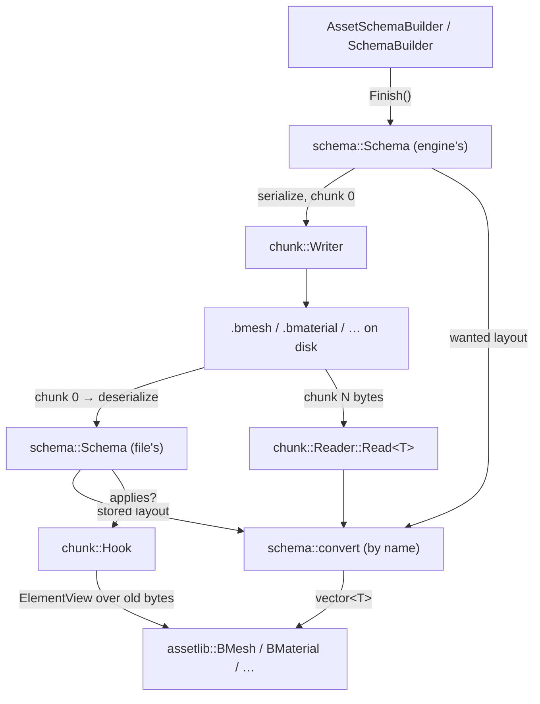

# Asset Schema — every container describes its own layout

Every asset container Bernini writes (`.bmesh`, `.bskel`, `.banim`, `.bvat`, `.bmaterial`, `.bsky`,
`.benvl`, `.benv`) is one chunked format whose chunk 0 is a **schema**: every struct the file stores,
field by field, by name, type, offset and count. A reader converts each chunk from the layout the
file stores to the one the engine wants — so a struct that gained, lost, widened, reordered or renamed
a field leaves every file on disk readable, with no code written by anyone. `libs/schema` is the
generic half (a schema, its builder, its byte form, the by-name converter); `assetlib` registers the
asset PODs and puts the schema in the container.

**This document is a map, not a mirror.** It captures design choices, topology, and the non-obvious
contracts — not full signatures. The header at each linked path is the source of truth; when this
doc disagrees, trust the header, then fix this doc.

---

## Design Choices

* **Layout comes from the file, never from the version number.** Two branches that both bump a
  container to the same number with different shapes produce two files no number can tell apart; each
  file's own schema can. The number in the header survives as a label — bumped when a schema changes,
  printed by `describe --schema` — and decides exactly one thing: a file **newer than the reader is
  refused**. A file from before the schema chunk is refused with a message that says so.
* **Fields match by name.** Names, not ids, so two developers adding different fields never collide,
  and a rename is one declaration (`AddRenamedField`) rather than a migration. The rule that follows:
  **a change of meaning renames the field** — `mtime` became `hash`, never `hash` under the old name —
  so the schema can see it.
* **Shape changes cost no code; meaning changes are a hook.** Add, remove, reorder, widen, grow an
  array, grow a nested struct: the converter handles all of them, defaulting what the file lacks and
  dropping what the engine no longer has (rules in
  [libs/schema/include/schema/convert.h](libs/schema/include/schema/convert.h)). What no rule can know
  — what a value the new shape does not carry should *become* — is a `chunk::Hook`: a predicate over
  the file's schema ("this file's `SourceStamp` still has an `mtime`"), never its version, and a body
  that reads the old bytes by name and repairs the converted struct.
* **Nothing lossy is a conversion.** Narrowing, float↔integer, signed→unsigned, value↔struct throw
  `Layout.field: file stores X, engine wants Y, no conversion`, prefixed with the container. A value
  that does not fit is data loss, and that is a hook's decision, not a copy's.
* **The current schema is a C++ builder beside the struct**, from member pointers, so offset and type
  come from the compiler and cannot drift; `Schema::Add` refuses a layout whose fields do not tile
  its `sizeof`, so a forgotten field fails at registration. The on-disk schema table is the same
  whether it was authored by a builder or, one day, by a generator.
* **Load in memory; write current on explicit save.** Opening a project never dirties it — the
  containers are binaries under version control. `assetlib_cli migrate` rewrites a whole project
  deliberately, leaves a file that is already current untouched (so a second run rewrites nothing),
  and reports a file it cannot read rather than half-writing it.
* **`assets/Frozen/` holds one file per container at its first self-describing schema, never
  rewritten.** Every later schema edit is measured against them by `Frozen_test`: a layout edit that
  leaves those unreadable is one that leaves every project unreadable, and that is where it fails
  first.

## Interface Index

| Interface | File | Role |
|---|---|---|
| `schema::Schema`, `Layout`, `Field`, `LayoutRef` | [libs/schema/include/schema/Schema.h](libs/schema/include/schema/Schema.h) | The layouts one container stores; `serialize`/`deserialize` are the byte form a file carries |
| `schema::LayoutBuilder<T>` | [libs/schema/include/schema/LayoutBuilder.h](libs/schema/include/schema/LayoutBuilder.h) | One POD's layout from member pointers; `AddField(name, member[, default])`, `AddRenamedField(name, formerly, member[, default])` |
| `schema::SchemaBuilder` | [libs/schema/include/schema/SchemaBuilder.h](libs/schema/include/schema/SchemaBuilder.h) | A schema as one chain of `AddLayout` calls; derive to add named registrations, which come first in a chain |
| `schema::convert`, `convertValues`, `widens`, `sameLayout`, `fieldShape` | [libs/schema/include/schema/convert.h](libs/schema/include/schema/convert.h) | Stored → wanted, by name; the lossless-widening rule; the message helper |
| `schema::ElementView` | [libs/schema/include/schema/ElementView.h](libs/schema/include/schema/ElementView.h) | Stored bytes read by field name — what a hook looks through |
| `assetlib::AssetSchemaBuilder` | [libs/assetlib/src/AssetSchemaBuilder.h](libs/assetlib/src/AssetSchemaBuilder.h) | The registrations of the `assetlib_structs` PODs (`AddTransform`, `AddNode`, `AddSubmesh`, …) |
| `chunk::Writer`, `chunk::Reader`, `chunk::Hook`, `readChunks`, `inspect` | [libs/assetlib/src/chunk_io.h](libs/assetlib/src/chunk_io.h) | The container: schema in chunk 0, typed entries, conversion on `Read`, hooks after it |
| `assetlib::inspectContainer`, `describe(const Schema&)` | [libs/assetlib/include/assetlib/container_info.h](libs/assetlib/include/assetlib/container_info.h) | A file's header and schema without loading it; the text `describe --schema` prints |
| `assetlib::migrateProject` | [libs/assetlib/include/assetlib/migrate.h](libs/assetlib/include/assetlib/migrate.h) | Re-save a whole data root at the current schema; `assetlib_cli migrate` |

### Supporting types
| Type | File | Role |
|---|---|---|
| `schema::Type` (`kValue`, `kStruct`, `kArray`), `schema::ValueType` (`kU8`…`kF64`) | [libs/schema/include/schema/Schema.h](libs/schema/include/schema/Schema.h) | What a field is, and what a value field holds — as `Uniforms`' `UniformType`/`UniformValueType` |
| `schema::FieldTraits<T>` | [libs/schema/include/schema/LayoutBuilder.h](libs/schema/include/schema/LayoutBuilder.h) | A member's C++ type as the schema sees it: `glm::vec3` is `f32[3]`, an enum its integer, `char` is `kU8` on every platform |
| `chunk::Entry`, `chunk::ElementKind` | [libs/assetlib/src/chunk_io.h](libs/assetlib/src/chunk_io.h) | A chunk's element: a layout of the schema, or a run of one scalar |

## Topology



## Risky / Non-obvious Method Contracts

### `schema::Schema::Add` / `LayoutBuilder::Finish`
* **@throws** if the layout reuses a name, names a layout not registered before it, or its fields do
  not tile its size — a gap before a field must be smaller than that field's alignment, the gap after
  the last smaller than the layout's. Register a struct's parts first (`Transform` before `Node`).
* A default (`AddField(name, member, value)`) is the whole field — an array for an array — and is
  typed by the member; it never reaches the byte form. Neither does a former name.

### `schema::convert`
* Copies a field only when the names match and `widens(stored, wanted)` holds; `u→wider u`,
  `i→wider i`, `u→strictly wider i`, `f32→f64` and nothing else. Arrays copy the shorter count and
  take the field's default for the rest; a missing field takes its default or zero. Everything else
  **@throws** naming layout, field and both shapes.
* A layout is matched by the field's name, never the layout's, so a nested struct may be renamed
  freely.

### `chunk::Writer` / `chunk::Reader`
* `Add<T>` **@throws** on a struct `T` the schema does not hold, and on id 0 (the schema's).
* `Reader` **@throws** on a version newer than its own, on a file with no schema chunk, on an entry
  whose element size disagrees with the layout it names, and passes `convert`'s errors on with the
  container's name in front. `Read<T>` is a copy when `sameLayout` holds and a conversion otherwise;
  a scalar chunk widens per element (`u16` indices read as `u32`).
* Hooks run after every `Read`, in registration order, on the assembled struct — `applyHooks` at
  the end of a container's `deserialize`. `Reader::View(id)` is the old bytes by name.
* `readChunks` (the ranged path `loadMeshRefs`, `loadVatRefs` and the staleness surveys use)
  fetches the schema chunk with the ones asked for and converts through the same code, so a survey
  still reads a few hundred bytes of a file of many megabytes.

### `assetlib::migrateProject`
* Never `.bvat` (derived, re-baked when unreadable) and never `.ktx2`. A file whose re-serialization
  is byte-identical is not written; the second walk of a preview-then-write is the report to trust,
  because the preview never attempts a write.

## Usage Sketch

```cpp
// A container's schema, once, beside its io. Register a struct's parts before the struct; the
// shared registrations first, a container's private records last.
const schema::Schema& meshSchema()
{
	static const schema::Schema c_Schema = AssetSchemaBuilder()
	    .AddTransform().AddNode().AddMesh().AddVertexLayout().AddSubmesh().AddMeshlet()
	    .AddLayout<MyPrivateRecord>("MyPrivateRecord", [](auto& l) {
	        l.AddField("count", &MyPrivateRecord::count)
	         .AddField("lodBias", &MyPrivateRecord::lodBias, 1.0f)                 // new: defaulted
	         .AddRenamedField("materialIndex", "material", &MyPrivateRecord::mat); // renamed
	    })
	    .Finish();
	return c_Schema;
}

// Writing and reading: the schema is chunk 0, every Read converts to the current shape.
chunk::Writer writer(meshSchema());
writer.Add(ChunkId::kNodes, mesh.nodes);
auto bytes = writer.Finish(magic::c_BMesh, c_VersionMajor, c_VersionMinor);

const chunk::Reader reader(bytes, magic::c_BMesh, c_VersionMajor, "bmesh", meshSchema());
mesh.nodes = reader.Require<Node>(ChunkId::kNodes);
chunk::applyHooks<BMesh>(hooks, reader, mesh);   // meaning changes only; usually none

// A meaning change, when one comes: predicate on the file's schema, never its version.
const chunk::Hook<BMesh> recoverHash{
	.applies = [](const schema::Schema& s) { const auto* l = s.Find("SourceStamp");
	    return l && std::ranges::find(l->fields, "mtime", &schema::Field::name) != l->fields.end(); },
	.run = [](const chunk::Reader& r, BMesh& m) { /* r.View(id).Get<uint64_t>("mtime") … */ } };
```

See [libs/assetlib/src/bmesh_io.cpp](libs/assetlib/src/bmesh_io.cpp) for a whole container, and
[libs/assetlib/tests/src/SchemaContainer_test.cpp](libs/assetlib/tests/src/SchemaContainer_test.cpp)
for the two-branch case with a hook.
