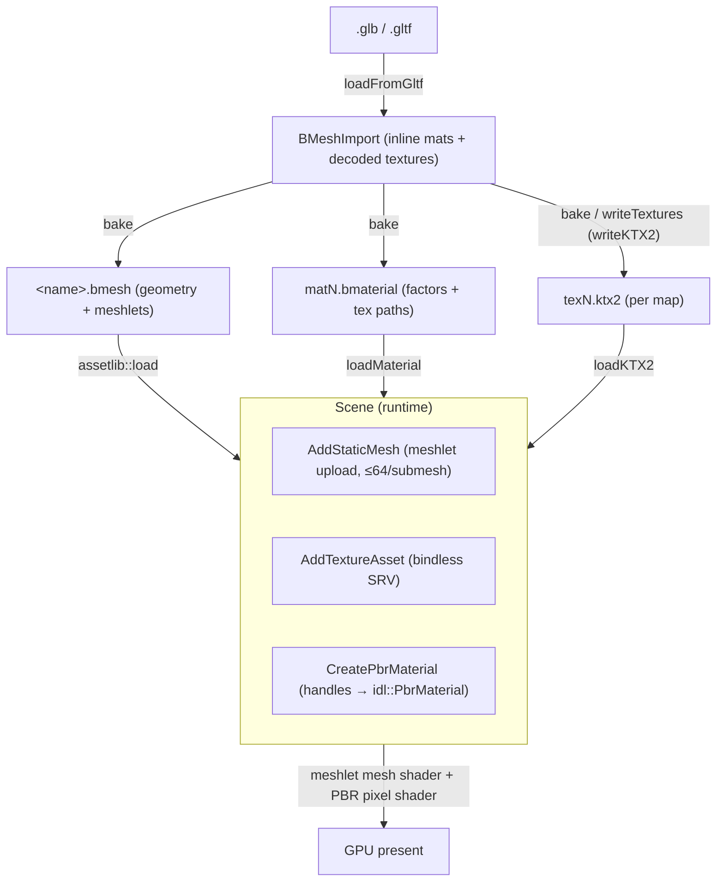

# Asset Standards — PBR texture & static-mesh conventions

The format, color-space, and channel conventions the renderer expects for PBR material textures
and static-mesh geometry, and how that data flows from glTF import → baked `.bmesh` / `.bmaterial`
/ texture files → GPU. This is the contract an asset must satisfy to render correctly; the pipeline
code and shaders enforce it.

**This document is a map, not a mirror.** It captures the conventions and cross-cutting decisions —
not full signatures or per-pixel shader code. The file at each linked path is the source of truth;
when this doc disagrees, trust the source, then fix this doc. In particular, **the PBR pixel shader
defines the texture contract** — channel meaning and color space live there, and the asset pipeline
must feed data that matches.

> **Textures are KTX2, GPU-compressed.** Bake and load go through **KTX2** via **libktx** —
> cross-platform, no DirectXTex. LDR material maps are **Basis UASTC** supercompressed at bake and
> **transcoded to BC7** at load (~4:1 vs uncompressed); HDR/IBL float maps stay uncompressed (Basis
> is LDR-only). See [GPU compression](#gpu-compression). sRGB is hardware at both ends and survives
> the UASTC round-trip, so base color still lands as a BC7 **sRGB** format.

---

## Design Choices

* **The shader owns the texture contract, not the file.** Channel semantics and color space are
  fixed by the PBR pixel shader
  [libs/bgl/shaders/src/Forward_PBR.slang](libs/bgl/shaders/src/Forward_PBR.slang) and the mesh /
  vertex-decode shaders. A `.ktx2` is just bytes + a format tag; if its channels or color
  space don't match what the shader reads, it renders wrong with no error. Author to the shader.
* **sRGB is hardware, at both ends — no gamma in the shaders.** Base-color textures use an **sRGB
  format** (`*_UNORM_SRGB`), so the sampler decodes sRGB→linear on read; the back-buffer **RTV is
  sRGB** (`SBGRA8_UNORM`), so the hardware encodes linear→sRGB on write. Lighting runs in linear
  space and the pixel shaders neither decode nor encode gamma (**no `pow`**). Consequence: a
  base-color texture supplied as plain `_UNORM` renders **washed out / desaturated** — it must carry
  an sRGB format (the bake tags it; hand-authored textures must use `*_UNORM_SRGB`). Normal and ORM
  stay `_UNORM` (linear data).
* **Color space is per-map.** Base color is sRGB (decoded by the sampler via its sRGB format).
  Normal, ORM, and the IBL maps carry linear data and are sampled raw.
* **ORM packing follows glTF metallic-roughness.** One texture, `R` = occlusion (AO), `G` =
  roughness, `B` = metallic. `roughness *= roughnessFactor`, `metallic *= metallicFactor`.
* **Honest vertex layout.** The importer packs *only* the attributes the source primitive provides
  and never fabricates a normal or tangent. Missing optional attributes decode to defaults on the
  GPU. **Position is the only required attribute**, and it must be the first one. See
  [Geometry Layout](docs/geometry_layout.md) for the GPU-side buffer structures this feeds.
* **Tangents are authored upstream, never synthesized at import.** Tangent generation is an explicit
  step in the 3D tool / material editor. A mesh with a normal map but no tangents renders with the
  *geometric* normal (the shader NaN-guards a degenerate tangent), so normal maps silently do nothing
  without authored tangents.
* **All static geometry is meshletized.** Meshes are clustered into meshlets (meshopt) at bake time —
  **64 vertices / 124 triangles** — and drawn through a mesh-shader pipeline, not raw index buffers.

---

## Texture standards

| Map | Color space | Mesh import → on GPU | **Material bake** → on GPU | Channels | Default when absent |
|---|---|---|---|---|---|
| **Base color** | **sRGB** (hardware-decoded) | UASTC sRGB → **BC7 sRGB** | **BC1 sRGB** (direct) | RGB albedo · A alpha | 1×1 white `(1,1,1,1)` |
| **Normal** | linear | UASTC → **BC7** | **BC5 UNORM** (direct) | RG = tangent-space X/Y (**Z reconstructed** in shader) | flat `(0.5,0.5,1)` |
| **ORM** | linear | UASTC → **BC7** | **BC7 UNORM** (direct) | R = AO · G = roughness · B = metallic | 1×1 white (AO=1; factors drive) |
| **IBL irradiance** | linear (HDR) | KTX2 cube map (float, uncompressed) | — | prefiltered diffuse cube | — (required via `SetEnvironmentMap`) |
| **IBL prefilter** | linear (HDR) | KTX2 cube map (float, uncompressed, mipped) | — | prefiltered specular cube (mip = roughness) | — |
| **IBL BRDF LUT** | linear | KTX2 2D (float, uncompressed) | — | RG (scale, bias) | — |

There are **two producers of textures**, and they compress differently:

* **Mesh import** (`bake` in [libs/assetlib/src/bmesh_io.cpp](libs/assetlib/src/bmesh_io.cpp)) writes
  Basis-UASTC `texN.ktx2`, which `loadKTX2` transcodes to BC7 on every load. Small on disk, uniform,
  and no per-map role needed.
* **Material bake** (`bakeMaterial` in
  [libs/assetlib/src/material_bake.cpp](libs/assetlib/src/material_bake.cpp)) composites the material
  editor's routed source textures into the triplet and writes each map into `<Data>/Textures/`
  **already in its block format**, so `loadKTX2` sees a non-Basis texture and uploads it with **no
  transcode**. libktx has no direct BC encoder, so `writeKTX2` UASTC-encodes and then
  `ktxTexture2_TranscodeBasis`es to the target (`Ktx2Compression::kBC1_RGB` / `kBC5_RG` / `kBC7_RGBA`).

  **Baked maps are shared, not owned by a material.** A map is named for the content that defines it --
  `orm_<hash>.ktx2`, where the hash covers the group, its resolution, its target format and the ordered
  (source, channel) pairs feeding it. Two materials whose ORM channels route identically therefore name
  the same file and write it once, instead of emitting byte-identical copies under each material's name.
  (The Apples model is exactly this: two submeshes, two materials, one shared ORM source.) A map that
  already exists and is newer than every source feeding it is not re-encoded.

  **Nothing owns a map, so nothing deletes one.** Because the name is a hash of the routing, re-baking a
  material whose routes changed writes a *new* file and simply stops naming the old one, which stays on
  disk forever. Reclaiming those is a whole-project mark and sweep -- never "delete the maps this
  material used to name", which would take a map still shared with someone else -- and that is what
  [libs/assetlib/include/assetlib/texture_prune.h](libs/assetlib/include/assetlib/texture_prune.h)
  does. See [Pruning unused baked maps](#pruning-unused-baked-maps).

  For that to be sound, **each group is sized independently**, to the largest source routed into *that
  group*. If the whole material shared one resolution, a material's ORM output would silently depend on
  the size of its base-colour texture, and two otherwise-identical ORM groups would diverge.

Two consequences of the baked formats worth knowing: **BC1 has no alpha**, so a base-colour alpha route
is dropped by the bake; and the compositor copies channel *bytes*, so a channel routed into base colour
is written into an sRGB map regardless of its own source's tag — keep one decode role per source
texture.

* **What the bake emits**: [libs/assetlib/src/bmesh_texture.cpp](libs/assetlib/src/bmesh_texture.cpp)
  (`rgba8ToImage`) builds an RGBA8 mip chain with `stb_image_resize`; `writeTextures`
  ([libs/assetlib/src/bmesh_io.cpp](libs/assetlib/src/bmesh_io.cpp)) tags **base-color maps as sRGB**
  (from the material's `baseColorTexture` usage) and everything else `_UNORM`, then `writeKTX2`
  ([libs/assetlib/src/image_io.cpp](libs/assetlib/src/image_io.cpp)) **Basis-UASTC-compresses** LDR
  maps (multi-threaded, `LEVEL_FASTER`) and writes one `texN.ktx2`. HDR/float inputs (the IBL maps)
  skip compression. On load, `loadKTX2` transcodes any Basis-supercompressed KTX2 to **BC7** and hands
  back an `ImageData` whose `vkFormat` is the BC7 block format (with block-aware subresource pitches).
  A material bake instead writes the per-map targets above, which load without transcoding.
* **Factors are linear** and live in the material, not the texture:
  `baseColorFactor` (linear, multiplies the *decoded* albedo), `metallicFactor`, `roughnessFactor`.
  See `PbrMaterialDesc` in [libs/bgl/include/bgl/IScene.h](libs/bgl/include/bgl/IScene.h) and the
  on-disk `.bmaterial` in
  [libs/assetlib_structs/include/assetlib_structs/BMaterial.h](libs/assetlib_structs/include/assetlib_structs/BMaterial.h).
* **Defaults come from the scene**, not the file — a null texture handle resolves to a 1×1 solid
  (white base/ORM, flat normal) built in
  [libs/bgl/src/scene/Scene.cpp](libs/bgl/src/scene/Scene.cpp). A material can omit any map.
* **Decoded image hand-off type:** `ImageData` in
  [libs/assetlib_structs/include/assetlib_structs/ImageData.h](libs/assetlib_structs/include/assetlib_structs/ImageData.h)
  — carries the raw **`vkFormat`** (the KTX2 container's native Vulkan format tag), cube flag, and
  D3D12-ordered (array-major, mip-minor) subresources. This is the API-neutral type between the codec
  (assetlib) and the RHI (bgl): the codec stores KTX2's `vkFormat` verbatim, and each backend maps it
  to its own format — the D3D12 RHI via `VkFormatToDXGI` in
  [libs/bgl/src/d3d12/util_d3d12.cpp](libs/bgl/src/d3d12/util_d3d12.cpp). No DXGI leaks into assetlib.

---

## Mesh standards

### Vertex layout
Interleaved, tightly packed; **stride = sum of present attributes** (variable — e.g. 32 bytes without
a tangent, 48 with). Decoded on the GPU per the submesh's `VertexLayout` descriptor, not a fixed
struct — see `DecodeVertex` in
[libs/bgl/shaders/src/forward/vertexdecode.slang](libs/bgl/shaders/src/forward/vertexdecode.slang).

| Attribute | Format | Required | Notes |
|---|---|---|---|
| position | `float32x3` | **yes** | must be the **first** attribute (offset 0) — the meshlet builder reads positions at stride intervals from offset 0 |
| normal | `float32x3` | no | default `(0,0,1)` |
| texcoord0 | `float32x2` | no | default `(0,0)` |
| tangent | `float32x4` | no | `xyz` + `w` = bitangent handedness; **authored upstream**; absent/zero → geometric-normal fallback |

Semantics/format enums: [libs/assetlib_structs/include/assetlib_structs/VertexLayout.h](libs/assetlib_structs/include/assetlib_structs/VertexLayout.h)
(CPU) mirror [libs/bgl/src/idl/VertexLayout.h](libs/bgl/src/idl/VertexLayout.h) (GPU) — the enum
ordering is shared so a layout maps field-for-field between them.

### Normal & tangent space

Three different spaces are in play and they are easy to conflate. The contract, end to end:

| Data | Space | Convention |
|---|---|---|
| vertex `normal` | **object** | unit-length; transformed to world in the mesh shader |
| vertex `tangent` | **object** | `float32x4`; `xyz` unit-length, `w` = ±1 bitangent handedness |
| bitangent | — | **not stored**; derived as `cross(N, T) * tangent.w` |
| normal **map** texel | **tangent** | OpenGL / glTF orientation: **+Y (green) is up** |

* **Vertex normals and tangents are authored in object space** and transformed to world space per
  vertex by the mesh shader, both by the mesh's `transform`
  ([libs/bgl/shaders/src/Forward_StaticMesh.slang](libs/bgl/shaders/src/Forward_StaticMesh.slang),
  `EvaluateVertices`). A tangent is a direction, so it transforms exactly like the normal; only
  `tangent.w` is left alone, because it is a sign and not a direction.
* **Uniform scale only.** Both are transformed by the plain upper-left `float3x3` of the model matrix,
  not its inverse-transpose. Under a **non-uniform** scale that skews the basis and the lighting is
  wrong. Bake non-uniform scale into the vertices at import, or the shader must switch to a normal
  matrix.
* **Normal maps are tangent-space, and Z is reconstructed, not sampled.** `CalculateNormal`
  ([libs/bgl/shaders/src/forward/PbrShading.slang](libs/bgl/shaders/src/forward/PbrShading.slang))
  takes only `xy`, unpacks `xy * 2 - 1`, and derives `z = sqrt(1 - dot(xy, xy))` — which is why the
  map can be stored two-channel `BC5_UNORM` with no blue channel. Two consequences:
  * An **object-space** or **world-space** normal map cannot be used. Z is forced positive, so any
    texel whose true normal points away from the surface is silently mangled.
  * A **DirectX-style (green-down)** map renders with its lighting inverted along Y. Nothing flips the
    green channel; glTF specifies OpenGL orientation and the engine follows it. Flip green at
    authoring time.
* **Handedness follows glTF**: `bitangent = cross(normal, tangent.xyz) * tangent.w`, and the shader
  builds `TBN = float3x3(T, B, N)` from it. A tangent whose `w` is 0 (rather than ±1) produces a
  degenerate bitangent and kills normal mapping for that vertex.
* **A degenerate tangent falls back to the geometric normal.** `CalculateNormal` re-orthogonalizes T
  against N (Gram-Schmidt) and bails out to N when the result is ~0 — this guards a `normalize(0)`
  NaN that would otherwise poison every lit pixel. So a mesh with a missing or zeroed tangent renders
  *unlit-by-normal-map* rather than broken, which is quiet: see the tangent contract under
  [Risky / Non-obvious contracts](#risky--non-obvious-contracts).

### Meshlets
* **64 vertices / 124 triangles** per meshlet, built with meshopt at import
  ([libs/assetlib/src/bmesh_gltf.cpp](libs/assetlib/src/bmesh_gltf.cpp), `buildMeshlets`). This
  ratio (~2 tris/vertex) matches typical manifold connectivity so both budgets fill together.
* **A submesh's meshlet count is unbounded**, up to the 65535 thread groups one `DispatchMesh` can
  launch. `Scene::AddStaticMesh`
  ([libs/bgl/src/scene/Scene.cpp](libs/bgl/src/scene/Scene.cpp)) emits one GPU submesh per source
  submesh and rejects anything past that limit; it never splits a submesh.
* The mesh shader runs `cMeshGroupSize` (64) threads and strides over both the up-to-64 vertices and
  the up-to-124 primitives — do not assume one thread per vertex or per primitive
  ([libs/bgl/shaders/src/Forward_StaticMesh.slang](libs/bgl/shaders/src/Forward_StaticMesh.slang)).

### Containers
* **`.bmesh`** — the modular on-disk mesh: node hierarchy, meshes, submeshes, meshlets +
  meshopt vertex/triangle pools, interleaved `vertexData`, and **material references by file path**.
  Struct: [libs/assetlib_structs/include/assetlib_structs/BMesh.h](libs/assetlib_structs/include/assetlib_structs/BMesh.h);
  container I/O: [libs/assetlib/include/assetlib/bmesh_io.h](libs/assetlib/include/assetlib/bmesh_io.h).
* **`.bmaterial`** (v4) — a material in **both** of its forms at once. Struct:
  [libs/assetlib_structs/include/assetlib_structs/BMaterial.h](libs/assetlib_structs/include/assetlib_structs/BMaterial.h);
  I/O: [libs/assetlib/include/assetlib/bmaterial_io.h](libs/assetlib/include/assetlib/bmaterial_io.h);
  bake: [libs/assetlib/include/assetlib/material_bake.h](libs/assetlib/include/assetlib/material_bake.h).
  * **Every texture path is relative to the project's Data root**, not to the material file: a material
    in `Data/Materials/` names `textures_src/tex1.ktx2` and `Textures/orm_a1b2c3d4.ktx2` wherever it
    lives. A standalone baked model directory is its own data root, which is how a `matN.bmaterial`
    beside its `texN.ktx2` still resolves.
  * **Sources** — a 9-entry `routes` table. Each PBR output channel (base colour R,G,B,A; ORM ao,
    roughness, metallic; normal X,Y) names a *source* texture and which of *its* RGBA channels to read.
    This is what the material editor authors, and what `LoosePbrMaterial` samples directly with no bake.
  * **Optimized** — the baseColor / normal / orm triplet, plus the factors. The output of `bakeMaterial`
    (or of a glTF import), and what `PbrMaterial` consumes. A bake writes them into
    `<Data>/Textures/`.
  * Both may be populated simultaneously, and normally are: a baked material keeps its routes so it can
    be reopened, re-authored and re-baked. `mode` says which representation **the renderer should draw
    from** — it is *not* a statement about which fields are filled.
  * `routeStamps` — parallel to `routes`: the size + mtime each source measured when the bake read it.
    `bakeIsStale(material, dir)` re-stats the sources and reports whether the triplet still reflects
    them. Editing a source therefore surfaces as a stale bake rather than silently rendering the old
    cooked textures. Size+mtime, not a content hash: verifying a hash would mean reading every source on
    every load, and a false positive only costs a rebake.
  * `editorGraph` — the node graph, as an opaque JSON blob. Nothing outside the editor reads it and it
    never affects rendering; it exists so reopening a material restores the board that produced the
    routes, node positions and unwired nodes included.
  * **Export strips authoring data.** `stripAuthoringData` clears `routes`, `routeStamps` and
    `editorGraph` and forces `kBaked`, leaving the triplet + factors + name. A shipping build carries no
    source-texture references. It refuses to strip a material that was never baked, which would leave
    nothing to render.
  * Older files still load: v1 (factors + triplet) as `kBaked` with empty routes, v2 with no graph, v3
    with no stamps — so a v3 loose material reports its bake as stale, which is correct: it never had one.
* A baked model on disk is therefore `<name>.bmesh` + one `matN.bmaterial` per material + one texture
  file per texture, all in one directory.

---

## Topology



---

## GPU compression

LDR material maps are **Basis Universal (UASTC)** supercompressed at bake and **transcoded to BC7**
at load — cross-platform, DirectXTex-free, and roughly **4:1** smaller than uncompressed RGBA8 in
both file and VRAM.

* **Encode (bake).** `writeKTX2` ([libs/assetlib/src/image_io.cpp](libs/assetlib/src/image_io.cpp))
  builds the uncompressed RGBA8 mip chain into a `ktxTexture2`, then, for 8-bit LDR formats only,
  calls `ktxTexture2_CompressBasisEx` with **UASTC** (`LEVEL_FASTER`, `threadCount =
  hardware_concurrency` — UASTC output is deterministic regardless of thread count, and
  single-threaded 4K encodes are prohibitively slow). sRGB base-color inputs keep an sRGB transfer
  function through the encode.
* **Transcode (load).** `loadKTX2` calls `ktxTexture2_NeedsTranscoding`; if set,
  `ktxTexture2_TranscodeBasis(…, KTX_TTF_BC7_RGBA)`. The resulting `vkFormat` is `BC7_SRGB_BLOCK`
  (base color) or `BC7_UNORM_BLOCK` (normal/ORM), which flows through `VkFormatToDXGI` →
  `BC7_UNORM[_SRGB]` → engine format. Subresource **row pitches are block-aware** (`ceil(w/4)·16`).
  Pass `Ktx2Decode::kRgba8` to transcode to `KTX_TTF_RGBA32` instead — for code that must *read* texels
  rather than draw them, i.e. the material bake compositing its sources. An already-block-compressed
  file (a baked map) cannot be decoded that way and is rejected: BC blocks do not transcode back.
* **HDR/IBL stays uncompressed.** Basis Universal is LDR-only, so float cube/2D maps skip compression
  and keep their `R16/R32` float formats (BC6H HDR compression is a possible follow-up).
* **Per-map targets are chosen at bake, not at load.** `loadKTX2` still needs no per-map role: a mesh
  import's UASTC textures all transcode to BC7, and a material bake's textures already carry their
  block format (`BC1_RGB_SRGB` / `BC5_UNORM` / `BC7_UNORM`), so nothing about the file has to be
  interpreted. The bake reaches those formats by transcoding UASTC → target *before* writing, since
  libktx exposes no direct BC encoder. On-disk zstd/ETC1S remains a possible refinement.
* **Debug builds link the *Release* libktx.** The Basis encoder/transcoder is unusably slow when
  compiled unoptimized (debug basisu is ~20–100× slower), so the root `CMakeLists.txt` maps
  `KTX::ktx` to its Release config and deploys the Release `ktx.dll` over the debug one in every
  build. ktx is a pure-C-API DLL, so this cross-config mix is safe. If a bake or texture load ever
  crawls, check that the deployed `ktx.dll` is the ~1.7 MB Release build, not the ~4.6 MB debug one.
* **Round-trip test:** [libs/assetlib/tests/src/Ktx2_test.cpp](libs/assetlib/tests/src/Ktx2_test.cpp)
  (`[ktx2]`) exercises mip-gen → UASTC encode → BC7 transcode, asserting the sRGB tag and block pitch
  survive.

### Related cross-platform cleanups (done alongside the container swap)

* **Screenshots use `stb_image_write`** (PNG), not DirectXTex/WIC — see `ScreenshotRaw`/`ScreenshotPng`
  in [libs/bgl/src/d3d12/Graphics_d3d12.cpp](libs/bgl/src/d3d12/Graphics_d3d12.cpp). The BGRA
  back-buffer readback is repacked to tight RGBA (R/B swizzle, padding dropped) before encoding.
* **Golden-image comparison** decodes the two PNGs with `stb_image` and computes a hand-written MSE
  ([libs/bgl/tests/src/util/GoldenImage.cpp](libs/bgl/tests/src/util/GoldenImage.cpp),
  `MatchesGolden`), replacing `DirectX::ComputeMSE`. Golden refs are `assets/golden/<name>.exp.png`.

---

## Pruning unused baked maps

A re-bake orphans the map its old routing named (see [Texture standards](#texture-standards)), so
`<Data>/Textures/` grows monotonically. `findUnusedBakedTextures` / `deleteUnusedBakedTextures`
([libs/assetlib/include/assetlib/texture_prune.h](libs/assetlib/include/assetlib/texture_prune.h))
reclaim them, exposed as `assetlib_cli prune` and as the editor's **File ▸ Clean Unused Textures…**.
The scan is separate from the delete so both surfaces can show what they are about to destroy and take
a confirmation first.

It is a **mark and sweep over the whole project**, and each half has a rule that is easy to get wrong:

* **Mark** — every `.bmaterial` below the data root is loaded and its baked triplet marked live,
  **whatever its `mode` says**. A `kLoose` material still carries the triplet of its last bake, and
  that bake is a valid thing to switch back to; deleting its maps because the renderer happens to be
  drawing from the routes today would destroy it. A material that fails to load **aborts the scan**
  rather than being skipped — an unread material is one whose references cannot be known, and the maps
  it alone keeps alive would otherwise be swept as garbage.
* **Sweep** — only files matching the bake's own naming, `<group>_<16 hex>.ktx2`, are candidates.
  That test is `isBakedMapName`, deliberately kept in `material_bake.cpp` beside the `c_Groups` table
  that *writes* the names, so the two cannot drift. It is what keeps the hand-placed maps sharing the
  directory — `skybox.ktx2`, `iem.ktx2`, `pmrem.ktx2`, `brdf_lut.ktx2`, which are named in config and
  by no material at all — from being swept as unreferenced.

Because a baked name is a content hash, the live set is keyed by **file name**, not by the path a
material stored: the name alone identifies the map, and a material that reached it through a different
`textureDir` still protects it. Every ambiguity is resolved toward *keeping* a file, which is the only
direction a prune is allowed to err in.

---

## Risky / Non-obvious contracts

* **Base color must carry an sRGB format.** Nothing in the pixel shader decodes gamma — the sampler
  does, via the texture's sRGB format. A base-color texture written as plain `_UNORM` (e.g. from an
  external tool) renders **washed out / desaturated**. The bake tags base-color maps sRGB; hand-
  authored ones must use a `*_UNORM_SRGB` format. Normal/ORM stay `_UNORM` (linear).
* **Metallic without an ORM map reads fully metallic.** glTF's `metallicFactor` defaults to **1.0**.
  With no ORM texture, `metallic = default_white.b (1) * metallicFactor (1) = 1` → the surface shows
  only environment reflection (washed out), not its base color. Provide the ORM map *or* set
  `metallicFactor` to 0 for non-metals.
* **Normal map with no tangents does nothing.** `CalculateNormal` falls back to the geometric normal
  when the tangent is degenerate (guards a `normalize(0)` NaN that would otherwise poison every lit
  pixel). Generate tangents upstream, or the (BC7) normal map has no effect.
* **Re-bake after the honest-layout change.** A `.bmesh` baked before the importer stopped
  zero-filling still *claims* to have (zero) tangents in its layout. Re-bake to get a truthful layout
  (and so runtime tangent-presence validation can trust it).
* **Position must be first.** Both the meshlet builder and vertex decode assume position is attribute
  0 at byte offset 0. Reordering the layout breaks meshlet bounds and vertex fetch.
* **Meshlet capacity is the hard cap, not meshlet count.** A meshlet over `cMaxVerticesPerMeshlet`
  (64) vertices or `cMaxPrimsPerMeshlet` (124) triangles overruns the mesh shader's output arrays and
  renders garbage. How *many* meshlets a submesh holds is unconstrained up to 65535. The two limits
  are unrelated, and splitting a submesh on the second one fixes nothing about the first.

---

## Usage

```bash
# Bake a source model into the modular on-disk form (.bmesh + matN.bmaterial + texN.ktx2)
assetlib_cli bake model.glb -o assets/model -n model

# Inspect the baked geometry in a viewer (meshlet-reconstructed, or --raw for the source indices)
assetlib_cli obj assets/model/model.bmesh -o model.obj

# Print what is actually inside a .bmesh or .bmaterial (the kind is read from the file's magic)
assetlib_cli describe Data/Meshes/model.bmesh            # hierarchy, submeshes, layouts, materials
assetlib_cli describe Data/Meshes/model.bmesh --brief    # summary + material table only
assetlib_cli describe Data/Materials/skin.bmaterial      # mode, factors, triplet, routing table

# ...and with a data root, each routed source is stat'd, so a stale bake is reported per channel
assetlib_cli describe Data/Materials/skin.bmaterial -d Data

# List the baked maps no material references any more, and delete nothing
assetlib_cli prune -d Data --dry-run

# Delete them. Asks first; -y skips the prompt, and a closed stdin answers no
assetlib_cli prune -d Data
```

`describe` is the counterpart of `obj`: `obj` dumps the geometry for a viewer, `describe` dumps
everything else as text. Both containers are opaque binary, so it is the intended answer to "what is
in this file" — reach for it before hand-decoding a file against the serializer. The unrouted channels
it lists are the usual cause of a material rendering wrong, since each one silently falls back to a
default texture (see [Risky / Non-obvious contracts](#risky--non-obvious-contracts)). Rendered by
[libs/assetlib/include/assetlib/asset_describe.h](libs/assetlib/include/assetlib/asset_describe.h),
which the editor can also call for an asset inspector.

Runtime load + render (load `.bmesh`, resolve each `.bmaterial` and its textures into PBR materials,
upload geometry, draw): [examples/bgl_base/src/main.cpp](examples/bgl_base/src/main.cpp).

---

*Maintenance: the file links above are the load-bearing part of this doc and rot silently if files
move. Re-check them when the asset pipeline's layout changes — the compression path lives in
`image_io.cpp` (`writeKTX2` UASTC encode + `loadKTX2` BC7 transcode), the `VkFormat` catalog in
`assetlib_structs/VkFormat.h`, and its `VkFormatToDXGI` mapping in `libs/bgl/src/d3d12/util_d3d12.cpp`.*
