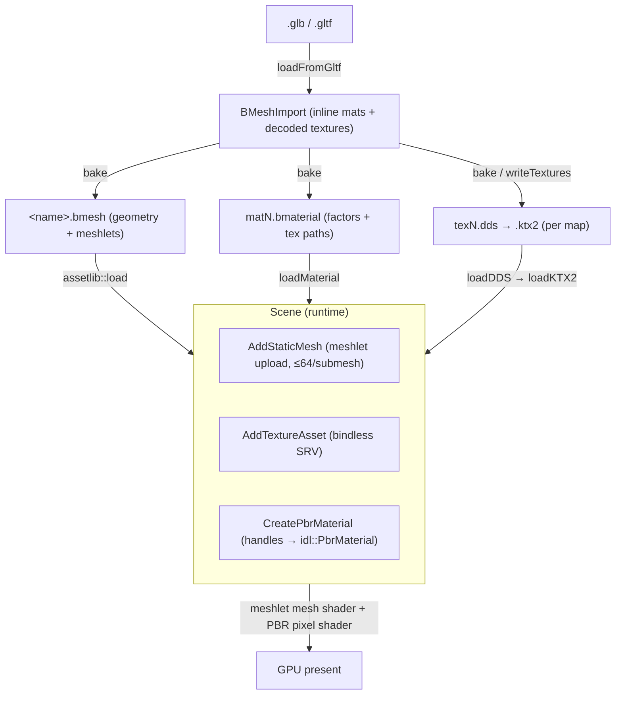

# Asset Standards — PBR texture & static-mesh conventions

The format, color-space, and channel conventions the renderer expects for PBR material textures
and static-mesh geometry, and how that data flows from glTF import → baked `.bmesh` / `.bmaterial`
/ texture files → GPU. This is the contract an asset must satisfy to render correctly; the pipeline
code and shaders enforce it.

**This document is a map, not a mirror.** It captures the conventions and cross-cutting decisions —
not full signatures or per-pixel shader code. The file at each linked path is the source of truth;
when this doc disagrees, trust the source, then fix this doc. In particular, **the PBR pixel shader
defines the texture contract** — channel meaning and color space live there, and the asset pipeline
must feed data that matches.

> **Migration in flight:** textures currently bake to **uncompressed** DDS; the engine is moving to
> **KTX2** for GPU-compressed, cross-platform textures. Formats marked "current" below are
> provisional — see [The DDS → KTX2 migration](#the-dds--ktx2-migration). (sRGB itself is already
> hardware, on DDS today — the migration is about compression, not color space.)

---

## Design Choices

* **The shader owns the texture contract, not the file.** Channel semantics and color space are
  fixed by the PBR pixel shader
  [libs/bgl/shaders/src/Forward_PBR.slang](libs/bgl/shaders/src/Forward_PBR.slang) and the mesh /
  vertex-decode shaders. A `.dds`/`.ktx2` is just bytes + a format tag; if its channels or color
  space don't match what the shader reads, it renders wrong with no error. Author to the shader.
* **sRGB is hardware, at both ends — no gamma in the shaders.** Base-color textures use an **sRGB
  format** (`*_UNORM_SRGB`), so the sampler decodes sRGB→linear on read; the back-buffer **RTV is
  sRGB** (`SBGRA8_UNORM`), so the hardware encodes linear→sRGB on write. Lighting runs in linear
  space and the pixel shaders neither decode nor encode gamma (**no `pow`**). Consequence: a
  base-color texture supplied as plain `_UNORM` renders **washed out / desaturated** — it must carry
  an sRGB format (the bake tags it; hand-authored textures must use `*_UNORM_SRGB`). Normal and ORM
  stay `_UNORM` (linear data).
* **Color space is per-map.** Base color is sRGB (decoded in-shader). Normal, ORM, and the IBL maps
  carry linear data and are sampled raw.
* **ORM packing follows glTF metallic-roughness.** One texture, `R` = occlusion (AO), `G` =
  roughness, `B` = metallic. `roughness *= roughnessFactor`, `metallic *= metallicFactor`.
* **Honest vertex layout.** The importer packs *only* the attributes the source primitive provides
  and never fabricates a normal or tangent. Missing optional attributes decode to defaults on the
  GPU. **Position is the only required attribute**, and it must be the first one. See
  [Geometry Layout](docs/geometry_layout.md) for the GPU-side buffer structures this feeds.
* **Tangents are authored upstream, never synthesized at import.** Tangent generation is an explicit
  step in the 3D tool / material editor. A mesh with a normal map but no tangents renders with the
  *geometric* normal (the shader NaN-guards a degenerate tangent), so normal maps silently do nothing
  without authored tangents.
* **All static geometry is meshletized.** Meshes are clustered into meshlets (meshopt) at bake time —
  **64 vertices / 124 triangles** — and drawn through a mesh-shader pipeline, not raw index buffers.

---

## Texture standards

| Map | Color space | Format (current → target) | Channels | Default when absent |
|---|---|---|---|---|
| **Base color** | **sRGB** (hardware-decoded via `*_UNORM_SRGB`) | `R8G8B8A8_UNORM_SRGB` DDS → **BC7/BC1 sRGB** KTX2 | RGB albedo · A alpha | 1×1 white `(1,1,1,1)` |
| **Normal** | linear | (author-supplied) → **BC5_UNORM** | RG = tangent-space X/Y (**Z reconstructed** in shader) | flat `(0.5,0.5,1)` |
| **ORM** | linear | `R8G8B8A8_UNORM` DDS → **BC1** | R = AO · G = roughness · B = metallic | 1×1 white (AO=1; factors drive) |
| **IBL irradiance** | linear (HDR) | DDS cube map | prefiltered diffuse cube | — (required via `SetEnvironmentMap`) |
| **IBL prefilter** | linear (HDR) | DDS cube map | prefiltered specular cube (mip = roughness) | — |
| **IBL BRDF LUT** | linear | DDS 2D | RG (scale, bias) | — |

* **"Current" = what the bake emits today**: [libs/assetlib/src/bmesh_texture.cpp](libs/assetlib/src/bmesh_texture.cpp)
  (`rgba8ToImage`) writes **uncompressed RGBA8 with a generated mip chain**, and `writeTextures`
  ([libs/assetlib/src/bmesh_io.cpp](libs/assetlib/src/bmesh_io.cpp)) tags **base-color maps as
  `R8G8B8A8_UNORM_SRGB`** (from the material's `baseColorTexture` usage) and everything else as
  `_UNORM`. The **BC** targets are the standard the runtime already *loads* —
  [libs/assetlib/include/assetlib/image_io.h](libs/assetlib/include/assetlib/image_io.h) (`loadDDS`)
  carries whatever `DXGI_FORMAT` the file declares, so hand-/tool-authored BC1/BC5/BC7 (incl. sRGB)
  DDS load and sample correctly today; the CLI bake just doesn't *compress* yet.
* **Factors are linear** and live in the material, not the texture:
  `baseColorFactor` (linear, multiplies the *decoded* albedo), `metallicFactor`, `roughnessFactor`.
  See `PbrMaterialDesc` in [libs/bgl/include/bgl/IScene.h](libs/bgl/include/bgl/IScene.h) and the
  on-disk `.bmaterial` in
  [libs/assetlib_structs/include/assetlib_structs/BMaterial.h](libs/assetlib_structs/include/assetlib_structs/BMaterial.h).
* **Defaults come from the scene**, not the file — a null texture handle resolves to a 1×1 solid
  (white base/ORM, flat normal) built in
  [libs/bgl/src/scene/Scene.cpp](libs/bgl/src/scene/Scene.cpp). A material can omit any map.
* **Decoded image hand-off type:** `ImageData` in
  [libs/assetlib_structs/include/assetlib_structs/ImageData.h](libs/assetlib_structs/include/assetlib_structs/ImageData.h)
  — carries the raw `dxgiFormat`, cube flag, and D3D12-ordered (array-major, mip-minor) subresources.
  This is the neutral type between the codec (assetlib) and the RHI (bgl); it is format-agnostic and
  survives the KTX2 switch unchanged.

---

## Mesh standards

### Vertex layout
Interleaved, tightly packed; **stride = sum of present attributes** (variable — e.g. 32 bytes without
a tangent, 48 with). Decoded on the GPU per the submesh's `VertexLayout` descriptor, not a fixed
struct — see `DecodeVertex` in
[libs/bgl/shaders/src/forward/vertexdecode.slang](libs/bgl/shaders/src/forward/vertexdecode.slang).

| Attribute | Format | Required | Notes |
|---|---|---|---|
| position | `float32x3` | **yes** | must be the **first** attribute (offset 0) — the meshlet builder reads positions at stride intervals from offset 0 |
| normal | `float32x3` | no | default `(0,0,1)` |
| texcoord0 | `float32x2` | no | default `(0,0)` |
| tangent | `float32x4` | no | `xyz` + `w` = bitangent handedness; **authored upstream**; absent/zero → geometric-normal fallback |

Semantics/format enums: [libs/assetlib_structs/include/assetlib_structs/VertexLayout.h](libs/assetlib_structs/include/assetlib_structs/VertexLayout.h)
(CPU) mirror [libs/bgl/src/idl/VertexLayout.h](libs/bgl/src/idl/VertexLayout.h) (GPU) — the enum
ordering is shared so a layout maps field-for-field between them.

### Meshlets
* **64 vertices / 124 triangles** per meshlet, built with meshopt at import
  ([libs/assetlib/src/bmesh_gltf.cpp](libs/assetlib/src/bmesh_gltf.cpp), `buildMeshlets`). This
  ratio (~2 tris/vertex) matches typical manifold connectivity so both budgets fill together.
* **≤ 64 meshlets per runtime submesh** (`cMaxMeshletsPerAccelerationStructure`,
  [libs/bgl/src/idl/Constants.h](libs/bgl/src/idl/Constants.h)). `Scene::AddStaticMesh`
  ([libs/bgl/src/scene/Scene.cpp](libs/bgl/src/scene/Scene.cpp)) splits a source submesh that
  exceeds this into multiple GPU submeshes sharing the vertex data.
* The mesh shader runs 64 threads and strides over the up-to-124 primitives — do not assume
  one-thread-per-primitive ([libs/bgl/shaders/src/Forward_StaticMesh.slang](libs/bgl/shaders/src/Forward_StaticMesh.slang)).

### Containers
* **`.bmesh`** — the modular on-disk mesh: node hierarchy, meshes, submeshes, meshlets +
  meshopt vertex/triangle pools, interleaved `vertexData`, and **material references by file path**.
  Struct: [libs/assetlib_structs/include/assetlib_structs/BMesh.h](libs/assetlib_structs/include/assetlib_structs/BMesh.h);
  container I/O: [libs/assetlib/include/assetlib/bmesh_io.h](libs/assetlib/include/assetlib/bmesh_io.h).
* **`.bmaterial`** — factors + texture path references (relative to the material file). Struct:
  [libs/assetlib_structs/include/assetlib_structs/BMaterial.h](libs/assetlib_structs/include/assetlib_structs/BMaterial.h);
  I/O: [libs/assetlib/include/assetlib/bmaterial_io.h](libs/assetlib/include/assetlib/bmaterial_io.h).
* A baked model on disk is therefore `<name>.bmesh` + one `matN.bmaterial` per material + one texture
  file per texture, all in one directory.

---

## Topology



---

## The DDS → KTX2 migration

The engine will replace DDS with **KTX2** (Khronos container). Why it matters and what has to change:

* **Color space is already sorted; this is about compression.** sRGB is handled in hardware today
  (sRGB base-color format + sRGB back-buffer RTV), so KTX2 changes nothing about the pixel shaders —
  it just carries the sRGB/format tag natively rather than the bake calling `MakeSRGB`.
* **Cross-platform GPU compression.** KTX2 + Basis Universal (UASTC/ETC1S) transcodes to BC / ASTC /
  ETC at load, which drops the **Windows-only DirectXTex** dependency in the bake and shrinks
  on-disk/VRAM footprint versus today's uncompressed RGBA8.
* **Per-map format targets** (unchanged by the container, but this is when they land): base color →
  BC7/BC1 **sRGB**; normal → **BC5_UNORM** (two-channel, Z already reconstructed in shader); ORM →
  BC1 **linear**.
* **Pipeline touch points:**
  * `writeTextures` / `writeDDS`
    ([libs/assetlib/src/bmesh_io.cpp](libs/assetlib/src/bmesh_io.cpp),
    [libs/assetlib/src/bmesh_texture.cpp](libs/assetlib/src/bmesh_texture.cpp)) emit `.ktx2`; the
    per-map color space / format must be chosen from the material's usage of each texture (base color
    → sRGB, others → linear).
  * `.bmaterial` texture path references become `.ktx2`.
  * `loadDDS` ([libs/assetlib/include/assetlib/image_io.h](libs/assetlib/include/assetlib/image_io.h))
    gains/gives way to a KTX2 loader; `ImageData` stays the neutral hand-off (it already carries an
    arbitrary format + subresource layout).

---

## Risky / Non-obvious contracts

* **Base color must carry an sRGB format.** Nothing in the pixel shader decodes gamma — the sampler
  does, via the texture's sRGB format. A base-color texture written as plain `_UNORM` (e.g. from an
  external tool) renders **washed out / desaturated**. The bake tags base-color maps sRGB; hand-
  authored ones must use a `*_UNORM_SRGB` format. Normal/ORM stay `_UNORM` (linear).
* **Metallic without an ORM map reads fully metallic.** glTF's `metallicFactor` defaults to **1.0**.
  With no ORM texture, `metallic = default_white.b (1) * metallicFactor (1) = 1` → the surface shows
  only environment reflection (washed out), not its base color. Provide the ORM map *or* set
  `metallicFactor` to 0 for non-metals.
* **Normal map with no tangents does nothing.** `CalculateNormal` falls back to the geometric normal
  when the tangent is degenerate (guards a `normalize(0)` NaN that would otherwise poison every lit
  pixel). Generate tangents upstream, or the BC5 normal map has no effect.
* **Re-bake after the honest-layout change.** A `.bmesh` baked before the importer stopped
  zero-filling still *claims* to have (zero) tangents in its layout. Re-bake to get a truthful layout
  (and so runtime tangent-presence validation can trust it).
* **Position must be first.** Both the meshlet builder and vertex decode assume position is attribute
  0 at byte offset 0. Reordering the layout breaks meshlet bounds and vertex fetch.
* **Submesh meshlet cap.** A runtime submesh must hold ≤ `cMaxMeshletsPerAccelerationStructure` (64)
  meshlets. `AddStaticMesh` chunks automatically; a hand-built submesh that exceeds it renders garbage.

---

## Usage

```bash
# Bake a source model into the modular on-disk form (.bmesh + matN.bmaterial + texN.dds)
assetlib_cli bake model.glb -o assets/model -n model

# Inspect the baked geometry in a viewer (meshlet-reconstructed, or --raw for the source indices)
assetlib_cli obj assets/model/model.bmesh -o model.obj
```

Runtime load + render (load `.bmesh`, resolve each `.bmaterial` and its textures into PBR materials,
upload geometry, draw): [examples/bgl_base/src/main.cpp](examples/bgl_base/src/main.cpp).

---

*Maintenance: the file links above are the load-bearing part of this doc and rot silently if files
move. Re-check them when the asset pipeline's layout changes — especially through the KTX2 migration,
which will touch `bmesh_texture.cpp`, `image_io.h` / `writeTextures`, and the DDS loader.*
