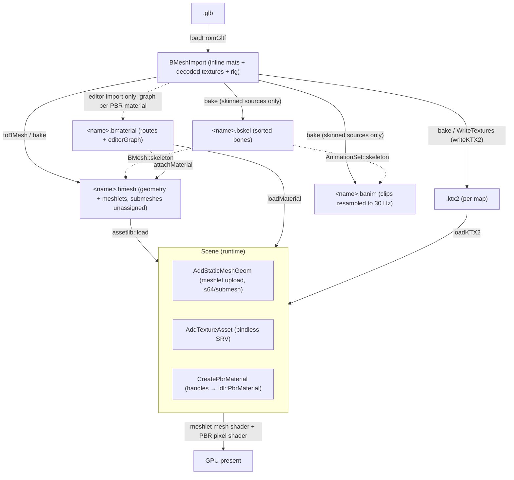

# Asset Standards — PBR texture, mesh & rig conventions

The format, color-space, and channel conventions the renderer expects for PBR material textures,
mesh geometry and animation rigs, and how that data flows from glTF import → baked `.bmesh` /
`.bmaterial` / `.bskel` / `.banim` / texture files → GPU. This is the contract an asset must satisfy
to render correctly; the pipeline code and shaders enforce it.

**This document is a map, not a mirror.** It captures the conventions and cross-cutting decisions —
not full signatures or per-pixel shader code. The file at each linked path is the source of truth;
when this doc disagrees, trust the source, then fix this doc. In particular, **the PBR pixel shader
defines the texture contract** — channel meaning and color space live there, and the asset pipeline
must feed data that matches.

> **Textures are KTX2, GPU-compressed.** Bake and load go through **KTX2** via **libktx** —
> cross-platform, no DirectXTex. LDR material maps are **Basis UASTC** supercompressed at bake and
> **transcoded to BC7** at load (~4:1 vs uncompressed); HDR/IBL float maps stay uncompressed (Basis
> is LDR-only). See [GPU compression](#gpu-compression). sRGB is hardware at both ends and survives
> the UASTC round-trip, so base color still lands as a BC7 **sRGB** format.

---

## Design Choices

* **The shader owns the texture contract, not the file.** Channel semantics and color space are
  fixed by the PBR pixel shader
  [libs/bgl_extended/shaders/src/programs/forward/PBR.slang](libs/bgl_extended/shaders/src/programs/forward/PBR.slang) and the mesh /
  vertex-decode shaders. A `.ktx2` is just bytes + a format tag; if its channels or color
  space don't match what the shader reads, it renders wrong with no error. Author to the shader.
* **sRGB is hardware, at both ends — no gamma in the shaders.** Base-color textures use an **sRGB
  format** (`*_UNORM_SRGB`), so the sampler decodes sRGB→linear on read; the back-buffer **RTV is
  sRGB** (`SBGRA8_UNORM`), so the hardware encodes linear→sRGB on write. Lighting runs in linear
  space and the pixel shaders neither decode nor encode gamma (**no `pow`**). Consequence: a
  base-color texture supplied as plain `_UNORM` renders **washed out / desaturated** — it must carry
  an sRGB format (the bake tags it; hand-authored textures must use `*_UNORM_SRGB`). Normal and ORM
  stay `_UNORM` (linear data).
* **Color space is per-map.** Base color is sRGB (decoded by the sampler via its sRGB format).
  Normal, ORM, and the IBL maps carry linear data and are sampled raw.
* **ORM packing follows glTF metallic-roughness.** One texture, `R` = occlusion (AO), `G` =
  roughness, `B` = metallic. `roughness *= roughnessFactor`, `metallic *= metallicFactor`. Note that
  glTF itself specifies only `G` and `B` of its metallic-roughness texture; `R` carrying occlusion is
  the widespread shared-ORM convention, not the format. An imported material takes `R` from the
  material's own `occlusionTexture` wherever it names one — see
  [Importing a glTF's materials](#importing-a-gltfs-materials).
* **assetlib never derives a material; the editor's import does.** `toBMesh` lands every submesh
  unassigned, and `attachMaterial` is the only thing that ever binds one — so `assetlib_cli bake`
  produces geometry and textures and nothing else. The editor's import is a *caller* of that seam: it
  builds the graph each PBR glTF material describes, writes the `.bmaterial`, and attaches it. The
  split matters because a glTF material is only glTF's shading model, and the choice to accept it is
  the editor's to make per import, not a property of the container. See
  [Importing a glTF's materials](#importing-a-gltfs-materials).

  It is also why the split cannot be closed by moving code down. The board *is* the routing table --
  `CompileMaterial` reads a material's nine routes back out of it, so there is no second table to
  disagree with -- and the board is QtNodes. Deriving materials in `assetlib` would mean either
  linking Qt into a CLI that is deliberately free of it, or writing that second table.
* **Honest vertex layout.** The importer packs *only* the attributes the source primitive provides
  and never fabricates a normal. The tangent is the one exception, and the bullet below says why.
  Missing optional attributes decode to defaults on the GPU. **Position is the only required attribute**, and it must be the first one. See
  [Geometry Layout](docs/geometry_layout.md) for the GPU-side buffer structures this feeds.
* **An authored tangent is kept; a missing one is derived at import.** A mesh with a normal map but
  no tangent renders with the *geometric* normal (the shader NaN-guards a degenerate tangent), so the
  map silently does nothing — no error, no warning, just a flat surface. Leaving that to an explicit
  step meant every asset arrived broken until someone remembered to run it, which is what a real
  import found. So the import calls `generateTangents`, which rewrites only the submeshes that have
  none and leaves an authored basis alone. Deriving is
  strictly better than the geometric-normal fallback, and never better than a basis the DCC tool
  exported, so authoring upstream is still the right thing to do. `assetlib_cli tangents -p <project> <mesh>`
  applies it to a `.bmesh` already on disk.
* **All static geometry is meshletized.** Meshes are clustered into meshlets (meshopt) at bake time —
  **64 vertices / 124 triangles** — and drawn through a mesh-shader pipeline, not raw index buffers.

---

## Texture standards

| Map | Color space | Mesh import → on GPU | **Material bake** → on GPU | Channels | Default when absent |
|---|---|---|---|---|---|
| **Base color** | **sRGB** (hardware-decoded) | UASTC sRGB → **BC7 sRGB** | **BC1 sRGB** opaque · **BC7 sRGB** cutout (direct) | RGB albedo · A alpha | 1×1 white `(1,1,1,1)` |
| **Normal** | linear | UASTC → **BC7** | **BC5 UNORM** (direct) | RG = tangent-space X/Y (**Z reconstructed** in shader) | flat `(0.5,0.5,1)` |
| **ORM** | linear | UASTC → **BC7** | **BC7 UNORM** (direct) | R = AO · G = roughness · B = metallic | 1×1 white (AO=1; factors drive) |
| **IBL irradiance** | linear (HDR) | KTX2 cube map (float, uncompressed) | — | prefiltered diffuse cube | — (required via `SetEnvironmentMap`) |
| **IBL prefilter** | linear (HDR) | KTX2 cube map (float, uncompressed, mipped) | — | prefiltered specular cube (mip = roughness) | — |
| **IBL BRDF LUT** | linear | KTX2 2D (float, uncompressed) | — | RG (scale, bias) | — |

There are **two producers of textures**, and they compress differently:

* **Mesh import** (`AssetStore::WriteTextures` in
  [libs/assetlib/src/bmesh_io.cpp](libs/assetlib/src/bmesh_io.cpp)) writes one Basis-UASTC `.ktx2`
  per image, named after that image (`importedTextureFileNames`), which `loadKTX2` transcodes to BC7
  on every load. Small on disk, uniform, and no per-map role
  needed — only the sRGB / linear split, which it takes from the glTF's materials. These are the
  *source* textures a material routes at; they land under `Derived/SourceTextures/` in an editor project.
  Naming them after the image rather than by index is what lets a re-export of the source be
  re-extracted over them without changing what any route means —
  `AssetStore::RefreshImportedTextures`, reached from `assetlib_cli migrate` and from the editor
  when a project with a moved source opens. **Name the images in the DCC**: one the source leaves
  unnamed falls back to `tex<index>`, which an inserted image still shifts. See
  [Asset Containers](asset_containers.md) § The textures a mesh import extracts.
* **Material bake** (`bakeMaterial` in
  [libs/assetlib/src/material_bake.cpp](libs/assetlib/src/material_bake.cpp)) composites the material
  editor's routed source textures into the triplet and writes each map into `<Data>/Derived/BakedTextures/`
  **already in its block format**, so `loadKTX2` sees a non-Basis texture and uploads it with **no
  transcode**. libktx has no direct BC encoder, so `writeKTX2` UASTC-encodes and then
  `ktxTexture2_TranscodeBasis`es to the target (`Ktx2Compression::kBC1_RGB` / `kBC5_RG` / `kBC7_RGBA`).

  **Baked maps are shared, not owned by a material.** A map is named for the content that defines it --
  `orm_<hash>.ktx2`, where the hash covers the group, its target format and, per channel, the source
  routed into it *and that source's own size and content hash*. Two materials whose ORM channels route
  identically therefore name the same file and write it once, instead of emitting byte-identical copies
  under each material's name. (The Apples model is exactly this: two submeshes, two materials, one
  shared ORM source.)

  **The name is the whole up-to-date test.** A map found under it was composed from exactly these
  inputs, so a bake that finds one decodes nothing and re-encodes nothing -- which is what makes baking
  a whole project cheap when little of it moved. Nothing is compared against a timestamp: a `git pull`
  moves every mtime without changing a byte, and a bake that read mtimes re-encoded the project for it.
  The target resolution is deliberately *not* in the hash, because a group is sized to the largest
  source routed into it and identical source content already implies that -- leaving it out is what
  lets the test run without decoding an image.

  Editing a source therefore names a *different* map and leaves the old one for the prune, exactly as
  repointing a route does. Overwriting in place was the alternative, and it is unsound: two materials
  can share a map, and the second one's bake would silently change what the first is drawing.

  **Nothing owns a map, so nothing deletes one implicitly.** Because the name is a hash of the routing,
  re-baking a material whose routes changed writes a *new* file and simply stops naming the old one,
  which stays on disk forever. Reclaiming those is a whole-project mark and sweep -- never "delete the
  maps this material used to name", which would take a map still shared with someone else -- and that is
  what [libs/assetlib/include/assetlib/texture_prune.h](libs/assetlib/include/assetlib/texture_prune.h)
  does. See [Pruning unused baked maps](#pruning-unused-baked-maps).

  A map *is* deleted when the user asks for that map by name, which the editor allows only once it has
  established that no material references it. See [Deleting assets](#deleting-assets).

  For that to be sound, **each group is sized independently**, to the largest source routed into *that
  group*. If the whole material shared one resolution, a material's ORM output would silently depend on
  the size of its base-colour texture, and two otherwise-identical ORM groups would diverge.

**A cutout material bakes its base colour to a different format.** BC1 has no alpha whatsoever —
libktx's only BC1 target is `KTX_TTF_BC1_RGB`, documented *"opaque only, no punchthrough alpha support
yet"* — so the bake cannot emit a BC1 map with a mask, and for a long time it silently composited a
routed alpha channel and then threw it away at transcode. So the base-colour group's format is a
function of the *material*, not a constant:

| `alphaMode` | format | notes |
|---|---|---|
| `kOpaque` | `BC1_RGB_SRGB` | 4 bpp; unchanged, so no existing asset re-cooks |
| `kMask` | `BC7_SRGB` | 8 bpp; carries alpha in an independent channel |
| `kBlend`, `kHashed` | `BC7_SRGB` | as `kMask`; the alpha is composited rather than tested |

**The alpha mode is authored, never inferred.** In the material editor, a graph ends in one of four
sinks — **Material Output**, **Alpha Tested**, **Alpha Blend** or **Hashed Alpha** — and the alpha port
exists on every one but the first, along with a cutoff on the two that have a threshold to author.

### What a blended material's alpha means

`kBlend` alone does not say *which* of two things the alpha is, and the difference decides whether the
surface reflects. **Transmission** (`PbrParams::transmissionFactor`, the Alpha Blend sink's one extra
row) is what says:

| transmission | the alpha is | authored on | the reflection |
|---|---|---|---|
| `0` (default) | coverage — how much surface is in the pixel | hair, foliage, a dissolve | thins with the alpha, like everything else |
| `1` | transmission — how much light passes through a surface that covers the pixel | glass, a lens, water | stays at full strength however clear the surface is |

Read by `kBlend` and by nothing else. **0 is the default and is bit-for-bit what the renderer did
before the factor existed**, so a material baked without one is unaffected — see
[Passes § Blended surfaces](docs/passes.md#blended-surfaces) for the shading.

glTF carries it as `KHR_materials_transmission`, which the importer reads; a `BLEND` material with no
such extension imports at 0, which is glTF's own default. The factor is a document key
with `0` as its default, so a material written before it reads back unchanged.

### Specular

The dielectric F0 every non-metal reflects — the renderer's flat `0.04` — is a *default*, not a law.
`PbrParams::specularColorFactor` tints it and `specularFactor` weights the whole specular lobe, so a
surface can be made to reflect a tinted sheen or none at all. A metal is untouched by both: its
reflection is its base colour, and the extension leaves that alone.

`specularFactor = 0` is the case that matters. A Phong export with its specular switched off carries
that intent nowhere else, and glTF has no other way to say it — a material without the extension is
implicitly a full dielectric, so the surface arrives wearing a sheen its author removed.

glTF carries the pair as `KHR_materials_specular`, which the importer reads; the two texture inputs
that extension also defines (`specularTexture`, `specularColorTexture`) are **not** read, so a
material that varies specular per-texel imports at its factors. A specular-glossiness material
carries the same intent in its own `specularFactor`, and the conversion writes it across
([below](#importing-a-gltfs-materials)) — that path, not this one, is where a Sketchfab-era Phong
export's switched-off specular actually arrives. Unlike transmission this costs no
version bump: since `.bmaterial` became [a text document](asset_containers.md), a field appended with a
default reads back at that default out of every file written before it, and `1` / white is exactly
the flat `0.04` those files already shaded at.

`kHashed` is the one mode **no import can produce**: glTF has only `OPAQUE`, `MASK` and `BLEND`, so it
is reachable solely by picking that sink. It turns alpha into stochastic coverage rather than a
threshold, which is what lets a self-occluding surface keep every layer — and it resolves only under
temporal antialiasing (see [Temporal Antialiasing](docs/taa.md)). It is appended to `AlphaMode` as
`3`, so every material baked before it keeps its value. Which sink the graph ends in *is* the alpha mode, so "routes an alpha
channel" and "is a cutout" cannot disagree — and the opaque node's base-colour port is 3-wide (RGB), so
the type system rejects the wrong wiring rather than tolerating it.

> Inferring cutout from "the material routes `routes[3]`" was tried and is wrong. glTF importers
> routinely wire all four channels of every texture whether or not the alpha means anything, which
> turned every material in a project into a two-sided BC7 cutout that cut nothing out, at double the
> memory. Routing alpha is not a request to test against it.

The mode is **stored** on the material rather than re-derived at load, because `stripAuthoringData`
clears `routes` for a shipping build — a derived-at-load flag would be lost with them. The resolved
format is part of the bake key, so a cutout and an opaque variant of the same routing cannot converge on
one file name.

BC7 rather than BC1's 1-bit punch-through, even though a cutout only needs one bit, because punch-through
makes transparency and *black* the same code point: a cut texel is forced to RGB (0,0,0), and any bilinear
tap across the silhouette drags that black in — dark fringing round every leaf, and unfixable, since you
cannot express "transparent but green". It also drops every silhouette block to 3-colour RGB. BC7 keeps
alpha independent, which is what lets a pipeline dilate colour out under the transparent region.

> **Corollary: RGB under a transparent texel is undefined.** BC7 is free to pick any colour where alpha is
> 0 — nothing is supposed to sample it — and in practice the encoder lands on white. Dilate the colour
> outward under the mask *before* baking if you care about the filtered edge.

**Cutout mips preserve alpha coverage.** Averaging an alpha mask down a mip chain shrinks the area that
survives the cutoff, so a naively mipped cutout thins out and dissolves with distance — foliage that
evaporates as it recedes. For a cutout, `rgba8ToImage` rescales each level's alpha so the fraction of
texels passing the cutoff matches mip 0's. The rescale takes the smallest scale that still *reaches* mip
0's coverage, so a level can come out marginally fat but never thin: fat is invisible, thin is not.

One more consequence of the baked formats: the compositor copies channel *bytes*, so a channel routed into
base colour is written into an sRGB map regardless of its own source's tag — keep one decode role per
source texture.

* **What the bake emits**: [libs/assetlib/src/bmesh_texture.cpp](libs/assetlib/src/bmesh_texture.cpp)
  (`rgba8ToImage`) builds an RGBA8 mip chain with `stb_image_resize`; `AssetStore::WriteTextures`
  ([libs/assetlib/src/bmesh_io.cpp](libs/assetlib/src/bmesh_io.cpp)) tags **base-color maps as sRGB**
  (from the material's `baseColorTexture` usage) and everything else `_UNORM`, then `writeKTX2`
  ([libs/assetlib/src/image_io.cpp](libs/assetlib/src/image_io.cpp)) **Basis-UASTC-compresses** LDR
  maps (multi-threaded, `LEVEL_FASTER`) and writes one `.ktx2` per image. HDR/float inputs (the IBL maps)
  skip compression. On load, `loadKTX2` transcodes any Basis-supercompressed KTX2 to **BC7** and hands
  back an `ImageData` whose `vkFormat` is the BC7 block format (with block-aware subresource pitches).
  A material bake instead writes the per-map targets above, which load without transcoding.
* **Factors are linear** and live in the material, not the texture:
  `baseColorFactor` (linear, multiplies the *decoded* albedo), `metallicFactor`, `roughnessFactor`,
  `specularColorFactor` and `specularFactor` ([above](#specular)).
  See `PbrMaterialDesc` in [libs/bgl/include/bgl/IScene.h](libs/bgl/include/bgl/IScene.h) and, on disk,
  `PbrParams` — the `.bmaterial`'s PBR payload — in
  [libs/assetlib_structs/include/assetlib_structs/BMaterial.h](libs/assetlib_structs/include/assetlib_structs/BMaterial.h).
* **Defaults come from the scene**, not the file — a null texture handle resolves to a 1×1 solid
  (white base/ORM, flat normal) built in
  [libs/bgl_extended/src/scene/Scene.cpp](libs/bgl_extended/src/scene/Scene.cpp). A material can omit any map.
* **Decoded image hand-off type:** `ImageData` in
  [libs/assetlib_structs/include/assetlib_structs/ImageData.h](libs/assetlib_structs/include/assetlib_structs/ImageData.h)
  — carries the raw **`vkFormat`** (the KTX2 container's native Vulkan format tag), cube flag, and
  D3D12-ordered (array-major, mip-minor) subresources. This is the API-neutral type between the codec
  (assetlib) and the RHI (bgl_extended): the codec stores KTX2's `vkFormat` verbatim, and `FromVkFormat` in
  [libs/bgl_extended/src/types/vk_format.h](libs/bgl_extended/src/types/vk_format.h) turns it into a `bgl::Format`
  each backend then maps to its own. No DXGI leaks into assetlib.

---

## Mesh standards

### Vertex layout
Interleaved, tightly packed; **stride = sum of present attributes** (variable — e.g. 32 bytes without
a tangent, 48 with). Decoded on the GPU per the submesh's `VertexLayout` descriptor, not a fixed
struct — see `DecodeVertex` in
[libs/bgl_common/shaders/src/lib/geom/vertexdecode.slang](libs/bgl_common/shaders/src/lib/geom/vertexdecode.slang).

| Attribute | Format | Required | Notes |
|---|---|---|---|
| position | `float32x3` | **yes** | must be the **first** attribute (offset 0) — the meshlet builder reads positions at stride intervals from offset 0 |
| normal | `float32x3` | no | default `(0,0,1)` |
| texcoord0 | `float32x2` | no | default `(0,0)` |
| tangent | `float32x4` | no | `xyz` + `w` = bitangent handedness; authored upstream when the source has one, else **derived at import**; absent only when there are no UVs/normals/triangles to derive from, and then → geometric-normal fallback |
| joints0 | `uint16x4` | no | bone indices, **already in the skeleton's bone order** — not the glTF's joint order |
| weights0 | `unorm16x4` | no | renormalized to sum 1 before quantizing |

**Joints and weights arrive together or not at all.** A joint index with no weight skins nothing and a
weight with no joint has nothing to skin to, so the importer emits the pair or neither. A mesh carrying
them is only drawable against the `.bskel` it names — see [Rigs](#rigs).

Semantics/format enums: [libs/assetlib_structs/include/assetlib_structs/VertexLayout.h](libs/assetlib_structs/include/assetlib_structs/VertexLayout.h)
(CPU) mirror [libs/bgl_common/shaders/src/idl/VertexLayout.slang](libs/bgl_common/shaders/src/idl/VertexLayout.slang) (GPU) — the enum
ordering is shared so a layout maps field-for-field between them.

### Normal & tangent space

Three different spaces are in play and they are easy to conflate. The contract, end to end:

| Data | Space | Convention |
|---|---|---|
| vertex `normal` | **object** | unit-length; transformed to world in the mesh shader |
| vertex `tangent` | **object** | `float32x4`; `xyz` unit-length, `w` = ±1 bitangent handedness |
| bitangent | — | **not stored**; derived as `cross(N, T) * tangent.w` |
| normal **map** texel | **tangent** | OpenGL / glTF orientation: **+Y (green) is up** |

* **Vertex normals and tangents are authored in object space** and transformed to world space per
  vertex by the mesh shader, both by the mesh's `transform`
  ([lib/forward/static_vertex.slang](libs/bgl_extended/shaders/src/lib/forward/static_vertex.slang), `StaticVertex`). A tangent is a direction, so it transforms exactly like the normal; only
  `tangent.w` is left alone, because it is a sign and not a direction.
* **Uniform scale only.** Both are transformed by the plain upper-left `float3x3` of the model matrix,
  not its inverse-transpose. Under a **non-uniform** scale that skews the basis and the lighting is
  wrong. Bake non-uniform scale into the vertices at import, or the shader must switch to a normal
  matrix.
* **Normal maps are tangent-space, and Z is reconstructed, not sampled.** `CalculateNormal`
  ([libs/bgl_common/shaders/src/lib/math/PbrShading.slang](libs/bgl_common/shaders/src/lib/math/PbrShading.slang))
  takes only `xy`, unpacks `xy * 2 - 1`, and derives `z = sqrt(1 - dot(xy, xy))` — which is why the
  map can be stored two-channel `BC5_UNORM` with no blue channel. Two consequences:
  * An **object-space** or **world-space** normal map cannot be used. Z is forced positive, so any
    texel whose true normal points away from the surface is silently mangled.
  * A **DirectX-style (green-down)** map renders with its lighting inverted along Y. Nothing flips the
    green channel; glTF specifies OpenGL orientation and the engine follows it. Flip green at
    authoring time.
* **Handedness follows glTF**: `bitangent = cross(normal, tangent.xyz) * tangent.w`, and the shader
  builds `TBN = float3x3(T, B, N)` from it. A tangent whose `w` is 0 (rather than ±1) produces a
  degenerate bitangent and kills normal mapping for that vertex.
* **A degenerate tangent falls back to the geometric normal.** `CalculateNormal` re-orthogonalizes T
  against N (Gram-Schmidt) and bails out to N when the result is ~0 — this guards a `normalize(0)`
  NaN that would otherwise poison every lit pixel. So a mesh with a missing or zeroed tangent renders
  *unlit-by-normal-map* rather than broken, which is quiet: see the tangent contract under
  [Risky / Non-obvious contracts](#risky--non-obvious-contracts).

### Meshlets
* **64 vertices / 124 triangles** per meshlet, built with meshopt at import
  ([libs/assetlib/src/bmesh_gltf.cpp](libs/assetlib/src/bmesh_gltf.cpp), `buildMeshlets`). This
  ratio (~2 tris/vertex) matches typical manifold connectivity so both budgets fill together.
* **A submesh's meshlet count is unbounded**, up to the 65535 thread groups one `DispatchMesh` can
  launch. `Scene::AddStaticMeshGeom`
  ([libs/bgl_extended/src/scene/Scene.cpp](libs/bgl_extended/src/scene/Scene.cpp)) emits one GPU submesh per source
  submesh and rejects anything past that limit; it never splits a submesh.
* The mesh shader runs `cMeshGroupSize` (64) threads and strides over both the up-to-64 vertices and
  the up-to-124 primitives — do not assume one thread per vertex or per primitive
  ([libs/bgl_extended/shaders/src/programs/forward/StaticMesh.slang](libs/bgl_extended/shaders/src/programs/forward/StaticMesh.slang)).
* **A cooked submesh stores its triangles twice, and the plain index range is load-bearing.** Beside
  `firstMeshlet`/`meshletCount`, every `assetlib::Submesh` carries a plain
  `indexByteOffset`/`indexCount`/`indexType` range into `BMesh::indexData`
  ([libs/assetlib_structs/include/assetlib_structs/Mesh.h](libs/assetlib_structs/include/assetlib_structs/Mesh.h)).
  **No renderer reads it** — `bgl_extended` uploads `meshletVertices`/`meshletTriangles` instead — so it
  profiles as pure cook-size overhead and is the obvious thing to drop. Three shipped paths read it
  today: cook-time tangent generation
  ([mesh_tangents.cpp](libs/assetlib/src/mesh_tangents.cpp), `readIndices`), `assetlib_cli describe`
  ([asset_describe.cpp](libs/assetlib/src/asset_describe.cpp)), and the CLI's raw-OBJ export
  ([bmesh_io.cpp](libs/assetlib/src/bmesh_io.cpp), `rawIndexAt`, the `--obj-raw` branch). It is also
  what a renderer with no mesh-shader stage would draw. Removing it breaks those three *and* costs
  an `AssetCodec<BMesh>::c_BakeToken` bump plus a re-cook of every asset in every project.
* **`vertexByteOffset`/`vertexCount` is not the duplicated half, and is not a candidate.** There is
  one `vertexData` pool; `meshletVertices` holds remap *indices* into it, not a second vertex blob.
  So that range is the only addressing into the pool and is read directly by `bgl_extended`
  ([Scene.cpp](libs/bgl_extended/src/scene/Scene.cpp), `CookStaticMesh`) and by `gamelib`
  ([Raycaster.cpp](libs/gamelib/src/Raycaster.cpp)).

### Long thin triangles

A triangle costs the rasterizer by its **length on screen**, not by its area or by how many there
are. The tiler visits every tile a triangle crosses and the fine rasterizer walks it in 2×2 quads,
so a sliver lying diagonally across the frame is paid for tile by tile and row by row whatever the
pixel shader does — measured on an M3 Pro at 2292×1996, one full-screen layer of 2000 thin strips
costs 1.6 ms axis-aligned and 4.5 ms rolled 45°, opaque as much as hashed; four times as many strips
over the same pixels cost 13.4 ms; and the same strips cut into twenty pieces along their length
cost 1.8 ms. An 80k-triangle plane of compact triangles costs the same as two triangles. The
per-part harness (`gamelib_tests "[.cha800cost]"`) put nine tenths of a hero character's face
close-up in its hair, whose 46k triangles are exactly such slivers, drawn on both sides; the pixel
shader was exonerated by costing the same with every fragment discarded.

So for card hair, foliage and anything else built from long strips:

* **Keep triangles short along the strip.** Subdivide a card along its length until each triangle's
  length is a few times its width; that is what turned 4.5 ms into 1.8 above, and what card hair
  is usually built like for bending anyway.
* **Prefer fewer, wider strips to many thin ones.** The same coverage in a quarter as many strips
  four times as wide also measured 1.8 ms.
* **Say `doubleSided` only when the back is seen.** A single-sided card's back faces never reach the
  rasterizer ([Passes § Two-sided surfaces](docs/passes.md)); on the character above, culling them
  took the hair from 7.5 to 2.3 ms from the front.

The cost scales with zoom, since zoom multiplies every length on screen, and doubles again at a 2×
render scale for the same reason. Splitting slivers at cook time is recorded as a deferred option
in `docs/specs/`.

### Containers
* **`.bmesh`** — the modular on-disk mesh: node hierarchy, meshes, submeshes, meshlets +
  meshopt vertex/triangle pools, interleaved `vertexData`, the plain `indexData` pool (above), and
  **material references by file path**.
  Struct: [libs/assetlib_structs/include/assetlib_structs/BMesh.h](libs/assetlib_structs/include/assetlib_structs/BMesh.h);
  container I/O: [libs/assetlib/include/assetlib/codecs.h](libs/assetlib/include/assetlib/codecs.h).
* **`.bmaterial`** — **a shading-model tag plus that model's parameters**, as an authored text
  document: canonical JSON, factors and routes as named keys, the editor graph carried as an
  opaque string, unknown keys preserved on round-trip. Struct:
  [libs/assetlib_structs/include/assetlib_structs/BMaterial.h](libs/assetlib_structs/include/assetlib_structs/BMaterial.h);
  I/O: [libs/assetlib/include/assetlib/codecs.h](libs/assetlib/include/assetlib/codecs.h);
  bake: [libs/assetlib/include/assetlib/material_bake.h](libs/assetlib/include/assetlib/material_bake.h).

  * **Every texture path is relative to the project's Data root**, not to the material file: a material
    in `Data/Authored/Materials/` names `Derived/SourceTextures/albedo.ktx2` and
    `Derived/BakedTextures/orm_a1b2c3d4.ktx2` wherever it lives. A standalone baked model directory
    is its own data root, which is how a `matN.bmaterial` beside its extracted maps still resolves.
  * **Which representation the renderer draws from is derived, never stored.** `drawsLoose` measures the
    material against the disk: a triplet that is present and still matches the sources its routes name is
    sampled as the optimized triplet, and anything else falls back to the routes. A stored flag could
    claim a triplet that had been deleted, and the renderer would then bind the default white 1×1 — which
    on a cutout material means alpha = 1 everywhere, i.e. a solid white silhouette rather than a visible
    error.

    Falling back needs somewhere to fall back *to*. A material whose sources are no longer on disk —
    a baked asset shipped without its `Derived/SourceTextures/`, which is the normal shape of a delivered
    project — keeps its triplet, because loose would name files that are not there. That is why the
    draw question is `drawsLoose` and the rebake question is `bakeIsStale`: the same material is both
    stale and drawn from its triplet, and only the editor's stale marker should care.
  * `editorGraph` — the node graph, as an opaque JSON blob. Nothing outside the editor reads it and it
    never affects rendering; it exists so reopening a material restores the board that produced the
    routes, node positions and unwired nodes included.

  **`PbrParams` — the metallic-roughness payload**, in *both* of its forms at once:

  * **Sources** — a 9-entry `routes` table. Each PBR output channel (base colour R,G,B,A; ORM ao,
    roughness, metallic; normal X,Y) names a *source* texture and which of *its* RGBA channels to read.
    This is what the material editor authors, and what `LoosePbrMaterial` samples directly with no bake.
  * **Optimized** — the baseColor / normal / orm triplet, plus the factors and the alpha mode/cutoff. The
    output of `bakeMaterial` (or of a glTF import), and what `PbrMaterial` consumes. A bake writes the
    maps into `<Data>/Derived/BakedTextures/`.
  * Both may be populated simultaneously, and normally are: a baked material keeps its routes so it can
    be reopened, re-authored and re-baked.
  * `routeStamps` — parallel to `routes`: the size + content hash each source measured when the bake
    read it. `bakeIsStale(material, dir)` re-measures the sources and reports whether the triplet still
    reflects them. Editing a source therefore surfaces as a stale bake rather than silently rendering the
    old cooked textures. Content, not mtime: a `git pull` or `checkout` rewrites mtimes without changing
    a byte, and a stamp that noticed would re-bake every asset and dirty the containers in git. The read
    that costs is paid once — `stampOf` memoizes against size and mtime, so a source already hashed
    re-stamps for a stat. **Baking is a PBR notion** — `bakeMaterial`
    rejects any other model, and `bakeIsStale` reports one as never-stale, because it has no bake step to
    have drifted from.
  * **Export strips authoring data.** `stripAuthoringData` clears `routes`, `routeStamps` and
    `editorGraph`, leaving the triplet + factors + name. A shipping build carries no source-texture
    references — and with no routes there is nothing for the triplet to be stale against, so a stripped
    material always draws from it. It refuses to strip a material that was never baked, which would leave
    nothing to render — and it refuses *before* clearing anything, so a rejected material comes out
    untouched rather than half-stripped. Run it with `assetlib_cli strip` (below); it is irreversible,
    so it asks before rewriting a file in place.

  **There is one shape in the reader, and older files read into it.** `AssetCodec<BMaterial>::Deserialize` takes the
  keys it knows and defaults the rest — a material written before
  `transmissionFactor` existed reads with 0, one from before the specular factors reads them at 1
  and white — so the reader has one shape and no branch that can rot; keys it does not know ride
  the document back out on save.

  **Adding a shading model** means: a `ShadingModel` enumerator, a payload struct, its document
  keys in `bmaterial_io.cpp`, a case in `texture_prune.cpp`'s mark phase (**an unmarked map is swept as
  garbage**), a case in `asset_describe.cpp`, and a renderer path in `gamelib`'s `AssetManager` — which
  today rejects any model but `kPbr` rather than rendering it wrong. Each of those is a `switch` on
  `shadingModel` with no `default`, so the compiler names every one of them.

  That is the offline half. The renderer's half lives in `bgl_extended`: a `MaterialType` enumerator and a
  material struct in the IDL (`libs/bgl_common/shaders/src/idl`, regenerated by `just idl`), whose texture handles
  are `RawTextureHandle` and come **first and contiguous**, because the shader finds them by
  position; an `XMaterialRecord` in `lib/forward/MaterialData.slang` conforming to the shading
  interfaces, which loads the payload out of the material arena and samples through the arena's
  typed view — no new buffer, no `c_MaterialBuffers` row and no uniform key, the arena being one
  binding for every kind; pixel-shader modules under `libs/bgl_extended/shaders/src` for the opaque,
  alpha-test and hashed modes — blend instead shares `programs.forward.Transparent` across material types,
  dispatching on the kind in the record's own header, which takes a third material type without
  changing shape; `PsoType` enumerators
  (`libs/bgl_common/shaders/src/idl/PsoType.slang`) appended at the end, because `c_Psos` in `ForwardPass.cpp` is
  index-parallel to the enum and its static_assert catches only an empty row, not a misordered one;
  arms in `GetPsoFromGeomAndMaterial` (`libs/bgl_extended/src/util/util.cpp`); and material storage in
  `Scene`. The amp/mesh stages are shared: every pixel module draws through one of the three
  geometry modules — `programs.forward.StaticMesh`, `programs.forward.SkinnedMesh`, or the
  tier-branching `programs.forward.AnyMesh` — and a new layer adds no geometry code.
* **`.bskel`** (v1) — a skeleton: bones, their bind pose and inverse bind matrices, and a name pool.
  Struct: [libs/assetlib_structs/include/assetlib_structs/Skeleton.h](libs/assetlib_structs/include/assetlib_structs/Skeleton.h);
  I/O: [libs/assetlib/include/assetlib/codecs.h](libs/assetlib/include/assetlib/codecs.h).
* **`.banim`** (v1) — a clip set: resampled poses, per-clip metadata, and the `.bskel` path they
  address. Struct: [libs/assetlib_structs/include/assetlib_structs/Animation.h](libs/assetlib_structs/include/assetlib_structs/Animation.h);
  I/O: [libs/assetlib/include/assetlib/codecs.h](libs/assetlib/include/assetlib/codecs.h).
* A baked model on disk is therefore `<name>.bmesh` + one `matN.bmaterial` per material + one texture
  file per texture + `<name>.bskel` and `<name>.banim` if it was rigged, all in one directory.
* **`.bsky`** — the sky: one radiance cube map, purely derived.
  **`.benvl`** — the lighting derived from that sky: the GGX prefilter chain, the irradiance
  convolution, and the exposure they were measured at. Both structs:
  [libs/assetlib_structs/include/assetlib_structs/BEnv.h](libs/assetlib_structs/include/assetlib_structs/BEnv.h);
  I/O: [libs/assetlib/include/assetlib/codecs.h](libs/assetlib/include/assetlib/codecs.h).

  * **Derived cache entries** (see [Asset Containers](asset_containers.md)): the sky's route is its cache
    key, the lighting joins its two sources into one. Every map is an `EnvMapRoute`: the `source`
    under `Derived/SourceTextures/`, the machine-ready `baked` `.ktx2` under `Derived/BakedTextures/`, and the `SourceStamp`
    the source measured when that bake ran. Paths are relative to the data root, as everywhere else.
    The authored presentation lives on the `.benv` document, not here.
  * **Sky and lighting are separate files because their lifetimes are.** Re-authoring a sky is
    immediate; re-convolving the lighting it implies is minutes of work that the same edit need
    not trigger.
  * **The bake compiles, it does not convolve.** `bakeSky`/`bakeEnvLighting`
    ([libs/assetlib/include/assetlib/envmap.h](libs/assetlib/include/assetlib/envmap.h)) take the
    routed float-cube intermediates and pack them RGB9E5 into content-addressed `.ktx2` under
    `Derived/BakedTextures/` — the shipping format, for the reasons `packRgb9e5`'s doc gives. The convolutions
    themselves (`prefilterRadiance`, `irradianceSh`) run at import, when the sources are produced.
  * `bakeEnvLighting` also re-derives `exposure` from the irradiance source: it is a property of the
    maps, so it must move whenever they do.
  * `isSkyBakeStale`/`isEnvLightingBakeStale` mirror `bakeIsStale`: unrouted is never stale; a
    changed, missing or never-baked source is.
  * **The texture prune knows these assets.** Its mark phase reads every `.bsky`/`.benvl` below the
    data root (unreadable ones are fatal, same as materials), and its sweep recognises
    `isBakedEnvMapName` — `sky_`/`prefilter_`/`irradiance_` + 16 hex — disjoint from the material
    groups by prefix. An orphaned env map is collected; a referenced one never is.
* **`.benv`** — **an environment by reference, and the family's one authored file**: a canonical-JSON
  text document naming a `.bsky` and a `.benvl` by data-root relative path, no pixels, carrying the
  presentation knobs (`skyMipLevel`, `skyRotationY`, `exposureOverride`), unknown keys preserved on
  round-trip as `.bmaterial` does. On disk the family follows the same
  per-kind directories materials use: the `.benv` in `Authored/Environments/`, the `.bsky` in `Derived/Sky/`, the
  `.benvl` in `Derived/EnvLighting/`, and every baked map in `Derived/BakedTextures/` — `assets/Data/` mirrors this exactly
  as it does for `Authored/Materials/`. Composing by path lets a sky be re-authored
  without touching the lighting minutes of convolution produced, and lets two environments share one
  sky; weather joins later through the minor version. Struct in the same `BEnv.h`; I/O:
  [libs/assetlib/include/assetlib/codecs.h](libs/assetlib/include/assetlib/codecs.h).

  * Either path may be empty — the import's checkboxes write whichever pieces were asked for; what a
    `.benv` must reference is its consumer's rule, not the container's.
  * **Consumers resolve, they do not parse.** `resolveEnvironment(benvPath, dataRoot)`
    ([libs/assetlib/include/assetlib/envmap.h](libs/assetlib/include/assetlib/envmap.h))
    follows the chain and loads, per route, whatever `envMapToDraw` says is there to draw: the baked
    map while it is current, the float source it was compiled from otherwise. Same branch a material
    takes (`drawsLoose`), and for the same reason — `Derived/BakedTextures/` is regenerated per platform, so a
    fresh checkout has sources and no bakes. Only a route with neither throws.

**`.bmesh`, `.bskel`, `.banim`, `.bsky` and `.benvl` are the same cache-entry container**,
in [libs/assetlib/src/cache_io.h](libs/assetlib/src/cache_io.h): a frozen header carrying the cache
key (bake token, source stamp, parameter hash, source mount key), 16-byte-aligned schema-less
chunks, a chunk table at the end. Chunks are addressed by id and an **absent chunk is not an
error**. There is no conversion and no old shape to parse — a token mismatch is a cache miss, and
the recovery is regeneration, never a reader. See [Asset Containers](asset_containers.md).

---

## Rigs

A skeleton and its clips are cooked from the same glTF as the mesh, by the same `loadFromGltf`, because
a mesh's `JOINTS_0` and a clip's samples are both bare indices into one bone array — they are only
meaningful together.

**The word is *bone*.** The sorted array a `.bskel` stores is bones, and so is everything derived
from it — bone order, bone count, bone parent. *Joint* appears only when quoting glTF, whose skin
speaks `skin.joints` and `JOINTS_0`; after the import's remap a joint index **is** a bone index, and
prose that mixes the two words outside a glTF quote is wrong by this rule.

**One file is one rig.** The skeleton comes from the glTF's `skins[0]`, and a file with two skins is
**rejected** rather than silently taking the first, which would bind a mesh to another rig's bones. A
file with no skin is not a rig with an empty skeleton — it is a static mesh, and its animations, if any,
drive nodes rather than bones and are left out. Humanoid and equine rigs are therefore separate files
that export to this same format.

Five rules, each of which is a way to get this wrong:

* **Bones are topologically sorted (`parent < index`), and joint order is not bone order.** `skin.joints`
  is arbitrary — Blender routinely exports a child before its parent. The import sorts depth-first from
  each root in `skin.joints` order (so a given file always yields the same bone order) and **remaps
  everything that indexed by joint**: the mesh's `JOINTS_0` and the inverse bind matrices. The sort is
  what lets a runtime resolve a pose in one forward pass with no per-bone parent check; a `.bskel` that
  breaks it is refused by `deserializeSkeleton`, not tolerated, because nothing downstream re-checks.
  A joint's bone parent is its **nearest joint ancestor**, which glTF allows to be several nodes up.
* **Clips are resampled to a fixed rate at import — there is no keyframe search at runtime.** The rate
  is 30 Hz by default (`assetlib_cli bake -r`), and is stored per clip rather than assumed. Frames span
  the **closed** interval `[0, duration]`, so a one-second clip at 30 Hz is **31** poses; the last lands
  on `duration` exactly however the rate divides it. glTF's three interpolations are all evaluated
  offline (`STEP`, `LINEAR` — slerp for rotations, not a four-float lerp — and `CUBICSPLINE`). A bone no
  channel targets holds its bind pose rather than collapsing to the origin.
* **Per-clip metadata is derived from the samples, never guessed.** `rootMotion` is bone 0's translation
  across the clip and `locomotionSpeed` its horizontal component over `duration` — both cosmetic, and
  neither ever authoritative for a unit's position. glTF has **no loop flag**, so the only evidence is
  the data: `loop` is set when the last pose matches the first, which is how a looping clip is authored.
  It is a seed for an author to override, not a fact about the file.
* **A clip set and a skinned mesh each record the signature of the rig they were cooked against.**
  `skeletonSignature` hashes every bone's name and parent — everything a joint index means. Nothing
  about a wrong index is visible in the pose it produces, so `animationsMatchSkeleton` and
  `meshMatchesSkeleton` are the only things that can catch a rig that has had a bone inserted or
  reordered since. Both halves need it: a container's cache key holds only its own bake token, so
  re-cooking a `.bskel` leaves the `.bmesh` and `.banim` beside it current. It deliberately does **not** hash the bind pose: re-authoring a rest
  pose does not invalidate a clip, and treating it as though it did would make every rig tweak a re-cook
  of every clip set.
* **The rig is not an authoring choice, unlike a material.** `bake` writes `<name>.bskel` and
  `<name>.banim` beside the mesh and points `BMesh::skeleton` at them, because joint indices remapped
  into a bone order that was never written down are indices nothing can resolve. That is an invariant,
  not a convention: **a mesh carrying joints and naming no skeleton is refused by `serialize` and by
  `deserialize`** — at write so the file is never produced, at read because a file may not have come
  from here. It is the editor's import that this catches today, which cooks a `.bmesh` but not yet a
  rig, and whose existing rollback turns the refusal into a clean failed import.

  Only one direction is enforced. **Naming a skeleton while carrying no joints stays legal**, because
  that is how a static attachment — a scabbard, a saddle — hangs off a bone.

**Where an import's output lands is decided by what it is, never by where the file was dropped.** The
data root splits first into `Authored/` — what a person decided — and `Derived/` — what a bake or an
import computed; the categories sit under one or the other. A
`.bmesh` goes under `Derived/Meshes/`, a rig under `Derived/Skeletons/`, its clips under `Derived/Animations/`, textures
under `Derived/SourceTextures/`, the copied `.glb` and its `.bimport` under `Authored/Meshes/`, and materials under `Authored/Materials/`. Each category has its own folder field, which
organises *inside* its category — it may name nested folders (`animals/coyote`) and can never name a
way out of one, which `editor::JoinCategory` enforces. Every reference in a project is written against
that layout, so an asset that could move across categories is an asset whose references stop
meaning anything.

**Each folder field folds out into the files it will write**, one editable name apiece — the `.bmesh`,
the `.bskel`, the `.banim`, and one per PBR material. Without them every output took the source file's
name, so two imports that belonged in one folder collided and each had to be given a subfolder to keep
them apart; naming the files is what lets `animals/coyote/` hold both skins rather than
`animals/coyote/skin1/` and `animals/coyote/skin2/`. Textures are the exception and stay folder-only:
`AssetStore::WriteTextures` names its output after the image each came from, so an import can neither name them
nor -- since two sources may name an image alike -- share their folder with another. The sections start **collapsed**, so a dialog nobody touches is the
folder-per-category one it has always been, and every name starts at the source's own — an untouched
import lands exactly where it used to.

A *folder* that cannot be honoured falls back to the source's name. A *file name* does not: it
disables OK and states the reason, because discarding a name someone deliberately typed writes a file
they did not ask for and cannot see coming. Names are also checked against the project as they are
typed — importing into a folder another import already owns is the case this exists for, and finding
the clash out after OK would mean filling the form in twice.

**The import writes the rig too**: a `.bskel` whenever the source carries a skin and the mesh is
coming across with it, and a `.banim` when the editor's *Import animations* box is ticked — the CLI
always writes both. The
skeleton is deliberately **not** behind that box — a mesh carrying joints while naming no skeleton is
one `save` refuses, so making the rig optional would make a skinned glTF unimportable rather than
merely rig-less. The clips are the half a user can decline. Both are rolled back with the mesh if the
import fails or is cancelled.

**One rig, many clip sets.** Artists routinely ship one file per animation, each carrying its own
copy of the skeleton and the geometry. Turning the importer's *Import mesh* box **off** brings only
the clips across: no second `.bmesh`, no second `.bskel`, and the `.banim` names the rig already in
the project — found by `skeletonSignature`, not by filename. The signature covers bone names and
parents and deliberately not the bind pose, which is what makes this sound: a per-animation export
whose rest pose drifted still matches, because a clip replaces the pose wholesale and only the
hierarchy has to agree. An import with no matching rig is refused rather than left naming a file
that does not exist.

They land in `Derived/Skeletons/` and `Derived/Animations/`, one category directory each, the way the environment
family splits across `Authored/Environments/` / `Derived/Sky/` / `Derived/EnvLighting/` — and for the same reason, sharpened:
a rig outlives its clips. Re-cooking a clip set leaves the skeleton alone, and re-authoring a rest
pose does not invalidate a clip, which is exactly what `skeletonSignature` is there to check and only
means anything if the two can move apart. Both importers write them into those categories, because
both address a project.

Not yet done, and deliberately: rotation/translation compression (samples are full-float `Transform`s
today — the 16 B/bone form is a runtime palette concern, not an import one), per-LOD bone subsets and
state machine tables.

### The reference graph

A `.bskel` is the first asset held by two different kinds of edge, and
[Deleting assets](#deleting-assets) covers both:

| Edge | Held by | Field |
| --- | --- | --- |
| mesh → skeleton | `.bmesh` | `BMesh::skeleton` |
| clip set → skeleton | `.banim` | `AnimationSet::skeleton` |

A clip set names a skeleton for the same reason a mesh does: its samples are stored one per bone per
frame, in bone order, so a pose is addressed by bone index and nothing else. Detached from the rig
that fixed that order the samples are unreadable — not wrong, but meaningless, and undetectably so.
Naming the skeleton is what makes the pairing checkable at all, and `skeletonSignature` is what
checks it. It is not retargeting: a clip set belongs to one rig.

Both are read without the container's bulk — `loadMeshRefs` and `loadAnimationSkeletonPath` seek to the
reference chunks, for the reason the material scan does. Nothing produces an edge *into* a `.banim`, so
a clip set always deletes and leaves its skeleton behind, exactly as a mesh leaves its materials.

---

## Topology


```mermaid
flowchart TD
    GLTF[".glb"] -- "loadFromGltf" --> IMP["BMeshImport (inline mats + decoded textures + rig)"]
    IMP -- "toBMesh / bake" --> BMESH["&lt;name&gt;.bmesh (geometry + meshlets, submeshes unassigned)"]
    IMP -- "bake / WriteTextures (writeKTX2)" --> TEX[".ktx2 (per map)"]
    IMP -- "bake (skinned sources only)" --> SKEL["&lt;name&gt;.bskel (sorted bones)"]
    IMP -- "bake (skinned sources only)" --> ANIM["&lt;name&gt;.banim (clips resampled to 30 Hz)"]
    SKEL -. "BMesh::skeleton" .-> BMESH
    SKEL -. "AnimationSet::skeleton" .-> ANIM
    IMP -. "editor import only: graph per PBR material" .-> BMAT["&lt;name&gt;.bmaterial (routes + editorGraph)"]
    BMAT -. "attachMaterial" .-> BMESH

    BMESH -- "assetlib::load" --> SCENE
    BMAT -- "loadMaterial" --> SCENE
    TEX -- "loadKTX2" --> SCENE

    subgraph SCENE["Scene (runtime)"]
        AM["AddStaticMeshGeom (meshlet upload, ≤64/submesh)"]
        AT["AddTextureAsset (bindless SRV)"]
        CM["CreatePbrMaterial (handles → idl::PbrMaterial)"]
    end

    SCENE -- "meshlet mesh shader + PBR pixel shader" --> GPU["GPU present"]
```

---

## GPU compression

LDR material maps are **Basis Universal (UASTC)** supercompressed at bake and **transcoded to BC7**
at load — cross-platform, DirectXTex-free, and roughly **4:1** smaller than uncompressed RGBA8 in
both file and VRAM.

* **Encode (bake).** `writeKTX2` ([libs/assetlib/src/image_io.cpp](libs/assetlib/src/image_io.cpp))
  builds the uncompressed RGBA8 mip chain into a `ktxTexture2`, then, for 8-bit LDR formats only,
  calls `ktxTexture2_CompressBasisEx` with **UASTC** (`LEVEL_FASTER`, `threadCount =
  hardware_concurrency` — UASTC output is deterministic regardless of thread count, and
  single-threaded 4K encodes are prohibitively slow). sRGB base-color inputs keep an sRGB transfer
  function through the encode.
* **Transcode (load).** `loadKTX2` calls `ktxTexture2_NeedsTranscoding`; if set,
  `ktxTexture2_TranscodeBasis(…, KTX_TTF_BC7_RGBA)`. The resulting `vkFormat` is `BC7_SRGB_BLOCK`
  (base color) or `BC7_UNORM_BLOCK` (normal/ORM), which flows through `VkFormatToDXGI` →
  `BC7_UNORM[_SRGB]` → engine format. Subresource **row pitches are block-aware** (`ceil(w/4)·16`).
  Pass `Ktx2Decode::kRgba8` to transcode to `KTX_TTF_RGBA32` instead — for code that must *read* texels
  rather than draw them, i.e. the material bake compositing its sources. An already-block-compressed
  file (a baked map) cannot be decoded that way and is rejected: BC blocks do not transcode back.
* **HDR/IBL stays uncompressed.** Basis Universal is LDR-only, so float cube/2D maps skip compression
  and keep their `R16/R32` float formats (BC6H HDR compression is a possible follow-up).
* **Per-map targets are chosen at bake, not at load.** `loadKTX2` still needs no per-map role: a mesh
  import's UASTC textures all transcode to BC7, and a material bake's textures already carry their
  block format (`BC1_RGB_SRGB` / `BC5_UNORM` / `BC7_UNORM`), so nothing about the file has to be
  interpreted. The bake reaches those formats by transcoding UASTC → target *before* writing, since
  libktx exposes no direct BC encoder. On-disk zstd/ETC1S remains a possible refinement.
* **Debug builds link the *Release* libktx.** The Basis encoder/transcoder is unusably slow when
  compiled unoptimized (debug basisu is ~20–100× slower), so the root `CMakeLists.txt` maps
  `KTX::ktx` to its Release config and deploys the Release `ktx.dll` over the debug one in every
  build. ktx is a pure-C-API DLL, so this cross-config mix is safe. If a bake or texture load ever
  crawls, check that the deployed `ktx.dll` is the ~1.7 MB Release build, not the ~4.6 MB debug one.
* **Round-trip test:** [libs/assetlib/tests/src/Ktx2_test.cpp](libs/assetlib/tests/src/Ktx2_test.cpp)
  (`[ktx2]`) exercises mip-gen → UASTC encode → BC7 transcode, asserting the sRGB tag and block pitch
  survive.

### Related cross-platform cleanups (done alongside the container swap)

* **Screenshots use `stb_image_write`** (PNG), not DirectXTex/WIC — see `ScreenshotRaw`/`ScreenshotPng`
  in [libs/bgl_extended/src/d3d12/Graphics_d3d12.cpp](libs/bgl_extended/src/d3d12/Graphics_d3d12.cpp). The BGRA
  back-buffer readback is repacked to tight RGBA (R/B swizzle, padding dropped) before encoding.
* **Golden-image comparison** decodes the two PNGs with `stb_image` and computes a hand-written MSE
  ([libs/bgl_extended/tests/src/util/GoldenImage.cpp](libs/bgl_extended/tests/src/util/GoldenImage.cpp),
  `MatchesGolden`), replacing `DirectX::ComputeMSE`. Golden refs are `assets/golden/<name>.exp.png`.

---

## Importing a glTF's materials

An editor import offers **Import PBR materials**, and when it is taken, each of the glTF's PBR
materials becomes one `.bmaterial` under `Authored/Materials/<subdir>/`, bound to the submeshes cut from it.
The box is disabled when the file has nothing to derive one from — `probeGltfMaterials`
([libs/assetlib/include/assetlib/bmesh_gltf.h](libs/assetlib/include/assetlib/bmesh_gltf.h)) reads the
material table with a **stubbed image loader**, so the dialog can ask the question without paying for
the decode that dominates an import. It returns the table itself, name and PBR flag per entry and
**index for index** with the one a full import produces, which is what lets the dialog offer a name
for each file before committing to the import. `editor::MaterialStems` turns those names into the
default stems, and the writer is handed whatever the fields then hold rather than deriving them a
second time — two copies of that rule is how a preview and a file come to disagree.

Ten rules, each of which is a way to get this wrong:

* **`doubleSided` is read, and its absence means one side.** That is glTF's default, and the
  renderer honours the flag on every cut-out, hashed and blended material
  ([Passes § Two-sided surfaces](docs/passes.md)); an opaque material is front-only whatever it
  says. A `.bmaterial` written before the key existed reads as two-sided, since that is how every
  such material drew until then — so a file imported now says one thing, and an old one says the
  other, on purpose.

* **PBR-ness is the absence of an extension, not the presence of `pbrMetallicRoughness`.** Metallic-
  roughness *is* glTF's shading model; tinygltf default-constructs the struct whether or not the file
  declares it, so testing for it would call every material PBR. `KHR_materials_unlit` is what says
  otherwise, and such a material is **skipped** — its submeshes arrive unassigned and render unlit,
  which both runtimes already do. Importing one as PBR would not be an approximation but a
  fabrication: its metallic/roughness fields are glTF's defaults, not the author's.
* **`KHR_materials_pbrSpecularGlossiness` is converted, not skipped.** The extension is archived —
  superseded by metallic-roughness plus `KHR_materials_specular` — but Sketchfab emitted it for
  years, so refusing it refuses a large share of the models anyone has. `readSpecularGlossiness`
  applies the conversion Khronos publishes with the extension and the rest of the ecosystem
  implements (glTF-Transform's `metalRough`, Blender, three.js): roughness is `1 - glossiness`, and
  metallic is solved from the diffuse and specular brightnesses, with the base colour blended
  between the two by the metallic that comes out. It runs **after** the metallic-roughness block,
  because a specular-glossiness material never declares one and would otherwise keep tinygltf's
  defaults — white, fully metallic, fully rough.

  **The authored specular also reaches the specular pair, which Khronos' conversion drops.** In
  specular-glossiness the specular *is* F0, and that conversion targets base glTF 2.0, which cannot
  express an F0 below the `0.04` dielectric — so everything under that line is discarded and every
  such surface arrives as a full dielectric. This build can express it: `specularColorFactor` is the
  authored specular over `0.04`, capped at white (above the line the reflection is already in
  metallic and the base colour, and the editor's colour picker cannot hold a component past 1), and
  `specularFactor` is 0 for an exactly black specular and 1 otherwise — the colour alone leaves the
  split-sum's F90 term as a grazing rim, and F90 is total for any real dielectric interface. A Phong
  export with its specular switched off says it nowhere else ([above](#specular)).

  Two more consequences worth knowing before reading a converted asset. **The glossiness map is
  composited; the specular map is not.** A `specularGlossinessTexture` carries specular in RGB and
  glossiness in A, and ORM wants roughness in G — an inversion no `ChannelRoute` can express, since
  a route selects a channel and never transforms it. So the complement is written once at import
  into an ORM-shaped image, one per (image, `glossinessFactor`) pair, its red and blue white because
  `GetORM` multiplies them into occlusion and metallic and white is the identity for both — and a
  material carrying an occlusion map of its own takes red from that one instead. The factor rides in
  the texels rather than on the material, because the shader multiplies the map's green by
  `roughnessFactor` and `1 - g*f` is not `(1 - g)*(1 - f)`. A map whose alpha is constant is refused
  and the constant roughness kept: tinygltf pads every image to four channels, so a source with no
  alpha arrives indistinguishable from one whose alpha is uniform, and neither says anything the
  factor did not. The RGB specular is still dropped — the pair above is the whole of what the engine
  has, with no map behind it.

  And **a black diffuse over any specular solves to metal**, because metallic-roughness has no
  other way to express it — which is right for a chrome surface and surprising on a transparent
  reflection layer, where it is the model's limit rather than the conversion's error.
* **The graph *is* the material.** The import builds a `MaterialGraphModel` — a Texture node per map,
  wired into the sink — and `CompileMaterial` reads the routes back out of it, exactly as the material
  editor's Save does. There is no second table mapping glTF to routes that could drift from the board,
  and the material reopens as the graph that produced it rather than a blank one.
* **Occlusion comes from the map the material names, not from ORM's red channel.** glTF specifies
  only `G` (roughness) and `B` (metalness) of `metallicRoughnessTexture`; `R` is unspecified, so
  reading occlusion out of it is the shared-ORM convention rather than the format, and an asset that
  leaves it as padding has that padding sampled as AO. A material's own `occlusionTexture` therefore
  wins ORM red, and the metallic-roughness texture keeps `G` and `B` — the board splits the ORM group
  into per-channel ports to say so. Where the two name **one image** the convention is holding and the
  single wide wire stays, so nothing already imported reroutes. A material naming an occlusion map and
  no metallic-roughness texture leaves roughness and metallic **unrouted**, which the bake fills with
  the group's fallback: the factors alone drive them.

  The map is **refused** rather than routed when its `texCoord` is not 0. Only `TEXCOORD_0` is read
  ([libs/assetlib/src/bmesh_gltf.cpp](libs/assetlib/src/bmesh_gltf.cpp)), and baked AO is commonly
  unwrapped onto a second UV set — sampling it through the wrong parameterisation is confident
  garbage, which is worse than the white default. `occlusionTexture.strength` has no home in
  `PbrParams` and is likewise ignored; both cases warn rather than passing silently.
* **The alpha mode is read, never inferred.** glTF states `alphaMode`, so honouring it is not the
  guesswork [the texture standards forbid](#texture-standards): `MASK` builds an *Alpha Tested*
  sink and wires base colour RGBA, `OPAQUE` builds the 3-wide one and wires RGB with the alpha left
  unrouted, and `BLEND` builds a *Blended* sink — base colour RGBA like the cutout, but its alpha is
  kept for the blend (`AlphaMode::kBlend` → `LayerType::kBlend`) rather than tested against a cutoff.
  `KHR_materials_transmission` rides along with it, because `BLEND` is what both a lens and a hair
  card export as and the extension is the only thing in the file that separates them.
* **The sink carries every factor, or the editor silently drops it.** `CompileMaterial` rebuilds
  `PbrParams` from the sink node alone, so a factor the node does not hold is reset to its default
  the first time an imported material is opened and saved. That is why the specular pair sits on the
  shared `MaterialOutputNode` rather than on one sink: specular is not a property of the alpha mode.
* **Materials cannot come across without textures.** They route at the extracted `.ktx2` files, so
  the box is disabled when *Import textures* is off. A material naming textures nothing wrote is the
  dangling reference that made an import produce meshes `gamelib`'s `AcquireMaterial` threw on.
* **An imported factor is snapped to the three decimals the sink's spin boxes hold.** glTF carries
  more precision than the board can show, so an unsnapped factor is one the editor cannot represent:
  the first person to touch that spin box writes back what it *displays*, and the material diffs on
  an edit that changed nothing — which is a merge conflict between two people who edited different
  materials. Reading a `.bmaterial` deliberately does **not** round (`MaterialOutputNode::load` blocks
  the spin boxes' signals for exactly that reason): an authored factor comes back as authored, and
  only a fresh import carries precision nobody chose. This covers metallic, roughness, specular, the
  alpha cutoff and transmission — every factor edited through a 3-decimal box. Base and specular
  *colour* come from a colour picker at 8 bits per channel and are not snapped.
* **Every `.bmaterial` is written before any submesh names one.** A failure part-way through therefore
  leaves a mesh naming only materials that exist, and the rollback removes the files this import wrote
  **by name** rather than taking the folder — the folder may be another import's as well, since each
  names its own files. For the same reason the conflict check that refuses an import is per *file*
  here, where the texture folder's is per *directory*.

The import runs no bake, so there is no triplet, and the maps are sampled straight from the routes until
someone bakes it.

## Pruning unused baked maps

A re-bake orphans the map its old routing named (see [Texture standards](#texture-standards)), so
`<Data>/Derived/BakedTextures/` grows monotonically. `AssetStore::FindUnusedBakedTextures` / `AssetStore::DeleteUnusedBakedTextures`
([libs/assetlib/include/assetlib/texture_prune.h](libs/assetlib/include/assetlib/texture_prune.h))
reclaim them, exposed as `assetlib_cli prune` and as the editor's **File ▸ Clean Unused Textures…**.
The scan is separate from the delete so both surfaces can show what they are about to destroy and take
a confirmation first.

It is a **mark and sweep over the whole project**, and each half has a rule that is easy to get wrong:

* **Mark** — every `.bmaterial` below the data root is loaded and its baked triplet marked live,
  **whether or not the renderer is drawing from it**. A material whose bake has gone stale still names the
  triplet that bake wrote, and re-stamping the sources is a valid thing to do; deleting its maps because
  the renderer happens to be drawing from the routes today would destroy it. A material that fails to load **aborts the scan**
  rather than being skipped — an unread material is one whose references cannot be known, and the maps
  it alone keeps alive would otherwise be swept as garbage.
* **Sweep** — only files matching the bake's own naming, `<group>_<16 hex>.ktx2`, are candidates.
  That test is `isBakedMapName`, deliberately kept in `material_bake.cpp` beside the `c_Groups` table
  that *writes* the names, so the two cannot drift. It is what keeps a hand-placed map sharing the
  directory — one named in config, or by no material at all — from being swept as unreferenced.

Because a baked name is a content hash, the live set is keyed by **file name**, not by the path a
material stored: the name alone identifies the map, and a material that reached it through a different
`textureDir` still protects it. Every ambiguity is resolved toward *keeping* a file, which is the only
direction a prune is allowed to err in.

---

## Deleting assets

The prune reclaims what nothing names any more. Deleting an asset is the opposite question — *the user
has named this file; may it go?* — and it is answered by the reference graph in
[libs/assetlib/include/assetlib/asset_refs.h](libs/assetlib/include/assetlib/asset_refs.h), exposed as
`assetlib_cli refs` and as **Delete** on the Content Explorer's right-click menu — for an *authored*
file only. The explorer roots at `Data/Authored`, so a derived container is not a row there, and
`editor::IsActionableAsset` refuses one that reaches the operation by any other route: it is a bake's
to write back, and `assetlib_cli` is where a person deletes one deliberately.

Assets reference each other **by path relative to the data root**, and there is no manifest, no GUID and
no back-index: identity *is* the path. So "what references this?" is answered by walking the project.
There are exactly five edges:

| Edge | Held by | Field |
| --- | --- | --- |
| mesh → material | `.bmesh` | `BMesh::materials`, which `Submesh::material` indexes into |
| material → baked map | `.bmaterial` | `PbrParams::baseColorTexture` / `normalTexture` / `ormTexture` |
| material → source texture | `.bmaterial` | `PbrParams::routes[i].texture`, one per channel |
| mesh → skeleton | `.bmesh` | `BMesh::skeleton` |
| clip set → skeleton | `.banim` | `AnimationSet::skeleton` |

A material names textures **twice** — the triplet its last bake wrote, and the sources it routes each
channel from. Both hold a file alive: the triplet is what the renderer samples, the routes are what a
re-bake reads. The prune marks only the triplet, which is why it cannot answer this question.

From those edges, three rules:

* **A mesh always deletes**, and **its materials and skeleton are left in place**. Nothing produces an
  edge into a `.bmesh`, so this falls out of the graph rather than being a special case. A material is a
  shareable asset that a mesh happens to name, not a part of it — and so is a rig, which a second mesh
  and every clip set of that character also name.
* **A clip set always deletes**, for the same reason, and leaves its skeleton behind.
* **A material deletes only if no mesh names it.**
* **A texture deletes only if no material names it** — as either a baked map or a routed source.
* **A skeleton deletes only if no mesh skins to it and no clip set was resampled against it.**

Deletion is **not cascading by default**. The maps a deleted material leaves behind are precisely what
the prune already collects, so the two compose instead of duplicating each other.

### Delete Cascade

`planCascadeDeletion` (the Content Explorer's **Delete Cascade**) asks the opposite of the prune,
per deletion: *what would nothing reference once this is gone?* `DeletionPlan::cascade` lists every
asset the deleted set references whose **every** referrer is itself in the set, applied transitively —
a material freed by its last mesh frees the baked maps and sources it alone named. It never reaches
*up*: what references the target blocks the deletion either way, exactly as before. A blocked plan
carries no cascade, and `AssetStore::DeleteAsset` removes the cascade only after the target, so a failure part-way
never leaves a referenced asset missing.

### Deleting a directory

A directory deletes **everything beneath it**, and is held *only by an edge reaching into it from
outside* — `AssetRefGraph::ReferrersInto`. The other two kinds of edge are not blockers, and this is
the whole rule:

* An edge **wholly inside** it holds nothing back: both ends go together.
* An edge **pointing out of** it is fine, for exactly the reason deleting a mesh does not take its
  materials — what the deleted thing referenced was never the deleted thing's to take.

So `Derived/Meshes/` always deletes and leaves every material, while `Derived/SourceTextures/kirk/` does not, because the
materials in `Authored/Materials/kirk/` route from it. A reference into *any depth* of the directory holds it, so
`Derived/SourceTextures/` is held by a material naming `Derived/SourceTextures/kirk/albedo.ktx2`.

`DeletionPlan::contents` lists **every file** beneath the directory, not just the ones the project
tracks: `remove_all` does not ask what a file is for, so a `notes.txt` the user dropped in the folder
goes with it, and the count they are warned with has to say so.

Which directories the *project* cannot spare is not a question the reference graph answers — it plans
a deletion from what points at what, and a category with nothing in it points at nothing. That rule is
`assetlib::Project::IsRequiredDirectory`: the data root, and the categories `Project::Create` scaffolds
— the eleven rows of `project_layout.h`'s `c_RequiredDirectories`, `Authored/Meshes` (the imported `.glb`
sources and their `.bimport` documents) among them. `Project::Open` puts a missing one
straight back, so deleting one would not even stick. A folder made *inside* a
category, like `Derived/SourceTextures/kirk`, is the user's.

Three things the implementation must get right, each of which is a real failure and not a hypothetical:

* **The scan must not `load()` a mesh.** A `.bmesh` is mostly vertex data, and only its reference chunks
  are wanted. `loadMeshRefs` seeks to `kMaterialPaths` and `kSkeletonPath` instead: in Test Project those
  are 0.0015%–0.017% of the file, so surveying its meshes reads ~3 KB rather than 16.8 MB. That is what
  lets the graph be rebuilt on demand rather than cached. `loadAnimationSkeletonPath` does the same for a
  `.banim`, whose samples are the bulk.
* **The graph is never cached.** The data root is shared with the user's file manager. A cached graph
  would not merely go stale, it would be *wrong* — refusing a deletion while naming a blocker that had
  since been deleted from under it. A *target* that is missing is recorded in `broken` and is not an
  error, or one file removed behind the editor's back would make every deletion in the project
  impossible. A *referrer* that will not parse **aborts the scan**, for the reason the prune's mark phase
  does: edges we cannot see are edges we would delete through.
* **Edges are deduplicated on (referrer, target, kind).** `attachMaterial` splits a shared slot rather
  than repointing its siblings, so a `.bmesh` legitimately names one material from two submesh slots —
  `tree_alpha_test.bmesh` does. Reporting that mesh twice would misstate how much is holding the
  material.

`AssetStore::DeleteAsset` reports a failure rather than throwing, because failure here is ordinary: the editor
decodes `.ktx2` thumbnails on a thread pool, and Windows will not unlink a file that is open. "Still
referenced" and "the file is in use" are different things to tell a user, and are different statuses.

## Renaming assets

Identity is the data-root-relative path, so a rename is a reference rewrite or it is a break. `planRename`
/ `AssetStore::RenameAsset` (**Rename** on the same menu) move a file — or a directory, everything under it — and
rewrite every referrer to follow, so a rename is **never blocked by references** the way a deletion is.
Three rules of its own:

* **A rename never overwrites**: a destination that exists refuses the plan, the same stance import
  takes. The one exception is the same file spelled in a different case, which is how a
  case-insensitive filesystem answers a case-only rename.
* **A rename cannot change what kind of asset a file is** — the extension stays, because every consumer
  of the path dispatches on it.
* **The move comes last.** Every referrer is read and rewritten in memory first, then saved, and the
  `rename` itself — the step Windows refuses while another process holds the file — runs when it is the
  only step left to undo. Any failure writes the original bytes back, so `kFailed` means the project is
  as it was.

---

## Risky / Non-obvious contracts

* **Base color must carry an sRGB format.** Nothing in the pixel shader decodes gamma — the sampler
  does, via the texture's sRGB format. A base-color texture written as plain `_UNORM` (e.g. from an
  external tool) renders **washed out / desaturated**. The bake tags base-color maps sRGB; hand-
  authored ones must use a `*_UNORM_SRGB` format. Normal/ORM stay `_UNORM` (linear).
* **Metallic without an ORM map reads fully metallic.** glTF's `metallicFactor` defaults to **1.0**.
  With no ORM texture, `metallic = default_white.b (1) * metallicFactor (1) = 1` → the surface shows
  only environment reflection (washed out), not its base color. Provide the ORM map *or* set
  `metallicFactor` to 0 for non-metals.
* **Normal map with no tangents does nothing.** `CalculateNormal` falls back to the geometric normal
  when the tangent is degenerate (guards a `normalize(0)` NaN that would otherwise poison every lit
  pixel). Import derives a tangent, so this now bites only a mesh with no UVs, no normals or no
  triangles to derive one from — and a mesh imported before that landed, which `assetlib_cli
  tangents` fixes in place.
* **Re-bake after the honest-layout change.** A `.bmesh` baked before the importer stopped
  zero-filling still *claims* to have (zero) tangents in its layout. Re-bake to get a truthful layout
  (and so runtime tangent-presence validation can trust it).
* **Position must be first.** Both the meshlet builder and vertex decode assume position is attribute
  0 at byte offset 0. Reordering the layout breaks meshlet bounds and vertex fetch.
* **Meshlet capacity is the hard cap, not meshlet count.** A meshlet over `cMaxVerticesPerMeshlet`
  (64) vertices or `cMaxPrimsPerMeshlet` (124) triangles overruns the mesh shader's output arrays and
  renders garbage. How *many* meshlets a submesh holds is unconstrained up to 65535. The two limits
  are unrelated, and splitting a submesh on the second one fixes nothing about the first.

---

## Usage

Every command opens one project and addresses its assets by key. There is no data-root flag: a
directory that is not a project is refused by the project file's absence, where `-d <any directory>`
used to be accepted and enumerate empty -- indistinguishable from a project with nothing in it. The
project is always named explicitly and never discovered from the working directory, which is what
lets `assetlib_cli` sit on `PATH` and read nothing relative to where it was invoked.

`list` is the one exception, and takes no project: its subject is a `.bpak`, which is what a project
*produces* rather than something inside one.

```bash
# `<project>` below is a .bproj file; every asset argument is a key relative to its data
# root, never a path on disk.

# Import a source model into the project: Derived/Meshes/model.bmesh, its textures into
# Derived/SourceTextures/model/, the source copy and its .bimport into Authored/Meshes/, and -- when the
# source carries a skin -- Derived/Skeletons/ and Derived/Animations/. Only a self-contained .glb: a .gltf's
# sidecars cannot be one copied source, so it is refused ("export as .glb").
# The .glb is a path on disk; everything written is a key. Import never overwrites
assetlib_cli bake -p <project> model.glb -n model

# -r picks the rate a rigged source's clips resample to
assetlib_cli bake -p <project> soldier.glb -n soldier -r 60

# Inspect the baked geometry in a viewer (meshlet-reconstructed, or --raw for the source indices).
# The .obj is not a project asset, so -o is a path on disk
assetlib_cli obj -p <project> Derived/Meshes/model.bmesh -o model.obj

# Derive a tangent basis in place, for a mesh imported before the importers did it themselves
assetlib_cli tangents -p <project> Derived/Meshes/model.bmesh

# Convolve an HDRI into the project's split environment set: float sources into Derived/SourceTextures/, a
# baked Derived/Sky/forest.bsky + Derived/EnvLighting/forest.benvl, and an Authored/Environments/forest.benv naming the pair
assetlib_cli envmap -p <project> forest.hdr --name forest

# Print what is actually inside a container (the kind is read from the file's magic, not its name).
# Every routed source is stat'd against the project, so a stale bake is always reported; a clip set
# resolves its skeleton, and a .benv says whether the files it names are there
assetlib_cli describe -p <project> Derived/Meshes/model.bmesh          # hierarchy, submeshes, layouts, materials
assetlib_cli describe -p <project> Derived/Meshes/model.bmesh --brief  # summary + material table only
assetlib_cli describe -p <project> Authored/Materials/skin.bmaterial    # factors, triplet, routes, bake state
assetlib_cli describe -p <project> Derived/Sky/forest.bsky             # the radiance route and its bake state
assetlib_cli describe -p <project> Derived/EnvLighting/forest.benvl    # exposure + the prefilter/irradiance pair
assetlib_cli describe -p <project> Authored/Environments/forest.benv    # the .bsky and .benvl it composes
assetlib_cli describe -p <project> Derived/Skeletons/soldier.bskel     # bones, parents, bind pose, signature
assetlib_cli describe -p <project> Derived/Animations/soldier.banim    # clips, and the rig they bind to

# Cut a material down to its shippable form: the triplet, the factors and the name. The routes and
# the node graph do not survive it, so -o is the safe way to keep the authoring copy -- and a
# shipping tree is not a project, so that one is a path on disk
assetlib_cli strip -p <project> Authored/Materials/skin.bmaterial -o Ship/Materials/skin.bmaterial
assetlib_cli strip -p <project> Authored/Materials/skin.bmaterial   # rewrites in place; asks first, -y skips

# Show or author the exposure an environment renders at
assetlib_cli exposure -p <project> Authored/Environments/forest.benv --set 1.0

# List the baked maps no material references any more, and delete nothing
assetlib_cli prune -p <project> --dry-run

# Delete them. Asks first; -y skips the prompt, and a closed stdin answers no
assetlib_cli prune -p <project>

# Move an asset and rewrite every reference that followed it. A file or a directory, and the
# hand-migration path for a project written against an older layout
assetlib_cli rename -p <project> Derived/BakedTextures/old.ktx2 Derived/BakedTextures/new.ktx2

# Why will the editor not let me delete this? -- who references it, and how
assetlib_cli refs -p <project> Derived/BakedTextures/basecolor_700a22db7b7ef785.ktx2
assetlib_cli refs -p <project>              # summary, and every dangling reference in the project
```

`describe` is the counterpart of `obj`: `obj` dumps the geometry for a viewer, `describe` dumps
everything else as text. Every container is opaque binary, so it is the intended answer to "what is
in this file" — reach for it before hand-decoding a file against the serializer. The unrouted channels
it lists are the usual cause of a material rendering wrong, since each one silently falls back to a
default texture (see [Risky / Non-obvious contracts](#risky--non-obvious-contracts)). Rendered by
`AssetStore::Describe` ([AssetStore.h](libs/assetlib/include/assetlib/AssetStore.h)), which the
editor can also call for an asset inspector.

Runtime load + render (load `.bmesh`, resolve each `.bmaterial` and its textures into PBR materials,
upload geometry, draw): [examples/bgl_base/src/main.cpp](examples/bgl_base/src/main.cpp).

---

*Maintenance: the file links above are the load-bearing part of this doc and rot silently if files
move. Re-check them when the asset pipeline's layout changes — the compression path lives in
`image_io.cpp` (`writeKTX2` UASTC encode + `loadKTX2` BC7 transcode), the `VkFormat` catalog in
`assetlib_structs/VkFormat.h`, and its `FromVkFormat` mapping in `libs/bgl_extended/src/types/vk_format.cpp`.*
