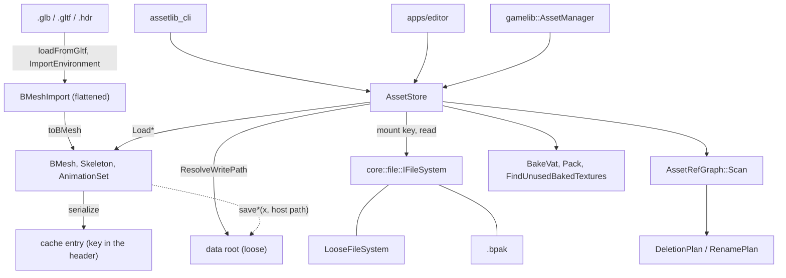

# assetlib Public API — the offline half of the engine

`assetlib` is the cook. It reads authoring formats (glTF, `.hdr`, `.ktx2`), writes the engine's
own containers, and answers questions about a project's assets — what references what, what is
stale, what can be deleted. It is the one library that **never links `bgl`**, so the CLI baker
does not drag in D3D12; the price is that nothing here can measure anything a GPU would have to
draw. `gamelib` is the seam that links both.

**This document is a map, not a mirror.** It captures the design choices, the topology and the
non-obvious contracts — not signatures. The header at each linked path is the source of truth;
when this doc disagrees, trust the header, then fix this doc.

---

## Design Choices

* **`AssetStore` is the project.** Reads resolve through a **mount** — a loose directory, a
  `.bpak`, or a loose overlay over one — and writes land on the **data root**, the loose layer.
  They are two different things because an archive entry cannot be unlinked or replaced in
  place. Everything a project owns is addressed by a **mount key**, and never by a host path.
  [libs/assetlib/include/assetlib/AssetStore.h](libs/assetlib/include/assetlib/AssetStore.h)

* **A mount key is not a `std::filesystem::path`, and the difference is silent on Windows.** A
  key is data-root-relative, `/`-separated, never absolute, and is matched byte-for-byte through
  a hash map by `PakFile`. A key that has passed through `std::filesystem::path` arrives
  `\`-separated and misses — but still resolves loose, because the OS accepts either separator.
  Loose works, packed does not, and nothing reports a problem. See [STYLE.md](STYLE.md) § Paths.

* **One seam, both directions.** A project's asset is read and written by mount key through the
  store: `store.Load<BMesh>(key)` and `store.Save(mesh, key)`. There is no second way — the
  `save*`/`load*` functions that took a `std::filesystem::path` to a project's file are gone, and
  the type is what selects the codec rather than the function name.

  A caller that genuinely addresses the *host* still uses a path, and now looks different so it
  cannot be mistaken for the other thing: it encodes with the codec and moves the bytes itself.
  `assetlib_cli strip --out` writes a shipping tree and the editor opens a mesh from outside any
  data root — both are `AssetCodec<T>::Serialize` plus `core::file::write_atomic`, or the read
  equivalent.

* **A codec per container, and the type picks it.** `AssetCodec<T>` declares a container's
  extension, its magic, how it serializes, and — for a cache entry — the bake revision it is
  written at. One specialization per container, beside that container's io
  ([AssetCodec.h](libs/assetlib/include/assetlib/AssetCodec.h)).

  This is the compile-time form of the registry a shipping engine uses — Godot's
  `ResourceFormatLoader`, Unity's `ScriptedImporter`, Unreal's `UFactory`. Those dispatch virtually
  because everything they load shares a base; our containers are unrelated PODs, so a virtual codec
  would return `std::any` and every caller would cast back. The deviation is deliberate.

* **The container list exists once.** `containerKinds()` is folded out of the codec
  specializations, and a static assertion holds it to `AssetType` — every kind but `kTexture`,
  which is an image this library encodes rather than a container it serializes a struct into. The
  extension lookup, the CLI's magic sniff and the pack rules all read it.

  Behaviour that differs *per* container is a different thing and stays a `switch`: `migrate`
  regenerates geometry and re-saves the rest, `asset_rename` rewrites different fields per type,
  `pack` re-bakes some and copies others. Each is exhaustive with no `default:`, so `-Wall -Werror`
  makes a new `AssetType` a compile error there — which is the guarantee a table cannot give.

* **Two container regimes, and the split is authored-vs-derived.** `.bmaterial`, `.benv` and
  `.bimport` are canonical-JSON text documents, unknown keys preserved on round-trip; `.bmesh`,
  `.bskel`, `.banim`, `.bvat`, `.bsky` and `.benvl` are cache entries — a frozen header carrying
  the cache key (bake token, source stamp, parameter hash, source mount key) over schema-less
  chunks. A key mismatch is a cache miss that regenerates, never a conversion.
  [docs/asset_containers.md](docs/asset_containers.md)

* **A `.ktx2` cannot hold a key, so its source's document holds one for it.** The textures a mesh
  import extracts are derived from the `.glb` like the rest of its group, but a KTX2 has nowhere
  to carry a header -- so the `.bimport` records `textureDir` and `textureStamp`, and
  `AssetStore::RefreshImportedTextures` is what takes the miss. Not `LoadRegen*`: that runs on
  every mesh load and every deletion's reference scan, where an import's worth of Basis encoding
  cannot go. An extracted texture is named after the image it came from, which is what lets a
  re-extract land back on the files materials already route at.
  [AssetStore.h](libs/assetlib/include/assetlib/AssetStore.h)

* **Every reference is data-root-relative, and layout is a table.** A `.bmesh` in
  `Meshes/props/` names `Textures/skin.ktx2`, not a path relative to itself, so a bake writing
  that file and a mesh naming it agree without either knowing where the other lives.
  [libs/assetlib/include/assetlib/project_layout.h](libs/assetlib/include/assetlib/project_layout.h)

* **Baked maps are shared, not owned.** A bake's output name is content-addressed from its
  route, so two materials routing the same source share one baked file — and deleting a material
  therefore does not delete its maps. `AssetStore::FindUnusedBakedTextures` is what collects them.

* **The cook never carries a source format's shading model across.** `toBMesh` drops glTF's PBR
  materials on the floor: they are that format's model, not necessarily the engine's, and
  deriving `.bmaterial` files inside assetlib would stamp glTF's model into the engine's own
  container for every caller — including `assetlib_cli bake`, which has no user to ask. Textures
  *are* extracted; binding a material is `attachMaterial`, and the editor's import is what calls
  it, behind a checkbox.

* **Reference queries are snapshots, never caches.** The data root is shared with the user's file
  manager. A cached graph would not merely go stale — it would refuse a deletion while naming a
  blocker that had since been deleted from under it.

## Interface Index

| Type | File | Role |
|---|---|---|
| `AssetStore` | [AssetStore.h](libs/assetlib/include/assetlib/AssetStore.h) | The project: the read mount and the writable root as one. Loads every container by key, answers staleness, describes against disk. |
| `Project` | [Project.h](libs/assetlib/include/assetlib/Project.h) | A `.berniniproject` on disk: the metadata file, the scaffolded `Data/` tree, and the `AssetStore` over it. |
| `AssetRefGraph` | [asset_refs.h](libs/assetlib/include/assetlib/asset_refs.h) | One walk of the project: who references what. Backs deletion, rename and the prune. |
| `DeletionPlan` / `RenamePlan` | [asset_refs.h](libs/assetlib/include/assetlib/asset_refs.h) | What an edit would destroy or rewrite, decided before anything is touched. |

### Containers — one table

Every container this build reads or writes is one `AssetCodec<T>` specialization in
[codecs.h](libs/assetlib/include/assetlib/codecs.h), listed in `AssetType` order: the extension, the
type, and for a cache entry the magic and the bake token. That header is the whole registration
surface and the only place those four are written down; each `Serialize` / `Deserialize` is defined
in the container's own `.cpp`, which is where the format lives.

Reading and writing a project's copy is `store.Load<T>(key)` / `store.Save(value, key)` — the codec
is what a caller reaches for only when it holds bytes no store addresses, which is
`assetlib_cli strip --out` and the editor opening a mesh from outside any data root.

| Container | Holds |
|---|---|
| `.bmesh` | Geometry, meshlets, node hierarchy, material paths, skeleton path. Editing one is [bmesh.h](libs/assetlib/include/assetlib/bmesh.h). |
| `.bmaterial` | Factors, the baked triplet, the per-channel routing table |
| `.bskel` / `.banim` | A rig; clip samples resampled against it. Split because a rig outlives its clips. |
| `.bvat` | A baked position/normal texture pair and its tables. Derived, never committed. |
| `.bsky` / `.benvl` / `.benv` | Backdrop; the lighting pair convolved from it; the few bytes naming both. [docs/envmaps.md](docs/envmaps.md) |
| `.bimport` | One per copied source under `meshes_src/`: the bindings and parameters an import was authored with, as text. What a stale cache entry re-cooks from. Its struct is [import_document.h](libs/assetlib/include/assetlib/import_document.h). |
| `.bpak` | The archive the rest are packed into — not a codec, since nothing references one. [pak.h](libs/assetlib/include/assetlib/pak.h). [docs/archives.md](docs/archives.md) |

### Operations

| Concern | Header | Notes |
|---|---|---|
| Import from glTF | [bmesh_gltf.h](libs/assetlib/include/assetlib/bmesh_gltf.h), [asset_import.h](libs/assetlib/include/assetlib/asset_import.h) | Decode, then write the files an import produces — with a rollback for a cancelled one. |
| Material bake | [material_bake.h](libs/assetlib/include/assetlib/material_bake.h) | Composites routes down to the baseColor/normal/orm triplet. |
| Environment bake | [envmap.h](libs/assetlib/include/assetlib/envmap.h) | One header, in pipeline order: `.hdr` → the convolutions → the shipping RGB9E5 maps. |
| VAT bake | [vat_bake.h](libs/assetlib/include/assetlib/vat_bake.h) | A rig's clips baked to textures. [docs/vat.md](docs/vat.md) |
| Pose and CPU skinning | [skinning.h](libs/assetlib/include/assetlib/skinning.h) | Deliberately the unoptimised reference every GPU path is diffed against. [docs/skinning.md](docs/skinning.md) |
| Images | [image_io.h](libs/assetlib/include/assetlib/image_io.h) | KTX2 encode/decode, RGB9E5 pack. [docs/asset_standards.md](docs/asset_standards.md) |
| Texture refresh | `AssetStore::WriteTextures` / `StaleImportedTextureSources` / `RefreshImportedTextures` ([AssetStore.h](libs/assetlib/include/assetlib/AssetStore.h)) | Extract an import's textures, and re-extract them when the source has moved -- the one part of a group the load-time seam skips. |
| Describe, migrate, prune | `AssetStore::Describe` ([AssetStore.h](libs/assetlib/include/assetlib/AssetStore.h)), [migrate.h](libs/assetlib/include/assetlib/migrate.h), [texture_prune.h](libs/assetlib/include/assetlib/texture_prune.h) | Text for a person, one overload per container; re-save at the current form; collect unreferenced bakes. |
| Cancellation | [cancel.h](libs/assetlib/include/assetlib/cancel.h) | `std::stop_token`, polled at the encode that dominates each bake. |

## Topology



The dotted edge is the asymmetry: reads go through the store, writes go around it.

## Threading & Synchronization

* **`AssetStore` is not synchronized.** It holds a `shared_ptr<const IFileSystem>` and a path;
  concurrent reads through one store are as safe as the mount beneath it, and nothing here
  serializes writes. The editor drives bakes on a worker and owns that discipline itself.
* **Every progress and cancel callback runs on the calling thread.** `TextureProgressFn` is
  invoked before each texture, from whichever thread called `AssetStore::WriteTextures`.
* **A cancel is honoured between encodes, not inside one.** A signalled token waits out the
  texture in flight — seconds at 4K. Whatever was already written stays on disk.

## Risky / Non-obvious Contracts

### AssetStore
* **`ResolveWritePath`** — `@throws` unless the key names something strictly inside the data
  root, so a key typed on a command line cannot climb out of the project. It is the *one* place
  a mount key legitimately becomes a host path.
* **`IsReadOnly`** — the whole mount's answer, not one path's. A loose overlay over an archive
  answers `false` even for a path only the archive currently carries; the rebuild lands in the
  overlay.
* **`StampOf`** — an absent path yields a **zeroed** stamp, which never compares equal to a real
  one. A missing source therefore reads as *stale*, not as unchanged.
* **`Describe(const BVat&)`** — `@pre` pass the tables-only form from `LoadVatTables`. Nothing in
  it reads a texel, and a whole-project survey must not pay for them.

### Containers
* **`Save<BMesh>`** — `@throws` if the mesh carries joint indices but names no skeleton. Refused
  at write time because nothing reading the file afterwards can tell a joint index that resolves
  to nothing from one that does not.
* **`Save` creates the directories its key names.** A key is a location in the data root, not one
  that already exists, so an import aimed at a subfolder needs nothing from its caller. The *data
  root* itself must exist — `AssetStore`'s constructor refuses one that does not, since a write
  into a missing root is a mistyped root rather than a new subfolder.
* **`Save` refuses a key that escapes the data root**, which is `ResolveWritePath`'s boundary. A
  key typed on a command line cannot climb out of the project.
* **`deserialize*`** — `@throws` on a foreign bake token or a chunk-era file. Both are
  unreadable by design, not by omission: a cache miss regenerates from the authored side, and
  there is nothing to convert from. `AssetStore::LoadRegen*` is the seam that regenerates;
  `assetlib_cli migrate` rewrites a whole project.

### Reference graph
* **`AssetRefGraph::Scan`** — `@throws` if a *referrer* cannot be read, deliberately: an edge we
  cannot see is an edge we would delete through. A `.bvat` that cannot be read is **skipped**
  instead, because its edges can only ever route to `derived`.
* **`planDeletion` on a directory** — a directory is held only by an edge reaching *into* it
  from outside, and takes everything beneath it. Whether it is a directory the *project* needs is
  not a question this can answer; `Project::IsRequiredDirectory` is.
* **`AssetStore::RenameAsset`** — reads and rewrites every referrer in memory first, saves them, then moves
  the file last, because the move is the step most likely to be refused. A failure writes the
  original bytes back — best-effort, and a machine that fails the restore too reports the first
  error rather than a pretense of atomicity.

## Usage Sketch

```cpp
// Open a project, bake a stale material, and write it back.
auto project = assetlib::Project::Open(projectFile);
const auto& store = project.GetStore();

auto material = store.Load<assetlib::BMaterial>("Materials/brick.bmaterial");
if (store.BakeIsStale(material))
{
	store.BakeMaterial(material);
	store.Save(material, "Materials/brick.bmaterial");
}
```

One key, read and written by the same store, and no path anywhere. `assetlib_cli`
([libs/assetlib/cli/main.cpp](libs/assetlib/cli/main.cpp)) is the fullest worked example — fourteen
verbs over one `Project`, including `describe`, `migrate`, `pack` and every bake.

---

The file links in the tables above are this document's load-bearing part, and they rot silently
when files move. Re-check them whenever assetlib's layout changes.
