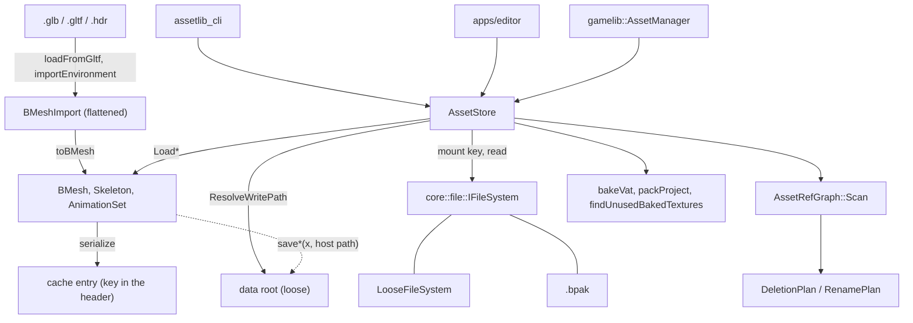

# assetlib Public API — the offline half of the engine

`assetlib` is the cook. It reads authoring formats (glTF, `.hdr`, `.ktx2`), writes the engine's
own containers, and answers questions about a project's assets — what references what, what is
stale, what can be deleted. It is the one library that **never links `bgl`**, so the CLI baker
does not drag in D3D12; the price is that nothing here can measure anything a GPU would have to
draw. `gamelib` is the seam that links both.

**This document is a map, not a mirror.** It captures the design choices, the topology and the
non-obvious contracts — not signatures. The header at each linked path is the source of truth;
when this doc disagrees, trust the header, then fix this doc.

---

## Design Choices

* **`AssetStore` is the project.** Reads resolve through a **mount** — a loose directory, a
  `.bpak`, or a loose overlay over one — and writes land on the **data root**, the loose layer.
  They are two different things because an archive entry cannot be unlinked or replaced in
  place. Everything a project owns is addressed by a **mount key**, and never by a host path.
  [libs/assetlib/include/assetlib/AssetStore.h](libs/assetlib/include/assetlib/AssetStore.h)

* **A mount key is not a `std::filesystem::path`, and the difference is silent on Windows.** A
  key is data-root-relative, `/`-separated, never absolute, and is matched byte-for-byte through
  a hash map by `PakFile`. A key that has passed through `std::filesystem::path` arrives
  `\`-separated and misses — but still resolves loose, because the OS accepts either separator.
  Loose works, packed does not, and nothing reports a problem. See [STYLE.md](STYLE.md) § Paths.

* **The seam is half-built, and the halves are visible from the include list.** Reads go through
  the store; the *write* half is still free functions taking a host path — `save`, `saveMaterial`,
  `saveSky`, `saveEnvLighting`, `saveVat` — so a caller writes
  `save(mesh, store.ResolveWritePath(key))`, or hand-joins `dataRoot / relative`. The newer
  whole-project operations already take the store (`packProject`, `findUnusedBakedTextures`,
  `bakeVat`, `AssetRefGraph::Scan`); the older per-file ones do not. The source+cache model widened
  the gap rather than closing it — six `LoadRegen*` methods joined the read half and no write half
  arrived — so the store now answers twenty loads and zero saves. The design that finishes it is
  settled and no longer blocked: see
  [docs/specs/assetlib_store_codecs.md](docs/specs/assetlib_store_codecs.md).

* **Two container regimes, and the split is authored-vs-derived.** `.bmaterial`, `.benv` and
  `.bimport` are canonical-JSON text documents, unknown keys preserved on round-trip; `.bmesh`,
  `.bskel`, `.banim`, `.bvat`, `.bsky` and `.benvl` are cache entries — a frozen header carrying
  the cache key (bake token, source stamp, parameter hash, source mount key) over schema-less
  chunks. A key mismatch is a cache miss that regenerates, never a conversion.
  [docs/asset_containers.md](docs/asset_containers.md)

* **Every reference is data-root-relative, and layout is a table.** A `.bmesh` in
  `Meshes/props/` names `Textures/skin.ktx2`, not a path relative to itself, so a bake writing
  that file and a mesh naming it agree without either knowing where the other lives.
  [libs/assetlib/include/assetlib/project_layout.h](libs/assetlib/include/assetlib/project_layout.h)

* **Baked maps are shared, not owned.** A bake's output name is content-addressed from its
  route, so two materials routing the same source share one baked file — and deleting a material
  therefore does not delete its maps. `findUnusedBakedTextures` is what collects them.

* **The cook never carries a source format's shading model across.** `toBMesh` drops glTF's PBR
  materials on the floor: they are that format's model, not necessarily the engine's, and
  deriving `.bmaterial` files inside assetlib would stamp glTF's model into the engine's own
  container for every caller — including `assetlib_cli bake`, which has no user to ask. Textures
  *are* extracted; binding a material is `attachMaterial`, and the editor's import is what calls
  it, behind a checkbox.

* **Reference queries are snapshots, never caches.** The data root is shared with the user's file
  manager. A cached graph would not merely go stale — it would refuse a deletion while naming a
  blocker that had since been deleted from under it.

## Interface Index

| Type | File | Role |
|---|---|---|
| `AssetStore` | [AssetStore.h](libs/assetlib/include/assetlib/AssetStore.h) | The project: the read mount and the writable root as one. Loads every container by key, answers staleness, describes against disk. |
| `Project` | [Project.h](libs/assetlib/include/assetlib/Project.h) | A `.berniniproject` on disk: the metadata file, the scaffolded `Data/` tree, and the `AssetStore` over it. |
| `AssetRefGraph` | [asset_refs.h](libs/assetlib/include/assetlib/asset_refs.h) | One walk of the project: who references what. Backs deletion, rename and the prune. |
| `DeletionPlan` / `RenamePlan` | [asset_refs.h](libs/assetlib/include/assetlib/asset_refs.h) | What an edit would destroy or rewrite, decided before anything is touched. |

### Containers — one `*_io.h` each

Each declares the same four operations over its POD: serialize, deserialize, save to a host
path, load from a host path.

| Container | Header | Holds |
|---|---|---|
| `.bmesh` | [bmesh_io.h](libs/assetlib/include/assetlib/bmesh_io.h) | Geometry, meshlets, node hierarchy, material paths, skeleton path |
| `.bmaterial` | [bmaterial_io.h](libs/assetlib/include/assetlib/bmaterial_io.h) | Factors, the baked triplet, the per-channel routing table |
| `.bskel` / `.banim` | [bskel_io.h](libs/assetlib/include/assetlib/bskel_io.h), [banim_io.h](libs/assetlib/include/assetlib/banim_io.h) | A rig; clip samples resampled against it. Split because a rig outlives its clips. |
| `.bvat` | [bvat_io.h](libs/assetlib/include/assetlib/bvat_io.h) | A baked position/normal texture pair and its tables. Derived, never committed. |
| `.bsky` / `.benvl` / `.benv` | [bsky_io.h](libs/assetlib/include/assetlib/bsky_io.h), [benvl_io.h](libs/assetlib/include/assetlib/benvl_io.h), [benv_io.h](libs/assetlib/include/assetlib/benv_io.h) | Backdrop; the lighting pair convolved from it; the few bytes naming both. [docs/envmaps.md](docs/envmaps.md) |
| `.bimport` | [import_document.h](libs/assetlib/include/assetlib/import_document.h) | One per copied source under `meshes_src/`: the bindings and parameters an import was authored with, as text. What a stale cache entry re-cooks from. |
| `.bpak` | [pak_io.h](libs/assetlib/include/assetlib/pak_io.h), [pak_pack.h](libs/assetlib/include/assetlib/pak_pack.h) | The archive the rest are packed into. [docs/archives.md](docs/archives.md) |

### Operations

| Concern | Header | Notes |
|---|---|---|
| Import from glTF | [bmesh_gltf.h](libs/assetlib/include/assetlib/bmesh_gltf.h), [asset_import.h](libs/assetlib/include/assetlib/asset_import.h) | Decode, then write the files an import produces — with a rollback for a cancelled one. |
| Material bake | [material_bake.h](libs/assetlib/include/assetlib/material_bake.h) | Composites routes down to the baseColor/normal/orm triplet. |
| Environment bake | [env_bake.h](libs/assetlib/include/assetlib/env_bake.h), [envmap_bake.h](libs/assetlib/include/assetlib/envmap_bake.h), [env_import.h](libs/assetlib/include/assetlib/env_import.h), [env_resolve.h](libs/assetlib/include/assetlib/env_resolve.h) | `.hdr` → the convolutions → the shipping RGB9E5 maps. |
| VAT bake | [vat_bake.h](libs/assetlib/include/assetlib/vat_bake.h) | A rig's clips baked to textures. [docs/vat.md](docs/vat.md) |
| Pose and CPU skinning | [skeleton.h](libs/assetlib/include/assetlib/skeleton.h), [skinning.h](libs/assetlib/include/assetlib/skinning.h) | Deliberately the unoptimised reference every GPU path is diffed against. [docs/skinning.md](docs/skinning.md) |
| Images | [image_io.h](libs/assetlib/include/assetlib/image_io.h) | KTX2 encode/decode, RGB9E5 pack. [docs/asset_standards.md](docs/asset_standards.md) |
| Describe, migrate, prune | [asset_describe.h](libs/assetlib/include/assetlib/asset_describe.h), [migrate.h](libs/assetlib/include/assetlib/migrate.h), [texture_prune.h](libs/assetlib/include/assetlib/texture_prune.h) | Text for a person; re-save at the current form; collect unreferenced bakes. |
| Cancellation | [cancel.h](libs/assetlib/include/assetlib/cancel.h) | `std::stop_token`, polled at the encode that dominates each bake. |

## Topology



The dotted edge is the asymmetry: reads go through the store, writes go around it.

## Threading & Synchronization

* **`AssetStore` is not synchronized.** It holds a `shared_ptr<const IFileSystem>` and a path;
  concurrent reads through one store are as safe as the mount beneath it, and nothing here
  serializes writes. The editor drives bakes on a worker and owns that discipline itself.
* **Every progress and cancel callback runs on the calling thread.** `TextureProgressFn` is
  invoked before each texture, from whichever thread called `writeTextures`.
* **A cancel is honoured between encodes, not inside one.** A signalled token waits out the
  texture in flight — seconds at 4K. Whatever was already written stays on disk.

## Risky / Non-obvious Contracts

### AssetStore
* **`ResolveWritePath`** — `@throws` unless the key names something strictly inside the data
  root, so a key typed on a command line cannot climb out of the project. It is the *one* place
  a mount key legitimately becomes a host path.
* **`IsReadOnly`** — the whole mount's answer, not one path's. A loose overlay over an archive
  answers `false` even for a path only the archive currently carries; the rebuild lands in the
  overlay.
* **`StampOf`** — an absent path yields a **zeroed** stamp, which never compares equal to a real
  one. A missing source therefore reads as *stale*, not as unchanged.
* **`Describe(const BVat&)`** — `@pre` pass the tables-only form from `LoadVatTables`. Nothing in
  it reads a texel, and a whole-project survey must not pay for them.

### Containers
* **`save(const BMesh&, path)`** — `@throws` if the mesh carries joint indices but names no
  skeleton. Refused at write time because nothing reading the file afterwards can tell a joint
  index that resolves to nothing from one that does not.
* **`save` does not create directories**; `writeImportedMesh` does. An import aimed at a
  subfolder needs the latter.
* **`deserialize*`** — `@throws` on a foreign bake token or a chunk-era file. Both are
  unreadable by design, not by omission: a cache miss regenerates from the authored side, and
  there is nothing to convert from. `AssetStore::LoadRegen*` is the seam that regenerates;
  `assetlib_cli migrate` rewrites a whole project.

### Reference graph
* **`AssetRefGraph::Scan`** — `@throws` if a *referrer* cannot be read, deliberately: an edge we
  cannot see is an edge we would delete through. A `.bvat` that cannot be read is **skipped**
  instead, because its edges can only ever route to `derived`.
* **`planDeletion` on a directory** — a directory is held only by an edge reaching *into* it
  from outside, and takes everything beneath it. Whether it is a directory the *project* needs is
  not a question this can answer; `Project::IsRequiredDirectory` is.
* **`renameAsset`** — reads and rewrites every referrer in memory first, saves them, then moves
  the file last, because the move is the step most likely to be refused. A failure writes the
  original bytes back — best-effort, and a machine that fails the restore too reports the first
  error rather than a pretense of atomicity.

## Usage Sketch

```cpp
// Open a project, bake a stale material, and write it back.
auto project = assetlib::Project::Open(projectFile);
const auto& store = project.GetStore();

auto material = store.LoadMaterial("Materials/brick.bmaterial");
if (store.BakeIsStale(material))
{
	assetlib::bakeMaterial(material, { .dataRoot = store.GetDataRoot() });
	assetlib::saveMaterial(material, store.ResolveWritePath("Materials/brick.bmaterial"));
}
```

The two-step write is the asymmetry above, not a convention to copy into new code. `assetlib_cli`
([libs/assetlib/cli/main.cpp](libs/assetlib/cli/main.cpp)) is the fullest worked example — fourteen
verbs over one `Project`, including `describe`, `migrate`, `pack` and every bake.

---

The file links in the tables above are this document's load-bearing part, and they rot silently
when files move. Re-check them whenever assetlib's layout changes.
