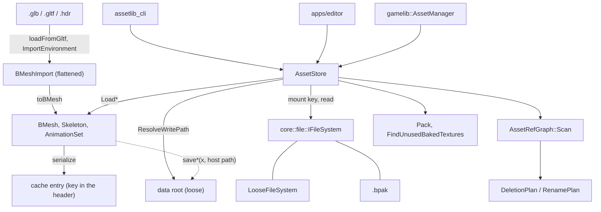

# assetlib Public API — the offline half of the engine

`assetlib` is the cook. It reads authoring formats (glTF, `.hdr`, `.ktx2`), writes the engine's
own containers, and answers questions about a project's assets — what references what, what is
stale, what can be deleted. It is the one library that **never links `bgl`**, so the CLI baker
does not drag in D3D12; the price is that nothing here can measure anything a GPU would have to
draw. `gamelib` is the seam that links both.

**This document is a map, not a mirror.** It captures the design choices, the topology and the
non-obvious contracts — not signatures. The headers are the source of truth, and the doc lists none
of their symbols: find a type with clangd's `workspaceSymbol`, or a public one in the [API
catalog](docs/api_catalog.md);
when this doc disagrees, trust the header, then fix this doc.

The Qt-free [IAssetPlugin contract](libs/assetlib/include/assetlib/IAssetPlugin.h) registers custom
authored kinds before a project store opens. Those kinds extend `AssetStore`, the reference graph,
rename, migrate and pack without entering the closed built-in `AssetType`; see
[Editor plugin contracts](docs/editor_plugins.md) for loading and lifetime rules.

## Imported-source contract

Imports own a stable identity and generated output names. `ResolveImport` maps a source key to
its output through the mounted sidecar; gamelib's mesh and animation acquisition takes those
source keys. Meshes contain geometry, original material slots, rig signatures and named grass
fields, while materials, overrides, skeleton bindings and grass looks live in the sidecar.
Packs include sidecars and exclude copied sources. Read-only geometry loads check bake tokens,
sidecar parameters and the packed source revision without opening or stamping a source.

| Contract | Declaration | Responsibility |
|---|---|---|
| `ImportIdentity` and naming functions | [ImportIdentity.h](../libs/assetlib/include/assetlib/ImportIdentity.h) | Nonzero random 64-bit ID and frozen source filename; category keys use the label and 16 lowercase hexadecimal digits. Zero identifies an unmigrated document. |
| `AssetStore::ResolveImport` / `ResolvedImport` | [AssetStore.h](../libs/assetlib/include/assetlib/AssetStore.h), [ResolvedImport.h](../libs/assetlib/include/assetlib/ResolvedImport.h) | Resolve a source identifier through its mounted sidecar to one produced output of the requested kind, returning an owned document snapshot. |
| `NamedGrassField` / `GrassGeometry` / `BMesh::grassFields` | [GrassGeometry.h](../libs/assetlib_structs/include/assetlib_structs/GrassGeometry.h) | Each field owns its name and `GrassField` data; geometry holds these named fields, chunks and clumps, without look paths. No renderer interface changes. |
| `MeshBindings` / `RegenMesh::bindings` | [MeshBindings.h](../libs/assetlib/include/assetlib/MeshBindings.h) | Material keys per submesh, named overrides, the bound skeleton and grass-look keys by field look slot. Empty keys mean unbound. |

The source key identifies a sidecar; lookup neither opens nor stamps the source. It checks the
document's source, identity and output entry, but leaves output existence and cache validation to
the loader. A skeleton *bound* from another source is in `document.skeleton`, not an output of
this source. Source rename preserves the frozen label and ID; generated names are never parsed
to discover ownership.

Bindings are owned snapshots too. Resolving a material choice per submesh permits two submeshes
that shared a source material slot to be authored differently without changing cooked geometry.
Unknown binding names remain diagnostics in `RegenMesh::unboundBindings`. Runtime mesh caches
observe the sidecar stamp as well as the cooked container's stamp.

The sidecar's `identity` object stores `id` as 16 lowercase hexadecimal digits and `label` as the
frozen source filename. Missing identity marks a legacy document; malformed identity is refused.
Identity is excluded from the cook parameter hash. `ResolveImport` reads the sidecar on every call
and returns an owned snapshot without opening the source or derived output.
`RegenMesh::sourceKey` identifies the current owner after source moves, separately from the
source key recorded when its cooked geometry was produced.

`ImportTarget::identity` carries the identity chosen before generating an import's destinations.
`WriteImportedDocument` persists it and refuses replacement of an existing identity. Omitting it
on a subsequent write preserves the stored identity. An unreadable existing sidecar refuses the
write so it cannot silently discard that identity or authored parameters.
`ImportTarget::bindings` writes named material choices directly into the sidecar, without requiring
cooked geometry. An explicitly empty list clears mesh defaults while retaining authored overrides
and grass choices; an omitted list preserves existing bindings.
`ImportDocument::packedSourceStamp` records the source revision shared by a packed group's
outputs. It is export metadata outside the cook parameter hash; it contains no source bytes.

`FindImportForOutput` supplies the inverse lookup for cooked containers whose recorded source path
predates a move. It indexes sidecar output claims lazily, rejects duplicate owners, and reads the
owner afresh for each returned snapshot. Sidecar writes through the store invalidate the index;
an absent or moved owner triggers a rescan. Repeated reads of an owned output do not rescan other
documents. Geometry loads use it when the recorded source path no longer identifies the owning
sidecar. Moving a source keeps its output keys and cache bytes, including legacy imports.
Independent moves of derived files or directories are refused.

`Migrate` assigns identities to existing mesh and environment imports, moves their outputs and extracted-texture
directories, and rewrites tracked references, including the skeleton's companion avatar. It saves
the identity before moving files so a retry keeps the same destinations. A shared identity or
texture directory refuses migration for the affected imports. Materials whose texture routes move
are baked against their new paths in the same run; a settled second run writes nothing. Dry runs
leave identities, files and references unchanged.

Production tests cover identity persistence and source lookup in `ImportIdentity_test.cpp`,
repeatable migration in `ImportNameMigration_test.cpp`, and loose/packed bindings in
`GrassFields_test.cpp` and `Pack_test.cpp`. Gamelib archive tests verify static and skinned
acquisition with no source files present and no source reads.

---

## Design Choices

* **`AssetStore` is the project.** Reads resolve through a **mount** — a loose directory, a
  `.bpak`, or a loose overlay over one — and writes land on the **data root**, the loose layer.
  They are two different things because an archive entry cannot be unlinked or replaced in
  place. Everything a project owns is addressed by a **mount key**, and never by a host path.
  [libs/assetlib/include/assetlib/AssetStore.h](libs/assetlib/include/assetlib/AssetStore.h)

* **A mount key is not a `std::filesystem::path`, and the difference is silent on Windows.** A
  key is data-root-relative, `/`-separated, never absolute, and is matched byte-for-byte through
  a hash map by `PakFile`. A key that has passed through `std::filesystem::path` arrives
  `\`-separated and misses — but still resolves loose, because the OS accepts either separator.
  Loose works, packed does not, and nothing reports a problem. See [STYLE.md](STYLE.md) § Paths.

* **One seam, both directions.** A project's asset is read and written by mount key through the
  store: `store.Load<BMesh>(key)` and `store.Save(mesh, key)`. There is no second way — the
  `save*`/`load*` functions that took a `std::filesystem::path` to a project's file are gone, and
  the type is what selects the codec rather than the function name.

  A caller that genuinely addresses the *host* still uses a path, and now looks different so it
  cannot be mistaken for the other thing: it encodes with the codec and moves the bytes itself.
  `assetlib_cli strip --out` writes a shipping tree and the editor opens a mesh from outside any
  data root — both are `AssetCodec<T>::Serialize` plus `core::file::write_atomic`, or the read
  equivalent.

* **A codec per container, and the type picks it.** `AssetCodec<T>` declares a container's
  extension, its magic, how it serializes, and — for a cache entry — the bake revision it is
  written at. One specialization per container, beside that container's io
  ([AssetCodec.h](libs/assetlib/include/assetlib/AssetCodec.h)).

  This is the compile-time form of the registry a shipping engine uses — Godot's
  `ResourceFormatLoader`, Unity's `ScriptedImporter`, Unreal's `UFactory`. Those dispatch virtually
  because everything they load shares a base; our containers are unrelated PODs, so a virtual codec
  would return `std::any` and every caller would cast back. The deviation is deliberate.

* **The container list exists once.** `containerKinds()` is folded out of the codec
  specializations, and a static assertion holds it to `AssetType` — every kind but the *foreign*
  ones. The extension lookup, the CLI's magic sniff and the pack rules all read it.

* **A kind with no codec is listed, not excepted.** `foreignKinds()`
  ([AssetCodec.h](libs/assetlib/include/assetlib/AssetCodec.h)) is the second table: `.ktx2`, an
  image this library encodes rather than a container it serializes a struct into, and the UI
  runtime's `.rml`, `.rcss` and `.ttf`, which a runtime reads and nothing here parses. A foreign
  kind is stored, packed, referenced, deleted and renamed like any other and has no struct to
  `Load<T>`; the assertion counts *both* tables against `AssetType::kCount`, so a new kind is a
  compile error until it says which side it is on.

  Behaviour that differs *per* container is a different thing and stays a `switch`: `migrate`
  regenerates geometry and re-saves the rest, `asset_rename` rewrites different fields per type,
  `pack` re-bakes some and copies others. Each is exhaustive with no `default:`, so `-Wall -Werror`
  makes a new `AssetType` a compile error there — which is the guarantee a table cannot give.

* **Two container regimes, and the split is authored-vs-derived.** `.bmaterial`, `.benv`,
  `.bimport`, `.bavatar`, `.bblend`, `.bgrass` and `.btoonrig` are canonical-JSON text documents, unknown keys preserved on
  round-trip; `.bmesh`, `.bskel`, `.banim`, `.bsky` and `.benvl` are cache entries — a frozen header carrying
  the cache key (bake token, source stamp, parameter hash, source mount key) over schema-less
  chunks. A key mismatch is a cache miss that regenerates, never a conversion.
  [docs/asset_containers.md](docs/asset_containers.md)

* **A `.ktx2` cannot hold a key, so its source's document holds one for it.** The textures a mesh
  import extracts are derived from the `.glb` like the rest of its group, but a KTX2 has nowhere
  to carry a header -- so the `.bimport` records `textureDir`, `textureStamp`,
  `textureBakeToken` (the revision of the chain the bake writes, `c_TextureBakeToken`) and
  `textures`, the files the extract wrote, so one missing is a miss too; and
  `AssetStore::RefreshImportedTextures` is what takes the miss. Not `LoadRegen*`: that runs on
  every mesh load and every deletion's reference scan, where an import's worth of Basis encoding
  cannot go. An extracted texture is named after the image it came from, which is what lets a
  re-extract land back on the files materials already route at.
  [AssetStore.h](libs/assetlib/include/assetlib/AssetStore.h)

* **Every reference is data-root-relative, and layout is a table.** A material in
  `Authored/Materials/props/` names `Derived/BakedTextures/skin.ktx2`, not a path relative to itself, so a bake writing
  that file and a mesh naming it agree without either knowing where the other lives. The data root's
  first level is the authored/derived split — `Authored/` holds what a person decided, `Derived/`
  what a bake or an import computed — so a project's commit rule is a directory rather than a list
  of extensions.
  [libs/assetlib/include/assetlib/project_layout.h](libs/assetlib/include/assetlib/project_layout.h)

* **Baked maps are shared, not owned, and named by what they hold.** A bake's output name hashes
  everything that determines its bytes — the group, the target format, and the channel *and content*
  of each source feeding it — so two materials composing the same map share one file, and finding
  that file is the whole up-to-date test. Nothing is compared against a timestamp, and a source
  edited in place names a different map rather than overwriting one someone else may still hold.
  Deleting a material therefore does not delete its maps; `AssetStore::FindUnusedBakedTextures`
  is what collects them.

* **The cook never carries a source format's shading model across.** `toBMesh` drops glTF's PBR
  materials on the floor: they are that format's model, not necessarily the engine's, and
  deriving `.bmaterial` files inside assetlib would stamp glTF's model into the engine's own
  container for every caller — including `assetlib_cli bake`, which has no user to ask. Textures
  *are* extracted. The editor authors materials behind a checkbox and passes named bindings
  to `WriteImportedDocument`.

* **Reference queries are snapshots, never caches.** The data root is shared with the user's file
  manager. A cached graph would not merely go stale — it would refuse a deletion while naming a
  blocker that had since been deleted from under it.

## Containers

Every container this build reads or writes is one `AssetCodec<T>` specialization in
[codecs.h](libs/assetlib/include/assetlib/codecs.h), listed in `AssetType` order: the extension, the
type, and for a cache entry the magic and the bake token. That header is the whole registration
surface and the only place those four are written down; each `Serialize` / `Deserialize` is defined
in the container's own `.cpp`, which is where the format lives.

Reading and writing a project's copy is `store.Load<T>(key)` / `store.Save(value, key)` — the codec
is what a caller reaches for only when it holds bytes no store addresses, which is
`assetlib_cli strip --out` and the editor opening a mesh from outside any data root.

| Container | Holds |
|---|---|
| `.bmesh` | Geometry, meshlets, node hierarchy, original material slots, rig layout signature/bone names, and embedded named grass geometry. Editing one is [bmesh.h](libs/assetlib/include/assetlib/bmesh.h). |
| `.bmaterial` | Factors, the baked triplet, the per-channel routing table -- or, under `shadingModel: "pbrSurface"`, the surface it names and the parameters and textures it sets on it ([Game-Defined Surfaces](game_defined_surfaces.md)) |
| `.bskel` / `.banim` | A rig; clip samples resampled against it. Split because a rig outlives its clips. The `.banim` also carries what the cook derived off the walk: a posed box per mesh entry, and a plant weight per leg per frame, each self-keyed so a pairing that has changed is measured instead. |
| `.rml` / `.rcss` / `.ttf` | Not containers — foreign kinds the UI runtime parses. Listed here only because the project stores and packs them. |
| `.bsky` / `.benvl` / `.benv` | Backdrop; the lighting pair convolved from it; the few bytes naming both. [docs/envmaps.md](docs/envmaps.md) |
| `.bimport` | One per copied source under `Authored/Meshes/` or `Authored/EnvSources/`: the source it describes, and the bindings, registered material overrides and parameters an import was authored with, as text. What a stale cache entry re-cooks from. `source` is recorded rather than derived from the document's own name, so a source kind with more than one extension is still reachable; one written before that field falls back to the `.glb` swap. Its struct is [import_document.h](libs/assetlib/include/assetlib/import_document.h). |
| `.bavatar` | One rig's authored half: the legs a foot-plant solve walks, by bone name, and how far each named clip plants (`plant`, a weight per clip name; zero takes the clip out, and the `unplanted` list it once was still reads). Found by convention from the `.bskel` (`avatarKeyFor`) rather than by anything naming it — the path is the attachment. Its struct is [avatar.h](libs/assetlib/include/assetlib/avatar.h). |
| `.bblend` | The blend spaces authored against one clip set: each a named, ordered run of clips with the parameter each plays alone at. Names the `.banim` by a path it stores, so unlike a `.bavatar` it is an ordinary asset — renamed freely, and a rename of the clip set rewrites it (`RefKind::kBlendClips`). Clips are named, never indexed, and resolved where both name tables meet. Its struct is [blend.h](libs/assetlib/include/assetlib/blend.h). |
| `.bgrass` | A grass look: the `.bmaterial` its blades shade through (a path it stores, `RefKind::kGrassMaterial`, so a rename of the material rewrites it) and the blade, clump, density, response, lighting and colour groups `bgl::GrassDesc` mirrors. A key it omits takes the default, and unknown keys are kept inside a group as well as at the top. Ranges are not checked on read: the renderer states them once, where it creates the look. Its struct is [BGrass.h](libs/assetlib_structs/include/assetlib_structs/BGrass.h). A look with no mesh under it is grown on `makeGrassPatch`'s square of clumps ([grass_patch.h](libs/assetlib/include/assetlib/grass_patch.h)), which is what a preview draws. |
| `.btoonrig` | A face's toon shading rig ([Toon Shading Rig](toon_shading_rig.md) § The document): its edits and their keys, the face light's remap, the face normal's smoothing and ellipsoid radii, the head's radius, fade and frame, and the head bone **by name**. Holds no path, so it references nothing; the character's `.bimport` names it (`toonShadingRig`, `RefKind::kToonShadingRig`), which holds it alive against a delete and is rewritten by its rename. Angles are degrees in the document. `resolveHeadBone` ([toon_shading_rig.h](libs/assetlib/include/assetlib/toon_shading_rig.h)) turns the name into an index against the mesh's `.bskel`; turning the rest into `bgl::ToonShadingRigDesc` is gamelib's. Its struct is [BToonShadingRig.h](libs/assetlib_structs/include/assetlib_structs/BToonShadingRig.h). |
| `.bpak` | The archive the rest are packed into — not a codec, since nothing references one. [pak.h](libs/assetlib/include/assetlib/pak.h). [docs/archives.md](docs/archives.md) |

## Topology


```mermaid
flowchart TD
    GLTF[".glb / .gltf / .hdr"] -- "loadFromGltf, ImportEnvironment" --> IMP["BMeshImport (flattened)"]
    IMP -- "toBMesh" --> POD["BMesh, Skeleton, AnimationSet"]
    POD -- "serialize" --> C["cache entry (key in the header)"]

    STORE["AssetStore"] -- "mount key, read" --> FS["core::file::IFileSystem"]
    STORE -- "ResolveWritePath" --> ROOT["data root (loose)"]
    FS --- LOOSE["LooseFileSystem"]
    FS --- PAK[".bpak"]

    STORE -- "Load*" --> POD
    POD -. "save*(x, host path)" .-> ROOT

    STORE --> GRAPH["AssetRefGraph::Scan"]
    GRAPH --> PLAN["DeletionPlan / RenamePlan"]
    STORE --> BAKE["Pack, FindUnusedBakedTextures"]

    CLI["assetlib_cli"] --> STORE
    ED["apps/editor"] --> STORE
    GL["gamelib::AssetManager"] --> STORE
```

The dotted edge is the asymmetry: reads go through the store, writes go around it.

## Threading & Synchronization

* **`AssetStore` is not synchronized, and does not need to be.** It holds a
  `shared_ptr<const IFileSystem>` and a path; `IFileSystem` promises every method is safe to call
  concurrently on one instance, and `core::file::write_atomic` names its temp file per process and
  per call — so several threads may cook through one store as long as no two write the same key.
  That is what `Reimport` and `Migrate` rely on; the editor drives bakes on a worker and owns that
  discipline itself.
* **One progress seam:** [`ProgressSink`](../libs/assetlib/include/assetlib/progress.h), a
  `ProgressEvent` carrying the phase, the subject and a `done`/`total`. Both belong to whichever
  operation is reporting — an operation that runs another inside itself lets the inner one report
  in its own frame — so a reader takes the total from each event rather than the first.
* **A sink is called from whichever thread is doing the work, but never two at once.** A cook that
  fans out wraps its sink with `serialized()`, so a sink needs no lock; it must not assume the
  calling thread and must not block, because every worker waits behind it.
* **A threaded cook runs a stage at a time.** `Reimport` fans out within an `AssetType` — rigs,
  then meshes, then clips — and `Migrate` within a rank, because a clip set sweeps its boxes
  through the meshes standing on disk. Capped at four threads: one cook holds a whole glTF parse,
  so what bounds it is memory rather than cores.
* **A cancel is honoured between encodes, not inside one.** A signalled token waits out the
  texture in flight — seconds at 4K. Whatever was already written stays on disk.

## Risky / Non-obvious Contracts

### AssetStore
* **`ResolveWritePath`** — `@throws` unless the key names something strictly inside the data
  root, so a key typed on a command line cannot climb out of the project. It is the *one* place
  a mount key legitimately becomes a host path.
* **`IsReadOnly`** — the whole mount's answer, not one path's. A loose overlay over an archive
  answers `false` even for a path only the archive currently carries; the rebuild lands in the
  overlay.
* **`StampOf`** — an absent path yields a **zeroed** stamp, which never compares equal to a real
  one. A missing source therefore reads as *stale*, not as unchanged.
### Containers
* **`LoadRegenMesh`** returns geometry and an owned binding snapshot from the current sidecar.
  A binding edit changes the snapshot without rewriting the mesh; unmatched names are reported.
* **`WriteImportedRig`** returns the bound skeleton and owned outputs. A reused rig is a binding,
  never an output this source may delete. The mesh records only the joint layout.
* **`Save` creates the directories its key names.** A key is a location in the data root, not one
  that already exists, so an import aimed at a subfolder needs nothing from its caller. The *data
  root* itself must exist — `AssetStore`'s constructor refuses one that does not, since a write
  into a missing root is a mistyped root rather than a new subfolder.
* **`Save` refuses a key that escapes the data root**, which is `ResolveWritePath`'s boundary. A
  key typed on a command line cannot climb out of the project.
* **`loadFromGltf` reads `TEXCOORD_1` only for a primitive whose material samples occlusion
  through it** (`occlusionTexture.texCoord == 1`), and files that map as
  `BMaterialImport::geometryOcclusionTexture` rather than routing it into ORM red. Every other second
  UV set is dropped, so a mesh whose materials sample none imports byte-for-byte as it did before
  the set was read. See [Asset Standards § Geometry AO](asset_standards.md#geometry-ao-on-a-second-uv-set).
* **`deserialize*`** — `@throws` on a foreign bake token or a chunk-era file. Both are
  unreadable by design, not by omission: a cache miss regenerates from the authored side, and
  there is nothing to convert from. `AssetStore::LoadRegen*` is the seam that regenerates;
  `assetlib_cli migrate` rewrites a whole project. The geometry group is every container one mesh
  import produces -- `.bmesh`, `.bskel` and `.banim` (`isGeometryContainer`) --
  and each has its `LoadRegen*` door. Grass geometry is part of the mesh; sidecar look bindings
  resolve through `LoadRegenMesh`, whose `unboundBindings` makes `migrate` and `pack` fail.

### Project

* **The `.bproj`** keys are `name`, `version`, `dataDirectory` and `plugins`
  ([Editor plugins](editor_plugins.md)). Any other key is ignored when the file is read and gone
  after the next Save, which writes only these: a `postProcess` an older project names, from when a
  project picked its curve, opens like any other and is dropped. Unlike the authored documents, the
  `.bproj` keeps no unknown key.

### Reference graph
* **`AssetRefGraph::Scan`** — `@throws` if a *referrer* cannot be read, deliberately: an edge we
  cannot see is an edge we would delete through. The one exception is stale geometry no import
  document owns: nothing can load it, so it holds nothing, and `migrate` discards it.
  Registered authored kinds contribute opaque field references through `IAssetKind::ReadReferences`;
  these edges participate in deletion and rename planning alongside built-in references.
* **`planDeletion` on a directory** — a directory is held only by an edge reaching *into* it
  from outside, and takes everything beneath it. Whether it is a directory the *project* needs is
  not a question this can answer; `Project::IsRequiredDirectory` is.
* **`AssetStore::RenameAsset`** — reads and rewrites every referrer in memory first, saves them, then moves
  the files last, because a move is the step most likely to be refused. A failure writes the
  original bytes back and puts every file already moved back where it was — best-effort, and a
  machine that fails the restore too reports the first error rather than a pretense of atomicity.
  Custom referrers are rewritten through `IAssetKind::RewriteReferences` using their field tokens.
* **`planRename` on an imported source** moves only the source and its `.bimport`, preserving
  identity, output keys and derived bytes. It rewrites tracked source references; a destination
  outside the corresponding authored source directory is refused. Source or sidecar spelling
  identifies the same move. Renaming a derived file or directory independently is refused.
* **Migration moves the skeleton's companion avatar** alongside a generated skeleton rename.
  The avatar is authored and its path supplies the attachment, so a failed avatar move is fatal;
  a missing derived output can be regenerated. `RenamePlan::avatars` keeps these cases separate.
  Independent avatar moves are refused to prevent detaching it from its rig.

## Usage Sketch

```cpp
// Open a project, bake a stale material, and write it back.
auto project = assetlib::Project::Open(projectFile);
const auto& store = project.GetStore();

auto material = store.Load<assetlib::BMaterial>("Authored/Materials/brick.bmaterial");
if (store.BakeIsStale(material))
{
	store.BakeMaterial(material);
	store.Save(material, "Authored/Materials/brick.bmaterial");
}
```

One key, read and written by the same store, and no path anywhere. `assetlib_cli`
([libs/assetlib/cli/main.cpp](libs/assetlib/cli/main.cpp)) is the fullest worked example — fourteen
verbs over one `Project`, including `describe`, `migrate`, `pack` and every bake.

---

The file links in the tables above are this document's load-bearing part, and they rot silently
when files move. Re-check them whenever assetlib's layout changes.
