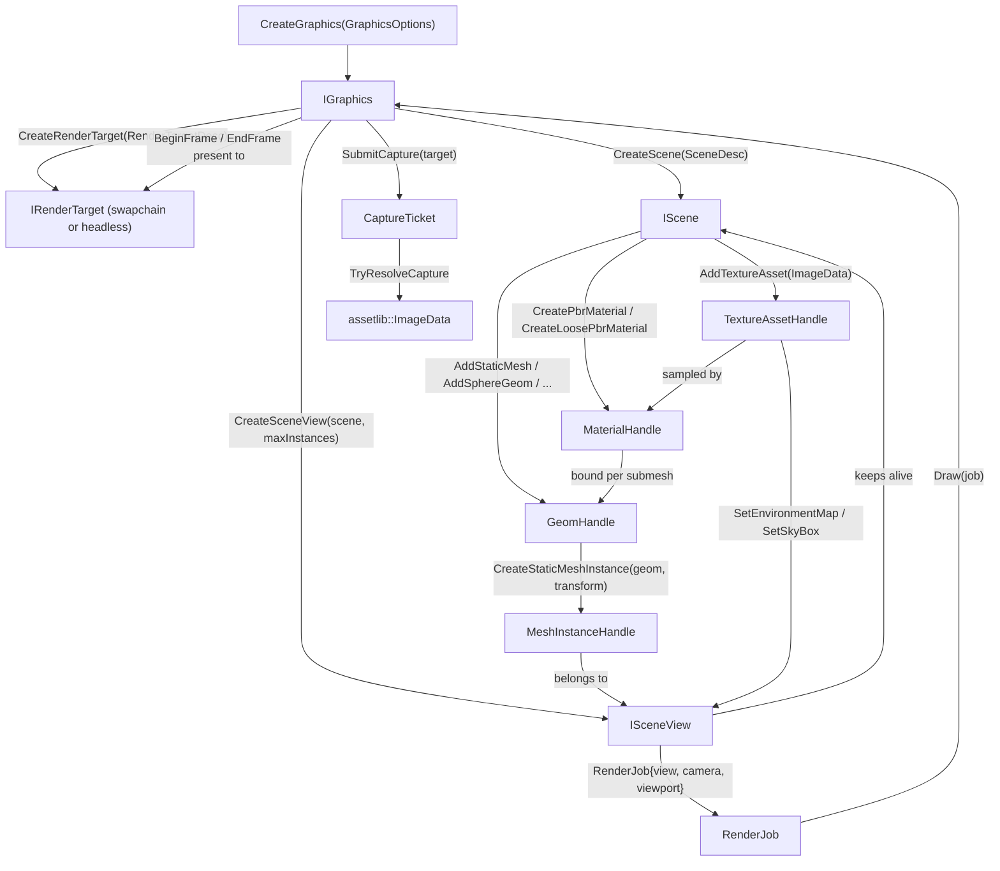

# bgl public API — what a client links against

Everything under [libs/bgl/include/bgl](libs/bgl/include/bgl) is bgl's public surface: the interfaces
an application (the editor, the examples, `gamelib`) uses to put a scene on screen. It is a strict
subset of what bgl contains — the RHI (`IDevice`, `IResourceManager`, command lists) is internal and
documented separately in [Render Hardware Interface](docs/rhi.md); the `bgl_d3d12` backend is never
visible here.

**This document is a map, not a mirror.** It captures design choices, topology, and the *non-obvious*
contracts — not full signatures. The header at each linked path is the source of truth; when this doc
disagrees, trust the header, then fix this doc.

---

## Design Choices

* **`IGraphics` is the entire entry point.** `CreateGraphics(GraphicsOptions)` returns the one object
  everything else is minted from: render targets, scenes, scene views. It also *is* the submission
  context — `BeginFrame`/`Draw`/`EndFrame`, `Resize` and the capture family are methods on it, not on
  a separate object. There is exactly one context per device.

* **Interfaces are pure-virtual and intrusively refcounted, because bgl is a DLL.** Every `I*` derives
  from `core::Ref` and is held behind `core::SharedRef<T>` (`GraphicsRef`, `SceneRef`, `SceneViewRef`,
  `RenderTargetRef`), with copy and move deleted — they are never value types. Each header ends with an
  explicit `template class BGL_API core::SharedRef<...>` instantiation so the refcount machinery
  crosses the DLL boundary once. This is why the API is virtual: it is an ABI seam, not backend
  polymorphism.

* **Scene holds geometry, SceneView holds instances — and rendering takes the view.** An
  [IScene](libs/bgl/include/bgl/IScene.h) owns geometry, materials and texture assets; an
  [ISceneView](libs/bgl/include/bgl/ISceneView.h) owns per-view mesh instances plus the lighting
  environment (IBL maps, skybox, exposure). Many views may share one scene, so meshlets and vertices
  are stored once and instanced cheaply. A view keeps its scene alive. `RenderJob::view` is a
  `SceneViewRef` — there is no way to draw a scene directly.

* **Scene mutations are staged, not immediate.** `AddTextureAsset`, `AddStaticMesh`,
  `CreatePbrMaterial` and friends record CPU-side state and queue the GPU upload; the upload runs as a
  frame-graph pass (`Scene Update <n>`) that `Draw` schedules. **Nothing reaches the GPU until a frame
  that draws this scene is submitted.** Capturing the backbuffer before any frame has drawn the new
  content yields the old content — this is why callers that render one-shot images draw a warmup frame
  before capturing.

* **Capacities are fixed at creation and never grow.** `SceneDesc` sizes every scene pool
  (`maxGeom`, `maxMeshlets`, `maxIndices`, `maxSubmeshes`, `maxVertexBufferByteSize`,
  `maxPbrMaterials`, `maxLoosePbrMaterials`); `GraphicsOptions` sizes the descriptor heaps and
  resource pools (`maxCbvSrvUavs`, `maxRtvs`, `maxDsvs`, `maxTextures`, `maxSamplers`,
  `maxReadbackBuffers`). Exhaustion throws `SceneError`; it is not a growth trigger. Size a scene for
  the largest asset that will ever enter it, not the typical one.

* **Handles are trivially copyable values, but their shapes differ.** `GeomHandle`, `MaterialHandle`
  and `MeshInstanceHandle` each wrap a `core::slot_handle` reached as `.handle` and expose
  `IsValid()`. `TextureAssetHandle` wraps one reached as `.textureSlot` and has **no** `IsValid()` —
  test it via the `slot_handle`'s `operator bool` (`if (tex.textureSlot)`). Do not assume one spelling
  across handle families.

* **Material bindings are raw slot indices with no generation check.** This is the sharpest hazard in
  the API. A submesh (and an instance override) stores a material's *slot index*, not a
  generation-guarded handle, so deleting a material that something still binds silently re-points it
  at whatever material next takes that slot. Geometry deletion has the mirror-image problem: an
  instance holds a plain copy of its geom's submesh range. Ordering these teardowns is the caller's
  job — or `gamelib`'s `AssetManager`, which refcounts them.

* **A material's PSO bucket comes from the `(layer, type)` pair, not the type alone.** `MaterialHandle`
  carries `layerType` (`kOpaque`/`kMask`/`kBlend`) and `occlude` alongside `materialType`, because a
  submesh cannot know which pipeline it belongs in from the material's storage alone. `layerType` and
  `occlude` are therefore part of the handle, not just the desc. See
  [PsoType.h](libs/bgl/include/bgl/PsoType.h) for the resulting buckets — it is IDL-generated; do not
  edit it.

* **Failures are exceptions, not return codes.** Everything derives from
  [ApiError](libs/bgl/include/bgl/error.h): `GraphicsError` for device/frame misuse, `SceneError` for
  scene misuse. Methods that cannot fail are `noexcept`. Handle-returning methods signal "nothing" with
  an invalid handle rather than throwing.

* **Backbuffer capture is split-phase.** `SubmitCapture` records the copy and returns a
  `CaptureTicket` without waiting; `TryResolveCapture` returns the image once the GPU is done, or
  `nullopt`. `ScreenshotToMemory` is the blocking convenience wrapper around the pair. At most
  `IGraphics::c_MaxPendingCaptures` may be in flight.

* **GPU assertions are a Debug-build facility.** `dbg_raise` in shaders reaches
  [IGpuAssertionHandler](libs/bgl/include/bgl/IGpuAssertionHandler.h) only under `BERNINI_GPU_DEBUG`;
  in Release the handler is never invoked. See [Graphics Debug](docs/gfx_debug.md).

---

## Interface Index

| Interface | File | Role |
|---|---|---|
| `IGraphics` | [libs/bgl/include/bgl/IGraphics.h](libs/bgl/include/bgl/IGraphics.h) | The device and its one submission context: creates targets/scenes/views, and drives frames, resizes and captures. Minted by `CreateGraphics`. |
| `IScene` | [libs/bgl/include/bgl/IScene.h](libs/bgl/include/bgl/IScene.h) | Owns geometry, materials and texture assets. Shared by many views. |
| `ISceneView` | [libs/bgl/include/bgl/ISceneView.h](libs/bgl/include/bgl/ISceneView.h) | Per-view mesh instances, material overrides, and lighting (IBL, skybox, exposure). |
| `IRenderTarget` | [libs/bgl/include/bgl/IRenderTarget.h](libs/bgl/include/bgl/IRenderTarget.h) | A render output: windowed swapchain or headless offscreen backbuffers, plus depth and the screen-space velocity buffer. |
| `IGpuAssertionHandler` | [libs/bgl/include/bgl/IGpuAssertionHandler.h](libs/bgl/include/bgl/IGpuAssertionHandler.h) | Caller-implemented sink for shader `dbg_raise` reports. Not refcounted; a plain callback interface. |

### Supporting types

| Type | File | Role |
|---|---|---|
| `GraphicsOptions` | [libs/bgl/include/bgl/IGraphics.h](libs/bgl/include/bgl/IGraphics.h) | Device creation: debug layers, log level, `shaderCacheDir`, and every descriptor-heap/pool capacity. |
| `CaptureTicket` | [libs/bgl/include/bgl/IGraphics.h](libs/bgl/include/bgl/IGraphics.h) | Names one in-flight backbuffer capture. Spent by resolve or discard. |
| `SceneDesc` | [libs/bgl/include/bgl/IScene.h](libs/bgl/include/bgl/IScene.h) | Fixed pool capacities for a scene. |
| `PbrMaterialDesc` / `LoosePbrMaterialDesc` | [libs/bgl/include/bgl/IScene.h](libs/bgl/include/bgl/IScene.h) | Baked (three-map) vs. loose (per-channel routed) material parameters. `ChannelRouteDesc` feeds the latter. |
| `EnvironmentMapDesc` | [libs/bgl/include/bgl/IScene.h](libs/bgl/include/bgl/IScene.h) | The IBL triplet (irradiance cube, prefilter cube, BRDF LUT). **Move-only** — copy is deleted. |
| `RenderTargetDesc` | [libs/bgl/include/bgl/IRenderTarget.h](libs/bgl/include/bgl/IRenderTarget.h) | Size, `headless`, and `wnd` (an `HWND`, ignored when headless). |
| `RenderJob` | [libs/bgl/include/bgl/RenderJob.h](libs/bgl/include/bgl/RenderJob.h) | One draw: `{view, camera, viewport}`. Holds a **copy** of the camera. |
| `Camera` | [libs/bgl/include/bgl/Camera.h](libs/bgl/include/bgl/Camera.h) | Chained-builder view/projection. Concrete, header-only, copyable. |
| `Viewport` | [libs/bgl/include/bgl/Viewport.h](libs/bgl/include/bgl/Viewport.h) | Min/max XYZ; the `(width, height)` constructor is the usual one. |
| `SkyboxDesc` | [libs/bgl/include/bgl/SkyboxDesc.h](libs/bgl/include/bgl/SkyboxDesc.h) | Cube texture plus `mipLevel`, `exposure`, `rotationY`. |
| `GeomHandle`, `MaterialHandle`, `MeshInstanceHandle`, `TextureAssetHandle` | [GeomHandle.h](libs/bgl/include/bgl/GeomHandle.h), [MaterialHandle.h](libs/bgl/include/bgl/MaterialHandle.h), [MeshInstanceHandle.h](libs/bgl/include/bgl/MeshInstanceHandle.h), [TextureAssetHandle.h](libs/bgl/include/bgl/TextureAssetHandle.h) | Value handles into scene/view storage. See the shape caveat above. |
| `GeomType`, `LayerType`, `MaterialType`, `PsoType` | [GeomType.h](libs/bgl/include/bgl/GeomType.h), [LayerType.h](libs/bgl/include/bgl/LayerType.h), [MaterialType.h](libs/bgl/include/bgl/MaterialType.h), [PsoType.h](libs/bgl/include/bgl/PsoType.h) | Classification enums. `MaterialType` and `PsoType` are **IDL-generated** from Slang — see [IDL Codegen](docs/idlgen.md). |
| `ApiError` | [libs/bgl/include/bgl/error.h](libs/bgl/include/bgl/error.h) | Base of `GraphicsError` and `SceneError`. |
| `BGL_API` | [libs/bgl/include/bgl/api.h](libs/bgl/include/bgl/api.h) | Export/import macro for the DLL boundary. |

[bgl.h](libs/bgl/include/bgl/bgl.h) is the umbrella header; including it reaches all of the above.

---

## Topology



---

## Threading & Synchronization

* **One thread drives `IGraphics`.** The frame methods, `Resize`, the capture family and the GPU
  assertion setters are thread-affine, not thread-safe. Pick a thread and keep every bgl call on it.
  The editor does this with a dedicated render thread ([apps/editor/src/Render/Renderer.h](apps/editor/src/Render/Renderer.h))
  that the GUI thread reaches only through posted closures.
* **`IScene` and `ISceneView` are externally synchronized** — one owner, one thread, the same thread
  that draws them. They have no internal locking.
* **Only one frame may be active at a time.** `BeginFrame` throws `GraphicsError` if one already is.
  `Resize`, `SubmitCapture` and `ScreenshotToMemory` throw if called between `BeginFrame` and
  `EndFrame`; `TryResolveCapture` is the exception and may be called mid-frame.
* **Object teardown is GPU-aware but thread-naive.** Releasing the last `SharedRef` to a scene, view
  or target flushes and frees GPU state, so it must happen on the driving thread — dropping a
  `SceneViewRef` from another thread while frames are in flight is a use-after-free, not a leak.

---

## Risky / Non-obvious Method Contracts

### IGraphics

* **`Draw(job)`** — @pre a frame is active (`BeginFrame` has been called and `EndFrame` has not).
  @post the job's scene and view are scheduled for GPU upload as part of *this* frame; content added
  since the last frame becomes visible only once this frame is submitted.
* **`Resize(target, w, h)`** — @pre not between `BeginFrame`/`EndFrame`; both dimensions non-zero.
  @throws `GraphicsError` otherwise. Recreates backbuffers, depth, and the velocity buffer,
  invalidating anything that cached them.
* **`SubmitCapture(target)`** — @pre not mid-frame; fewer than `c_MaxPendingCaptures` captures in
  flight. @post returns a ticket that **must** be spent by `TryResolveCapture` or `DiscardCapture`;
  leaking tickets exhausts the slots and the next submit throws. Captures the *last presented*
  backbuffer, so it reflects the frame before it, not one still being recorded.
* **`TryResolveCapture(ticket)`** — @throws `GraphicsError` if the ticket is null or already spent.
  Returning an image spends it; `nullopt` leaves it live for a later call.
* **`DiscardCapture(ticket)`** — `noexcept`, and spending a ticket twice is a no-op, so teardown paths
  need no bookkeeping.
* **`SetGpuAssertionHandler(handler)`** — @pre `handler` outlives this `IGraphics`. Assertions are
  reported several frames after they fire (the readback ring is `c_SwapchainImageCount` deep), so
  clearing to `nullptr` does **not** cancel one already in flight — that would fall back to the crash
  path. Call `DiscardPendingGpuAssertions()` first to drop it.

### IScene

* **`DeleteGeom(geom)`** — @pre every instance placed from this geom has been destroyed via
  `ISceneView::DeleteMeshInstance`. The scene does **not** track instances and cannot check: an
  instance holds an ungenerationed copy of the geom's submesh range, so one that outlives its geometry
  draws whatever is allocated into that range next.
* **`DeleteMaterial(material)`** — @pre no live submesh or instance override still binds it. A submesh
  stores the material's slot index, not a generation-checked handle, so a stale binding silently picks
  up the next material to take that slot. Rebind with `SetSubmeshMaterial` first. @throws `SceneError`
  for `kNull` / `kAssert`, which have no storage to free.
* **`DeleteTextureAsset(texture)`** — @pre no live material routes it. The scene does not know which
  materials sample which textures. The GPU release itself *is* safely deferred behind the frames that
  could still be reading it; the dangling *binding* is what is unsafe.
* **`UpdatePbrMaterial` / `UpdateLoosePbrMaterial`** — rewrites in place, keeping the handle and slot,
  so every submesh already bound picks the change up with no rebinding. The material's *type* cannot
  change, so the PSO bucket is unaffected. @throws `SceneError` on a type mismatch.
* **`AddStaticMesh(mesh, meshIndex, materials)`** — `materials` is parallel to `mesh.materials`, and a
  submesh whose material index is out of range is left unlit rather than rejected. Resolving those
  paths to handles is the caller's job — `gamelib`'s `AssetManager` is the only implementation of the
  baked-vs-loose branch that does it, so reach for it rather than rebuilding it.

### ISceneView

* **`SetSubmeshMaterialOverride(instance, submeshIndex, material)`** — overrides one submesh of *one*
  instance, outranking the geom default; a later `Scene::SetSubmeshMaterial` does not disturb it. Same
  raw-slot hazard as `DeleteMaterial`: clear the override before deleting the material it names. The
  PSO follows the override, so two instances of one geom can draw from different pipelines.
* **`SetEnvironmentMap(desc)`** — @pre irradiance and prefilter are cube maps. Takes
  `EnvironmentMapDesc` by const reference but the struct is move-only, so build it in place at the
  call site. Replaces any previous environment wholesale.
* **`SetExposure(e)`** — @pre finite and non-negative. Scales *total* radiance before tone mapping, not
  the environment's contribution — it is camera sensitivity, not an IBL property.

---

## Usage Sketch

```cpp
auto gfxOpts           = bgl::GraphicsOptions{};
gfxOpts.shaderCacheDir = "shadercache";  // empty disables it; cold start is seconds slower
auto graphics          = bgl::CreateGraphics(gfxOpts);

auto targetDesc     = bgl::RenderTargetDesc{};
targetDesc.width    = 800;
targetDesc.height   = 600;
targetDesc.headless = false;
targetDesc.wnd      = nativeWindowHandle;
auto target         = graphics->CreateRenderTarget(targetDesc);

auto sceneDesc                    = bgl::SceneDesc();
sceneDesc.maxGeom                 = 100;
sceneDesc.maxMeshlets             = 1000;
sceneDesc.maxSubmeshes            = 100;
sceneDesc.maxIndices              = 10000;
sceneDesc.maxVertexBufferByteSize = 100000;
sceneDesc.maxPbrMaterials         = 100;

auto scene = graphics->CreateScene(std::move(sceneDesc));
auto view  = graphics->CreateSceneView(scene, 100);

auto prefilter = scene->AddTextureAsset(assetlib::loadKTX2("assets/pmrem.ktx2"));
view->SetEnvironmentMap(
    { scene->AddTextureAsset(assetlib::loadKTX2("assets/iem.ktx2")),
      prefilter,
      scene->AddTextureAsset(assetlib::loadKTX2("assets/brdf_lut.ktx2")) });

auto material = scene->CreatePbrMaterial(
    { .baseColorFactor = glm::vec4(1.0f), .metallicFactor = 0.5f, .roughnessFactor = 0.5f });
auto sphere = scene->AddSphereGeom(32, 32, 2.0f, material);
view->CreateStaticMeshInstance(sphere, glm::mat4(1.0f));

auto camera = bgl::Camera();
camera.LookAt({ 0.0f, 0.0f, 20.0f }, { 0.0f, 0.0f, 19.0f }, { 0.0f, 1.0f, 0.0f })
    .Perspective(glm::radians(60.0f), 800.0f / 600.0f, 0.5f, 500.0f);

auto job     = bgl::RenderJob{};
job.view     = view;
job.camera   = camera;  // a copy -- reassign after moving the camera
job.viewport = bgl::Viewport(800.0f, 600.0f);

while (!ShouldClose())
{
    PumpEvents();
    graphics->DrawFrame(target, job);  // BeginFrame + Draw + EndFrame
}
```

See [examples/bgl_sphere/src/main.cpp](examples/bgl_sphere/src/main.cpp) for the full program, and
[examples/bgl_two_windows/src/main.cpp](examples/bgl_two_windows/src/main.cpp) for two targets and two
scenes driven from one device.

---

**Maintenance.** The interface and supporting-type tables are this doc's load-bearing part, and their
file links rot silently when headers move or are renamed. Re-check them whenever
[libs/bgl/include/bgl](libs/bgl/include/bgl) changes shape.
