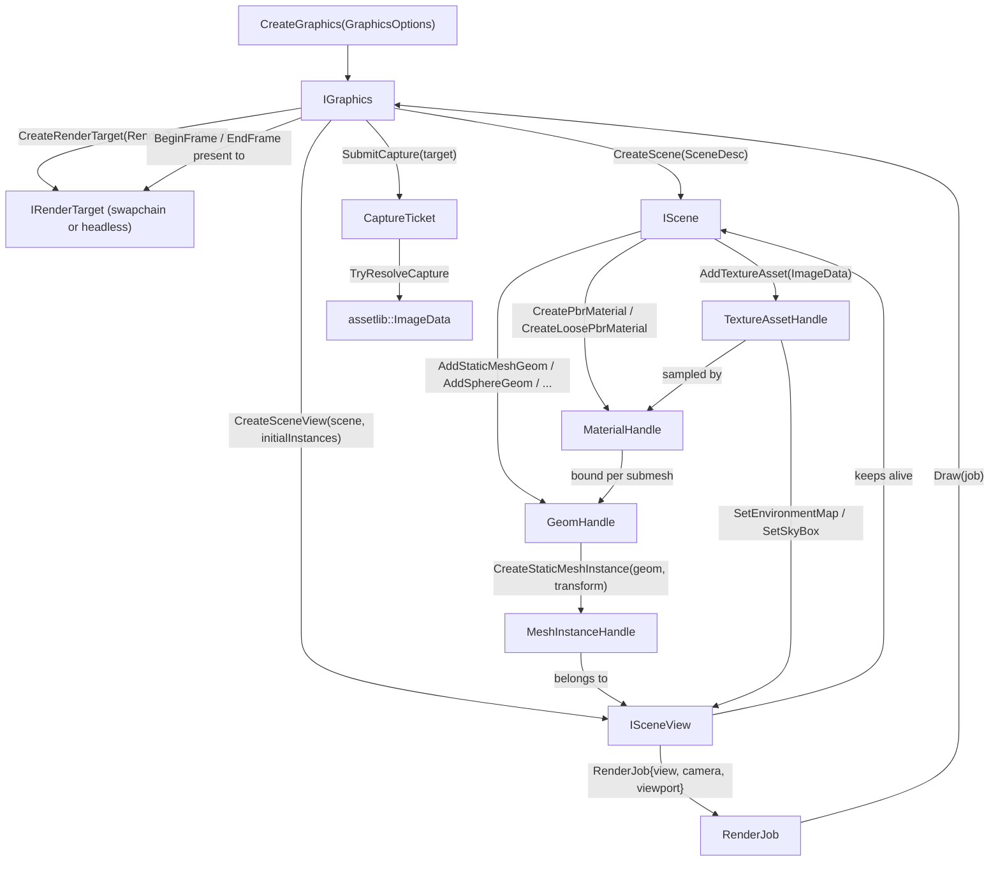

# bgl public API — what a client links against

Everything under [libs/bgl/include/bgl](libs/bgl/include/bgl) is bgl's public surface: the interfaces
an application (the editor, the examples, `gamelib`) uses to put a scene on screen. It is a strict
subset of what bgl_extended contains — the RHI (`IDevice`, `IResourceManager`, command lists) is internal and
documented separately in [Render Hardware Interface](docs/rhi.md); neither shipped backend,
`bgl_d3d12` or `bgl_metal`, is ever visible here.

The two are seams at different heights. The RHI abstracts a *graphics API*, and is drawn at the bar
D3D12 and Metal share — bindless resource access and mesh shaders. This surface sits above it and
abstracts the *renderer*, in the vocabulary of geometry, materials, textures, instances and cameras.

`bgl` is the target that carries these headers and nothing else. A renderer implementing them is
named for what it is built on and is a target of its own: `bgl_extended` is the tier that assumes
bindless resource access and a mesh stage, and it is the only one that ships today. `bgl_wgpu`, the
baseline tier for the browser and for a device that misses that bar, is recorded in `ROADMAP.md` and
not built.

**Keep it that way.** No descriptor, meshlet, heap or pipeline-object vocabulary in a name, a field
or a throw contract here — state what a caller is guaranteed, not the machinery that currently
provides it. `bgl_selfcheck` enforces the dependency half (a public header that reaches into a
renderer's internals fails the build); the wording half is review's.

**This document is a map, not a mirror.** It captures design choices, topology, and the *non-obvious*
contracts — not full signatures. The header at each linked path is the source of truth; when this doc
disagrees, trust the header, then fix this doc.

---

## Design Choices

* **`IGraphics` is the entire entry point.** `CreateGraphics(GraphicsOptions)` returns the one object
  everything else is minted from: render targets, scenes, scene views. It also *is* the submission
  context — `BeginFrame`/`Draw`/`EndFrame`, `Resize` and the capture family are methods on it, not on
  a separate object. There is exactly one context per device.

* **Interfaces are pure-virtual and intrusively refcounted, because bgl_extended is a DLL.** Every `I*` derives
  from `core::Ref` and is held behind `core::SharedRef<T>` (`GraphicsRef`, `SceneRef`, `SceneViewRef`,
  `RenderTargetRef`), with copy and move deleted — they are never value types. Each header ends with an
  explicit `template class BGL_API core::SharedRef<...>` instantiation so the refcount machinery
  crosses the DLL boundary once. This is why the API is virtual: it is an ABI seam, not backend
  polymorphism.

* **Scene holds geometry, SceneView holds instances — and rendering takes the view.** An
  [IScene](libs/bgl/include/bgl/IScene.h) owns geometry, materials and texture assets; an
  [ISceneView](libs/bgl/include/bgl/ISceneView.h) owns per-view mesh instances plus the lighting
  environment (IBL maps, skybox, exposure). Many views may share one scene, so meshlets and vertices
  are stored once and instanced cheaply. A view keeps its scene alive. `RenderJob::view` is a
  `SceneViewRef` — there is no way to draw a scene directly.

* **An overlay is 2D output drawn over a frame, and it is not a scene.** `CreateOverlay` mints an
  [IOverlay](libs/bgl/include/bgl/IOverlay.h) that compiles pixel-space triangle lists and
  owns straight-alpha textures; `DrawOverlay`, between `BeginFrame` and `EndFrame`, queues draws
  that land after post-processing, blended premultiplied over the tonemapped frame in submission
  order. Positions are output pixels, origin top-left; colours are sRGB-encoded premultiplied bytes,
  the form a UI library emits, and the renderer decodes them. A frame with no `DrawOverlay` draws
  no overlay pass, and a capture holds the overlay because a capture is the presented frame.
  General 2D output — a UI runtime is one client of it, and nothing here knows what a document is.
* **A live 3D render inside 2D output is a headless target sampled as an overlay texture.** The
  frame cannot layer it — post-processing covers the backbuffer whole — so the scene is drawn every
  tick into its own headless `IRenderTarget`, and `IOverlay::CreateTexture(target)` wraps what that
  target last presented. The overlay retains the target, the frame that samples it imports the
  borrowed backbuffer under its own name and returns it to present before `EndFrame`, and the two
  targets keep their own histories and clocks; one queue in submission order is what orders the
  preview's frame before the read. A windowed target is refused, and a target cannot be sampled
  by its own frame. The seam is overlay-scoped rather than an SRV on `IRenderTarget` because the
  overlay is its only consumer today; when a second one arrives — the hero damage-mask target in
  `ROADMAP.md` is the candidate — the general spelling is the refactor, and this overload becomes
  its first caller.

* **Scene mutations are staged, not immediate.** `AddTextureAsset`, `AddStaticMeshGeom`,
  `CreatePbrMaterial` and friends record CPU-side state and queue the GPU upload; the upload runs as a
  frame-graph pass (`Scene Update <n>`) that `Draw` schedules. **Nothing reaches the GPU until a frame
  that draws this scene is submitted.** Capturing the backbuffer before any frame has drawn the new
  content yields the old content — this is why callers that render one-shot images draw a warmup frame
  before capturing.

* **Scene capacities are a starting point; descriptor-heap capacities are not.** `SceneDesc` sizes
  where every scene arena *starts* (`initialGeom`, `initialMeshlets`, `initialIndices`,
  `initialSubmeshes`, `initialVertexBufferByteSize`, `initialPbrMaterials`,
  `initialLoosePbrMaterials`), and `CreateSceneView(scene, initialInstances)` does the same for a
  view. Each grows on demand, so an asset larger than the whole initial budget still loads; sizing
  them near the steady state only avoids the growth events. `SceneError` on a load now means the
  device could not allocate, not that a budget was hit.

  `GraphicsOptions` is the opposite: `maxCbvSrvUavs`, `maxBuffers`, `maxSrvs`, `maxBufferSrvs`,
  `maxRtvs`, `maxDsvs`, `maxTextures`, `maxSamplers` and `maxReadbackBuffers` size fixed pools that
  never grow. Exhausting one fails that creation and nothing else: the call logs and returns a null
  handle rather than throwing, so a caller that stores the result holds something it must check
  before using or releasing it.

  `maxRtvs` and `maxDsvs` are sized against each other, because a render target draws seven views
  from the first and one from the second. Raising the number of targets a client keeps open means
  raising both.

  **`maxCbvSrvUavs` counts descriptors; the pool sizes count resources.** Every buffer, every SRV and
  every second view of a buffer takes one descriptor from the shader-visible heap, so the heap must
  be at least as large as those three pools together — the resource manager asserts it. They are
  separate knobs because they run out for different reasons: the heap is a hardware-shaped limit,
  the pools are how many live objects a scene keeps. A texture is in neither pool; only an SRV onto it is.

  Note that growth *consumes* buffer slots and descriptors — a grown buffer takes a new one of each
  and gives the old ones back only once the deferred destroy clears — so a scene that grows a lot
  needs headroom above its steady-state resource count.

* **Never cache a buffer's descriptor index across frames.** Growth allocates a new resource and a
  new descriptor slot rather than rewriting the existing one, because a descriptor is read by the GPU
  when a shader runs, not when the command list is recorded. Re-read `GetBufferHandle()` each frame;
  the superseded resource stays alive on the resource manager's fence until every in-flight frame
  that referenced it has retired.

* **Handles are trivially copyable values, but their shapes differ.** `GeomHandle`,
  `MeshInstanceHandle` and `RigHandle` each wrap a `core::slot_handle` reached as `.handle` and
  expose `IsValid()`; `MaterialHandle` carries a `.byteOffset` into the scene's material arena
  instead, materials living in one arena rather than a slot buffer. `TextureAssetHandle` wraps one
  reached as `.textureSlot` and has **no** `IsValid()` —
  test it via the `slot_handle`'s `operator bool` (`if (tex.textureSlot)`). Do not assume one spelling
  across handle families.

* **Material bindings are raw byte offsets with no generation check.** This is the sharpest hazard in
  the API. A submesh (and an instance override) stores a material's *byte offset* into the scene's
  material arena, not a generation-guarded handle, so deleting a material that something still binds
  silently re-points it at whatever record next takes those bytes — and, the arena holding records of
  different sizes, at a record of another kind or at the middle of one. The header a record carries
  is what a debug build checks that against. Geometry deletion has the mirror-image problem: an
  instance holds a plain copy of its geom's submesh range. Ordering these teardowns is the caller's
  job — or `gamelib`'s `AssetManager`, which refcounts them.

  **A rig is the exception, and it throws rather than corrupting.** `DeleteRig` refuses while any geom
  added against it is still alive, so the order — geoms, then the rig they were skinned to — is
  enforced instead of merely documented. It is the one deletion here whose misuse is an error you see.

* **A material's PSO bucket comes from the `(layer, type)` pair, not the type alone.** `MaterialHandle`
  carries `layerType` (`kOpaque`/`kMask`/`kBlend`/`kHashed`) alongside `materialType`, because a
  submesh cannot know which pipeline it belongs in from the material's storage alone. `layerType` is
  therefore part of the handle, not just the desc. Which bucket a pair resolves to is bgl_extended's own
  business: the enum lives at [libs/bgl_common/shaders/src/idl/PsoType.slang](libs/bgl_common/shaders/src/idl/PsoType.slang) and is
  generated into `bgl::idl`, not onto this surface.

* **Failures are exceptions, not return codes.** Everything derives from
  [ApiError](libs/bgl/include/bgl/error.h): `GraphicsError` for device/frame misuse, `SceneError` for
  scene misuse. Methods that cannot fail are `noexcept`. Handle-returning methods signal "nothing" with
  an invalid handle rather than throwing.

* **Backbuffer capture is split-phase.** `SubmitCapture` records the copy and returns a
  `CaptureTicket` without waiting; `TryResolveCapture` returns the image once the GPU is done, or
  `nullopt`. `ScreenshotToMemory` is the blocking convenience wrapper around the pair. At most
  `IGraphics::c_MaxPendingCaptures` may be in flight.

* **GPU assertions are a Debug-build facility.** `dbg_raise` in shaders reaches
  [IGpuAssertionHandler](libs/bgl/include/bgl/IGpuAssertionHandler.h) only under `BERNINI_GPU_DEBUG`;
  in Release the handler is never invoked. See [Graphics Debug](docs/gfx_debug.md).

---

## Interface Index

| Interface | File | Role |
|---|---|---|
| `IGraphics` | [libs/bgl/include/bgl/IGraphics.h](libs/bgl/include/bgl/IGraphics.h) | The device and its one submission context: creates targets/scenes/views, and drives frames, resizes and captures. Minted by `CreateGraphics`. |
| `IScene` | [libs/bgl/include/bgl/IScene.h](libs/bgl/include/bgl/IScene.h) | Owns geometry, materials and texture assets. Shared by many views. |
| `ISceneView` | [libs/bgl/include/bgl/ISceneView.h](libs/bgl/include/bgl/ISceneView.h) | Per-view mesh instances, material overrides, per-submesh selection marks, and lighting (IBL, skybox, exposure). |
| `IOverlay` | [libs/bgl/include/bgl/IOverlay.h](libs/bgl/include/bgl/IOverlay.h) | Compiled 2D geometry and the textures it samples, drawn over a frame by `IGraphics::DrawOverlay`. Usable on any target the graphics draws. |
| `IRenderTarget` | [libs/bgl/include/bgl/IRenderTarget.h](libs/bgl/include/bgl/IRenderTarget.h) | A render output: windowed swapchain or headless offscreen backbuffers, plus depth, the linear-HDR scene colour every pass renders into, and the screen-space velocity buffer. `RenderTargetDesc::taaEnabled` opts it into a jittered projection and a temporal history, which `SetTaaEnabled` then runs or stops at runtime; `SetOutlineEnabled` runs or stops the selection outline, on by default. `GetWidth`/`GetHeight` are the output size — the backbuffer's, and every capture's; `GetRenderWidth`/`GetRenderHeight` are the grid the geometry passes draw on; `SetTaaReconstructionWidth` sweeps the resolve's kernel without reallocating anything or dropping the accumulation. |
| `IGpuAssertionHandler` | [libs/bgl/include/bgl/IGpuAssertionHandler.h](libs/bgl/include/bgl/IGpuAssertionHandler.h) | Caller-implemented sink for shader `dbg_raise` reports. Not refcounted; a plain callback interface. |

### Supporting types

| Type | File | Role |
|---|---|---|
| `GraphicsOptions` | [libs/bgl/include/bgl/IGraphics.h](libs/bgl/include/bgl/IGraphics.h) | Device creation: debug layers, log level, `shaderCacheDir`, and every descriptor-heap/pool capacity. |
| `CaptureTicket` | [libs/bgl/include/bgl/IGraphics.h](libs/bgl/include/bgl/IGraphics.h) | Names one in-flight backbuffer capture. Spent by resolve or discard. |
| `SceneDesc` | [libs/bgl/include/bgl/IScene.h](libs/bgl/include/bgl/IScene.h) | Fixed pool capacities for a scene. |
| `PbrMaterialDesc` / `LoosePbrMaterialDesc` | [libs/bgl/include/bgl/IScene.h](libs/bgl/include/bgl/IScene.h) | Baked (three-map) vs. loose (per-channel routed) material parameters. `ChannelRouteDesc` feeds the latter. |
| `EnvironmentMapDesc` | [libs/bgl/include/bgl/IScene.h](libs/bgl/include/bgl/IScene.h) | The IBL triplet (irradiance cube, prefilter cube, BRDF LUT). **Move-only** — copy is deleted. |
| `GroundPlaneDesc` | [libs/bgl/include/bgl/IScene.h](libs/bgl/include/bgl/IScene.h) | The scene's ground: a point and an up normal. Defaults to `y = 0`. |
| `RenderTargetDesc` | [libs/bgl/include/bgl/IRenderTarget.h](libs/bgl/include/bgl/IRenderTarget.h) | The output size, `renderScale` (how dense the geometry passes' grid is relative to it), `taaReconstructionWidth` (how wide a kernel the resolve rebuilds an output pixel with, in output pixels), `headless`, and `wnd` — an `HWND` on D3D12, a `CAMetalLayer*` on Metal; ignored when headless. |
| `RenderJob` | [libs/bgl/include/bgl/RenderJob.h](libs/bgl/include/bgl/RenderJob.h) | One draw: `{view, camera, viewport, time}`. Holds a **copy** of the camera. |
| `OverlayVertex`, `OverlayDraw`, `OverlayJob`, `OverlayRect` | [libs/bgl/include/bgl/IOverlay.h](libs/bgl/include/bgl/IOverlay.h) | A 24-byte pixel-space vertex; one draw of a geometry with its texture, translation, optional 4×4 transform and optional scissor; the overlay plus the draws one `DrawOverlay` submits; a pixel rectangle. |
| `OverlayGeometryHandle`, `OverlayTextureHandle` | [libs/bgl/include/bgl/IOverlay.h](libs/bgl/include/bgl/IOverlay.h) | Value handles into an overlay's storage, valid only on the overlay that minted them. |
| `Camera` | [libs/bgl/include/bgl/Camera.h](libs/bgl/include/bgl/Camera.h) | Chained-builder view/projection. Concrete, header-only, copyable. |
| `Viewport` | [libs/bgl/include/bgl/Viewport.h](libs/bgl/include/bgl/Viewport.h) | Min/max XYZ; the `(width, height)` constructor is the usual one. |
| `SkyboxDesc` | [libs/bgl/include/bgl/SkyboxDesc.h](libs/bgl/include/bgl/SkyboxDesc.h) | Cube texture plus `mipLevel`, `exposure`, `rotationY`. |
| `GeomHandle`, `MaterialHandle`, `MeshInstanceHandle`, `RigHandle`, `TextureAssetHandle` | [GeomHandle.h](libs/bgl/include/bgl/GeomHandle.h), [MaterialHandle.h](libs/bgl/include/bgl/MaterialHandle.h), [MeshInstanceHandle.h](libs/bgl/include/bgl/MeshInstanceHandle.h), [RigHandle.h](libs/bgl/include/bgl/RigHandle.h), [TextureAssetHandle.h](libs/bgl/include/bgl/TextureAssetHandle.h) | Value handles into scene/view storage. See the shape caveat above. |
| `GeomType`, `LayerType`, `MaterialType` | [GeomType.h](libs/bgl/include/bgl/GeomType.h), [LayerType.h](libs/bgl/include/bgl/LayerType.h), [MaterialType.h](libs/bgl/include/bgl/MaterialType.h) | Classification enums. `MaterialType` is **IDL-generated** from Slang — see [IDL Codegen](docs/idlgen.md). |
| `ApiError` | [libs/bgl/include/bgl/error.h](libs/bgl/include/bgl/error.h) | Base of `GraphicsError` and `SceneError`. |
| `BGL_API` | [libs/bgl/include/bgl/api.h](libs/bgl/include/bgl/api.h) | Export/import macro for the DLL boundary. |

[bgl.h](libs/bgl/include/bgl/bgl.h) is the umbrella header; including it reaches all of the above.

---

## Topology


```mermaid
flowchart TD
    CG["CreateGraphics(GraphicsOptions)"] --> IG[IGraphics]

    IG -- "CreateRenderTarget(RenderTargetDesc)" --> RT["IRenderTarget (swapchain or headless)"]
    IG -- "CreateScene(SceneDesc)" --> SC[IScene]
    IG -- "CreateSceneView(scene, initialInstances)" --> SV[ISceneView]

    SV -- "keeps alive" --> SC
    SC -- "AddStaticMeshGeom / AddSphereGeom / ..." --> GH[GeomHandle]
    SC -- "CreatePbrMaterial / CreateLoosePbrMaterial" --> MH[MaterialHandle]
    SC -- "AddTextureAsset(ImageData)" --> TH[TextureAssetHandle]

    GH -- "CreateStaticMeshInstance(geom, transform)" --> MI[MeshInstanceHandle]
    MI -- "belongs to" --> SV
    MH -- "bound per submesh" --> GH
    TH -- "sampled by" --> MH
    TH -- "SetEnvironmentMap / SetSkyBox" --> SV

    SV -- "RenderJob{view, camera, viewport}" --> RJ[RenderJob]
    RJ -- "Draw(job)" --> IG
    IG -- "BeginFrame / EndFrame present to" --> RT
    IG -- "SubmitCapture(target)" --> CT[CaptureTicket]
    CT -- "TryResolveCapture" --> IMG["assetlib::ImageData"]
```

---

## Threading & Synchronization

* **One thread drives `IGraphics`.** The frame methods, `Resize`, the capture family and the GPU
  assertion setters are thread-affine, not thread-safe. Pick a thread and keep every bgl call on it.
  The editor does this with a dedicated render thread ([apps/editor/src/Render/Renderer.h](apps/editor/src/Render/Renderer.h))
  that the GUI thread reaches only through posted closures.
* **`IScene` and `ISceneView` are externally synchronized** — one owner, one thread, the same thread
  that draws them. They have no internal locking.
* **`CookStaticMesh` is the one call allowed off the driving thread.** It is a free function over
  the `BMesh` alone — no scene, no device — and exists so the CPU half of `AddStaticMeshGeom` (the
  dominant cost of a large mesh) can run on a worker, leaving only the commit overload's uploads on
  the driving thread.
* **Only one frame may be active at a time.** `BeginFrame` throws `GraphicsError` if one already is.
  `Resize`, `SubmitCapture` and `ScreenshotToMemory` throw if called between `BeginFrame` and
  `EndFrame`; `TryResolveCapture` is the exception and may be called mid-frame.
* **Object teardown is GPU-aware but thread-naive.** Releasing the last `SharedRef` to a scene, view
  or target flushes and frees GPU state, so it must happen on the driving thread — dropping a
  `SceneViewRef` from another thread while frames are in flight is a use-after-free, not a leak.

---

## Risky / Non-obvious Method Contracts

### IGraphics

* **`Draw(job)`** — @pre a frame is active (`BeginFrame` has been called and `EndFrame` has not).
  @post the job's scene and view are scheduled for GPU upload as part of *this* frame; content added
  since the last frame becomes visible only once this frame is submitted.
* **`DrawOverlay(job)`** — @pre a frame is active; `job.overlay` non-null; every draw names a live
  geometry of that overlay and a null or live texture of it, and no scissor with a negative extent.
  @throws `GraphicsError` otherwise, with nothing queued from that call. @post the draws are copied and resolved at once — the span need not
  outlive the call — and land after post-processing in order across every call this frame; the
  overlay is retained until `EndFrame`, so a caller's last ref dropped mid-frame frees nothing early.
  A geometry or texture named here must not be released before this frame's `EndFrame`. A draw whose
  texture wraps the target this frame is drawing to throws: a target's output is drawn on another
  target. Every other target a draw samples is retained through the frame, and the frame reads the
  slot it presented last — draw the preview target first, then the frame that shows it.
* **`Resize(target, w, h)`** — @pre not between `BeginFrame`/`EndFrame`; both dimensions non-zero.
  @throws `GraphicsError` otherwise. `w`/`h` are the *output* size; the render size is re-derived
  from the target's scale. Recreates backbuffers, depth, scene colour and the velocity buffer,
  invalidating anything that cached them.
* **`SetRenderScale(target, scale)`** — @pre not between `BeginFrame`/`EndFrame`; `scale` positive
  and finite. @throws `GraphicsError` otherwise. Recreates only what the geometry passes draw into,
  at the new render size; the presented size and every capture are unchanged, and the accumulation
  is discarded because a history gathered on one render grid describes samples the new one does not
  take.
* **`WaitIdle()`** — @pre not between `BeginFrame`/`EndFrame`. Blocks until every submitted frame,
  queued presents included, has drained from the GPU. Call it *before* hiding the last window being
  presented to (the editor does, in `MainWindow::closeEvent`): a present left pending across the hide
  is never consumed, and every later fence wait on the queue — the teardown flushes among them —
  blocks behind it forever.
* **`SubmitCapture(target)`** — @pre not mid-frame; fewer than `c_MaxPendingCaptures` captures in
  flight. @post returns a ticket that **must** be spent by `TryResolveCapture` or `DiscardCapture`;
  leaking tickets exhausts the slots and the next submit throws. Captures the *last presented*
  backbuffer, so it reflects the frame before it, not one still being recorded.
* **`TryResolveCapture(ticket)`** — @throws `GraphicsError` if the ticket is null or already spent.
  Returning an image spends it; `nullopt` leaves it live for a later call.
* **`DiscardCapture(ticket)`** — `noexcept`, and spending a ticket twice is a no-op, so teardown paths
  need no bookkeeping.
* **`SetGpuAssertionHandler(handler)`** — @pre `handler` outlives this `IGraphics`. Assertions are
  reported several frames after they fire (the readback ring is `c_SwapchainImageCount` deep), so
  clearing to `nullptr` does **not** cancel one already in flight — that would fall back to the crash
  path. Call `DiscardPendingGpuAssertions()` first to drop it.

### IOverlay

* **`CreateGeometry(vertices, indices)`** — @pre both non-empty, `indices` a multiple of three, every
  index below `vertices.size()`. @throws `GraphicsError` otherwise, or if the device cannot
  allocate; nothing is allocated before the checks pass. @post the bytes are copied; the upload rides
  the first frame that draws this overlay, so a geometry compiled and released between two frames
  costs no GPU work at all.
* **`ReleaseGeometry` / `ReleaseTexture`** — @throws `GraphicsError` for a null handle, one already
  released, or one minted by a different overlay — every overlay numbers its slots from zero, so a
  handle carries its overlay's id and a foreign one is refused rather than looked up. @post the
  handle is invalid at once and the GPU resources go once every frame that could read them has
  retired.
* **`CreateTexture(img)`** — @pre `img` has decoded pixels and at least one subresource. The image is
  straight-alpha and sampled through the format `img.vkFormat` declares: an sRGB format decodes on
  sample, a UNORM one does not. A UI library that hands over premultiplied bytes divides them out
  before calling this.
* **`CreateTexture(target)`** — @pre `target` non-null and headless; @throws `GraphicsError` for a
  windowed one, whose swapchain image is the surface a frame presents to. @post the target is
  retained until `ReleaseTexture`, so a caller's last ref cannot free the ring under a live handle;
  a draw sampling the handle reads the frame the target most recently finished, opaque, in the
  output's sRGB encoding — or opaque white until the target has presented at all, since a ring
  that never drew holds no frame. A `Resize` of the target between frames is followed — the view
  is re-resolved every frame, and the resized ring reads white until its first present — but never
  during one, which `Resize` refuses anyway.

### IScene

* **`DeleteGeom(geom)`** — @pre every instance placed from this geom has been destroyed via
  `ISceneView::DeleteMeshInstance`. The scene does **not** track instances and cannot check: an
  instance holds an ungenerationed copy of the geom's submesh range, so one that outlives its geometry
  draws whatever is allocated into that range next.
* **`DeleteMaterial(material)`** — @pre no live submesh or instance override still binds it. A submesh
  stores the material's byte offset, not a generation-checked handle, so a stale binding silently
  picks up whatever record next takes those bytes. Rebind with `SetSubmeshMaterial` first. @throws `SceneError`
  for `kNull` / `kAssert`, which have no storage to free.
* **`SetGround(ground)`** — the plane every skinned instance's feet are planted on, scene-wide
  (every view stands on the same ground, where lighting is per view). The normal is normalised on
  the way in. @throws `SceneError` for a non-finite point or normal, a zero normal, or one with
  `normal.y <= 0` — a vertical or overhanging plane has no height under a point. Moves the temporal
  epoch: a rebind, not a per-frame input, so set it with the scene.
* **`SetFootPlanting(enabled)`** — whether skinned instances plant their feet at all; on by default.
  Off, a rig that authored legs poses exactly as one that did not, against the same ground — what
  judging the solve takes. Scene-wide like the ground, and moves the temporal epoch like it.
* **`DeleteTextureAsset(texture)`** — @pre no live material routes it. The scene does not know which
  materials sample which textures. The GPU release itself *is* safely deferred behind the frames that
  could still be reading it; the dangling *binding* is what is unsafe.
* **`UpdatePbrMaterial` / `UpdateLoosePbrMaterial`** — rewrites the payload in place, keeping the
  record's offset and its header, so every submesh already bound picks the change up with no
  rebinding. The material's *type* cannot
  change, so the PSO bucket is unaffected. @throws `SceneError` on a type mismatch.
* **`AddStaticMeshGeom(mesh, meshIndex, materials)`** — `materials` is parallel to `mesh.materials`, and a
  submesh whose material index is out of range is left unlit rather than rejected. Resolving those
  paths to handles is the caller's job — `gamelib`'s `AssetManager` is the only implementation of the
  baked-vs-loose branch that does it, so reach for it rather than rebuilding it.

### ISceneView

* **`SetSubmeshMaterialOverride(instance, submeshIndex, material)`** — overrides one submesh of *one*
  instance, outranking the geom default; a later `Scene::SetSubmeshMaterial` does not disturb it. Same
  raw-slot hazard as `DeleteMaterial`: clear the override before deleting the material it names. The
  PSO follows the override, so two instances of one geom can draw from different pipelines.
* **`SetSubmeshSelected(instance, submeshIndex, selected)`** — marks one submesh of one instance
  for editor feedback (the selection outline draws from it); no shading changes. The mark dies with
  the instance: `DeleteMeshInstance` drops it, and a handle reusing the slot starts unselected —
  there is no stale-binding hazard here, unlike materials.
* **`SetFootIK(instance, desc)` / `GetFootIK(instance)`** — a hero skinned instance's runtime
  foot-IK record, one `FootIKLegDesc` per leg of its rig: a position ramp and a rotation ramp,
  each in `RenderJob::time` and each multiplying the weight the cook baked for the frame. Written
  on an event, never per frame; a write whose ramps all start at or after now leaves the previous
  frame's pose and its motion vector exact, and `FootIKDesc::FadeTo` builds one from the record
  read back. @throws on a static or crowd placement, a rig with no legs, a weight outside
  `[0, 1]`, a non-finite field, or a ramp ending before it starts. `HasFootIK(instance)` is
  exactly when neither throws, for a caller that cannot tell a rig's legs from outside. See
  [Skinned Meshes](skinning.md) § Foot planting.
* **`SetEnvironmentMap(desc)`** — @pre irradiance and prefilter are cube maps. Takes
  `EnvironmentMapDesc` by const reference but the struct is move-only, so build it in place at the
  call site. Replaces any previous environment wholesale.
* **`SetExposure(e)`** — @pre finite and non-negative. Scales *total* radiance before tone mapping, not
  the environment's contribution — it is camera sensitivity, not an IBL property.

---

## Usage Sketch

```cpp
auto gfxOpts           = bgl::GraphicsOptions{};
gfxOpts.shaderCacheDir = "shadercache";  // empty disables it; cold start is seconds slower
auto graphics          = bgl::CreateGraphics(gfxOpts);

auto targetDesc     = bgl::RenderTargetDesc{};
targetDesc.width    = 800;
targetDesc.height   = 600;
targetDesc.headless = false;
targetDesc.wnd      = nativeWindowHandle;
auto target         = graphics->CreateRenderTarget(targetDesc);

auto sceneDesc                    = bgl::SceneDesc();
sceneDesc.initialGeom                 = 100;
sceneDesc.initialMeshlets             = 1000;
sceneDesc.initialSubmeshes            = 100;
sceneDesc.initialIndices              = 10000;
sceneDesc.initialVertexBufferByteSize = 100000;
sceneDesc.initialPbrMaterials         = 100;

auto scene = graphics->CreateScene(std::move(sceneDesc));
auto view  = graphics->CreateSceneView(scene, 100);

// One .benv carries the prefilter, irradiance and skybox of an environment, plus its exposure. The
// split-sum BRDF table is not among them: it integrates a white environment, so it belongs to the
// shading model, and bgl_extended generates its own at device init.
auto env = assetlib::loadBenv("assets/forest.benv");
view->SetEnvironmentMap(
    { scene->AddTextureAsset(std::move(env.irradiance)),
      scene->AddTextureAsset(std::move(env.prefilter)) });
view->SetExposure(env.exposure);

auto material = scene->CreatePbrMaterial(
    { .baseColorFactor = glm::vec4(1.0f), .metallicFactor = 0.5f, .roughnessFactor = 0.5f });
auto sphere = scene->AddSphereGeom(32, 32, 2.0f, material);
view->CreateStaticMeshInstance(sphere, glm::mat4(1.0f));

auto camera = bgl::Camera();
camera.LookAt({ 0.0f, 0.0f, 20.0f }, { 0.0f, 0.0f, 19.0f }, { 0.0f, 1.0f, 0.0f })
    .Perspective(glm::radians(60.0f), 800.0f / 600.0f, 0.5f, 500.0f);

auto job     = bgl::RenderJob{};
job.view     = view;
job.camera   = camera;  // a copy -- reassign after moving the camera
job.viewport = bgl::Viewport(800.0f, 600.0f);

while (!ShouldClose())
{
    PumpEvents();
    graphics->DrawFrame(target, job);  // BeginFrame + Draw + EndFrame
}
```

See [examples/bgl_sphere/src/main.cpp](examples/bgl_sphere/src/main.cpp) for the full program, and
[examples/bgl_two_windows/src/main.cpp](examples/bgl_two_windows/src/main.cpp) for two targets and two
scenes driven from one device.

---

**Maintenance.** The interface and supporting-type tables are this doc's load-bearing part, and their
file links rot silently when headers move or are renamed. Re-check them whenever
[libs/bgl/include/bgl](libs/bgl/include/bgl) changes shape.
