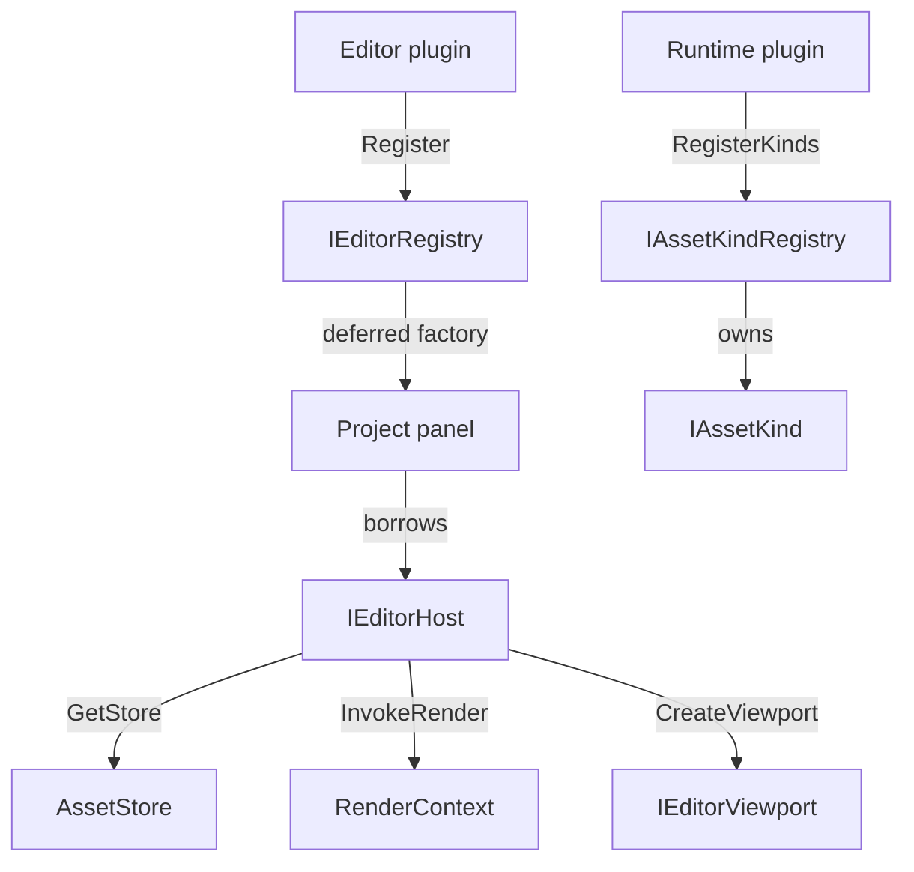

# Editor plugin contracts

`editor_api` defines the public C++ contracts for native editor extensions. This is an interface
review milestone: the compiled sample and recording host exercise the contracts, but the editor
does not yet load plugins or dispatch through them. `AssetStore` does not yet consume registered
kinds. The headers at the linked paths are the source of truth; when this map disagrees, trust the
header and fix the map.

## Design choices

- **Separate document semantics from Qt presentation.** `assetlib_plugin_api` has no Qt, renderer
  or implementation-library dependency. A runtime module registers authored kinds; its editor
  module registers panels and presentation. Built-in `AssetType` and codecs are unchanged.
  This contract belongs in assetlib so the offline CLI and game can use a custom kind without
  loading Qt or its editor module. `IAssetKind` represents one file type, not an individual record.
- **General tabs require no document kind.** A project tool, including a future AI management tab,
  uses `PanelDesc`. `AssetEditorDesc` additionally supplies extensions and an asset-opening panel.
- **One project, one host.** A panel borrows that project's `IEditorHost`. The host exposes the
  existing `AssetStore` and lends graphics, scene and `game::AssetManager` only inside synchronous
  render-thread calls. Do not create a second store or renderer to service a panel.
- **The host owns presentation.** Plugins populate host-created viewports and describe thumbnails.
  A scene thumbnail names geometry (a mesh key or the built-in sphere), optional material override
  and optional camera; no camera means automatic framing. Plugins never advance the frame loop.
- **Matched-build C++ boundary.** STL and Qt types intentionally cross it. These are not interfaces
  for an arbitrary compiler or engine version. Entry-point aliases name factory signatures, not
  implemented loader functions; the future loader must verify compatibility before calling them.
  `editor_api` currently carries gamelib's public dependencies so clients can use the borrowed
  manager and store. Those libraries still use their existing linkage: do not build a production
  plugin DLL against this milestone until the shared SDK establishes their single ownership.

## Interface index

| Contract | Header | Role |
|---|---|---|
| `IAssetPlugin`, `IAssetKindRegistry`, `IAssetKind` | [IAssetPlugin.h](libs/assetlib/include/assetlib/IAssetPlugin.h) | Qt-free authored-kind registration and document operations |
| `IEditorPlugin` | [IEditorPlugin.h](libs/editor_api/include/editor_api/IEditorPlugin.h) | Register editor contributions at startup |
| `IEditorRegistry` | [IEditorRegistry.h](libs/editor_api/include/editor_api/IEditorRegistry.h) | Own deferred panel, editor, action, importer and thumbnail descriptors |
| `EditorPanel`, `AssetEditorPanel` | [EditorPanel.h](libs/editor_api/include/editor_api/EditorPanel.h) | Project-scoped widgets, close veto and held assets |
| `IEditorHost` | [IEditorHost.h](libs/editor_api/include/editor_api/IEditorHost.h) | Project store, render dispatch and editor navigation |
| `IEditorViewport`, `RenderContext` | [IEditorViewport.h](libs/editor_api/include/editor_api/IEditorViewport.h) | Host presentation with access to its scene view on the render thread |
| `Thumbnail`, `ThumbnailScene` | [Thumbnail.h](libs/editor_api/include/editor_api/Thumbnail.h) | No preview, CPU image, or a scene the host renders |

Owning pointer aliases live beside their interfaces: `AssetKindPtr`, `AssetPluginPtr` and
`EditorPluginPtr`. Descriptor callback aliases live in `IEditorRegistry.h`; `RenderWork` and
`ViewportRenderWork` live beside `RenderContext`.

Recheck this table whenever the public files move.

## Topology



The diagram is the contract's ownership/call topology; only the sample's recording host currently
implements its registration side. There is no production registry or loader in this milestone.

## Threading and lifetime

Registration, factories, panels, actions, importers and host navigation run on the GUI thread.
An importer may arrange background CPU work, but must finish or join it before returning; these
callbacks do not grant a background task permission to outlive the project. Thumbnail descriptions
and document callbacks may run concurrently and must not access widgets or mutate shared state.

`InvokeRender` and viewport `Invoke` run synchronously on the render thread and propagate
exceptions to the caller. A closure must never wait on the GUI thread or retain the borrowed
context. Owned scene handles may be retained by a panel, but all access and release still belong
on the render thread, before its host dies. The host drains a viewport's pending draws before
destroying its view. Inactive tabs must suspend their viewports through `SetActive`.

The module stays loaded until process exit. Its plugin object outlives its descriptors and kinds;
those outlive all callbacks and panels using them. On project close, ask all panels `CanClose`
first; any refusal keeps the project alive. Then destroy panels and their viewport children and
join plugin work while the old host still exists. Destroy the host last. On another project, create
new panels against a new host; do not silently retarget stored references to old services.

## Risky contracts

- **Registration:** IDs are nonempty, plugin-qualified strings. Extensions are lowercase with a
  leading dot. Missing required callbacks, null kinds, duplicate IDs or conflicting extension claims
  are errors, including conflicts with built-ins. Registry implementations must discard all of a
  failed module's contributions. Panel/editor IDs share one namespace; other categories have their
  own ID namespaces. These requirements are not implemented by the recording test host.
- **Factories:** @pre a non-null parent and live project host. @post return a non-null widget
  parented to that parent, transferring Qt ownership to the host. Each registered panel/editor is
  one reusable tab per project. Factories are lazy; registration cannot access a project.
- **Actions:** both callbacks are required. Empty extensions means a menu action with an empty
  selection; otherwise the action is a content-menu contribution, offered only when every selected
  key matches. Menu components identify a menu path; the host owns the actual actions and menus.
  A plugin can contribute to `File` or another menu, but its actions are disabled without an open
  project because they borrow `IEditorHost`. Shell commands such as `File → Open Project` stay
  host-owned and available before a project opens; this API does not expose project switching to
  plugins. `AddAction` is a menu-bar/content-menu contract, not a toolbar-button contract.
- **Importers:** the source is an OS path, the destination a project folder key. Store operations
  own writes. The host reports thrown errors; a successful write calls `AssetChanged`.
- **References:** `ReadReferences` must validate the document and report every reference, even
  one whose target is absent. Each field token uniquely identifies an occurrence; the host treats
  tokens as opaque, normalizes targets through assetlib and expands directory moves. A rewrite
  receives replacement targets with those tokens against the same input bytes. It preserves
  unknown fields and never writes to disk. The host alone commits or rolls back the resulting bytes.
  Input spans borrow the original bytes without copying them. A returned vector owns the encoded
  result; keeping the original unchanged permits rollback if another document's rewrite fails.
- **Packing/migration:** registered kinds are authored documents, with an explicit include/exclude
  policy. `Migrate` validates and returns current-schema bytes even for a kind with no older schema.
  Custom derived cache formats are outside this initial contract. Existing typed codecs and store
  operations remain the only project I/O seam; their registration integration is still pending.

## Usage sketch

```cpp
auto plugin = sample::CreateEditorPlugin();
plugin->Register(registry);
// Later, while the plugin and registry still live:
auto* panel = registry.panels.front().create(host, &projectRoot);
panel->SetActive(true);
```

See the compiled [sample](examples/editor_plugin/sample.cpp) and its
[README](examples/editor_plugin/README.md). It links only the public API and a private JSON parser;
it has no editor implementation include path. It currently displays a selected document key, not
a working document editor. The fake host deliberately fails if it is asked for storage or graphics.

`just test editor_plugin` exercises deferred registration, Qt ownership, tab activation, held asset
replacement, malformed-document refusal, reference rewriting and preservation of unknown fields.
Each public editor header is also compiled alone, with no PCH. The asset plugin header compiles
against its Qt-free target alone. Renderer scheduling, DLL ABI checks, registry validation and real
store/pack behavior require later integration tests; the fake host does not establish them.
