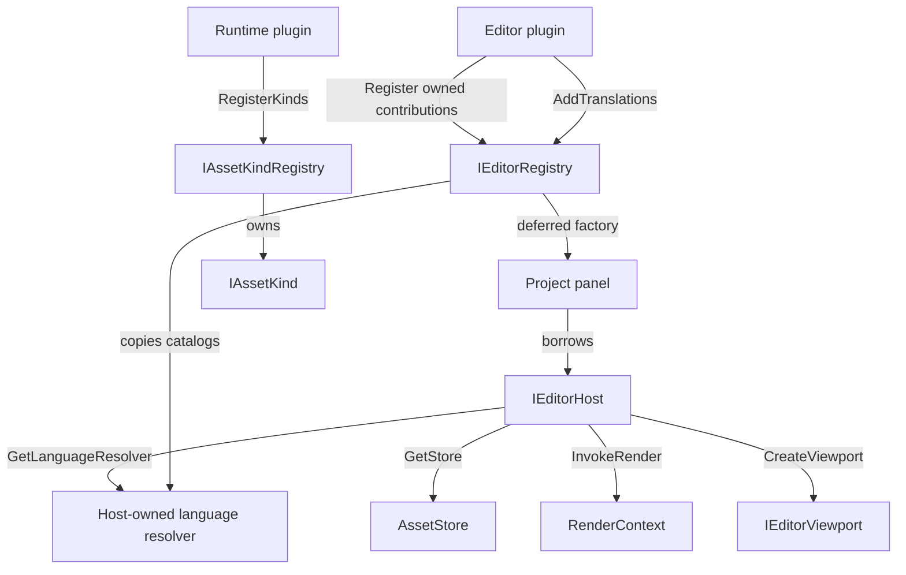

# Editor plugin contracts

`editor_api` defines the public C++ contracts for native editor extensions. A top-level renderer
build also writes a build-tree `BerniniEditorSDK` CMake package whose `Bernini::editor_api` target
is consumed by a separately configured plugin project. The editor loads the local modules required
by its startup project before that project's store opens. Runtime kinds already participate in the
store, graph, rename, migrate and pack paths. The editor validates and owns presentation
contributions in the same process session, then creates one host for each open project.
The headers at the linked paths are the source of truth; when this map disagrees, trust the header
and fix the map.

## Design choices

- **Separate document semantics from Qt presentation.** `assetlib_plugin_api` has no Qt, renderer
  or implementation-library dependency. A runtime module registers authored kinds; its editor
  module registers panels and presentation. Built-in `AssetType` and codecs are unchanged.
  This contract belongs in assetlib so the offline CLI and game can use a custom kind without
  loading Qt or its editor module. `IAssetKind` represents one file type, not an individual record.
- **General tabs require no document kind.** A project tool, including a future AI management tab,
  uses `PanelDesc`. `AssetEditorDesc` additionally supplies extensions and an asset-opening panel.
- **One project, one host.** A panel borrows that project's `IEditorHost`. The host exposes the
  existing `AssetStore` and lends graphics, scene and `game::AssetManager` only inside synchronous
  render-thread calls. Do not create a second store or renderer to service a panel.
- **The host owns presentation.** Plugins populate host-created viewports and describe thumbnails.
  A scene thumbnail names geometry (a mesh key or the built-in sphere), optional material override
  and optional camera; no camera means automatic framing. Plugins never advance the frame loop.
- **Identity is independent of language.** Panel, action and menu IDs are stable; labels retain
  translation context/key and fallback text. The host resolves them through a borrowed
  `ILanguageResolver` without registering contributions again. Each host owns its locale and copies
  module catalogs; there is no singleton. The resolver and CSV reader are implemented, but the
  production editor uses the resolver for plugin menus, actions, tabs and widgets.
- **Matched-build C++ boundary.** STL and Qt types intentionally cross it. These are not interfaces
  for an arbitrary compiler or engine version. Entry-point aliases name factory signatures, not
  implemented loader functions. The loader checks the engine build ID, configuration, dependency
  files and SDK freshness before loading a module or calling either factory.
  `editor_api` carries gamelib's public dependencies so clients can use the borrowed manager and
  store. In SDK builds, assetlib and gamelib are shared and RmlUi/Lua live inside gamelib rather
  than being linked into every plugin. `core` remains static; its process state is already owned by
  shared `core_process`. Windows SDK builds require shared RmlUi targets, because a DLL cannot
  re-export every symbol from an imported static archive automatically.
- **The SDK is a build-tree package.** Configure a plugin with
  `-DBerniniEditorSDK_DIR=<engine-build>/editor_sdk` and link `Bernini::editor_api`. This package
  names the exact libraries and dependency tree of that engine build; it is not an installed,
  version-independent engine package. Top-level editor builds enable it by default. Builds without
  Qt/editor, embedded games and `RENDERER_BACKEND=NONE` keep assetlib and gamelib static and produce
  no package.

## Interface index

| Contract | Header | Role |
|---|---|---|
| `IAssetPlugin`, `IAssetKindRegistry`, `IAssetKind` | [IAssetPlugin.h](libs/assetlib/include/assetlib/IAssetPlugin.h) | Qt-free authored-kind registration and document operations |
| `IEditorPlugin` | [IEditorPlugin.h](libs/editor_api/include/editor_api/IEditorPlugin.h) | Register editor contributions at startup |
| Descriptor constants | [PluginDescriptor.h](libs/editor_api/include/editor_api/PluginDescriptor.h) | Descriptor filename and schema version |
| `IEditorPanelFactory`, `IAssetEditorFactory` | [IEditorPanelFactory.h](libs/editor_api/include/editor_api/IEditorPanelFactory.h), [IAssetEditorFactory.h](libs/editor_api/include/editor_api/IAssetEditorFactory.h) | Owned deferred factories for project widgets |
| `IEditorAction` | [IEditorAction.h](libs/editor_api/include/editor_api/IEditorAction.h) | Owned action with enablement and invocation |
| `IEditorImporter`, `IThumbnailProvider` | [IEditorImporter.h](libs/editor_api/include/editor_api/IEditorImporter.h), [IThumbnailProvider.h](libs/editor_api/include/editor_api/IThumbnailProvider.h) | Owned import and thumbnail behavior |
| `IEditorRegistry` | [IEditorRegistry.h](libs/editor_api/include/editor_api/IEditorRegistry.h) | Own deferred panel, editor, action, importer and thumbnail descriptors |
| `LocalizedText` | [LocalizedText.h](libs/editor_api/include/editor_api/LocalizedText.h) | Deferred label lookup with fallback |
| `ILanguageResolver`, `LanguageResolver` | [ILanguageResolver.h](libs/editor_api/include/editor_api/ILanguageResolver.h), [LanguageResolver.h](libs/editor_api/include/editor_api/LanguageResolver.h) | Borrowed lookup service and host-owned implementation |
| `TranslationCatalog`, `ReadTranslationCsv` | [TranslationCatalog.h](libs/editor_api/include/editor_api/TranslationCatalog.h), [translation_csv.h](libs/editor_api/include/editor_api/translation_csv.h) | Module data and optional CSV ingestion |
| `MenuDesc` | [IEditorRegistry.h](libs/editor_api/include/editor_api/IEditorRegistry.h) | Stable menu identity and parent, separate from its label |
| `EditorPanel`, `AssetEditorPanel` | [EditorPanel.h](libs/editor_api/include/editor_api/EditorPanel.h) | Project-scoped widgets, close veto and held assets |
| `IEditorHost` | [IEditorHost.h](libs/editor_api/include/editor_api/IEditorHost.h) | Project store, render dispatch and editor navigation |
| `IEditorViewport`, `RenderContext` | [IEditorViewport.h](libs/editor_api/include/editor_api/IEditorViewport.h) | Host presentation with access to its scene view on the render thread |
| `Thumbnail`, `ThumbnailScene` | [Thumbnail.h](libs/editor_api/include/editor_api/Thumbnail.h) | No preview, CPU image, or a scene the host renders |

Owning pointer aliases live beside their interfaces: `AssetKindPtr`, `AssetPluginPtr` and
`EditorPluginPtr`. Each contribution interface also declares its owning `Ptr` alias, such as
`EditorActionPtr`. Descriptors hold these exclusive owners; `RenderWork` and
`ViewportRenderWork` live beside `RenderContext`.

Registration descriptors and `ViewportDesc` support fluent `Set…` methods; extension lists use
`AddExtension`. `AddFactory<T>`, `AddAction<T>`, `AddImporter<T>` and `AddProvider<T>` construct
and own a concrete contribution, forwarding constructor arguments. These templates require a
constructible public implementation of the corresponding interface. Replacing an object destroys
its predecessor only after successful construction. Lvalue chains return the same descriptor;
rvalue chains retain the rvalue category so a temporary transfers directly into registration.

Recheck this table whenever the public files move.

## Topology



The diagram is the contract ownership/call topology. The production loader owns both registries.
Each project host borrows its store, renderer and asset manager while project panels exist.

## Local loading

A `.bproj` names its required plugin IDs in `plugins`. Machine-local `config.json` names candidate
output directories in `pluginDirectories`; each directory contains `bernini-plugin.json` and the
binaries it names. Opening a project with a different ordered plugin list restarts the editor, just
as changing its surface shaders does. Missing, malformed or incompatible requirements stop startup
with the plugin named in the error.

```json
{
  "version": 1,
  "id": "studio.ai",
  "engineBuildId": "<BerniniEditorSDK_BUILD_ID>",
  "configuration": "Debug",
  "runtime": "studio_ai_runtime.dylib",
  "editor": "studio_ai_editor.dylib",
  "dependencies": []
}
```

`runtime` and `editor` are each optional, but at least one is present. Every file path is relative
to the descriptor directory and may not escape it. Plugin IDs are lower-case, dot-qualified
components. A plugin CMake project gets the exact build-tree ID from
`BerniniEditorSDK_BUILD_ID` after `find_package(BerniniEditorSDK CONFIG REQUIRED)` and records its
active build configuration beside it.

The SDK stamp moves when a public contract header changes or a shared library exposed by that
package rebuilds. A module or declared dependency older than the stamp is refused so a developer
rebuilds the plugin against the current SDK. All descriptors needed by the project are checked
before any module is loaded. Kind registration happens in a private registry and reaches the
project registry only after the whole module registers without a collision. Editor registration runs as a startup transaction. Failure destroys every newly registered object
and removes its menus and catalogs, preserving earlier registrations. Plugin objects are retained
before registration starts, so contribution cleanup always runs while its plugin is alive.

On Windows the loader copies both modules and every declared private dependency to a per-process
plugin binary directory before loading; the originals remain writable by the linker. Other
platforms load the build output in place. Every loaded image remains in the process through
shutdown; plugin objects and registered kinds are destroyed before their image.

## Threading and lifetime

Registration, factories, panels, actions, importers and host navigation run on the GUI thread.
Factories, actions, importers and thumbnail providers are noncopyable, nonmovable objects owned
exclusively by the registry. Descriptor movement and vector growth move their owning pointers,
not the objects. Descriptor addresses are not stable during registration; registration must finish
before dispatch begins. Store configuration as owned values. Contribution methods must not retain
borrowed hosts, stores, selections or paths; a created panel may borrow its project host for the
panel lifetime below. Native C++ cannot prevent an implementation from storing an unsafe pointer.
An importer may arrange background CPU work, but must finish or join it before returning; these
callbacks do not grant a background task permission to outlive the project. Thumbnail descriptions
and document callbacks may run concurrently and must not access widgets or mutate shared state. The
host tags every thumbnail stage with its project generation, so a queued result from a closed
project cannot satisfy the same path in its replacement.

`InvokeRender` and viewport `Invoke` run synchronously on the render thread and propagate
exceptions to the caller. A closure must never wait on the GUI thread or retain the borrowed
context. Owned scene handles may be retained by a panel, but all access and release still belong
on the render thread, before its host dies. The host drains a viewport's pending draws before
destroying its view. Inactive tabs must suspend their viewports through `SetActive`.

`ViewportDesc` supplies initial instance capacity, TAA allocation, render scale and reconstruction
width. The host preserves these defaults until the user selects a Render-menu override. Those
choices also apply to viewports created later by lazy panel factories; outline and GPU timing follow
the current host toggles. TAA availability is refreshed when the Render menu opens.

The module stays loaded until process exit. Its plugin object outlives its descriptors and kinds;
those outlive all callbacks and panels using them. On project close, ask all panels `CanClose`
first; any refusal keeps the project alive. Then destroy panels and their viewport children and
join plugin work while the old host still exists. The host tracks returned panels with guarded pointers; a panel that survives dock teardown is
logged by contribution ID and deleted before project services. Destroy the host last. On another project, create
new panels against a new host; do not silently retarget stored references to old services.
The built-in Material, Animation and Blend Space panels follow the same project lifetime: an
empty editor allocates no preview viewports, and project replacement destroys the old panels before
releasing their asset manager. New viewports retain the current Render-menu overrides. Preview teardown stops rendering and
releases owned geometry, materials and environment maps from the persistent scene.
The built-in descriptors borrow their renderer and asset manager without an expiry check. Their
owner must destroy the panels synchronously before either service; a non-null pointer alone does
not prove it is live. Viewport destruction drains queued render work before returning. Replacement
and shutdown tests exercise both services through the end of viewport teardown.

## Risky contracts

- **Registration:** IDs are nonempty, plugin-qualified strings. Extensions are lowercase with a
  leading dot. Null contribution objects, null kinds, duplicate IDs or conflicting extension claims
  are errors, including conflicts with built-ins. Registry implementations must discard all of a
  failed module's contributions. Panel/editor IDs share one namespace; other categories have their
  own ID namespaces. Runtime kind batches and editor contribution batches both enforce collision
  rollback.
- **Factories:** @pre a non-null parent and live project host. @post return a non-null widget
  parented to that parent, transferring Qt ownership to the host. Each registered panel/editor is
  one reusable tab per project. Factories are lazy; registration cannot access a project.
- **Labels:** keys match `[a-z][a-z0-9_]*`; contexts are dot-separated components of that form,
  qualified by the plugin. Fallback is nonempty display text. `LocalizedText::Resolve` calls the
  explicitly supplied resolver every time; it neither caches a string nor locates global state.
  IDs, extensions and stored asset keys are never translated. Lookup uses an exact context/key/locale
  match; unknown context, key or locale returns the descriptor fallback. The initial locale is `en`.
  Locale tokens begin with an ASCII letter and contain only ASCII letters, digits, `_` or `-`;
  matching is case-sensitive, without normalization or regional fallback.
- **Resolver ownership:** link the static `editor_localization` target in the host. It depends only
  on core and Qt Core; `editor_api` does not link its implementation into every client. Plugins borrow the
  const `ILanguageResolver` returned by their host and cannot register catalogs or select its locale
  through that interface. All calls, including catalog registration and locale changes, run on the
  GUI thread. The resolver outlives its borrowers; independent hosts may choose different locales.
  This Qt editor service does not implement the game runtime localization system.
- **Catalogs:** `AddTranslations` transfers a module catalog by value, with one catalog per context.
  The host copies strings and owns them beyond registration. `LanguageResolver::RegisterCatalog`
  rejects invalid contexts, keys, locales, empty translations, duplicate key/locale pairs and existing
  contexts, leaving the previous state intact. Omit missing translations instead of storing empty
  strings. The production registry rolls catalogs back with every other contribution if a module
  fails.
  Catalog and entry lookup use `core::str::unordered_str_map`; entries are addressed by `locale/key`.
  The separator cannot occur in either component. Contexts remain separate registration units,
  allowing an entire catalog to be validated before it becomes visible.
- **Language changes:** changing the resolver locale affects the next lookup, not already displayed
  strings. The future host must re-resolve its menu, action and tab labels and notify plugin widgets
  on the GUI thread. The sample resolves its widget title when constructed; live widget refresh,
  catalog discovery, pluralization and parameter formatting are not implemented.
- **Menus:** the host supplies `c_FileMenuId` and `c_ToolsMenuId` before plugin registration.
  `AddMenu` creates a plugin-qualified ID with a localized label; empty parent means a root menu,
  otherwise the parent must already exist. Register parents before children. Reject duplicate IDs,
  reserved `editor.` IDs and missing parents; never find, merge or create menus by their labels.
  Menu IDs have their own namespace. Failed registration rolls back menus with other contributions.
- **Actions:** one owned `IEditorAction` implements both `IsEnabled` and `Invoke`. Empty extensions means a menu action with an empty
  selection; otherwise the action is a content-menu contribution, offered only when every selected
  key matches. A menu action requires an existing `menuId`; a content-menu action requires an
  empty `menuId`. The host owns the actual actions and menus.
  A plugin can target `c_FileMenuId` or another registered menu, but its actions are disabled without an open
  project because they borrow `IEditorHost`. Shell commands such as `File → Open Project` stay
  host-owned and available before a project opens; this API does not expose project switching to
  plugins. `AddAction` is a menu-bar/content-menu contract, not a toolbar-button contract.
- **Importers:** the source is an OS path, the destination a project folder key. Store operations
  own writes. The host reports thrown errors; a successful write calls `AssetChanged`, which drops
  cached previews and their render assets because another document may reference the changed key.
- **References:** `ReadReferences` must validate the document and report every reference, even
  one whose target is absent. Each field token uniquely identifies an occurrence; the host treats
  tokens as opaque, normalizes targets through assetlib and expands directory moves. A rewrite
  receives replacement targets with those tokens against the same input bytes. It preserves
  unknown fields and never writes to disk. The host alone commits or rolls back the resulting bytes.
  Input spans borrow the original bytes without copying them. A returned vector owns the encoded
  result; keeping the original unchanged permits rollback if another document's rewrite fails.
- **Packing/migration:** registered kinds are authored documents; `includeInPack` defaults to true.
  `Migrate` validates and returns current-schema bytes even for a kind with no older schema.
  Custom derived cache formats are outside this initial contract. Existing typed codecs and store
  operations remain the project I/O seam; custom bytes are read through the host filesystem and
  written by host-owned rename, migrate and pack transactions.

## Usage sketch

```cpp
auto plugin = sample::CreateEditorPlugin();
plugin->Register(registry);
// Later, while the plugin and registry still live:
auto* panel = registry.FindPanel("sample.overview")->factory->Create(host, &projectRoot);
panel->SetActive(true);
```

See the compiled [sample](examples/editor_plugin/sample.cpp) and its
[README](examples/editor_plugin/README.md). It links only the public API and a private JSON parser;
it has no editor implementation include path. It currently displays a selected document key, not
a working document editor. Its contracts still use a fake host; `editor_tests` exercises the same
plugin through the production registry and project host.

`just test editor_plugin` exercises deferred registration, Qt ownership, stable contribution addresses, exclusive destruction, tab activation, held asset
replacement, deferred label lookup/fallback with unchanged menu routing, malformed-document refusal, reference rewriting and preservation of unknown fields.
Each public editor header is also compiled alone, with no PCH. The asset plugin header compiles
against its Qt-free target alone. A separately configured project builds a real shared fixture from
`Bernini::editor_api`; the host loads it through the declared entry-point names and checks that its
logger, allocation-id sequence and RmlUi lifetime are the host's. `editor_tests` refuses mismatched
and stale modules and missing declared dependencies before factory invocation, checks duplicate kind
batches, and forces the plugin binary copy path. Headless tests cover host viewport and thumbnail
rendering. The editor dispatches menu and content actions, dropped source files, document opens and
panel navigation through the active project host. Project replacement drains thumbnail description
work and destroys plugin panels before replacing the store or render services. The thumbnail cache
borrows only the project store through `SetStore`; it owns a separate render asset manager for
its mip-capped uploads.

The localization tests use the concrete resolver through the fake host. They cover host isolation,
owned catalog copies, CSV decoding, invalid-input refusal, fallback and unchanged routing. They do
not establish live widget retranslation.

## CSV authoring

`ReadTranslationCsv` parses supplied UTF-8 bytes into the same catalog data plugins register;
it performs no file I/O. The caller supplies the module context separately, so every row belongs to
one namespace. CSV is an optional input format, not part of `ILanguageResolver` or registration.

```csv
key,en,zh_CN
open_file,Open file,打开文件
save_file,Save file,保存文件
```

The first column must be `key`, followed by one or more distinct locale columns. Rows must have the
same width and unique keys. Empty cells are missing translations. UTF-8 BOM, LF/CRLF records,
quoted commas/newlines and doubled quotes are supported; malformed UTF-8, NUL bytes, bad quoting,
duplicate keys/locales and invalid identifiers throw. Whitespace is preserved rather than trimmed.
Placeholders remain literal text; this importer supplies neither interpolation nor plural selection.
Resolve the returned catalog through `LanguageResolver` after registering it; plugins may instead
construct `TranslationCatalog` directly, as the sample does.
