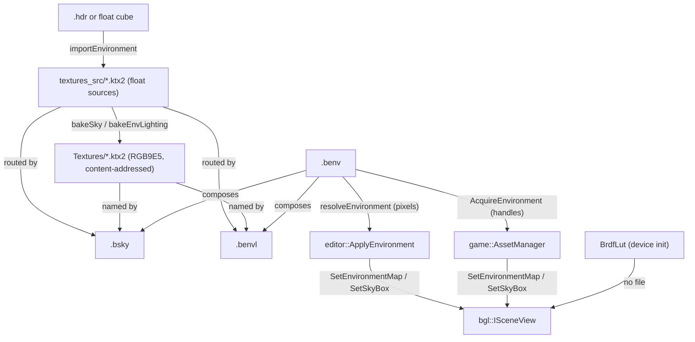

# Environment Maps — authoring, baking and consuming an environment

An environment is a sky and the image-based lighting derived from it. On disk it is **three
containers**, not one file: a `.bsky`, a `.benvl`, and a `.benv` that names the pair. This document
covers how they relate, how a source becomes them, and the authoring rules that still bite when a cube
map arrives from somewhere else.

**This document is a map, not a mirror.** It captures design choices, topology, and the non-obvious
contracts — not full signatures. The header at each linked path is the source of truth; when this doc
disagrees, trust the header, then fix this doc.

---

## Design Choices

* **The environment family mirrors `.bmaterial`'s authoring/baked split.** A `.bsky` and a `.benvl`
  hold `EnvMapRoute`s — a *source* under `textures_src/`, a *baked* map under `Textures/`, and the
  source's size+mtime stamp as it measured at bake time. The same shape, the same staleness question,
  and the same prune. See [Asset Standards](docs/asset_standards.md) for the material side.
* **A `.benv` holds no pixels.** It names a `.bsky` and a `.benvl` by path. Composing by reference is
  what lets a sky be re-authored without touching the lighting that minutes of convolution produced,
  and what lets two environments share one sky. Either half may be empty.
* **The three are separate files because they have different lifetimes.** Rotating a sky or sampling a
  blurrier mip of it is a change a person makes and looks at immediately; re-convolving the lighting is
  minutes of work that the same change need not trigger.
* **Sources are float, shipped maps are `RGB9E5`.** The import writes `R32G32B32A32_SFLOAT` cubes into
  `textures_src/` as the routed sources, and the bake packs each into `E5B9G9R9_UFLOAT_PACK32` under
  `Textures/`. 4 bytes a texel, filterable everywhere without an optional feature — WebGPU core
  `rgb9e5ufloat`, D3D12 `R9G9B9E5_SHAREDEXP`, Metal `RGB9E5Float`. Preferred over BC6H, whose 1 byte a
  texel is unreachable on Apple GPUs; `R11G11B10` is the same size but bands in sky gradients, its blue
  channel carrying only 5 mantissa bits.
* **Baked maps are shared, not owned.** The name is content-addressed from the route, so two skies
  routing the same source name one file. Nothing deletes a baked map implicitly; reclaiming orphans is
  the whole-project mark and sweep in
  [libs/assetlib/include/assetlib/texture_prune.h](libs/assetlib/include/assetlib/texture_prune.h),
  which recognises them via `isBakedEnvMapName`.
* **Exposure belongs to the maps, not to the scene.** An HDR environment's absolute scale is
  arbitrary, so `bakeEnvLighting` derives an exposure from the irradiance it produced and stores it in
  the `.benvl`. It has to be re-derived whenever the maps change, which is why it lives in the file.
* **The split-sum BRDF table is not an asset.** It is the same integral taken against a *white*
  environment, leaving a function of only `dot(N,V)` and roughness — a property of the shading model,
  not of any environment. bgl renders its own 256² `RG16_FLOAT` copy once at device init
  ([libs/bgl/src/gfx/BrdfLut.cpp](libs/bgl/src/gfx/BrdfLut.cpp)), so there is no file to ship, to
  configure, or to get out of step with the shader that samples it.

## Interface Index

### Containers

| Type | File | Role |
|---|---|---|
| `BSky` | [libs/assetlib_structs/include/assetlib_structs/BEnv.h](libs/assetlib_structs/include/assetlib_structs/BEnv.h) | One radiance route, plus how the backdrop presents it (`mipLevel`, `rotationY`) |
| `BEnvLighting` | [libs/assetlib_structs/include/assetlib_structs/BEnv.h](libs/assetlib_structs/include/assetlib_structs/BEnv.h) | The prefilter/irradiance pair and the exposure they were measured at |
| `BEnv` | [libs/assetlib_structs/include/assetlib_structs/BEnv.h](libs/assetlib_structs/include/assetlib_structs/BEnv.h) | Paths to a `.bsky` and a `.benvl`; no pixels |
| `EnvMapRoute` | [libs/assetlib_structs/include/assetlib_structs/BEnv.h](libs/assetlib_structs/include/assetlib_structs/BEnv.h) | source + baked + stamp, the same shape as a material's channel route |

### Operations

| Header | Role |
|---|---|
| [libs/assetlib/include/assetlib/env_import.h](libs/assetlib/include/assetlib/env_import.h) | `importEnvironment` — one `.hdr` or float cube into the whole family, with selectable parts, cancellation and rollback. `environmentImportTargets` names what it *would* write |
| [libs/assetlib/include/assetlib/env_bake.h](libs/assetlib/include/assetlib/env_bake.h) | `bakeSky` / `bakeEnvLighting`, the staleness checks, and `isBakedEnvMapName` for the prune |
| [libs/assetlib/include/assetlib/envmap_bake.h](libs/assetlib/include/assetlib/envmap_bake.h) | The convolutions themselves: `equirectToCube`, `prefilterRadiance`, `irradianceSh`, `blurCube` |
| [libs/assetlib/include/assetlib/env_resolve.h](libs/assetlib/include/assetlib/env_resolve.h) | `resolveEnvironment` — a `.benv` followed to decoded pixels. What the editor consumes |
| [libs/gamelib/include/gamelib/AssetManager.h](libs/gamelib/include/gamelib/AssetManager.h) | `AcquireEnvironment` — a `.benv` followed to uploaded texture handles. What the runtime consumes |
| [libs/assetlib/include/assetlib/bsky_io.h](libs/assetlib/include/assetlib/bsky_io.h), [benvl_io.h](libs/assetlib/include/assetlib/benvl_io.h), [benv_io.h](libs/assetlib/include/assetlib/benv_io.h) | Serialize / load each container |

## Topology



## Risky / Non-obvious Method Contracts

### `bgl::ISceneView`

* **`SetEnvironmentMap` / `SetSkyBox`** — **@pre every handle is valid.** Both **throw** on an invalid
  one; neither reads it as "absent". A `.benv` naming only a sky resolves to null lighting handles, so
  binding them unconditionally is a crash rather than an unlit scene. Ask first — see `HasLighting` /
  `HasSky` below, and `editor::ApplyEnvironment`, which guards both.
* The prefilter chain must be **7 mips**. `MAX_REFLECTION_LOD = 6` in
  [libs/bgl/shaders/src/forward/PbrShading.slang](libs/bgl/shaders/src/forward/PbrShading.slang), and
  roughness is `mip / (mipLevels - 1)` — a different count silently remaps roughness rather than
  failing.

### `game::AssetManager`

* **`AcquireEnvironment`** — @post pieces the `.benv` does not reference come back as invalid handles.
  **@throws** when a container it *does* name has never been baked; that is a project error, not a
  partial environment. Use `Environment::HasLighting()` and `HasSky()` before binding: they exist
  because the scene throws, not because it tolerates.

### `assetlib::importEnvironment`

* **@post rolls back on failure and on cancel**, removing only files it *created* — one already on
  disk was overwritten rather than made, and taking it would destroy whatever wrote it first.
* **Baked maps are deliberately not rolled back.** Content-addressed and shared, so the map this
  import wrote may be the one another environment already names. An orphan is the prune's business.
* Requires an `.hdr` or a **float** cube. A baked `RGB9E5` map is not a valid source — the bake reads
  `R32G32B32A32_SFLOAT` and refuses anything else.

### `assetlib::resolveEnvironment`

* Loads the **baked** maps, never the float sources. Resolving is a consumer operation, and a fallback
  to sources would light the scene subtly differently from the shipping build. **@throws** if a
  referenced asset was never baked.

### `editor::ApplyEnvironment`

* **@pre the render thread**, like everything touching a scene or a view.
* Finds the data root by taking the `.benv`'s **parent's parent**, so an environment anywhere but
  directly inside `Environments/` resolves its references against the wrong root.
* **@post applying twice over one view leaks the first set's texture slots** unless the caller releases
  what it returns. See `MaterialPreviewWindow::SetEnvironment`, which releases the previous set *after*
  binding the new one.

## Usage Sketch

```cpp
// Import: one HDRI into the whole family, cancellable, rolled back on failure.
auto desc     = assetlib::EnvImportDesc();
desc.dataRoot = "Project/Data";
desc.source   = "forest_4k.hdr";
desc.name     = "forest";

const assetlib::EnvImportResult imported = assetlib::importEnvironment(desc, cancel);

// Consume: follow the .benv to uploaded handles, and bind only what it actually has.
auto assets = game::AssetManager(scene, "Project/Data");
const auto env = assets.AcquireEnvironment(imported.environment);

if (env.HasLighting())
    view->SetEnvironmentMap({ env.irradiance, env.prefilter });
if (env.HasSky())
    view->SetSkyBox({ env.skybox, env.skyMipLevel, 1.0f, env.skyRotationY });

view->SetExposure(env.exposure);
```

See [examples/bgl_base/src/main.cpp](examples/bgl_base/src/main.cpp).

From a command line, `--project` does the import and both bakes:

```bash
assetlib_cli envmap forest.hdr -p Project/Data --name forest \
    --size 256 --skybox-size 256 --skybox-blur 0.15 --irradiance-size 128 \
    --mips 7 --samples 2048
```

In the editor, dropping a `.hdr` on the Content Explorer opens the same import; dropping a `.benv` on
the material preview relights it.

---

## Sizing

Each map has its own size, because the three are looked at differently. The prefilter is sampled
through a roughness lobe that blurs it, so 256² is already generous; the irradiance is band-limited to
`l = 2`, so 128² is more than the signal contains. The skybox is the one seen *directly*, at viewport
resolution, and wants the most.

**But not more than the source can supply.** An equirectangular `.hdr` gives `width / 4` texels across
a face's 90°, so a 1024×512 source carries about 256 — and a 512² face is already interpolating. Going
further buys smoothness, not detail: raising the skybox from 256² to 512² did not move a single golden
image. Size it from the source, not from the screen.

### The skybox is deliberately defocused

`--skybox-blur` convolves it with a GGX lobe; 0.15 is the shipped value. This is an effect, not a
concession. A material editor wants the eye on the material, and a soft backdrop reads as depth of
field where a sharp one competes for attention. It also decouples the background from the source's
resolution, so the ceiling above stops showing as pixelation.

0.08 leaves a fence and path legible enough to distract. 0.35 flattens the environment to one wash.
0.15 keeps the colour variation that makes it read as a real place, out of focus.

**Only the skybox.** The prefilter and the irradiance convolve the sharp projection, so nothing about
the background reaches the lighting — the shipped map keeps the source's full 1092 peak in prefilter
mip 0 while the skybox's is crushed to 91. Blurring the maps that light the scene would be the gamma
mistake in another costume.

Because the blur removes everything above the face's Nyquist, a blurred skybox wants *fewer* texels,
not more: 256² is indistinguishable from 512² at half the size.

---

## Handling a cube map from elsewhere

`importEnvironment` reads the `.hdr` directly and generates at the resolution asked for, so neither
trap below can be sprung by the normal path. They still apply to any externally produced cube map,
and both were expensive to diagnose.

### Every gamma field must be 1.0

External bakers (CMFT among them) expose *gamma before processing* and *gamma after processing* on
both the radiance and irradiance filters. **All of them must be 1.0.**

* **Before** linearizes a gamma-encoded input. Filtering is a weighted average of radiance and is only
  physically valid in linear space — but a `.hdr` is *already* linear radiance. There is nothing to
  undo.
* **After** re-encodes for display or LDR storage. Our output is float, consumed as linear radiance;
  the engine tone maps (AgX) and sRGB-encodes at the end of the frame. There is nothing to apply.

Set either and you distort physical radiance that the BRDF then treats as physical. The failure is
quiet, because the result still looks like a plausible environment map:

* **Highlights are crushed.** 2.2 on both fields compounds to ~4.8 and took a real sun peak of **833
  down to 7.5** — the entire HDR range the specular lobe feeds on.
* **The irradiance goes flat.** Gamma pushes everything toward 1.0, collapsing the contrast between
  bright sky and dark ground (a real up/down ratio of ~6× measured as ~1.2×), so diffuse barely
  responds to the surface normal.
* Together those give a distinctive symptom: the diffuse term is directionless and the specular term is
  the only view-dependent one left, so **the lighting appears to follow the camera** as you orbit.

If a render is too bright that is **exposure**, not gamma. `ISceneView::SetExposure` is a tone knob and
costs nothing; reaching for gamma to dim a map destroys data.

### Edge fixup must be off

CMFT's `Warp` fixup stretches each face's texel centres outward so the outermost lands exactly on the
edge — a correction for hardware that cannot filter across a cube seam. **D3D12, Metal and WebGPU all
do it in hardware**, always on, so `Warp` is applied twice: content near a border ends up displaced by
up to half a texel, in opposite directions on the two faces sharing it, and the seam shows as a bright
crease.

The displacement is a fraction of a *texel*, so its angular size scales with the mip — about 0.04° at
1024² but 2.8° at the 16² roughness-1 mip. That is why it appears as "seams only at roughness 1" rather
than a uniform problem, and why it survives a long time before being diagnosed.

A map that has it is recognisable without the source: its border texels are **bitwise identical** to
their partners across every seam, which is only possible if both faces sample the exact same direction.
A correctly generated map has them roughly one texel apart, like any other neighbours.

### Do not resample a cube map to resize it

`ktx create --width/--height`'s resampling kernel is wider than the output texel, so at a face border it
reaches past the edge and clamps — and the two faces sharing that edge clamp to different data. A
correct cube map has each border texel *equal* to its partner across the seam; resizing 1024 → 256 that
way took a 0.00% mismatch to **32% mean, 178% peak**, which reads on a mirror surface as bright lines
tracing the cube's edges and corners.

Downsampling a cube face correctly needs an exact box average that never reaches past the border,
*followed by* averaging each matched edge pair and each 3-way corner. Generating at the target
resolution avoids the question, which is what the importer does.

---

## Verifying

Each baked map is a complete `.ktx2`, so `ktxinfo`, `ktx compare` and `ktx2check` work on it directly —
those are the tools that diagnose a bad environment map.

`assetlib_cli describe` reads the containers themselves: a `.bsky` or `.benvl` reports its routes, the
baked map each names, and whether the bake is stale against its source; a `.benv` reports the pair it
composes and whether those files are there.

```bash
assetlib_cli describe Data/Environments/forest.benv -d Data
assetlib_cli describe Data/Sky/forest.bsky -d Data
assetlib_cli refs -d Data Textures/forest_sky.ktx2   # what holds a baked map alive
```

**Maintenance note.** The tables above are this document's load-bearing part, and their file links rot
silently if files move. Re-check them whenever the environment file layout changes.
