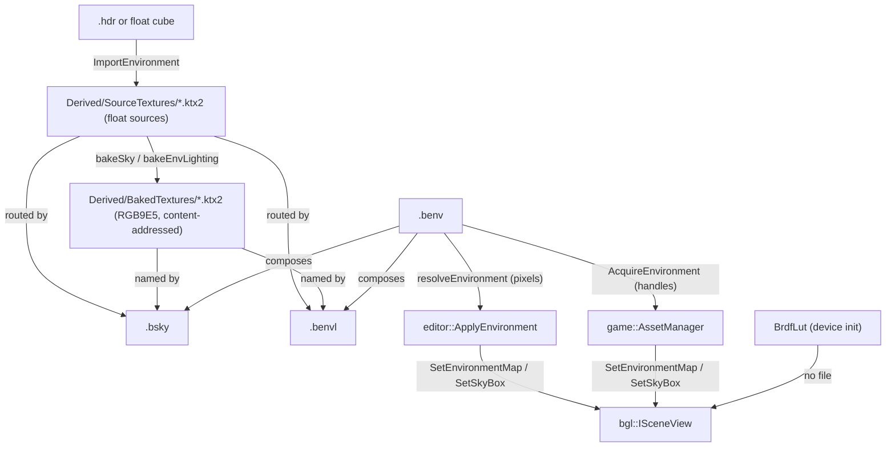

# Environment Maps — authoring, baking and consuming an environment

An environment is a sky and the image-based lighting derived from it. On disk it is **three
containers**, not one file: a `.bsky`, a `.benvl`, and a `.benv` that names the pair. This document
covers how they relate, how a source becomes them, and the authoring rules that still bite when a cube
map arrives from somewhere else.

**This document is a map, not a mirror.** It captures design choices, topology, and the non-obvious
contracts — not full signatures. The header at each linked path is the source of truth; when this doc
disagrees, trust the header, then fix this doc.

---

## Design Choices

* **The environment family mirrors `.bmaterial`'s authoring/baked split.** A `.bsky` and a `.benvl`
  hold `EnvMapRoute`s — a *source* under `Derived/SourceTextures/`, a *baked* map under `Derived/BakedTextures/`, and the
  source's size + content-hash stamp as it measured at bake time. The same shape, the same staleness question,
  and the same prune. See [Asset Standards](docs/asset_standards.md) for the material side.
* **A `.benv` holds no pixels, and it is the family's only authored file.** It is a text document —
  canonical JSON, like `.bmaterial` — naming a `.bsky` and a `.benvl` by path and carrying the
  presentation knobs (`skyMipLevel`, `skyRotationY`, `exposureOverride`) and the rim light.
  Composing by reference is
  what lets a sky be re-authored without touching the lighting that minutes of convolution produced,
  and what lets two environments share one sky. Either half may be empty. `.bsky` and `.benvl` are
  purely derived cache entries (see [Asset Containers](asset_containers.md)): the sky's route is its cache
  key, the lighting's key joins its two sources; `pack` re-bakes a stale one into the archive and
  fails loudly on one it cannot.
* **The document names its shading model, and the image-based lighting sits behind it.** `.benv`
  mirrors `.bmaterial`: a `shadingModel` key, generic state beside it, and one block per model. The
  sky, its presentation and the rim light are the environment whatever shades under it; the
  `.benvl` reference and `exposureOverride` are the only things a non-PBR surface would have no use
  for, so they live under `pbr`. A toon environment is then a sky, a rim and a `toon` block with no
  `.benvl` at all — which is the whole point of the split, since there is no split-sum anything to
  convolve for an ink shader. An unknown *model* is refused rather than lit as PBR, exactly as a
  material's is; an unknown *block* rides `extraJson` and round-trips, so a sibling branch authoring
  for a model this build lacks does not lose work.
* **A rim light is the environment, not a material parameter.** It samples the irradiance cube away
  from the camera and tints the result, so a dusk rims every unit in dusk colour with nothing
  re-authored per material — which is what earns it a place on this document rather than on a
  `.bmaterial`. Every engine with a rim term puts it on the material (Unreal's Fresnel node, Unity
  Toon Shader's Rim Color/Power); this is a deliberate deviation, and the cost of it is that two
  meshes cannot rim in different *colours* under one environment. How much of it each catches is its
  own — a scale on the environment's intensity, zero by default
  (`bgl::ISceneView::SetInstanceRimIntensity`, defaulted per mesh by the `.bimport`'s
  `meshOptions`). The rim deliberately ignores albedo: it is there to
  separate a silhouette from the sky, and weighted by albedo it disappears on exactly the dark
  armour that needs it.
* **A `.benv` written before the shading model is refused, not read.** Its `lighting` sat at the top
  level, and unknown keys are *preserved* rather than rejected — so a reader that simply did not
  know the key would carry it in `extraJson`, resolve the environment unlit, and let the next save
  write that back. The reader names the file and asks for it to be re-authored instead.
* **The three are separate files because they have different lifetimes.** Re-authoring a sky is a
  change a person looks at immediately; re-convolving the lighting is minutes of work that the same
  change need not trigger.
* **Sources are float, shipped maps are `RGB9E5`.** The import writes `R32G32B32A32_SFLOAT` cubes into
  `Derived/SourceTextures/` as the routed sources, and the bake packs each into `E5B9G9R9_UFLOAT_PACK32` under
  `Derived/BakedTextures/`. 4 bytes a texel, filterable everywhere without an optional feature — WebGPU core
  `rgb9e5ufloat`, D3D12 `R9G9B9E5_SHAREDEXP`, Metal `RGB9E5Float`. Preferred over BC6H, whose 1 byte a
  texel is unreachable on Apple GPUs; `R11G11B10` is the same size but bands in sky gradients, its blue
  channel carrying only 5 mantissa bits.
* **Baked maps are shared, not owned.** The name is content-addressed from the route, so two skies
  routing the same source name one file. Nothing deletes a baked map implicitly; reclaiming orphans is
  the whole-project mark and sweep in
  [libs/assetlib/include/assetlib/texture_prune.h](libs/assetlib/include/assetlib/texture_prune.h),
  which recognises them via `isBakedEnvMapName`.
* **Exposure belongs to the maps, not to the scene.** An HDR environment's absolute scale is
  arbitrary, so `bakeEnvLighting` derives an exposure from the irradiance it produced and stores it in
  the `.benvl`. It has to be re-derived whenever the maps change, which is why it lives in the file.
* **The derivation proposes; the document decides.** `exposureFor` normalizes every environment
  to middle grey, which means that used alone, no environment can be dimmer or brighter than another —
  a dusk and a noon are forced to the same average. `BEnv::pbr.exposureOverride` is the authored
  answer, kept on the document rather than in the derived file so a re-bake refreshes the proposal
  without touching a tuned value. `resolveEnvironment` folds the two; the resolved
  `maps.exposure` is what a renderer reads. Author it with
  `assetlib_cli exposure -p <project> <key.benv> --set <v>`, or `--clear` to go back to the bake.
* **The backdrop's defocus is presentation, not pixels.** The sky is baked as a chain by `skyChain`:
  mip 0 is the sharp projection, and each level below it is convolved to the width its own texel
  subtends. Which level is drawn is a document edit rather than minutes of
  convolution — and reversible, which a blur convolved into a single mip is not. The pick is
  `BEnv::skyMipLevel`, authored on the document and clamped at resolve to what the baked chain holds.
* **The split-sum BRDF table is not an asset.** It is the same integral taken against a *white*
  environment, leaving a function of only `dot(N,V)` and roughness — a property of the shading model,
  not of any environment. bgl renders its own 256² `RG16_FLOAT` copy once at device init
  ([libs/bgl/src/passes/BrdfLutGenPass.cpp](libs/bgl/src/passes/BrdfLutGenPass.cpp)), so there is no file to ship, to
  configure, or to get out of step with the shader that samples it.

## Interface Index

### Containers

| Type | File | Role |
|---|---|---|
| `BSky` | [libs/assetlib_structs/include/assetlib_structs/BEnv.h](libs/assetlib_structs/include/assetlib_structs/BEnv.h) | One radiance route; purely derived |
| `BEnvLighting` | [libs/assetlib_structs/include/assetlib_structs/BEnv.h](libs/assetlib_structs/include/assetlib_structs/BEnv.h) | The prefilter/irradiance pair and the exposure they were measured at; purely derived |
| `BEnv` | [libs/assetlib_structs/include/assetlib_structs/BEnv.h](libs/assetlib_structs/include/assetlib_structs/BEnv.h) | The authored document: its `ShadingModel`, a path to a `.bsky`, `skyMipLevel`, `skyRotationY`, a `RimLight`, and the model's own block |
| `RimLight` | [libs/assetlib_structs/include/assetlib_structs/BEnv.h](libs/assetlib_structs/include/assetlib_structs/BEnv.h) | tint, intensity and falloff of the environment's rim; intensity 0 is off |
| `PbrEnvParams` | [libs/assetlib_structs/include/assetlib_structs/BEnv.h](libs/assetlib_structs/include/assetlib_structs/BEnv.h) | What only a PBR surface reads: the `.benvl` path and `exposureOverride` |
| `EnvMapRoute` | [libs/assetlib_structs/include/assetlib_structs/BEnv.h](libs/assetlib_structs/include/assetlib_structs/BEnv.h) | source + baked + stamp, the same shape as a material's channel route |

### Operations

| Header | Role |
|---|---|
| [libs/assetlib/include/assetlib/envmap.h](libs/assetlib/include/assetlib/envmap.h) | The pipeline, in one header and in the order it runs: `loadRadianceHdr` / `equirectToCube`, then the convolutions (`prefilterRadiance`, `irradianceSh`, `skyChain`, `blurCube`), then `EnvironmentMaps` and `ResolvedEnvironment`, and `isBakedEnvMapName`, which is what the prune reads. The import itself is `AssetStore::ImportEnvironment` — selectable parts, cancellation and rollback — with `EnvironmentImportTargets` naming what it *would* write |
| [AssetStore.h](../libs/assetlib/include/assetlib/AssetStore.h) | `BakeSky` / `BakeEnvLighting` and their staleness checks |
| [libs/gamelib/include/gamelib/AssetManager.h](libs/gamelib/include/gamelib/AssetManager.h) | `AcquireEnvironment` — a `.benv` followed to uploaded texture handles and its rim. What the runtime consumes |
| [apps/editor/src/Windows/EnvironmentEditor/EnvironmentEditorWindow.h](apps/editor/src/Windows/EnvironmentEditor/EnvironmentEditorWindow.h) | The panel a person authors one in: the presentation knobs, the exposure override and the rim, over a lit preview. What it composes is read-only — that is what an import wrote |
| [libs/assetlib/include/assetlib/codecs.h](libs/assetlib/include/assetlib/codecs.h) | The codec for each of the three containers |

## Topology



## Risky / Non-obvious Method Contracts

### `bgl::ISceneView`

* **`SetEnvironmentMap` / `SetSkyBox`** — **@pre every handle is valid.** Both **throw** on an invalid
  one; neither reads it as "absent". A `.benv` naming only a sky resolves to null lighting handles, so
  binding them unconditionally is a crash rather than an unlit scene. Ask first — see `HasLighting` /
  `HasSky` below, and `editor::ApplyEnvironment`, which guards both.
* The prefilter chain must be **7 mips**. `MAX_REFLECTION_LOD = 6` in
  [libs/bgl/shaders/src/forward/PbrShading.slang](libs/bgl/shaders/src/forward/PbrShading.slang), and
  roughness is `mip / (mipLevels - 1)` — a different count silently remaps roughness rather than
  failing.

### `game::AssetManager`

* **`AcquireEnvironment`** — @post pieces the `.benv` does not reference come back as invalid handles.
  **@throws** when a route it *does* name has neither a baked map nor a source on disk; that is a
  project error, not a partial environment. Use `Environment::HasLighting()` and `HasSky()` before
  binding: they exist because the scene throws, not because it tolerates.

### `AssetStore::ImportEnvironment`

* **@post rolls back on failure and on cancel**, removing only files it *created* — one already on
  disk was overwritten rather than made, and taking it would destroy whatever wrote it first.
* **Baked maps are deliberately not rolled back.** Content-addressed and shared, so the map this
  import wrote may be the one another environment already names. An orphan is the prune's business.
* Requires an `.hdr` or a **float** cube. A baked `RGB9E5` map is not a valid source — the bake reads
  `R32G32B32A32_SFLOAT` and refuses anything else.

### `assetlib::resolveEnvironment`

* Loads whichever map each route draws — `envMapToDraw`, below. **@throws** only when a route has
  neither its baked map nor its source on disk.

### `assetlib::envMapToDraw`

* **The baked-vs-source branch, in one place**, because two consumers ask it: `resolveEnvironment`
  (the editor) and `game::AssetManager::AcquireEnvironment` (the runtime). It is the environment's
  copy of a material's `drawsLoose`, and follows the same rule — the baked RGB9E5 while it is on disk
  and current, the float source it was compiled from while it is not, and the baked map anyway when
  the source has gone, because a route with neither cannot be drawn at all.
* **This is what makes a fresh checkout work.** `Data/Derived/BakedTextures/` is git-ignored by
  design — baked output is regenerated per platform — so a clone has every `Derived/SourceTextures/`
  source and no bake. Before this branch existed, every environment in such a project failed to load
  while its materials drew fine, because materials already had the fallback.
* The fallback costs memory (`R32G32B32A32_SFLOAT` against RGB9E5, four times the bytes) and is not
  what ships. It is not a different *image*: the source is exactly what the bake compiled, blur and
  all.

### `editor::ApplyEnvironment`

* **@pre the render thread**, like everything touching a scene or a view.
* Takes the data root as an argument rather than deriving it from the `.benv`: an environment is not
  always two levels under the root, and guessing lands on the wrong one without saying so.
* Binds the IBL pair and the skybox **independently**, and binds neither when the resolve fails — so
  what it returns can be empty, or half of an environment, with the view still naming what it had.
* **@post applying twice over one view leaks the first set's texture slots** unless the caller releases
  what it displaced. `editor::ReplaceEnvironment` is that rule: it releases only the maps the new apply
  rebound, because a map the apply left alone is one the view still samples every frame. Releasing the
  whole previous set is what crashed the Metal backend on a failed drop — D3D12 reads a stale
  descriptor and survives, Metal resolves the handle to an `MTLResourceID` at dispatch and aborts.

## Usage Sketch

```cpp
// Import: one HDRI into the whole family, cancellable, rolled back on failure.
auto desc   = assetlib::EnvImportDesc();
desc.source = "forest_4k.hdr";
desc.name   = "forest";

const assetlib::AssetStore      store("Project/Data");
const assetlib::EnvImportResult imported = store.ImportEnvironment(desc, cancel);

// Consume: follow the .benv to uploaded handles, and bind only what it actually has.
auto assets = game::AssetManager(scene, "Project/Data");
const auto env = assets.AcquireEnvironment(imported.environment);

if (env.HasLighting())
    view->SetEnvironmentMap({ env.irradiance, env.prefilter });
if (env.HasSky())
    view->SetSkyBox({ env.skybox, env.skyMipLevel, 1.0f, env.skyRotationY });

// One exposure for the whole view. SkyboxDesc::exposure above is an *additional* per-sky gain that
// the pass multiplies onto this, so 1.0f means "no extra gain" rather than "ignore the environment".
view->SetExposure(env.exposure);
```

See [examples/bgl_base/src/main.cpp](examples/bgl_base/src/main.cpp).

From a command line, `--project` does the import and both bakes:

```bash
assetlib_cli envmap -p Project.bproj forest.hdr --name forest \
    --size 256 --skybox-size 512 --skybox-mips 6 --irradiance-size 128 \
    --mips 7 --samples 2048
```

In the editor, dropping a `.hdr` on the Content Explorer opens the same import; dropping a `.benv` on
the material or animation preview relights it until that panel is left, which puts the configured one
back.

---

## Sizing

Each map has its own size, because the three are looked at differently. The prefilter is sampled
through a roughness lobe that blurs it, so 256² is already generous; the irradiance is band-limited to
`l = 2`, so 128² is more than the signal contains. The skybox is the one seen *directly*, at viewport
resolution, and wants the most.

**But not more than the source can supply.** An equirectangular `.hdr` gives `width / 4` texels across
a face's 90°, so a 1024×512 source carries about 256 — and a 512² face is already interpolating. Going
further buys smoothness, not detail: raising the skybox from 256² to 512² did not move a single golden
image. Size it from the source, not from the screen.

### The skybox is defocused at draw time, not at bake time

A material editor wants the eye on the material, and a soft backdrop reads as depth of field where a
sharp one competes for attention. It also decouples the background from the source's resolution, so
the ceiling above stops showing as pixelation.

That is an effect, and it belongs to the **viewport** rather than to the environment: a level viewport
is judged on the world it is building and wants the same sky sharp. So the bake writes the whole
range — `skyChain`, mip 0 sharp, each level below convolved to its own texel — and
`BEnv::skyMipLevel` picks one. `--skybox-mips` sets how many levels; `--skybox-mip` sets which one
the `.benv` document presents,
and `editor::ApplyEnvironment`'s `skyMipLevelOverride` lets a viewport overrule even that. The
material preview and the thumbnail cache default to mip 3; the level viewport takes the file's own.

Mip 3 of a **512** chain is a lobe of about roughness 0.157, which is where `--skybox-blur 0.15` used
to put it — the level that was chosen by eye when the blur was destructive, and why the preview's
default is 3 against the 512 sky `EnvImportDesc` bakes. Mip 1 leaves a fence and path legible enough
to distract; mip 5 flattens the environment to one wash.

**A level is not a fixed amount of blur** — it is a fraction of the chain, so the same index means
different things on different-sized skies. On a 256² chain, roughness 0.157 is mip **2**; mip 3 there
is 0.222 and visibly softer. A viewport that wants a particular look on an arbitrary sky has to pick
the level from the cube's face size rather than hardcode one, and the defaults here do not yet.

**Only the skybox.** The prefilter and the irradiance convolve the sharp projection, so nothing about
the background reaches the lighting — the shipped map keeps the source's full 1092 peak in prefilter
mip 0 while a defocused backdrop is crushed to 91. Blurring the maps that light the scene would be the
gamma mistake in another costume.

### A rotated sky rotates the lighting

`BEnv::skyRotationY` spins the backdrop's clip-to-world ray, and the IBL lookup carries the same spin
(`PbrShading::ToEnvSpace`). It has to: the cubes are one environment, and a normal that skipped the
rotation would be lit from where the sky used to be. Nothing caught this for as long as it was wrong,
because the only environment shipped has `skyRotationY` 0 — `EnvOrientation_test` is what catches it now.

## Verifying

Each baked map is a complete `.ktx2`, so `ktxinfo`, `ktx compare` and `ktx2check` work on it directly —
those are the tools that diagnose a bad environment map.

`assetlib_cli describe` reads the containers themselves: a `.bsky` or `.benvl` reports its routes, the
baked map each names, and whether the bake is stale against its source; a `.benv` reports the pair it
composes and whether those files are there.

```bash
assetlib_cli describe -p <project> Authored/Environments/forest.benv
assetlib_cli describe -p <project> Derived/Sky/forest.bsky
assetlib_cli refs -p <project> Derived/BakedTextures/forest_sky.ktx2   # what holds a baked map alive
```

**Maintenance note.** The tables above are this document's load-bearing part, and their file links rot
silently if files move. Re-check them whenever the environment file layout changes.
