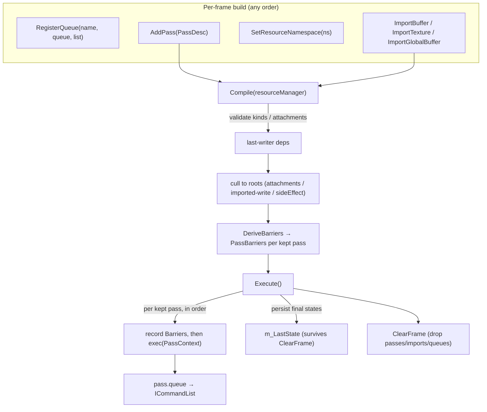

# Frame Graph — declarative pass scheduling & barrier derivation

The `FrameGraph` records a frame as a list of passes, each *declaring* the resources it touches
(and how). From those declarations the graph derives inter-pass dependencies, culls dead passes,
and computes every resource-state barrier — so pass code records draws/dispatches and never touches
barriers itself. It owns no GPU memory: resources are imported by name from the outside.

**This document is a map, not a mirror.** It captures the scheduling model, the barrier-derivation
rules, and the non-obvious contracts — not full signatures. The header at each linked path is the
source of truth; when this doc disagrees, trust the header, then fix this doc.

---

## Design Choices

* **Passes declare access; the graph owns the barriers.** A pass never calls
  `ICommandList::Barrier`. It declares each resource it reads/writes as a `BufferArg` / `TextureArg`
  (a name + `BarrierSync` + `BarrierAccess` [+ `BarrierLayout` for textures]) and lists its
  render/depth attachments. `Compile` walks the kept passes and emits exactly the transitions
  needed before each one; `Execute` records those barriers ahead of the pass's `exec`. This is the
  load-bearing decision — it is why the [RHI](docs/rhi.md) says pass code must not barrier.

  **Caveat — barriers are derived at pass boundaries only.** The graph inserts one set of
  transitions *before* each pass, from the resource's prior state to the state that pass declares.
  It does **not** synchronize hazards *within* a pass. If a single pass's `exec` issues multiple
  dispatches/draws where a later one reads or overwrites what an earlier one wrote to the **same**
  resource (a UAV read-after-write / write-after-write), the graph cannot see it and inserts
  nothing — the two commands race. Prefer **splitting the work into separate passes** so the graph
  derives the barrier from the declared access change (e.g. producer declares
  `kUnorderedAccess`, consumer declares `kShaderResource`). Only when the dispatches must stay in
  one pass (e.g. they share a UAV as both in and out) issue the intra-pass barrier yourself — this
  is the one sanctioned exception to "pass code must not barrier." *Bug precedent:* the
  histogram and prefix-sum dispatches in `CompactInstancesPass` shared one buffer in a single pass
  with no barrier between them; the scan raced the histogram and produced wrong prefix sums —
  visible only with multiple PSO buckets, as nondeterministic flicker.

* **Ordering is submission order; the graph adds dependencies and culling, not reordering.** Passes
  execute in `AddPass` order. `Compile` builds a *last-writer* dependency edge (a pass depends on
  the most recent prior pass that wrote each resource it accesses) purely to drive culling — it
  does not reschedule. `ExecutionOrder()` returns the surviving passes in their original order.

* **Dead-pass culling from roots.** A pass is a *root* if it has a color/depth attachment, writes an
  imported resource, or is pinned with `SetSideEffect`. Culling keeps the roots and everything
  reachable backward through their dependencies; every other pass is dropped. A pass that only
  writes a *transient* (a name never imported) is not a root and is culled unless pinned — use
  `SetSideEffect(true)` to keep it. `WasCulled(name)` reports the outcome.

* **Resources are external, imported by name.** The graph allocates nothing. `ImportBuffer` /
  `ImportTexture` register an existing RHI handle under a string name; passes refer to that name.
  Attachments are resolved to their textures via the `IResourceManager`. A declared access whose
  name was never imported is a *transient*: it participates in dependency/ordering by name but has
  no handle, so `PassContext::GetBuffer/GetTexture` throws for it.

* **Namespaces let many scopes share one graph.** `SetResourceNamespace(ns)` prefixes subsequent
  imports and the name-resolution of subsequently-added passes. `ResolveName` tries `ns+name` then
  falls back to the bare `name`, so `ImportGlobalBuffer` registers a resource reachable from every
  namespace. This is how multiple scenes/views populate one graph without colliding.

* **Resource state persists across frames.** `Execute` remembers the final `AccessState` of each
  imported resource in `m_LastState`. Next frame, re-importing the same name resumes from that
  state (unless an explicit `initial` is passed), so the first barrier of the new frame is correct
  and redundant transitions are avoided — including when the same resource is drawn more than once.

* **Enhanced barriers, merged per pass.** An `AccessState` is `(sync, access, layout)`. Multiple
  declared accesses to one resource within a single pass are merged (union of sync/access, last
  non-undefined layout) into one transition. Buffers ignore `layout`.

* **The frame is consumed on execute.** `Execute` (and `Reset`) clears passes, imports, and queue
  bindings and requires a fresh `Compile` before the next `Execute`; only `m_LastState` survives.
  Passes — and everything their `exec` lambdas captured (e.g. scene references) — are rebuilt each
  frame.

---

## Interface Index

| Type | File | Role |
|---|---|---|
| `FrameGraph` | [fg/FrameGraph.h](bgl/src/fg/FrameGraph.h) | The graph: import resources, add passes, register queues, `Compile` then `Execute`. |
| `PassDesc` | [fg/PassDesc.h](bgl/src/fg/PassDesc.h) | Fluent builder for one pass: name, queue, attachments, buffer/texture args, `exec` callback, side-effect pin. |
| `PassContext` | [fg/PassDesc.h](bgl/src/fg/PassDesc.h) | Handed to `exec`; resolves the pass's declared names to physical handles and exposes its command list/queue. |

### Supporting types (POD / helpers)

| Type | File | Role |
|---|---|---|
| `BufferArg` / `TextureArg` | [fg/PassDesc.h](bgl/src/fg/PassDesc.h) | A declared access: resource name + `BarrierSync` + `BarrierAccess` (+ `BarrierLayout` for textures). |
| `AccessState` | [fg/FrameGraph.h](bgl/src/fg/FrameGraph.h) | `(sync, access, layout)` triple; the unit the graph merges and diffs to derive barriers. |
| `PassBarriers` | [fg/FrameGraph.h](bgl/src/fg/FrameGraph.h) | The buffer/texture handles + `*BarrierDesc`s derived for one pass; queryable via `BarriersFor`. |
| `ResourceKind` | [fg/FrameGraph.h](bgl/src/fg/FrameGraph.h) | `kBuffer` / `kTexture`; used to reject a resource imported as one kind but accessed as the other. |
| Barrier vocabulary | [types/Barrier.h](bgl/src/types/Barrier.h) | `BarrierSyncFlag`, `BarrierAccessFlag`, `BarrierLayout` the args are built from. |

---

## Topology



---

## Threading & Synchronization

* **Single render thread; no internal locking.** Build, `Compile`, and `Execute` run sequentially
  on the render thread. `FrameGraph` is move-only and not thread-safe.
* **`Compile` must precede `Execute`.** `Execute` throws if the graph is not compiled; any
  re-import/re-add invalidates and requires a recompile.
* **The graph records into command lists; it does not submit or fence.** `Execute` writes barriers
  and pass commands into each pass's registered `ICommandList` but performs no
  `ExecuteCommandList` and no cross-queue fence waits — submission and inter-queue synchronization
  are the caller's responsibility. Multi-queue passes select their list via `PassDesc::SetQueue`.

---

## Risky / Non-obvious Method Contracts

### FrameGraph

* **`AddPass(desc)`** — @pre `desc.name` is unique in this frame, non-empty, and not `"$"`
  (reserved for the root). Throws `std::runtime_error` on a duplicate name.
* **`Compile(resourceManager)`** — @pre `resourceManager != nullptr`. Throws if any pass accesses
  an imported resource as the wrong kind (buffer vs texture), or if a texture is reached **both**
  as an attachment and as an import (pick one, not both). @post builds deps, culls, derives
  barriers, marks compiled.
* **`Execute()`** — @pre `Compile` has run. @post records each kept pass on its queue's list,
  persists imported-resource end states into `m_LastState`, then **clears the frame** (passes,
  imports, queues). Throws if a pass names a queue that was never `RegisterQueue`'d.
* **`ImportBuffer/ImportTexture(name, handle, initial)`** — the name is prefixed by the current
  namespace; re-importing the same key overwrites. Omit `initial` to resume from last frame's
  tracked state (undefined the first time the name is seen). `ImportGlobalBuffer` skips the
  namespace prefix so the resource is reachable from every scope.
* **`Reset()`** — clears the frame like `Execute`'s tail but **keeps** `m_LastState`; use to
  rebuild without having executed.

### PassContext (inside `exec`)

* **`GetBuffer(name)` / `GetTexture(name)`** — @pre `name` was declared by this pass **and**
  resolves to an imported resource. Throws for an undeclared name or a transient (declared but
  never imported) — declaring an arg does not guarantee a handle.
* **Do not call `ICommandList::Barrier`** from `exec` for *inter-pass* transitions; the graph
  already inserted the state changes this pass needs on entry. The **only** exception is an
  *intra-pass* hazard: if this `exec` issues multiple dispatches/draws that read-after-write or
  write-after-write the **same** resource, the graph inserts nothing between them (it derives
  barriers at pass boundaries only). Split into separate passes so the graph handles it, or, if the
  dispatches must share one pass, emit that one UAV barrier yourself. See the "barriers are derived
  at pass boundaries only" caveat under Design Choices.

### PassDesc

* **A pass that writes only transients is culled** unless it has an attachment or
  `SetSideEffect(true)`. If a pass's work must always run (side effects the graph can't see), pin
  it.

---

## Usage Sketch

```cpp
// Build (render thread) — order of imports vs passes is free.
fg.RegisterQueue("main", queue, cmdList);
fg.ImportTexture("backbuffer", backbufferHandle);          // resumes last frame's state
fg.ImportBuffer("scene.meshletBuffer", meshletBufHandle);

PassDesc pass;
pass.SetName("Forward")
    .AddColorAttachment(backbufferRtv)                     // graph transitions it to render-target
    .AddBufferArg("scene.meshletBuffer",
                  BarrierSyncFlag::kMeshShading,
                  BarrierAccessFlag::kShaderResource)      // graph transitions it to SRV
    .SetExec([](const PassContext& ctx) {
        ICommandList* cmd = ctx.GetCommandList();
        BufferHandle  mb  = ctx.GetBuffer("scene.meshletBuffer");
        // record dispatch/draw — no Barrier() calls here
    });
fg.AddPass(std::move(pass));

fg.Compile(resourceManager);   // deps, cull, derive barriers
fg.Execute();                  // record barriers + exec per pass, then consume the frame
```

A pass typically ships as a small type with an `AttachToFrameGraph` method that builds and adds its
`PassDesc` — see [passes/ClearPass.h](bgl/src/passes/ClearPass.h) for a minimal one and
[docs/passes.md](docs/passes.md) for the full pass catalog.
