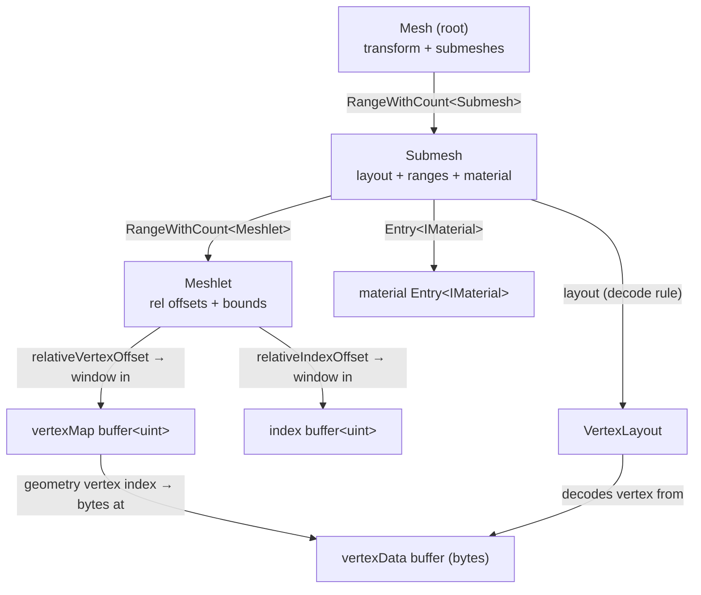

# Geometry Layout — the GPU geometry data model

The structs that describe renderable geometry — `Mesh`, `Submesh`, `Meshlet`, `Vertex`,
`VertexLayout`, and the `Range` / `RangeWithCount` / `Entry` offset primitives — plus the CPU-side
buffers that mirror them onto the GPU. The structs are laid out once and shared between CPU and
GPU: a single IDL source (`libs/bgl/idl/src/*.slang`) generates a shader copy under
[libs/bgl/shaders/src/idl/](libs/bgl/shaders/src/idl/) and a byte-identical C++ mirror under `libs/bgl/src/idl/`.
This document links the **generated shader slang** — the GPU-facing view is the one that drives
rendering, and the C++ mirror pins the same offsets with `static_assert`s.

**This document is a map, not a mirror.** It captures the layout model, the offset-indirection
chain, and the non-obvious contracts — not full field lists. The generated struct at each linked
path is the source of truth; when this doc disagrees, trust the struct, then fix this doc.

---

## Design Choices

* **All cross-references are `uint` offsets, not pointers.** A struct never holds a GPU address.
  It holds a `Range<T>` / `RangeWithCount<T>` / `Entry<T>` — each a bare `uint` offset into a
  global `StructuredBuffer<T>`. `0xFFFFFFFF` is the null sentinel (`Null()`). The GPU dereferences
  by indexing the matching buffer; the CPU assigns these offsets from container handles (see
  *CPU-side mirror buffers*). This is the same bindless, index-as-descriptor philosophy as the
  [RHI](docs/rhi.md).

* **One IDL, two generated targets, guaranteed layout parity.** The `.slang` structs
  ([Mesh.slang](libs/bgl/shaders/src/idl/Mesh.slang) etc.) and the C++ `bgl::idl::*` structs are both
  generated from `libs/bgl/idl/src`. The C++ side carries `static_assert(sizeof / offsetof …)` so the
  two never drift — CPU code can `memcpy` a struct straight into a GPU buffer. An IDL module can
  also declare `enum`s and `public static const` **constants** (e.g.
  [Constants.slang](libs/bgl/idl/src/Constants.slang)); constants are emitted as `constexpr` into the
  C++ mirror, keeping shared limits single-sourced across CPU and GPU. Never hand-edit either
  generated copy; edit the IDL source and regenerate.

* **The geometry hierarchy is flat arrays cross-linked by offset.** Every level lives in its own
  global buffer — a submesh buffer, a meshlet buffer, a vertexMap buffer, a byte vertex buffer, an
  index buffer. A parent references a contiguous window of children by `(offset, count)`; there is
  no nesting or pointer chasing. A `Mesh` is the root descriptor: a `transform` plus a
  `RangeWithCount<Submesh>` into the submesh buffer.

* **Geometry is meshlet-partitioned for mesh-shader rendering.** Each submesh is split into
  `Meshlet`s of at most `idl::cMaxVerticesPerMeshlet` (64) unique vertices and
  `idl::cMaxPrimsPerMeshlet` (124) triangles. These are declared once in the IDL module
  [Constants.slang](libs/bgl/idl/src/Constants.slang) and consumed by both the CPU (generated
  [Constants.h](libs/bgl/src/idl/Constants.h)) and the shaders (`import idl.Constants`). A meshlet
  carries a bounding sphere for culling.

* **Vertex data is type-erased bytes, decoded by a `VertexLayout` descriptor.** The vertex buffer
  is a raw `ByteBuffer` (a `StructuredBuffer<uint>` of packed words), not a
  `StructuredBuffer<Vertex>`. Each submesh's `VertexLayout` (attribute semantics/formats/offsets +
  `stride`) tells the shader how to decode a vertex at a byte offset. `Vertex` is the *full-fat*
  authoring layout (pos/normal/uv/tangent); a producer may emit only a tightly-packed subset (e.g.
  the 32-byte position/normal/uv the procedural cube/sphere use) and describe it with a matching
  layout. See `DecodeVertex` in
  [Forward_StaticMesh.slang](libs/bgl/shaders/src/Forward_StaticMesh.slang).

* **CPU-side mirror buffers own the storage and hand back offsets.** Geometry is uploaded through
  `RangeBuffer` / `EntryBuffer` / `PackedBuffer` — GPU-mirrored containers whose `Add`/`EmplaceBack`
  return a handle whose index (and count) assign straight into a `Range` / `RangeWithCount` /
  `Entry`. Writes are dirty-block tracked and flushed lazily by `Update(cmdList)`, so only touched
  regions are re-uploaded.

---

## Struct Index

Generated shader structs (GPU source of truth). Each has a byte-identical `bgl::idl::*` C++ mirror.

| Struct | File | Role |
|---|---|---|
| `Mesh` | [Mesh.slang](libs/bgl/shaders/src/idl/Mesh.slang) | Root descriptor of a renderable: world `transform` + `RangeWithCount<Submesh>` + total meshlet count. |
| `Submesh` | [Submesh.slang](libs/bgl/shaders/src/idl/Submesh.slang) | One drawable part: its `VertexLayout`, meshlet range, vertexMap/vertexData/indices ranges, vertex count, material entry. |
| `Meshlet` | [Meshlet.slang](libs/bgl/shaders/src/idl/Meshlet.slang) | A mesh-shader work unit: offsets into the parent submesh's vertexMap/indices windows, vertex/triangle counts, bounding sphere. |
| `Vertex` | [Vertex.slang](libs/bgl/shaders/src/idl/Vertex.slang) | Full authoring vertex (pos, normal, uv, tangent). The *decoded* form; on the GPU vertices live as raw bytes. |
| `VertexLayout` | [VertexLayout.slang](libs/bgl/shaders/src/idl/VertexLayout.slang) | Up to 8 `VertexAttribute`s (semantic + format + byte offset) plus `stride`; describes how to decode a vertex from bytes. |

### Offset primitives

| Type | File | Role |
|---|---|---|
| `Range<T>` | [Range.slang](libs/bgl/shaders/src/idl/Range.slang) | A `uint offsetStart` into a `StructuredBuffer<T>`; the element count is known from context. `Null()` at `0xFFFFFFFF`. |
| `RangeWithCount<T>` | [RangeWithCount.slang](libs/bgl/shaders/src/idl/RangeWithCount.slang) | A `Range<T>` plus an explicit `count` (a self-describing span). |
| `Entry<T>` | [Entry.slang](libs/bgl/shaders/src/idl/Entry.slang) | A single-element `uint offset` into a `StructuredBuffer<T>` (e.g. a material record). |

### CPU-side mirror buffers

GPU-mirrored containers that back the geometry buffers and hand out the offsets the structs above
store. All three dirty-track writes and flush via `Update(cmdList)`.

| Type | File | Role |
|---|---|---|
| `RangeBuffer<T,Meta>` | [RangeBuffer.h](libs/bgl/src/scene/RangeBuffer.h) | Variable-length-range allocator; `Add(span)` returns a `multi_slot_handle` assignable into a `Range`/`RangeWithCount`. Backs the vertex/index/meshlet/submesh buffers. |
| `EntryBuffer<T,Meta>` | [EntryBuffer.h](libs/bgl/src/scene/EntryBuffer.h) | Slot buffer with stable, generation-checked handles; `Add`/`EmplaceBack` return a `slot_handle` assignable into an `Entry`. |
| `PackedBuffer<T>` | [PackedBuffer.h](libs/bgl/src/scene/PackedBuffer.h) | Densely-packed buffer with stable handles (handle→dense indirection); erase swaps the tail in and re-uploads it. |

---

## Topology



### The per-meshlet-vertex indirection chain

For lane `gtid` of a meshlet (see [Forward_StaticMesh.slang](libs/bgl/shaders/src/Forward_StaticMesh.slang)):

1. **vertexMap lookup** — `vertexMapBuffer[submesh.vertexMap, meshlet.relativeVertexOffset + gtid]`
   yields a **geometry-local vertex index**. The meshlet's vertices are a compacted window inside
   the submesh's shared `vertexMap` span, so several meshlets can reuse the same underlying vertex.
2. **byte address** — `vertexData.GetStart()*4 + vertexIdx * layout.stride` gives the byte offset
   of that vertex inside the global vertex byte buffer.
3. **decode** — `DecodeVertex(vertexDataBuffer, submesh.layout, byteBase)` reads the attributes
   per the layout.
4. **triangles** — `indexBuffer.Get<3>(submesh.indices, meshlet.relativeIndexOffset + gtid*3)`
   returns three **meshlet-local** indices (`0 … vertexCount-1`) into the mesh shader's output
   vertex array — *not* geometry indices.

All `relative*Offset`s are relative to the parent submesh's range start; the buffer accessors add
the range's `GetStart()` (see [RangeBuffer.slang](libs/bgl/shaders/src/types/RangeBuffer.slang)).

---

## Building geometry

Structs are populated bottom-up, each parent storing the offset the buffer hands back:

* `RangeBuffer::Add(span)` returns a `core::multi_slot_handle`; assigning it into a `Range` /
  `RangeWithCount` (via their `operator=`) copies `handle.index` into `offsetStart` (and
  `handle.count` into `count`). `EntryBuffer` / `slot_handle` feed an `Entry` the same way.
* Order matters: vertices → vertexMap → indices → meshlets → submesh. Each parent stores the child
  range's handle before it is itself added to its buffer.
* Nothing reaches the GPU until an open command list calls `Update(cmdList)` on each buffer, which
  copies only the dirty blocks.

For a concrete procedural builder (cube / sphere meshletization), see
[Scene.cpp](libs/bgl/src/scene/Scene.cpp).

---

## Risky / Non-obvious Contracts

* **`relativeVertexOffset` / `relativeIndexOffset` are submesh-relative, not global.** They index
  into the submesh's `vertexMap` / `indices` windows; the accessor adds the range start. Treating
  them as absolute buffer indices corrupts the fetch.
* **Triangle index values are meshlet-local vertex indices**, in `[0, meshlet.vertexCount)`. They
  address the mesh shader's emitted vertices, so they only make sense after the meshlet's vertices
  have been laid out via the `vertexMap` step above.
* **The vertex buffer is bytes, not `Vertex`.** Never index it as `StructuredBuffer<Vertex>`;
  always decode through the submesh's `VertexLayout` and `stride`. A producer may emit a packed
  subset (e.g. 32-byte pos/normal/uv, no tangent) rather than the full 48-byte `Vertex`.
* **`Range` / `RangeWithCount` / `Entry` default to `0xFFFFFFFF` (null).** Check `Null()` before
  dereferencing; a zero-initialized struct is *not* a valid range.
* **`VertexLayout` holds at most 8 attributes.** `attributeCount > 8` overruns the fixed array.
* **A mirror-buffer handle is only valid while its range is live.** After `Erase`, the generation
  bumps and the stale handle reports invalid; the raw GPU-side offset carries no generation, so
  code that stored only the offset must re-validate against the buffer before reuse.

---

## Usage Sketch

```cpp
// Each geometry buffer is a CPU-mirrored container; Add(span) stages an upload and
// returns a handle whose index/count assign straight into a Range / RangeWithCount.
RangeBuffer<uint32_t>     vertexDataBuffer(desc, resourceManager);  // ByteBuffer of packed words
RangeBuffer<uint32_t>     vertexMapBuffer(desc, resourceManager);
RangeBuffer<uint32_t>     indexBuffer(desc, resourceManager);
RangeBuffer<idl::Meshlet> meshletBuffer(desc, resourceManager);

idl::Submesh submesh;
submesh.layout     = layout;                             // decode rule for the packed bytes
submesh.vertexData = vertexDataBuffer.Add(vertexWords);  // handle -> Range offset
submesh.vertexMap  = vertexMapBuffer.Add(vertexMap);
submesh.indices    = indexBuffer.Add(localIndices);
submesh.meshlets   = meshletBuffer.Add(meshlets);        // handle -> RangeWithCount (offset + count)

// Later, inside an open command list, flush only the dirty regions:
meshletBuffer.Update(cmdList);
vertexDataBuffer.Update(cmdList);
```

See [Scene.cpp](libs/bgl/src/scene/Scene.cpp) for a full procedural builder and
[docs/passes.md](docs/passes.md) for how the forward pass consumes these buffers.
