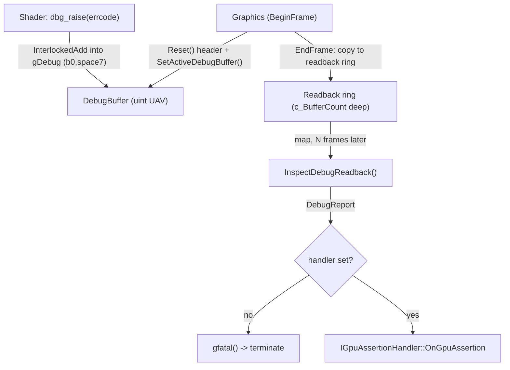

# Graphics Debug — how to diagnose bgl rendering errors

The tools bgl gives you to find out *why* a frame is wrong: GPU-side assertions that
report back through a debug buffer (`dbg_raise`), a spdlog file log, CPU-side asserts that
crash on broken invariants, a post-mortem crash log with a stack trace, and the D3D12 debug
/ GPU-validation layer. This document maps how they fit together and when to reach for each.

**This document is a map, not a mirror.** It captures design choices, data flow, and the
non-obvious contracts — not full signatures. The header at each linked path is the source of
truth; when this doc disagrees, trust the header, then fix this doc.

---

## Design Choices

* **One global switch, `BERNINI_GPU_DEBUG`, gates the entire GPU-assertion path** — the shader
  bodies, the CPU `DebugBuffer`/`DebugReadback` types, and the readback orchestration all
  compile out of Release. It is a Debug-config define set both for C++
  ([CMakeLists.txt](CMakeLists.txt), `$<$<CONFIG:Debug>:BERNINI_GPU_DEBUG>`) and for shaders
  ([cmake/compile_shader.cmake](cmake/compile_shader.cmake), `-DBERNINI_GPU_DEBUG=1` in Debug).
  In Release, `dbg_raise` is an empty function and no handler is ever invoked.
* **GPU assertions travel through an implicit, engine-bound UAV.** Shaders never declare the
  debug buffer; they `import debug.dbg` and call `dbg_raise(errcode)`, which writes into
  `gDebug` at a fixed slot (`register(b0, space7)`). The engine binds the live buffer once per
  frame so every dispatch is auto-wired. See [Geometry Layout](docs/geometry_layout.md) for how
  other implicit globals are bound.
* **GPU→CPU reporting is asynchronous and frame-latent.** `dbg_raise` only atomically appends a
  record on the GPU. The buffer is copied to a readback ring and inspected `c_BufferCount`
  frames later, so a report surfaces a few frames *after* the shader raised it. Consequences for
  handler lifetime are in the contracts below.
* **The debug-buffer decode is a pure function**, split out of the orchestration so the crash
  path is unit-testable without terminating the process
  ([DebugReadback.h](libs/bgl/src/debug/DebugReadback.h), `InspectDebugReadback`).
* **CPU error handling splits by blame.** Internal invariant violations use `gassert`/`gfatal`
  (log + `__debugbreak` + `std::terminate`); problems caused by the *caller* (code linking bgl)
  throw `GraphicsError`/`ApiError` so the caller can handle them. See
  [libs/bgl/CLAUDE.md](libs/bgl/CLAUDE.md).
* **The word layout of the debug buffer is duplicated in two places on purpose** — the GPU
  writer ([dbg.slang](libs/bgl/shaders/src/debug/dbg.slang)) and the CPU reader
  ([DebugBuffer.h](libs/bgl/src/debug/DebugBuffer.h)) each hardcode `kHeaderWords=4`,
  `kRecordWords=1`. They **must** stay in sync; there is no shared source for them.

---

## Which tool for which symptom

| Symptom | Reach for |
|---|---|
| Shader produced wrong/impossible data (bad index, overflow) but didn't crash | **GPU assertion** via `dbg_raise` |
| D3D12 API misuse, invalid barrier, resource-state mismatch, leaked resource | **D3D12 debug layer** + `bgl.log` |
| Silent wrong output, want a timeline of what the engine did | **`bgl.log`** (raise `logLevel` to `kTrace`) |
| Broken internal invariant should stop the process now | **`gassert`/`gfatal`** |
| Process already crashed; need the stack | **`{exe}_crash.log`** |

---

## 1. GPU Debug Buffers via `dbg_raise`

A GPU→CPU assertion channel. A shader detects a bad condition and calls `dbg_raise`; the engine
reads the buffer back a few frames later and either crashes (`gfatal`) or forwards a report to a
registered handler.

**Shader side** — [libs/bgl/shaders/src/debug/dbg.slang](libs/bgl/shaders/src/debug/dbg.slang):
* `dbg_raise(ErrorCode errcode)` — atomically appends one record; sets the overflow flag if the
  buffer is full.
* `dbg_assert(bool condition, ErrorCode errcode)` — `dbg_raise` when `!condition`.
* Error codes are the generated enum
  [idl/ErrorCode.slang](libs/bgl/shaders/src/idl/ErrorCode.slang) / C++ mirror
  [idl/ErrorCode.h](libs/bgl/src/idl/ErrorCode.h) (`kUnknown=1 … kInvalidVertexIndex=7`). Add
  new codes there, not inline. See [IDL Codegen](docs/idlgen.md).

**Consumer API** — [libs/bgl/include/bgl/IGraphics.h](libs/bgl/include/bgl/IGraphics.h),
[libs/bgl/include/bgl/IGpuAssertionHandler.h](libs/bgl/include/bgl/IGpuAssertionHandler.h):
* `IGraphics::SetGpuAssertionHandler(IGpuAssertionHandler*)` — install a handler to intercept
  reports instead of crashing; `nullptr` (default) restores the crash.
* `IGraphics::DiscardPendingGpuAssertions()` — drop in-flight reports without crashing/handling.
* `IGpuAssertionHandler::OnGpuAssertion(const GpuAssertionReport&)` — your callback;
  `GpuAssertionReport` carries `raisedCount`, `overflow`, and the `errcodes` array.

**Internal plumbing** (Debug-only; you normally don't touch these — the engine drives them):

| Type / entry | File | Role |
|---|---|---|
| `DebugBuffer` | [libs/bgl/src/debug/DebugBuffer.h](libs/bgl/src/debug/DebugBuffer.h) | CPU wrapper over the uint UAV; owns layout constants, `Init`/`Reset`/`Release` |
| `InspectDebugReadback` | [libs/bgl/src/debug/DebugReadback.h](libs/bgl/src/debug/DebugReadback.h) | Pure decode of a mapped readback → `DebugReport` (`nullopt` if nothing fired) |
| `ICommandList::SetActiveDebugBuffer` | [libs/bgl/src/cmd/CommandList.h](libs/bgl/src/cmd/CommandList.h) | Binds the UAV that subsequent dispatches auto-wire into `gDebug` (see [RHI](docs/rhi.md)) |
| Orchestration | [libs/bgl/src/d3d12/Graphics_d3d12.cpp](libs/bgl/src/d3d12/Graphics_d3d12.cpp) | Owns the buffer + readback ring; resets/binds each `BeginFrame`, copies out each `EndFrame`, inspects and crashes-or-forwards |

### Data flow



### Risky / non-obvious contracts

* **`dbg_raise` needs the buffer bound.** Standard passes get it automatically because
  `Graphics::BeginFrame` calls `SetActiveDebugBuffer`. If you drive an `ICommandList` yourself
  (custom compute), you must `Reset()` the buffer, barrier it, and `SetActiveDebugBuffer()`
  before the dispatch — otherwise `gDebug` is unbound. See the sketch below.
* **Debug-only.** In Release the shader body, the C++ types, and the handler invocation are all
  compiled out. Do not depend on `dbg_raise` firing in a Release build.
* **`gDebug` must live at `register(b0, space7)`** and shaders must `import debug.dbg` rather
  than declaring their own buffer — the binding is fixed engine-wide.
* **Layout constants must match** between [DebugBuffer.h](libs/bgl/src/debug/DebugBuffer.h) and
  [dbg.slang](libs/bgl/shaders/src/debug/dbg.slang) (`kHeaderWords=4`, `kRecordWords=1`).
  Changing a record's shape means editing both.
* **Handler lifetime spans the frame-latency window.** Reports arrive `c_BufferCount` frames
  after they fire, so the handler must stay valid across that window — simplest rule: it must
  outlive the `IGraphics`. @pre for a clean teardown: call `DiscardPendingGpuAssertions()`
  *before* clearing the handler, or an in-flight report falls back to the crash path.
* **Setters do no GPU sync and are not thread-safe.** `SetGpuAssertionHandler` /
  `DiscardPendingGpuAssertions` only swap CPU state; call them on the render thread alongside
  `BeginFrame`/`Draw`/`EndFrame`. They take effect at the next frame's inspection.
* **`DebugBuffer::Reset` @pre**: the buffer must be in copy-dest state, and `Init` must have run.
* **Capacity is small on purpose** (256 records). The whole buffer is copied every frame and the
  first firing frame crashes anyway, so overflow just sets a flag.
* **Editing a `.slang` file requires a full build** — a per-target build runs a stale DXIL, so
  the shader change won't take effect until every target is rebuilt.

---

## 2. Logging — `bgl.log`

bgl logging is **spdlog aliased into the `bgl` namespace**. In
[libs/bgl/src/pch.h](libs/bgl/src/pch.h): `namespace bgl { namespace logger = spdlog; }`. The
public API is therefore the spdlog free functions:
`logger::trace/debug/info/warn/error/critical(fmt, args...)`. It is PCH-included, so bgl sources
call `logger::…` with no extra include.

* **Log file:** `bgl.log`, written next to the bgl binary
  (`getLibraryPath().parent_path() / "bgl.log"`), set up in the `Graphics` constructor
  ([Graphics_d3d12.cpp](libs/bgl/src/d3d12/Graphics_d3d12.cpp)). It is truncated **once per
  process**, so multiple `Graphics` instances share one run's log rather than clobbering it.
* **Level & flush level** come from `GraphicsOptions::logLevel`
  ([IGraphics.h](libs/bgl/include/bgl/IGraphics.h), enum `kTrace … kOff`). **Default is `kError`**
  — to see the timeline of a run, pass `logLevel = kTrace` when calling `CreateGraphics`.
* **D3D12 debug-layer messages are forwarded into this same log** (see §5), so validation errors
  and your own `logger::` output interleave in one file.

Per [libs/bgl/CLAUDE.md](libs/bgl/CLAUDE.md): after running `bgl_tests`, always read `bgl.log`
for the warnings/errors/info the run emitted.

---

## 3. CPU-side assertions — `gassert` / `gfatal` / `gerror`

Defined in [libs/bgl/src/error/gassert.h](libs/bgl/src/error/gassert.h) (PCH-included, namespace
`bgl`). All three log then break into the debugger on MSVC (`__debugbreak`):

* `gassert(condition, fmt, args...)` — on failure: `logger::error`, break, `std::terminate`.
  Use for internal invariants.
* `gfatal(fmt, args...)` `[[noreturn]]` — `logger::critical`, break, `std::terminate`. This is
  the GPU-assertion crash path.
* `gerror(fmt, args...)` — `logger::error` + break, but **does not terminate** (execution
  continues).
* `GWARN_ONCE(fmt_str, ...)` — logs a `warn` exactly once via a function-local `static bool`.

**Contracts / gotchas:**
* **Blame split:** `gassert` is for bgl's *own* broken invariants. For bad input from the caller
  (code that links bgl), throw `GraphicsError`/`ApiError`
  ([IGraphics.h](libs/bgl/include/bgl/IGraphics.h)) so the caller can catch it.
* **Not compiled out in Release.** These are function templates with no `NDEBUG` guard —
  `gassert`/`gfatal` still `terminate` on failure in every config. Don't put
  side-effecting expressions in the condition expecting them to vanish.
* **`__debugbreak` is MSVC-only.** On other compilers there is no breakpoint, only the
  log + terminate.
* These are function templates, not macros — they do **not** capture `__FILE__`/`__LINE__`;
  put the location context in the format string.

---

## 4. Crash log — `{exe}_crash.log`

A post-mortem stack trace, provided by **core** (not bgl):
[libs/core/src/err/util.cpp](libs/core/src/err/util.cpp), `core::crash_signal_handle`. On a
fatal signal it truncates `./{exe_stem}_crash.log`, writes a `cpptrace` stack trace, then
`std::exit`. The app/test entry point registers it for `SIGSEGV/SIGABRT/SIGFPE` (e.g.
[libs/assetlib/tests/src/main.cpp](libs/assetlib/tests/src/main.cpp)). Because `gassert`/`gfatal`
call `std::terminate` → `SIGABRT`, a CPU assert failure lands here. After any crash, look for
`{exe_stem}_crash.log` (and other `.log` files) in the failing executable's directory.

---

## 5. D3D12 debug layer & GPU validation

Runtime-toggled via `GraphicsOptions` flags
([IGraphics.h](libs/bgl/include/bgl/IGraphics.h)), applied in the `Graphics` constructor
([Graphics_d3d12.cpp](libs/bgl/src/d3d12/Graphics_d3d12.cpp)):

* `enableDebugLayer` → `ID3D12Debug::EnableDebugLayer()`. Turns on D3D12 API validation and sets
  break-on-severity for ERROR and CORRUPTION via `IDXGIInfoQueue`.
* `enableGPUValidationLayer` → `SetEnableGPUBasedValidation(TRUE)`. **Only meaningful with
  `enableDebugLayer` on.**
* `enablePixDebug` → loads `WinPixGpuCapturer.dll` for PIX captures. See [RHI](docs/rhi.md).
* Validation messages are routed to `bgl.log` through the `Graphics::LogD3D12Message` callback
  registered on `ID3D12InfoQueue1`, so they appear alongside your logging.

This runtime layer is **independent** of the compile-time `BERNINI_GPU_DEBUG` GPU-assertion
system in §1: one is a D3D12 API validator, the other is your shaders reporting logic errors.
Examples and tests typically enable both `enableDebugLayer` and `enableGPUValidationLayer`; the
editor reads them from its config.

---

## Usage Sketch

Register a handler so GPU assertions are captured instead of crashing the process:

```cpp
struct MyHandler : bgl::IGpuAssertionHandler
{
    void OnGpuAssertion(const bgl::GpuAssertionReport& r) noexcept override
    {
        bgl::logger::error("GPU raised {} assertion(s), overflow={}", r.raisedCount, r.overflow);
        for (uint32_t i = 0; i < r.errcodeCount; ++i)
            bgl::logger::error("  errcode {}", r.errcodes[i]);
    }
};

bgl::GraphicsOptions opts;
opts.enableDebugLayer         = true;          // D3D12 validation into bgl.log
opts.enableGPUValidationLayer = true;
opts.logLevel = bgl::GraphicsOptions::LogLevel::kTrace;  // full timeline

auto gfx = bgl::CreateGraphics(opts);

MyHandler handler;                              // must outlive the frame-latency window
gfx->SetGpuAssertionHandler(&handler);          // else a raise -> gfatal() crash

// ... render frames; dbg_raise() in shaders now routes to handler ...

gfx->DiscardPendingGpuAssertions();             // before dropping the handler
gfx->SetGpuAssertionHandler(nullptr);
```

Driving the debug buffer manually on your own command list (custom compute) — the pattern the
engine's `BeginFrame`/`EndFrame` follow — is shown end-to-end in
[libs/bgl/tests/src/DebugAssert_test.cpp](libs/bgl/tests/src/DebugAssert_test.cpp): `Reset()` the
header, barrier to UAV, `SetActiveDebugBuffer()`, `Dispatch()`, barrier to copy-source,
`CopyBufferToReadback()`, then `InspectDebugReadback()`.

---

## Maintenance note

The file links in the tables and section headers are the load-bearing part of this doc; they rot
silently if files move or are renamed. When the debug/logging layout changes — especially the
buffer word layout duplicated across
[DebugBuffer.h](libs/bgl/src/debug/DebugBuffer.h) and
[dbg.slang](libs/bgl/shaders/src/debug/dbg.slang) — re-check the links and the constants.
