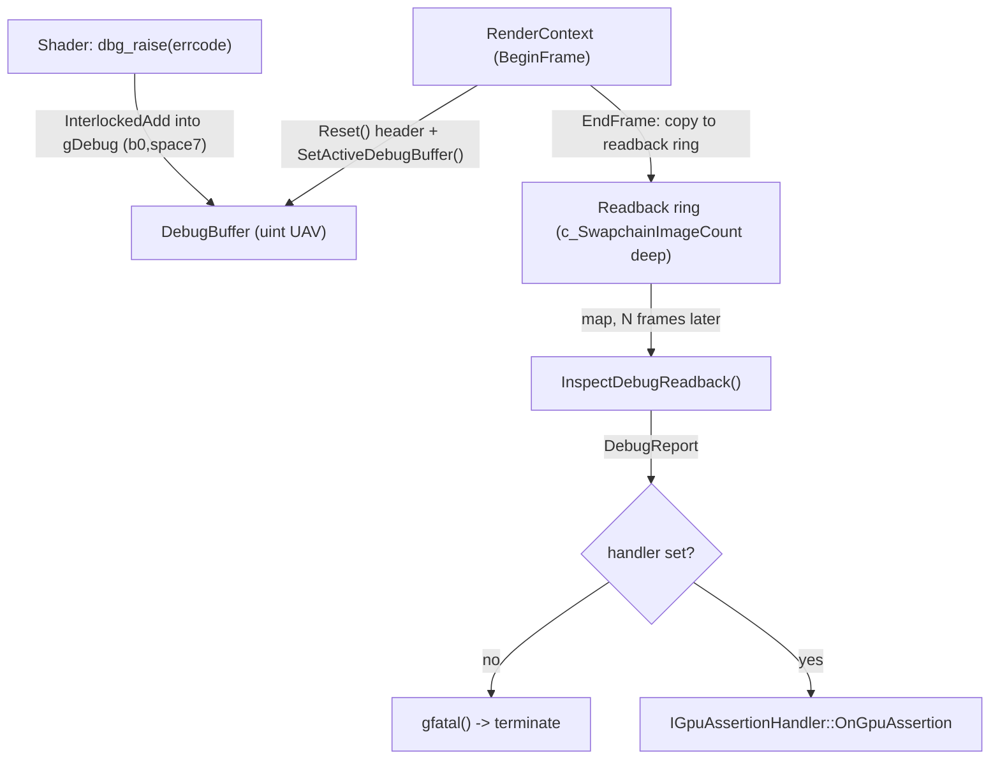

# Graphics Debug — how to diagnose bgl rendering errors

The tools bgl gives you to find out *why* a frame is wrong: GPU-side assertions that
report back through a debug buffer (`dbg_raise`), a spdlog file log, CPU-side asserts that
crash on broken invariants, a post-mortem crash log with a stack trace, and the D3D12 debug
/ GPU-validation layer. This document maps how they fit together and when to reach for each.

**This document is a map, not a mirror.** It captures design choices, data flow, and the
non-obvious contracts — not full signatures. The header at each linked path is the source of
truth; when this doc disagrees, trust the header, then fix this doc.

---

## Design Choices

* **One global switch, `BERNINI_GPU_DEBUG`, gates the entire GPU-assertion path** — the shader
  bodies, the CPU `DebugBuffer`/`DebugReadback` types, and the readback orchestration all
  compile out of Release. It is a Debug-config define for C++
  ([CMakeLists.txt](CMakeLists.txt), `$<$<CONFIG:Debug>:BERNINI_GPU_DEBUG>`); the runtime Slang
  session forwards the same macro into shaders it compiles at PSO creation, gated by the C++
  define ([Device_d3d12.cpp](libs/bgl/src/d3d12/device/Device_d3d12.cpp)). In Release, `dbg_raise`
  is an empty function and no handler is ever invoked.
* **GPU assertions travel through an implicit, engine-bound UAV.** Shaders never declare the
  debug buffer; they `import debug.dbg` and call `dbg_raise(errcode)`, which writes into the
  implicit `gDebug` constant buffer. `gDebug` carries no explicit `register()` — its binding is
  assigned by Slang when the PSO's entry points are linked, and the engine reads that binding
  back from reflection (`GetRootParamIndex`) to bind the live buffer once per frame, so every
  dispatch is auto-wired. See [Geometry Layout](docs/geometry_layout.md) for how other implicit
  globals are bound.
* **GPU→CPU reporting is asynchronous and frame-latent.** `dbg_raise` only atomically appends a
  record on the GPU. The buffer is copied to a readback ring and inspected `c_SwapchainImageCount`
  frames later, so a report surfaces a few frames *after* the shader raised it. Consequences for
  handler lifetime are in the contracts below.
* **The debug-buffer decode is a pure function**, split out of the orchestration so the crash
  path is unit-testable without terminating the process
  ([DebugReadback.h](libs/bgl/src/debug/DebugReadback.h), `InspectDebugReadback`).
* **CPU error handling splits by blame.** Internal invariant violations use `gassert`/`gfatal`
  (log + `__debugbreak` + `std::terminate`); problems caused by the *caller* (code linking bgl)
  throw `GraphicsError`/`ApiError` so the caller can handle them. See
  [libs/bgl/CLAUDE.md](libs/bgl/CLAUDE.md).
* **The word layout of the debug buffer is duplicated in two places on purpose** — the GPU
  writer ([dbg.slang](libs/bgl/shaders/src/debug/dbg.slang)) and the CPU reader
  ([DebugBuffer.h](libs/bgl/src/debug/DebugBuffer.h)) each hardcode `kHeaderWords=4`,
  `kRecordWords=1`. They **must** stay in sync; there is no shared source for them.

---

## Which tool for which symptom

| Symptom | Reach for |
|---|---|
| Shader produced wrong/impossible data (bad index, overflow) but didn't crash | **GPU assertion** via `dbg_raise` |
| A pass reads a buffer element nobody wrote this frame, and the stale value looks plausible | **Buffer poisoning** (§7) |
| D3D12 API misuse, invalid barrier, resource-state mismatch, leaked resource | **D3D12 debug layer** + `bgl.log` |
| Silent wrong output, want a timeline of what the engine did | **`bgl.log`** (raise `logLevel` to `kTrace`) |
| Broken internal invariant should stop the process now | **`gassert`/`gfatal`** |
| Process already crashed; need the stack | **`{exe}_crash_*.log`** (newest) |

---

## 1. GPU Debug Buffers via `dbg_raise`

A GPU→CPU assertion channel. A shader detects a bad condition and calls `dbg_raise`; the engine
reads the buffer back a few frames later and either crashes (`gfatal`) or forwards a report to a
registered handler.

**Shader side** — [libs/bgl/shaders/src/debug/dbg.slang](libs/bgl/shaders/src/debug/dbg.slang):
* `dbg_raise(ErrorCode errcode, uint value = 0, uint limit = 0, uint context = 0)` — atomically
  appends one record; sets the overflow flag if the buffer is full.
* `dbg_assert(bool condition, ErrorCode errcode, uint value = 0, uint limit = 0, uint context = 0)`
  — `dbg_raise` when `!condition`.
* **Pass the operands.** `value`/`limit` are the two sides of the comparison that failed and
  `context` names what the shader was working on (the submesh, meshlet or instance). They default to
  zero so a raise that is not a comparison stays terse — but a record without them says only that
  something went wrong, which cannot be traced back to *which* draw. One bad submesh raises once per
  vertex, so a bare errcode arrives a thousand times over and still names nothing.
* Error codes are the generated enum
  [idl/ErrorCode.slang](libs/bgl/idl/src/ErrorCode.slang) / C++ mirror
  `<build>/generated/idl/ErrorCode.h` (`kUnknown=1 … kNullRawDeref=12`). Add
  new codes there, not inline — and give the new code a name in `ErrorCodeName`
  ([DebugReadback.h](libs/bgl/src/debug/DebugReadback.h)), which the build enforces. See
  [IDL Codegen](docs/idlgen.md).

**Consumer API** — [libs/bgl_intfc/include/bgl/IGraphics.h](libs/bgl_intfc/include/bgl/IGraphics.h),
[libs/bgl_intfc/include/bgl/IGpuAssertionHandler.h](libs/bgl_intfc/include/bgl/IGpuAssertionHandler.h):
* `IGraphics::SetGpuAssertionHandler(IGpuAssertionHandler*)` — install a handler to intercept
  reports instead of crashing; `nullptr` (default) restores the crash.
* `IGraphics::DiscardPendingGpuAssertions()` — drop in-flight reports without crashing/handling.
* `IGpuAssertionHandler::OnGpuAssertion(const GpuAssertionReport&)` — your callback;
  `GpuAssertionReport` carries `raisedCount`, `overflow`, and the `errcodes` array.

**Internal plumbing** (Debug-only; you normally don't touch these — the engine drives them):

| Type / entry | File | Role |
|---|---|---|
| `DebugBuffer` | [libs/bgl/src/debug/DebugBuffer.h](libs/bgl/src/debug/DebugBuffer.h) | CPU wrapper over the uint UAV; owns layout constants, `Init`/`Reset`/`Release` |
| `InspectDebugReadback` | [libs/bgl/src/debug/DebugReadback.h](libs/bgl/src/debug/DebugReadback.h) | Pure decode of a mapped readback → `DebugReport` (`nullopt` if nothing fired) |
| `ICommandList::SetActiveDebugBuffer` | [libs/bgl/src/cmd/CommandList.h](libs/bgl/src/cmd/CommandList.h) | Binds the UAV that subsequent dispatches auto-wire into `gDebug` (see [RHI](docs/rhi.md)) |
| Orchestration | [libs/bgl/src/gfx/RenderContext.cpp](libs/bgl/src/gfx/RenderContext.cpp) | Owns the buffer + readback ring; resets/binds each `BeginFrame`, copies out each `EndFrame`, inspects and crashes-or-forwards |

### Data flow


```mermaid
flowchart TD
    Shader["Shader: dbg_raise(errcode)"] -- "InterlockedAdd into gDebug (b0,space7)" --> Buf["DebugBuffer (uint UAV)"]
    Ctx["RenderContext (BeginFrame)"] -- "Reset() header + SetActiveDebugBuffer()" --> Buf
    Ctx -- "EndFrame: copy to readback ring" --> Ring["Readback ring (c_SwapchainImageCount deep)"]
    Ring -- "map, N frames later" --> Inspect["InspectDebugReadback()"]
    Inspect -- "DebugReport" --> Decide{"handler set?"}
    Decide -- "no" --> Crash["gfatal() -> terminate"]
    Decide -- "yes" --> Handler["IGpuAssertionHandler::OnGpuAssertion"]
```

### Risky / non-obvious contracts

* **`dbg_raise` needs the buffer bound.** Standard passes get it automatically because
  `RenderContext::BeginFrame` calls `SetActiveDebugBuffer`. If you drive an `ICommandList` yourself
  (custom compute), you must `Reset()` the buffer, barrier it, and `SetActiveDebugBuffer()`
  before the dispatch — otherwise `gDebug` is unbound. See the sketch below.
* **Debug-only.** In Release the shader body, the C++ types, and the handler invocation are all
  compiled out. Do not depend on `dbg_raise` firing in a Release build.
* **Shaders must `import debug.dbg`** and use its implicit `gDebug` rather than declaring their
  own buffer. `gDebug` has no explicit `register()`; its binding is assigned at link time and
  the engine wires the live buffer from reflection, so every shader that imports `debug.dbg`
  gets it auto-bound.
* **Layout constants must match** between [DebugBuffer.h](libs/bgl/src/debug/DebugBuffer.h) and
  [dbg.slang](libs/bgl/shaders/src/debug/dbg.slang) (`kHeaderWords=4`, `kRecordWords=4`).
  Changing a record's shape means editing both, plus the `DebugRecord` IDL struct the readback
  decodes over the words. A `static_assert` in `DebugBuffer.h` catches the struct and the word count
  disagreeing; nothing catches `dbg.slang` disagreeing, so change it in the same commit.
* **A slot in the readback ring is context-wide, but every `RenderTarget` indexes it with a frame
  index of its own.** With more than one target (the editor has three) the target that inspects a
  slot need not be the one that filled it, so `InspectDebugSlot` waits on the fence recorded for the
  copy rather than the caller's `rt.GetFrameFence(index)` — which gates a different frame entirely,
  and is absent altogether for a target that has not yet drawn at that slot. Two consequences remain:
  a report can be attributed to the wrong target (read the record's `context`, not the stack), and a
  second target's copy can overwrite a slot before anyone inspects it, dropping those assertions.
* **Handler lifetime spans the frame-latency window.** Reports arrive `c_SwapchainImageCount` frames
  after they fire, so the handler must stay valid across that window — simplest rule: it must
  outlive the `IGraphics`. @pre for a clean teardown: call `DiscardPendingGpuAssertions()`
  *before* clearing the handler, or an in-flight report falls back to the crash path.
* **Setters do no GPU sync and are not thread-safe.** `SetGpuAssertionHandler` /
  `DiscardPendingGpuAssertions` only swap CPU state; call them on the render thread alongside
  `BeginFrame`/`Draw`/`EndFrame`. They take effect at the next frame's inspection.
* **`DebugBuffer::Reset` @pre**: the buffer must be in copy-dest state, and `Init` must have run.
* **Capacity is small on purpose** (256 records). The whole buffer is copied every frame and the
  first firing frame crashes anyway, so overflow just sets a flag.
* **Editing a `.slang` file requires a build to re-stage the source** — shaders are compiled at
  runtime from the `.slang` source copied into each target's output dir (`shaders/src`), so a
  change won't take effect until a build re-copies it.

---

## 2. Logging — `bgl.log`

bgl logging is **spdlog aliased into the `bgl` namespace**. In
[libs/bgl/src/pch.h](libs/bgl/src/pch.h): `namespace bgl { namespace logger = spdlog; }`. The
public API is therefore the spdlog free functions:
`logger::trace/debug/info/warn/error/critical(fmt, args...)`. It is PCH-included, so bgl sources
call `logger::…` with no extra include.

* **Log file:** one per process, named by whoever opens it first. The `Graphics` constructor
  ([Graphics_d3d12.cpp](libs/bgl/src/d3d12/Graphics_d3d12.cpp)) asks for `bgl.log` next to the
  binary, which is what `bgl_tests` and the examples get; under the editor `main.cpp` has already
  asked for `editor.log`, so bgl's call only applies its level. `core::logging::init_file_logger`
  ([log.h](libs/core/include/core/log/log.h)) is where that rule lives: **the first call wins the
  file, every call applies its level**. Several `Graphics` instances therefore share one run's log
  rather than clobbering it.
* **Level & flush level** come from `GraphicsOptions::logLevel`
  ([IGraphics.h](libs/bgl_intfc/include/bgl/IGraphics.h), enum `kTrace … kOff`). **Default is `kError`**
  — to see the timeline of a run, pass `logLevel = kTrace` when calling `CreateGraphics`.
* **D3D12 debug-layer messages are forwarded into this same log** (see §5), so validation errors
  and your own `logger::` output interleave in one file.

* **Cook and load timings are not in this log at all — they are Tracy zones.** A glTF parse, a
  tangent pass, a posed-bounds bake, a prefilter and a whole-project bounds rebake each
  open a zone carrying its own dimensions, and so does every stage of an editor start-up. They are
  read in the Tracy profiler, not here, because a duration on a line cannot say what it ran *inside*
  and a log interleaved from six threads cannot say which one it ran *on*. See
  [docs/profiling.md](docs/profiling.md).

* **The editor's Qt messages are in this same file too.** `InstallQtLogRouting`
  ([util/qt_logging.cpp](apps/editor/src/util/qt_logging.cpp)) hands everything that goes through
  `qInfo`/`qWarning`/`qCritical` to the default logger's *sinks*, so `editor.log` carries the
  renderer's lines, assetlib's and the editor's own, in one order on one clock. It writes through
  the sinks rather than the logger for the same reason the cook stages once did: the level above is
  the renderer's, and at `kError` routing through the logger would drop every editor diagnostic
  there is. Each message is flushed on the way out, because `flush_on` is set from that same
  renderer level.

  There used to be a second file. Two clocks meant an import's timeline straddled both, which is
  why a duration was once written onto the line that reported it — that is now a Tracy zone, and the
  two logs are one.

Per [libs/bgl/CLAUDE.md](libs/bgl/CLAUDE.md): after running `bgl_tests`, always read `bgl.log`
for the warnings/errors/info the run emitted.

---

## 3. CPU-side assertions — `gassert` / `gfatal` / `gerror`

Defined in [libs/bgl/src/error/gassert.h](libs/bgl/src/error/gassert.h) (PCH-included, namespace
`bgl`). All three log then break into the debugger on MSVC (`__debugbreak`):

* `gassert(condition, fmt, args...)` — on failure: `logger::error`, break, `std::terminate`.
  Use for internal invariants.
* `gfatal(fmt, args...)` `[[noreturn]]` — `logger::critical`, break, `std::terminate`. This is
  the GPU-assertion crash path.
* `gerror(fmt, args...)` — `logger::error` + break, but **does not terminate** (execution
  continues).
* `GWARN_ONCE(fmt_str, ...)` — logs a `warn` exactly once via a function-local `static bool`.

**Contracts / gotchas:**
* **Blame split:** `gassert` is for bgl's *own* broken invariants. For bad input from the caller
  (code that links bgl), throw `GraphicsError`/`ApiError`
  ([IGraphics.h](libs/bgl_intfc/include/bgl/IGraphics.h)) so the caller can catch it.
* **Not compiled out in Release.** These are function templates with no `NDEBUG` guard —
  `gassert`/`gfatal` still `terminate` on failure in every config. Don't put
  side-effecting expressions in the condition expecting them to vanish.
* **`__debugbreak` is MSVC-only.** On other compilers there is no breakpoint, only the
  log + terminate.
* These are function templates, not macros — they do **not** capture `__FILE__`/`__LINE__`;
  put the location context in the format string.

---

## 4. Crash log — `{exe}_crash_YYYYMMDD_HHMMSS.log`

A post-mortem stack trace, provided by **core** (not bgl):
[libs/core/src/err/util.cpp](libs/core/src/err/util.cpp), `core::install_crash_handlers`, which
every app and test entry point calls first thing (e.g.
[libs/assetlib/tests/src/main.cpp](libs/assetlib/tests/src/main.cpp)). On a fatal signal it writes
`./{exe_stem}_crash_YYYYMMDD_HHMMSS.log` — a `cpptrace` stack trace — then leaves through `_Exit`.
Because `gassert`/`gfatal` call `std::terminate` → `SIGABRT`, a CPU assert failure lands here.
After any crash, look for the newest `{exe_stem}_crash_*.log` (and other `.log` files) in the
failing executable's directory.

**Read the header line before the trace.** It names the address that faulted and the instruction
that faulted on it, and that instruction is in the one function the trace below cannot name: a
trace is walked from the frame pointers, which hold *return* addresses, so the innermost frame —
the function that has not returned — is absent from it and the trace reads as if the caller were
to blame.

The name is stamped, so a crash never overwrites the one before it and a reproduction attempt can
be compared against the original. The ordinary logs are overwritten per run. Crashes within the
same second do still collide.

---

## 5. D3D12 debug layer & GPU validation

Runtime-toggled via `GraphicsOptions` flags
([IGraphics.h](libs/bgl_intfc/include/bgl/IGraphics.h)), applied in the `Graphics` constructor
([Graphics_d3d12.cpp](libs/bgl/src/d3d12/Graphics_d3d12.cpp)):

* `enableDebugLayer` → `ID3D12Debug::EnableDebugLayer()`. Turns on D3D12 API validation and sets
  break-on-severity for ERROR and CORRUPTION via `IDXGIInfoQueue`.
* `enableGPUValidationLayer` → `SetEnableGPUBasedValidation(TRUE)`. **Only meaningful with
  `enableDebugLayer` on.**
* `enablePixDebug` → loads `WinPixGpuCapturer.dll` for PIX captures. See [RHI](docs/rhi.md).
* Validation messages are routed to `bgl.log` through the `Graphics::LogD3D12Message` callback
  registered on `ID3D12InfoQueue1`, so they appear alongside your logging.

This runtime layer is **independent** of the compile-time `BERNINI_GPU_DEBUG` GPU-assertion
system in §1: one is a D3D12 API validator, the other is your shaders reporting logic errors.
Examples and tests typically enable both `enableDebugLayer` and `enableGPUValidationLayer`; the
editor reads them from its config.

---

## 6. Metal validation & frame capture

Metal's validators are environment variables, not `GraphicsOptions` flags, so they need no rebuild:

```bash
MTL_DEBUG_LAYER=1 MTL_DEBUG_LAYER_ERROR_MODE=assert MTL_SHADER_VALIDATION=1 ./bgl_tests "<name>"
```

`MTL_DEBUG_LAYER` is the API validator (the counterpart to `enableDebugLayer`);
`MTL_SHADER_VALIDATION` is the GPU-side one (the counterpart to `enableGPUValidationLayer`).

For a frame capture, set `GraphicsOptions::gpuCapturePath` to a `.gputrace` path. The **first**
frame between `BeginFrame` and `EndFrame` is written there, and the capture stops after the frame
is submitted so the trace holds a complete one.

```bash
MTL_CAPTURE_ENABLED=1 ./bgl_tests "PBR instances render headlessly"
```

`MTL_CAPTURE_ENABLED=1` is required. Metal reads it when the process starts its device, so bgl
cannot set it on your behalf; without it `supportsDestination` reports the destination unsupported
and bgl throws, naming the variable.

**Capturing needs no Xcode — reading the result does.** A machine with only the Command Line Tools
writes a valid `.gputrace`, which then opens in Xcode's Metal debugger anywhere. That split is the
whole point of the flag: it is how a headless or CI macOS box hands a frame to someone who can look
at it.

---

## 7. Buffer poisoning

A GPU buffer this engine allocates is never freed and re-allocated per frame — the scratch a compute
pass writes is the same resource it wrote last frame. So a pass that fails to write an element does
not read garbage; it reads *last frame's value*, which is plausible enough that the frame still looks
right and the bug surfaces later, somewhere else. Poisoning removes that luck: the graph fills the
buffer with a value that is wrong under every interpretation just before the pass runs.

* **The pattern is `0x7FBADBAD`** ([BufferPoisoner.h](libs/bgl/src/debug/BufferPoisoner.h),
  `c_PoisonWord`) — a **signalling NaN** read as a `float` and an impossible element index read as a
  `uint`. `0xDEADBEEF` alone is a finite float (-6.3e18) that a solver consumes without complaint,
  which is the interpretation poisoning most needs to break.
* **It is opt-in per pass, per buffer.** `PassDesc::AddPoisonedBufferArg(name, sync)` declares a UAV
  output the pass rewrites *from nothing*. Declaring it on a buffer the pass **accumulates** into —
  a histogram, an append counter — destroys the frame's own data: those want
  `ComputeBuffer::Clear`, which zeroes, not this.
* **Only the poisoner is Debug-only.** The declaration compiles in every configuration and does
  nothing without a poisoner installed, so pass code carries no `#ifdef`. `RenderContext` installs
  one under `BERNINI_GPU_DEBUG` (§1's switch), and nothing else does.
* **The fill is a copy, not a dispatch.** A buffer's one bindless descriptor is a *structured* view
  with that buffer's own stride, so a compute shader cannot address an arbitrary buffer as `uint`s.
  `BufferPoisoner` instead keeps a 64 KiB chunk of the repeated pattern and `CopyBuffer`s it over
  the target as many times as it takes — which needs no descriptor, and no backend code.
* **Cost per poisoned buffer, per frame:** two barriers (the graph transitions out of the state it
  derived, and back) plus one copy per 64 KiB. Nothing crosses PCIe; the pattern chunk is uploaded
  once, on the first poison of the process.

Poisoned today: `scene.compactedInstances` (written only for visible instances, at offsets the
prefix sum decides) and `scene.transparentSortEntries` (only transparent instances take a slot).

### Reading a poisoned value

| Where it shows up | What you see |
|---|---|
| A readback or PIX/Xcode buffer view | `0x7FBADBAD`, `2143082413`, or `nan` |
| Anything shaded with it | NaN propagation — black or missing pixels, not subtly wrong ones |
| An index derived from it | far out of bounds, so a `dbg_assert` on the bound fires (§1) |

---

## Usage Sketch

Register a handler so GPU assertions are captured instead of crashing the process:

```cpp
struct MyHandler : bgl::IGpuAssertionHandler
{
    void OnGpuAssertion(const bgl::GpuAssertionReport& r) noexcept override
    {
        bgl::logger::error("GPU raised {} assertion(s), overflow={}", r.raisedCount, r.overflow);
        for (uint32_t i = 0; i < r.errcodeCount; ++i)
            bgl::logger::error("  errcode {}", r.errcodes[i]);
    }
};

bgl::GraphicsOptions opts;
opts.enableDebugLayer         = true;          // D3D12 validation into bgl.log
opts.enableGPUValidationLayer = true;
opts.logLevel = bgl::GraphicsOptions::LogLevel::kTrace;  // full timeline

auto gfx = bgl::CreateGraphics(opts);

MyHandler handler;                              // must outlive the frame-latency window
gfx->SetGpuAssertionHandler(&handler);          // else a raise -> gfatal() crash

// ... render frames; dbg_raise() in shaders now routes to handler ...

gfx->DiscardPendingGpuAssertions();             // before dropping the handler
gfx->SetGpuAssertionHandler(nullptr);
```

Driving the debug buffer manually on your own command list (custom compute) — the pattern the
engine's `BeginFrame`/`EndFrame` follow — is shown end-to-end in
[libs/bgl/tests/src/DebugAssert_test.cpp](libs/bgl/tests/src/DebugAssert_test.cpp): `Reset()` the
header, barrier to UAV, `SetActiveDebugBuffer()`, `Dispatch()`, barrier to copy-source,
`CopyBufferToReadback()`, then `InspectDebugReadback()`.

---

## Maintenance note

The file links in the tables and section headers are the load-bearing part of this doc; they rot
silently if files move or are renamed. When the debug/logging layout changes — especially the
buffer word layout duplicated across
[DebugBuffer.h](libs/bgl/src/debug/DebugBuffer.h) and
[dbg.slang](libs/bgl/shaders/src/debug/dbg.slang) — re-check the links and the constants.
