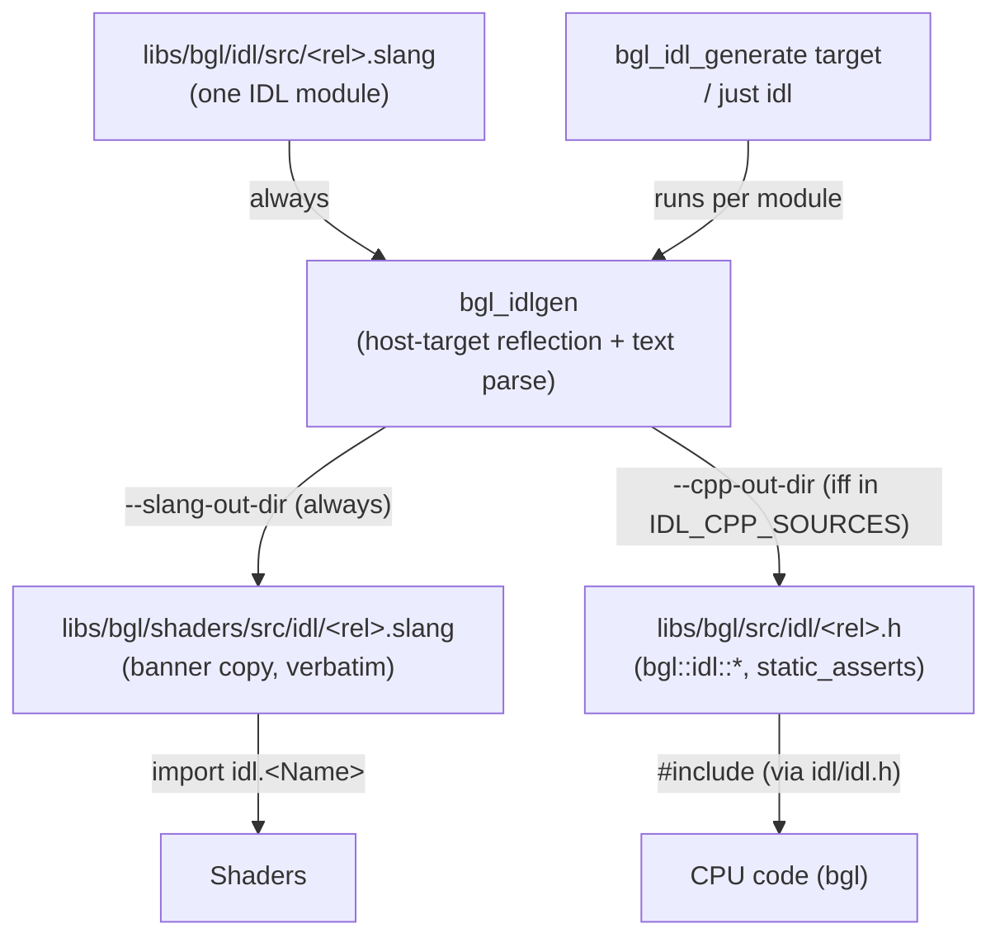

# IDL Codegen (`bgl_idlgen`) — one Slang source, CPU + GPU definitions in lockstep

`bgl_idlgen` is a build-time code generator that turns a single `.slang` **IDL module** into two
outputs: a banner-stamped Slang copy the shaders `import`, and (opt-in) a C++ header the CPU
`#include`s. Its job is to keep the CPU-side struct/enum/constant definitions byte-for-byte
identical to the GPU-side ones so a CPU struct can be `memcpy`'d straight into a GPU buffer. It is
an executable tool, not a runtime library — there are no `I*` interfaces here.

**This document is a map, not a mirror.** It captures the design choices, the generation
topology, and the *non-obvious* contracts — not the tool's internals. The generator source
[libs/bgl/idl/idlgen.cpp](libs/bgl/idl/idlgen.cpp) and each IDL module under [libs/bgl/idl/src/](libs/bgl/idl/src/)
are the source of truth; when this doc disagrees, trust them, then fix this doc.

---

## Design Choices

* **A module's identity is its path relative to `--src-root`, and that one path drives
  everything.** The relative path (minus extension) becomes the Slang `import` name, the output
  `.slang`/`.h` sub-path under each output root, and the C++ namespace (each sub-directory appends
  a `::` segment onto the base `bgl::idl`). Because the input is written under both output roots
  at the *same* relative sub-path, the import path, the `.slang` location, the `#include`, and the
  `.h` location cannot drift. **To move a module, rename it (change its relative path) so importers
  follow it — never relocate it to a path that disagrees with its import name.**

* **One IDL source, two generated targets, opt-in on the C++ side.** Every module always produces
  a banner-stamped Slang copy under [libs/bgl/shaders/src/idl/](libs/bgl/shaders/src/idl/) (a verbatim copy,
  so shaders `import idl.<Name>`). A module produces a C++ header under
  [libs/bgl/src/idl/](libs/bgl/src/idl/) **only if it is listed in `IDL_CPP_SOURCES`**
  ([libs/bgl/idl/src/CMakelists.txt](libs/bgl/idl/src/CMakelists.txt)); interface/generic-only modules carry
  no concrete layout and are skipped. The tool also self-skips the C++ header when a module has no
  structs, enums, or constants.

* **Layout parity is proven, not assumed.** Struct layout comes from Slang's reflection of a
  **host** target (`SLANG_HOST_HOST_CALLABLE`), which lays types out with C/C++ scalar rules —
  the same layout a scalar `StructuredBuffer` uses on the GPU. The generated C++ struct is followed
  by `static_assert(sizeof(...))` and per-field `static_assert(offsetof(...))`, so the two sides
  can never silently diverge; a mismatch is a compile error.

* **Structs use reflection; enums and constants are parsed textually.** Slang's `DeclReflection`
  does not reliably surface enum *cases* or a constant's *initializer value*, and the module source
  is already copied verbatim, so a small deterministic text parser handles those. Struct fields —
  where exact offsets/sizes matter — go through reflection.

* **Type mapping is fixed.** Scalars map to `<cstdint>` (`uint`→`uint32_t`, …); vectors/matrices
  map to `glm` (`float3`→`glm::vec3`, `float4x4`→`glm::mat4`, glm being column-major); a struct/enum
  field keeps its *declared* type name (the host layout would otherwise lower an enum field to its
  underlying scalar and erase the name). An `import`ed type pulls in the corresponding generated
  `#include`.

* **Generated files are write-only build artifacts.** Both the `.slang` copy and the `.h` carry a
  `// THIS IS A FILE GENERATED FROM ... DO NOT EDIT MANUALLY` banner. Edit the IDL source and
  regenerate; never hand-edit a generated copy.

---

## Authoring & Tooling Index

### IDL constructs (what you can write in a module)
| Construct | Example | Generates (C++) | Notes |
|---|---|---|---|
| `public struct` | [Meshlet.slang](libs/bgl/idl/src/Meshlet.slang) | `struct` + `sizeof`/`offsetof` asserts | Layout via host reflection. |
| `public enum` | [VertexLayout.slang](libs/bgl/idl/src/VertexLayout.slang) | `enum class : <underlying>` + `sizeof` assert | Values parsed textually; see contracts. |
| `public static const` | [Constants.slang](libs/bgl/idl/src/Constants.slang) | `constexpr <type> = <expr>` | RHS copied verbatim; `public` needed for shader import. |
| `import <Module>` | [Mesh.slang](libs/bgl/idl/src/Mesh.slang) | `#include "idl/<Module>.h"` | Only emitted for referenced types. |
| `interface` / generic-only | [IMaterial.slang](libs/bgl/idl/src/IMaterial.slang), [RangeWithCount.slang](libs/bgl/idl/src/RangeWithCount.slang) | *(none)* | Slang copy only; no concrete layout. |

### CLI options ([libs/bgl/idl/idlgen.cpp](libs/bgl/idl/idlgen.cpp))
| Option | Role |
|---|---|
| `<input.slang>` | The single IDL module to process (positional, required). |
| `--src-root <dir>` | Root the module's import path / namespace / output sub-path are relative to (required). |
| `--slang-out-dir <dir>` | Output root for the banner-stamped Slang copy. |
| `--cpp-out-dir <dir>` | Output root for the generated C++ header. At least one of `--slang-out-dir` / `--cpp-out-dir` is required; omitting `--cpp-out-dir` emits only the Slang copy. |
| `--namespace <ns>` | Base C++ namespace (default `bgl::idl`). |
| `-I,--include <dir>` | Extra search dir for `import`ed Slang modules (repeatable). |

### Files & build wiring
| Path | Role |
|---|---|
| [libs/bgl/idl/idlgen.cpp](libs/bgl/idl/idlgen.cpp) | The generator (target `bgl_idlgen`). |
| [libs/bgl/idl/src/](libs/bgl/idl/src/) | IDL source modules (`--src-root`). |
| [libs/bgl/idl/src/CMakelists.txt](libs/bgl/idl/src/CMakelists.txt) | Per-module `add_custom_command`s + the `bgl_idl_generate` target; `IDL_CPP_SOURCES` gates C++ output. |
| [scripts/gen_idl.py](scripts/gen_idl.py) | Standalone driver to regenerate on demand, via `just idl` (mirrors the CMake target; resolves the built tool via the CMake File API). |
| [libs/bgl/shaders/src/idl/](libs/bgl/shaders/src/idl/) | Generated Slang copies (`import idl.<Name>`). |
| [libs/bgl/src/idl/](libs/bgl/src/idl/) | Generated C++ headers (`bgl::idl::<Name>`), aggregated by the hand-written [libs/bgl/src/idl/idl.h](libs/bgl/src/idl/idl.h). |

---

## Topology



---

## Risky / Non-obvious Contracts

### Module placement & the C++ opt-in
* **`IDL_CPP_SOURCES` gates C++ generation.** @pre a module needs a `bgl::idl::*` C++ mirror ⇒ it
  must be listed in `IDL_CPP_SOURCES`. A module not listed emits **only** its Slang copy; any C++
  header at that path is then hand-written and will *not* track edits to the IDL source. Add the
  module to the list when you add a struct/enum/constant meant for CPU use.
* **Path is the import name.** @pre importers reference a module by its `--src-root`-relative path.
  Relocating the file to a path that disagrees with its import name breaks every importer and the
  CPU/`.h` lockstep. Rename (re-path) instead.
* The generated slang and C++ idl will use local relative imports contrary to the project's standard
  of absolute imports.

### Constants
* **Must be `public static const <type|let> <name> = <expr>;`.** @pre `public` — otherwise the
  constant is not visible to shaders that `import` the module. The RHS `<expr>` is copied
  **verbatim** into the C++ `constexpr`, so it must be valid in *both* languages (integer/float
  literals and arithmetic on them are safe; Slang-only constructs are not). @post `let` → C++
  `auto`; a recognized scalar keyword (`uint`,`int`,`float`,`double`,`bool`) → its `<cstdint>`/C++
  spelling; any other type name passes through unchanged.

### Enums
* **Enumerator values are text-parsed, not reflected.** @post a value defaults to a running counter
  unless an explicit `= <int>` is given. The underlying size is taken from struct-field reflection:
  an enum used as a struct field gets its real size, but a **free-standing enum referenced by no
  field defaults to `uint32_t` (4 bytes)**.

### Struct fields
* **Host scalar layout only.** @pre fields must be scalars/vectors/matrices/fixed arrays or other
  IDL structs/enums. GPU-only types (textures, pointers, resource handles) have no host layout and
  are unsupported.
* **No 8-bit fields in shader-imported structs.** @pre a field whose struct is `import`ed by a
  shader cannot be `uint8_t`/`int8_t` (DXC has no 8-bit scalar). Use `uint16_t`. See
  [Geometry Layout](docs/geometry_layout.md).

### Whole-module
* **Empty modules emit no C++ header.** @post if a module has no structs, enums, or constants, the
  tool logs a note and writes only the Slang copy — even with `--cpp-out-dir` set.

---

## Usage Sketch

Author a module `libs/bgl/idl/src/Foo.slang`:

```slang
import Range;                                   // pulls in idl/Range.h on the C++ side

public static const uint cFooCapacity = 256;    // -> constexpr uint32_t bgl::idl::cFooCapacity

public enum FooKind { kA, kB, kC }              // -> enum class FooKind : uint32_t

public struct Foo
{
    public Range<uint> items;
    public FooKind     kind;
    public uint16_t    count;                    // 8-bit would break shader import; use 16-bit
};
```

Register it for a C++ header (skip this for shader-only modules) in
[libs/bgl/idl/src/CMakelists.txt](libs/bgl/idl/src/CMakelists.txt):

```cmake
set(IDL_CPP_SOURCES
    ...
    Foo.slang
)
```

Regenerate (or just let the `bgl_idl_generate` target run during a build):

```bash
just idl libs/bgl/idl/src/Foo.slang    # or: just idl  (all modules)
```

Consume it — shader side imports the copy, CPU side includes the mirror:

```cpp
// shader:  import idl.Foo;  then use Foo / FooKind / cFooCapacity
#include "idl/Foo.h"                              // or "idl/idl.h" for all modules
auto n = bgl::idl::cFooCapacity;                  // same value the shader sees
```

See [Constants.slang](libs/bgl/idl/src/Constants.slang) → [Constants.h](libs/bgl/src/idl/Constants.h) for a
constants-only module, and [Geometry Layout](docs/geometry_layout.md) for how these structs form
the GPU geometry model.

---

> **Maintenance:** the tables above are load-bearing and their file links rot silently if modules
> or scripts move. When the IDL file layout, `IDL_CPP_SOURCES`, or the output roots change,
> re-check every link and the topology diagram.
