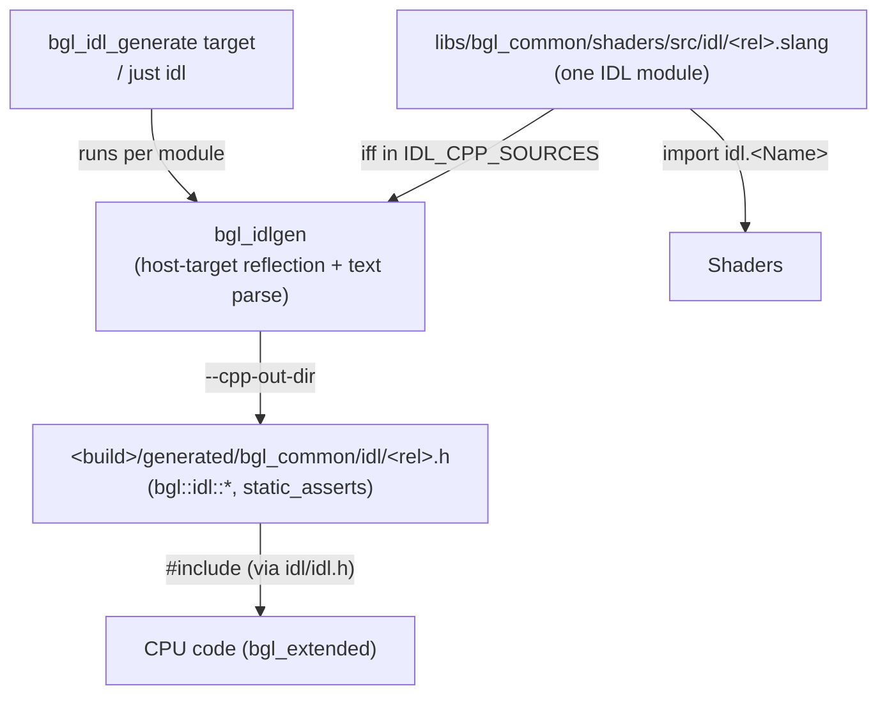

# IDL Codegen (`bgl_idlgen`) — one Slang source, CPU + GPU definitions in lockstep

`bgl_idlgen` is a build-time code generator that turns a `.slang` **IDL module** — a Slang module
the shaders `import` as it is written — into the C++ header the CPU `#include`s. Its job is to keep
the CPU-side struct/enum/constant definitions byte-for-byte identical to the GPU-side ones so a CPU
struct can be `memcpy`'d straight into a GPU buffer. It is
an executable tool, not a runtime library — there are no `I*` interfaces here.

**This document is a map, not a mirror.** It captures the design choices, the generation
topology, and the *non-obvious* contracts — not the tool's internals. The generator source
[libs/bgl_common/idl/idlgen.cpp](libs/bgl_common/idl/idlgen.cpp) and each IDL module under [libs/bgl_common/shaders/src/idl/](libs/bgl_common/shaders/src/idl/)
are the source of truth; when this doc disagrees, trust them, then fix this doc.

---

## Design Choices

* **A module's identity is its path relative to `--src-root`, and that one path drives
  everything.** The modules live in the shared shader tree, under
  [libs/bgl_common/shaders/src/idl/](libs/bgl_common/shaders/src/idl/), so the relative path (minus
  extension) is the Slang `import` name (`idl.<Name>`), the `.h` sub-path under the output root,
  and the C++ namespace (each sub-directory appends a `::` segment onto the base `bgl::idl`). The
  import path, the `#include` and the `.h` location cannot drift. **To move a module, rename it
  (change its relative path) so importers follow it — never relocate it to a path that disagrees
  with its import name.**

* **The module is the shader source; nothing is copied, and only C++ is generated.** The shaders
  import the module where it is written, staged with the rest of the shared tree. A module produces
  a C++ header under `<build>/generated/bgl_common/idl/` **only if it is listed in
  `IDL_CPP_SOURCES`** ([libs/bgl_common/idl/CMakelists.txt](libs/bgl_common/idl/CMakelists.txt));
  interface/generic-only modules carry no concrete layout and are skipped. The tool also self-skips
  the header when a module has no structs, enums, or constants. *Rejected: a banner-stamped copy of
  every module under the shader tree*, which this once did — a generated file that is also the
  file people read, with a second copy of the source in the tree.

* **Layout parity is proven, not assumed.** Struct layout comes from Slang's reflection of a
  **host** target (`SLANG_HOST_HOST_CALLABLE`), which lays types out with C/C++ scalar rules —
  the same layout a scalar `StructuredBuffer` uses on the GPU. The generated C++ struct is followed
  by `static_assert(sizeof(...))` and per-field `static_assert(offsetof(...))`, so the two sides
  can never silently diverge; a mismatch is a compile error.

* **Structs use reflection; enums and constants are parsed textually.** Slang's `DeclReflection`
  does not reliably surface enum *cases* or a constant's *initializer value*, so a small
  deterministic text parser handles those. Struct fields —
  where exact offsets/sizes matter — go through reflection.

  **An initializer therefore has to be valid C++ as well as Slang**, because it is copied across
  unchanged — only the *declared* type is mapped. So write `uint32_t(-1)`, never `uint(-1)`: `uint`
  is a Slang scalar with no C++ equivalent. This does not fail on a macOS or Linux build, where
  `<sys/types.h>` defines `uint` as a POSIX typedef and clang accepts the generated header; MSVC
  rejects it, and every other error in that build cascades from the one bad header.

* **Both sides describe one layout.** The C++ struct is reflected from the same `ScalarDataLayout`
  element the shaders read through `EntryBuffer<T>`, so `sizeof`/`offsetof` on the CPU and the
  buffer stride on the GPU agree by construction.

  A struct's size still depends on the final size of everything it embeds — shrink `RangeWithCount`
  and `Rig.clips` moves — so the CMake rules carry an edge per `import`, and a module's header is
  regenerated when a module it imports changes.

* **Type mapping is fixed.** Scalars map to `<cstdint>` (`uint`→`uint32_t`, …); vectors/matrices
  map to `glm` (`float3`→`glm::vec3`, `float4x4`→`glm::mat4`, glm being column-major); a struct/enum
  field keeps its *declared* type name (the host layout would otherwise lower an enum field to its
  underlying scalar and erase the name). An `import`ed type pulls in the corresponding generated
  `#include`. A `float3` field in a C++-mirrored struct is **refused** outright — MSL sizes it 16
  where C++ says 12, so no shared layout exists; carry a `float4`. A `float4` placed *after* scalars is refused unless the bytes ahead of
  it already sum to a multiple of 16, because MSL aligns it to 16 and the C++ rules do not, and no
  struct alignment can rescue an interior mismatch. `Meshlet`'s trailing `float4` is legal on exactly
  that count; declaring the widest members first is how not to have to check.

* **The C++ headers are generated into the build tree, and are not committed.** A struct's layout
  follows the backend it was generated for — MSL aligns a resource handle to 8 where the C/C++ scalar
  rules give it 4, and rounds a struct up to its alignment — so one committed copy would be right for
  one backend and silently wrong for the other. Each build directory carries its own, and switching
  backend needs no regeneration. Both `<build>/generated` and [libs/bgl_common/include/bgl_common/idl/](libs/bgl_common/include/bgl_common/idl/)
  are on the include path, because a generated header includes its imports as siblings and four of
  those (`Entry`, `Range`, `RangeWithCount`, `RawEntry`) are hand-written.

  **One public module is the exception and stays committed**, under
  [libs/bgl/include/bgl/](libs/bgl/include/bgl/): a consumer includes `<bgl/...>` without building
  bgl. That is safe only while `IDL_PUBLIC_CPP_SOURCES` holds no structs — today it is `MaterialType`
  alone, an enum with an explicit underlying type, which every backend lays out identically.

  A public *struct* a shader also reads therefore takes the `OverlayVertex` shape: the POD is
  hand-written in `bgl` ([IOverlay.h](libs/bgl/include/bgl/IOverlay.h)), the IDL module
  is internal and the shader imports it, and the renderer pins the two together with `sizeof` and
  a per-field `offsetof` assert against the generated `bgl::idl` mirror
  ([Overlay.cpp](libs/bgl_extended/src/overlay/Overlay.cpp)). The layout is still proven, just from the
  side that can see both.

  The list is also what keeps renderer-shaped data off the public surface, which is the other half
  of the rule: a GPU struct laid out per backend cannot go here, and neither can an enum that
  describes *this* renderer's pipelines. `PsoType` was in this list and is no longer — it names
  mesh-shader pipeline permutations, so it belongs in `bgl::idl` with the rest of bgl_extended's internals.

* **Generated headers are write-only build artifacts.** Each `.h` carries a
  `// THIS IS A FILE GENERATED FROM ... DO NOT EDIT MANUALLY` banner. Edit the IDL module and
  regenerate; never hand-edit a generated header.

---

## Authoring & Tooling Index

### IDL constructs (what you can write in a module)
| Construct | Example | Generates (C++) | Notes |
|---|---|---|---|
| `public struct` | [Meshlet.slang](libs/bgl_common/shaders/src/idl/Meshlet.slang) | `struct` + `sizeof`/`offsetof` asserts | Layout via host reflection. |
| `public enum` | [VertexLayout.slang](libs/bgl_common/shaders/src/idl/VertexLayout.slang) | `enum class : <underlying>` + `sizeof` assert | Values parsed textually; see contracts. |
| `public static const` | [Constants.slang](libs/bgl_common/shaders/src/idl/Constants.slang) | `constexpr <type> = <expr>` | RHS copied verbatim; `public` needed for shader import. |
| `import <Module>` | [MeshInstance.slang](libs/bgl_common/shaders/src/idl/MeshInstance.slang) | `#include "<Module>.h"` (a sibling) | Only emitted for referenced types. |
| a `float3`/`float4x4`/… field | [BoneSample.slang](libs/bgl_common/shaders/src/idl/BoneSample.slang) | `#include <core/glm.h>` | A header names what it uses; a renderer's PCH must not be what makes it compile. |
| `interface` / generic-only | [IMaterial.slang](libs/bgl_common/shaders/src/idl/IMaterial.slang), [RangeWithCount.slang](libs/bgl_common/shaders/src/idl/RangeWithCount.slang) | *(none)* | Shader-only; no concrete layout. |

### CLI options ([libs/bgl_common/idl/idlgen.cpp](libs/bgl_common/idl/idlgen.cpp))
| Option | Role |
|---|---|
| `<input.slang>` | The single IDL module to process (positional, required). |
| `--src-root <dir>` | Root the module's import path / namespace / output sub-path are relative to (required). |
| `--cpp-out-dir <dir>` | Output root for the generated C++ header (required). |
| `--namespace <ns>` | Base C++ namespace (default `bgl::idl`). |
| `-I,--include <dir>` | Extra search dir for `import`ed Slang modules (repeatable). |

### Files & build wiring
| Path | Role |
|---|---|
| [libs/bgl_common/idl/idlgen.cpp](libs/bgl_common/idl/idlgen.cpp) | The generator (target `bgl_idlgen`). |
| [libs/bgl_common/shaders/src/idl/](libs/bgl_common/shaders/src/idl/) | The IDL modules (`--src-root`), which the shaders `import idl.<Name>`. |
| [libs/bgl_common/idl/CMakelists.txt](libs/bgl_common/idl/CMakelists.txt) | The `bgl_idlgen` tool, the per-module `add_custom_command`s and the `bgl_idl_generate` target; `IDL_CPP_SOURCES` gates C++ output. |
| [scripts/gen_idl.py](scripts/gen_idl.py) | Standalone driver to regenerate on demand, via `just idl` (mirrors the CMake target; resolves the built tool via the CMake File API). |
| `<build>/generated/bgl_common/idl/` | Generated C++ headers (`bgl::idl::<Name>`). A build artifact, not committed — see below. |
| [libs/bgl_common/include/bgl_common/idl/](libs/bgl_common/include/bgl_common/idl/) | The **hand-written** headers only: `idl.h` (the aggregate), `Entry.h`, `Range.h`, `RangeWithCount.h`, `RawEntry.h` — the offset primitives, which are generic and so have no concrete layout to generate. |

**Generated headers are never clang-formatted.** `scripts/format.py` skips any file whose first line
carries the generator's `DO NOT EDIT MANUALLY` banner, so the one committed header is byte-for-byte
what `bgl_idlgen` emits. Formatting them instead makes the tree disagree with the generator, and since
`bgl_idl_generate` runs as part of an ordinary build, every build then reports the files as dirty.

---

## Topology


```mermaid
flowchart TD
    IDL["libs/bgl_common/shaders/src/idl/&lt;rel&gt;.slang<br/>(one IDL module)"]
    TOOL["bgl_idlgen<br/>(host-target reflection + text parse)"]
    CPP["&lt;build&gt;/generated/bgl_common/idl/&lt;rel&gt;.h<br/>(bgl::idl::*, static_asserts)"]
    SH["Shaders"]
    CX["CPU code (bgl_extended)"]

    IDL -- "iff in IDL_CPP_SOURCES" --> TOOL
    TOOL -- "--cpp-out-dir" --> CPP
    IDL -- "import idl.&lt;Name&gt;" --> SH
    CPP -- "#include (via idl/idl.h)" --> CX
    CMAKE["bgl_idl_generate target<br/>/ just idl"] -- "runs per module" --> TOOL
```

---

## Risky / Non-obvious Contracts

### Module placement & the C++ opt-in
* **`IDL_CPP_SOURCES` gates C++ generation.** @pre a module needs a `bgl::idl::*` C++ mirror ⇒ it
  must be listed in `IDL_CPP_SOURCES`. A module not listed generates nothing; any C++ header at
  that path is then hand-written and will *not* track edits to the IDL module. Add the module to
  the list when you add a struct/enum/constant meant for CPU use.
* **Path is the import name.** @pre importers reference a module by its `--src-root`-relative path.
  Relocating the file to a path that disagrees with its import name breaks every importer and the
  CPU/`.h` lockstep. Rename (re-path) instead.
* An IDL module imports its siblings by bare name (`import Range;`), which Slang resolves beside the
  importing file; the generated C++ includes the sibling header the same way.

### Constants
* **Must be `public static const <type|let> <name> = <expr>;`.** @pre `public` — otherwise the
  constant is not visible to shaders that `import` the module. The RHS `<expr>` is copied
  **verbatim** into the C++ `constexpr`, so it must be valid in *both* languages (integer/float
  literals and arithmetic on them are safe; Slang-only constructs are not). @post `let` → C++
  `auto`; a recognized scalar keyword (`uint`,`int`,`float`,`double`,`bool`) → its `<cstdint>`/C++
  spelling; any other type name passes through unchanged.

### Enums
* **Enumerator values are text-parsed, not reflected.** @post a value defaults to a running counter
  unless an explicit `= <int>` is given. The underlying size is taken from struct-field reflection:
  an enum used as a struct field gets its real size, but a **free-standing enum referenced by no
  field defaults to `uint32_t` (4 bytes)**.

### Struct fields
* **Host scalar layout only.** @pre fields must be scalars/vectors/matrices/fixed arrays or other
  IDL structs/enums. GPU-only types (textures, pointers, resource handles) have no host layout and
  are unsupported.
* **No 8-bit fields in shader-imported structs.** @pre a field whose struct is `import`ed by a
  shader cannot be `uint8_t`/`int8_t` (DXC has no 8-bit scalar). Use `uint16_t`. See
  [Geometry Layout](docs/geometry_layout.md).

### Whole-module
* **Empty modules emit no C++ header.** @post if a module has no structs, enums, or constants, the
  tool logs a note and writes nothing.

---

## Usage Sketch

Author a module `libs/bgl_common/shaders/src/idl/Foo.slang`:

```slang
import Range;                                   // pulls in idl/Range.h on the C++ side

public static const uint cFooCapacity = 256;    // -> constexpr uint32_t bgl::idl::cFooCapacity

public enum FooKind { kA, kB, kC }              // -> enum class FooKind : uint32_t

public struct Foo
{
    public Range<uint> items;
    public FooKind     kind;
    public uint16_t    count;                    // 8-bit would break shader import; use 16-bit
};
```

Register it for a C++ header (skip this for shader-only modules) in
[libs/bgl_common/idl/CMakelists.txt](libs/bgl_common/idl/CMakelists.txt):

```cmake
set(IDL_CPP_SOURCES
    ...
    Foo.slang
)
```

Regenerate (or just let the `bgl_idl_generate` target run during a build):

```bash
just idl libs/bgl_common/shaders/src/idl/Foo.slang    # or: just idl  (all modules)
```

Consume it — shader side imports the module, CPU side includes the mirror:

```cpp
// shader:  import idl.Foo;  then use Foo / FooKind / cFooCapacity
#include <bgl_common/idl/Foo.h>                   // or <bgl_common/idl/idl.h> for all modules
auto n = bgl::idl::cFooCapacity;                  // same value the shader sees
```

See [Constants.slang](libs/bgl_common/shaders/src/idl/Constants.slang) → `<build>/generated/bgl_common/idl/Constants.h` for a
constants-only module, and [Geometry Layout](docs/geometry_layout.md) for how these structs form
the GPU geometry model.

---

> **Maintenance:** the tables above are load-bearing and their file links rot silently if modules
> or scripts move. When the IDL file layout, `IDL_CPP_SOURCES`, or the output roots change,
> re-check every link and the topology diagram.
