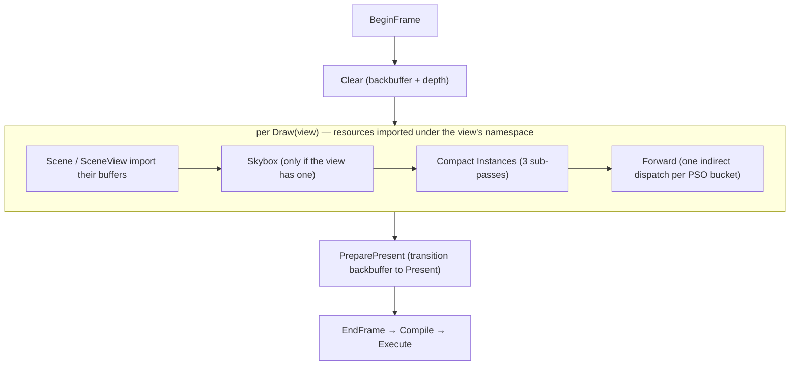

# Passes — the built-in Frame Graph pass catalog

A *pass* is a small type that knows how to add one (or a few) `PassDesc`s to a `FrameGraph`. It
owns whatever GPU objects it needs across frames (kernels, scratch buffers) and exposes an
`AttachToFrameGraph(fg, …)` that declares its resource accesses and sets an `exec` callback. The
graph then culls, orders, derives barriers, and records — see [Frame Graph](docs/framegraph.md) for
that machinery. This page is the catalog of the passes `bgl` ships.

**This document is a map, not a mirror.** It captures each pass's role, the resources it reads and
writes, and the non-obvious contracts — not full signatures. The header at each linked path is the
source of truth; when this doc disagrees, trust the header, then fix this doc.

---

## The frame

`Graphics` ([d3d12/Graphics_d3d12.cpp](libs/bgl/src/d3d12/Graphics_d3d12.cpp)) drives the frame and
owns the long-lived pass objects (`m_Forward`, `m_Skybox`, `m_CompactInstances`,
`m_PreparePresentPass`). A frame is built between `BeginFrame` and `EndFrame`, with one `Draw` per
view in between; the passes are added in this order and, because the graph never reorders, execute
in it:

`Clear`, `Skybox`, and `Forward` take the imported `backbuffer` texture as a render target;
`PreparePresent` only transitions it to present; `Compact Instances` is a pure compute pass that
touches no textures at all. `Compact Instances` and `Forward` read the scene/view buffers imported
by [Scene](libs/bgl/src/scene/Scene.cpp)/[SceneView](libs/bgl/src/scene/SceneView.cpp)'s own
`AttachToFrameGraph`. Multiple `Draw`s share one graph by prefixing their imports with the view's
resource namespace (see [Frame Graph](docs/framegraph.md)).

`DrawData` ([passes/DrawData.h](libs/bgl/src/passes/DrawData.h)) is the per-draw parameter bundle
handed to `Skybox`/`Compact Instances`/`Forward`: the view, viewport, view-projection, camera
position, back/depth handles and names, standard samplers, environment map, exposure, and the
optional skybox.

---

## Catalog

### Clear — [passes/ClearPass.h](libs/bgl/src/passes/ClearPass.h)

Clears a set of color render targets and an optional depth target. Each color target is declared as
a `TextureArg` in the render-target state so the graph transitions it; the pass's `exec` records
`ClearRtv`/`ClearDsv` and nothing else. Stateless — it holds no kernel and is constructed inline
each frame. It is the first pass of the frame, added in `BeginFrame`.

* **In:** each color target + the depth target, transitioned to render-target / depth-write.
* **Out:** the cleared attachments (via clears, not declared writes).

### Skybox — [passes/SkyboxPass.{h,cpp}](libs/bgl/src/passes/SkyboxPass.cpp)

Draws the environment cube behind the scene as a single full-screen triangle. Its `MeshletKernel`
is mesh + pixel only (no amplification shader), built from the `Skybox` module; `DispatchMesh(1, 1,
1)` emits the one covering triangle. Depth test is `LessOrEqual` with **depth-write off** and no
culling, so it fills only where nothing has been drawn.

* **No-op** when the view has no skybox (`DrawData::skybox` is empty) — `AttachToFrameGraph` adds
  nothing.
* **In:** the backbuffer as a render target; samples the skybox cube texture through the view's
  linear-clamp sampler. The `gSkyboxData` cbuffer carries `clipToWorld`, `cubeTex`, `sampler`,
  `exposure`, and `mipLevel`; the constant-buffer name is matched against Slang reflection, so it
  must track the declaration in `Skybox.slang`.
* Attached per draw, before `Compact Instances` and `Forward`.

### Compact Instances — [passes/CompactInstancesPass.{h,cpp}](libs/bgl/src/passes/CompactInstancesPass.cpp)

Buckets the view's `SubmeshInstance`s by PSO into contiguous ranges and builds the per-PSO indirect
dispatch arguments that `Forward` consumes. Owns three compute kernels (`HistogramInstances`,
`PrefixSumInstances`, `CompactInstances`) and two scene-independent `ComputeBuffer`s sized
`c_PsoCount`: `psoPrefixSumBuffer` and `compactDispatchArgs`, both imported globally (namespace-free).

It adds **three sub-passes**:

1. **Clear** — zeroes `psoPrefixSumBuffer` and seeds every `compactDispatchArgs` entry to
   `{ 0, 1, 1 }` (a group count of 0 with Y = Z = 1). Both buffers are declared copy-dest.
2. **Histogram and Prefix Sum** — the histogram dispatch counts instances per PSO into
   `psoPrefixSumBuffer`, then the scan rewrites that same buffer in place into exclusive prefix
   sums. Both dispatches run **in this one pass** sharing the buffer as a UAV, so the graph inserts
   no barrier between them; the pass issues the one intra-pass UAV barrier itself — the sanctioned
   exception to "pass code must not barrier" (see the barrier caveat in
   [Frame Graph](docs/framegraph.md)). Skipped when the view's instance count is 0.
3. **Compact Instances** — scatters each instance into `scene.compactedInstances` at its bucket's
   prefix-sum offset and finalizes each PSO's dispatch args. Skipped when the instance count is 0.

* **In:** `scene.instanceBuffer` (SRV).
* **Out:** `scene.compactedInstances`, `psoPrefixSumBuffer`, `compactDispatchArgs` (all UAV /
  indirect-args downstream).

### Forward — [passes/ForwardPass.{h,cpp}](libs/bgl/src/passes/ForwardPass.cpp)

The main geometry pass: a mesh-shader forward render, in two phases. It holds `c_PsoCount`
`MeshletKernel`s, one per `PsoType`, built from the `c_Psos` config table (pixel-shader module +
raster/depth/blend state), plus a second `m_PrepassKernels` array whose only built slots are the
self-occluding transparent PSOs. The amplification and mesh shaders are always the shared
`Forward_StaticMesh` module; the pixel shader varies per bucket (`Forward_Null`, `Forward_PBR`,
`Forward_PBR_Loose`, `Forward_PBR_AlphaTest`, `Forward_PBR_Loose_AlphaTest`, `Forward_PBR_Prepass`,
`Forward_PBR_Loose_Prepass`, `Forward_Assert`). **`c_Psos` order must match `PsoType`** — a
`static_assert` catches an empty row but not a misordering.

**Opaque and alpha-test** are PSO-bucketed: per bucket it populates the `forwardData` and
`materialData` cbuffers (scene buffers, view-proj, `psoIndex`, samplers, IBL maps, camera position,
exposure), binds the meshlet state (viewport + color/depth framebuffer), and calls
`DispatchMeshIndirect(pso)`, whose grid comes from the `compactDispatchArgs` entry that
`Compact Instances` produced.

**Transparent buckets are skipped there** — blending needs depth order, not PSO order — and drawn
afterwards by `DrawTransparentRuns`, inside the same pass. It walks `DrawData::transparentRuns`
(back-to-front spans of one PSO, sliced from the CPU-sorted `sortedTransparentInstances` list) and
issues a **direct** `DispatchMesh` per run, pointing the amp shader at the run's slice via
`instanceListBase`/`usePrefixSumBase`.

A run whose material sets `occlude` (the `kTransparentOcclude_*` buckets) is drawn **twice**: first a
depth-only pre-pass — a **0-RTV pipeline** bound to a depth-only framebuffer, alpha-discarding below
the material's cutoff and writing depth — then its colour draw with `depthFunc == Equal`, so only the
front layer blends. The pre-pass must share this pass's depth attachment and sit between the two
colour loops, which is why it is a sub-draw here rather than a pass of its own.

* **In:** the backbuffer as a render target; `compactDispatchArgs` as indirect args; the nine
  `c_ForwardDataBuffers` scene buffers, `sortedTransparentInstances`, and the two
  `c_MaterialBuffers` (PBR + loose). Missing a `forwardData` key is fatal (`gfatal`); a missing
  `materialData` key is skipped silently.
* **Out:** the backbuffer (rendered), depth.
* **Skipped** when the view's instance count is 0.

### PreparePresent — [passes/PreparePresentPass.h](libs/bgl/src/passes/PreparePresentPass.h)

A barrier-only pass with no `exec`: it declares the backbuffer with `BarrierLayout::kPresent` so the
graph transitions it out of render-target state and into present. Because it has no attachment and
writes no imported resource, it would be culled — it is pinned with `SetSideEffect()`. Added last,
in `EndFrame`, after all draws.

---

## Risky / Non-obvious Contracts

* **`Forward` depends on `Compact Instances` by resource, not by ordering code.** It reads
  `compactedInstances`, `psoPrefixSumBuffer`, and `compactDispatchArgs`; the graph's last-writer
  dependency is what puts the compaction before it. Adding `Forward` without the compaction in the
  same frame leaves its indirect args seeded to zero groups (nothing draws) — not an error.
* **The histogram reuses `psoPrefixSumBuffer` as its output.** The histogram and the scan are the
  same buffer read-modify-written back to back; the intra-pass UAV barrier between them is
  mandatory. Dropping it produces wrong prefix sums that surface only in scenes mixing PSO buckets —
  nondeterministic flicker. This is the bug precedent the [Frame Graph](docs/framegraph.md) barrier
  caveat is written from.
* **`c_Psos` (Forward) is coupled to `PsoType` by position.** The rows are ordered to match the
  enum and indexed by it; a reordering is not caught by the `static_assert`, which only rejects an
  empty pixel-shader row.
* **`Skybox` and `Forward` cbuffer keys are matched against Slang reflection by name.** A rename on
  one side of the CPU/GPU boundary silently unbinds the resource for the `materialData`/skybox
  optional keys (no assert), so keep the string and the shader declaration in step.
* **Passes are rebuilt every frame; the pass objects are not.** `AttachToFrameGraph` re-adds the
  `PassDesc` (and everything its `exec` lambda captured) each frame, but the kernels and scratch
  buffers on `ForwardPass`/`SkyboxPass`/`CompactInstancesPass` persist. Release them through their
  `Release(...)` with the queue's fence before destroying the device.
