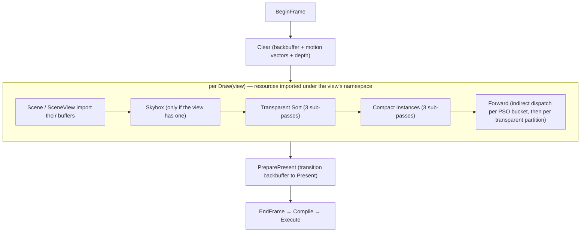

# Passes — the built-in Frame Graph pass catalog

A *pass* is a small type that knows how to add one (or a few) `PassDesc`s to a `FrameGraph`. It
owns whatever GPU objects it needs across frames (kernels, scratch buffers) and exposes an
`AttachToFrameGraph(fg, …)` that declares its resource accesses and sets an `exec` callback. The
graph then culls, orders, derives barriers, and records — see [Frame Graph](docs/framegraph.md) for
that machinery. This page is the catalog of the passes `bgl` ships.

**This document is a map, not a mirror.** It captures each pass's role, the resources it reads and
writes, and the non-obvious contracts — not full signatures. The header at each linked path is the
source of truth; when this doc disagrees, trust the header, then fix this doc.

---

## The frame

`RenderContext` ([gfx/RenderContext.cpp](libs/bgl/src/gfx/RenderContext.cpp)) drives the frame and
owns the long-lived pass objects (`m_Forward`, `m_Skybox`, `m_TransparentSort`,
`m_CompactInstances`, `m_PreparePresentPass`); `Graphics` owns one context and forwards the frame
methods to it. A frame is built between `BeginFrame` and `EndFrame`, with one `Draw` per
view in between; the passes are added in this order and, because the graph never reorders, execute
in it:

`Clear` and `Forward` take the imported `backbuffer` and `motionVectors` textures as render targets,
`Skybox` the backbuffer alone; `PreparePresent` only transitions the backbuffer to present;
`Compact Instances` and `Transparent Sort` are pure compute passes that touch no textures at all. All three read the scene/view buffers imported
by [Scene](libs/bgl/src/scene/Scene.cpp)/[SceneView](libs/bgl/src/scene/SceneView.cpp)'s own
`AttachToFrameGraph`. Multiple `Draw`s share one graph by prefixing their imports with the view's
resource namespace (see [Frame Graph](docs/framegraph.md)).

`DrawData` ([passes/DrawData.h](libs/bgl/src/passes/DrawData.h)) is the per-draw parameter bundle
handed to `Skybox`/`Transparent Sort`/`Compact Instances`/`Forward`: the view, viewport, view-projection
(this frame's and the previous frame's), camera position, back/depth/motion-vector handles and names,
standard samplers, environment map, exposure, and the optional skybox.

---

## Motion vectors

The forward pass writes a screen-space velocity buffer alongside colour, as MRT slot 1: for each
pixel, the UV displacement from where its surface sat last frame to where it sits now, so a consumer
samples history at `uv - motion`. It is `RG16_FLOAT`, owned by the render target beside the depth
buffer, and cleared to zero each frame — a pixel nothing drew reads as static.

Every instance transform is fixed for its lifetime (there is no `SetTransform`), so the camera is
the whole of the motion: the mesh shader reprojects one world position through `viewProj` and
`prevViewProj` and hands the pixel stage both clip positions. A movable — or skinned — instance
plugs in by substituting its own previous-frame position for the second of those, with no change to
the pixel stage. `SceneView::AdvanceCamera` is what holds the previous frame's matrices; drawing one
view twice in a frame reports the same history to both draws rather than letting the second treat
the first as history.

**The transparent phase writes no velocity** — a blended surface has no single depth to reproject —
so its PSOs declare one render target and `DrawTransparent` binds a framebuffer without the velocity
attachment. The skybox does not write it either, so the sky reads as static through a camera pan.

---

## Catalog

### Clear — [passes/ClearPass.h](libs/bgl/src/passes/ClearPass.h)

Clears a set of color render targets and an optional depth target. Each color target is declared as
a `TextureArg` in the render-target state so the graph transitions it; the pass's `exec` records
`ClearRtv`/`ClearDsv` and nothing else. Stateless — it holds no kernel and is constructed inline
each frame. It is the first pass of the frame, added in `BeginFrame`.

* **In:** each color target + the depth target, transitioned to render-target / depth-write.
* **Out:** the cleared attachments (via clears, not declared writes).

### Skybox — [passes/SkyboxPass.{h,cpp}](libs/bgl/src/passes/SkyboxPass.cpp)

Draws the environment cube behind the scene as a single full-screen triangle. Its `MeshletKernel`
is mesh + pixel only (no amplification shader), built from the `Skybox` module; `DispatchMesh(1, 1,
1)` emits the one covering triangle. Depth test is `LessOrEqual` with **depth-write off** and no
culling, so it fills only where nothing has been drawn.

* **No-op** when the view has no skybox (`DrawData::skybox` is empty) — `AttachToFrameGraph` adds
  nothing.
* **In:** the backbuffer as a render target; samples the skybox cube texture through the view's
  linear-clamp sampler. The `gSkyboxData` cbuffer carries `clipToWorld`, `cubeTex`, `sampler`,
  `exposure`, and `mipLevel`; the constant-buffer name is matched against Slang reflection, so it
  must track the declaration in `Skybox.slang`.
* Attached per draw, before `Compact Instances` and `Forward`.

### Compact Instances — [passes/CompactInstancesPass.{h,cpp}](libs/bgl/src/passes/CompactInstancesPass.cpp)

Frustum-culls the view's instances, then buckets the survivors by PSO into contiguous ranges and
builds the per-PSO indirect dispatch arguments that `Forward` consumes. Owns four compute kernels
(`CullInstances`, `HistogramInstances`, `PrefixSumInstances`, `CompactInstances`) and the
scene-independent `ComputeBuffer`s it imports globally (namespace-free): `psoPrefixSumBuffer` and
`compactDispatchArgs` (sized `c_PsoCount`), `cull.view` (one `CullView` — view-proj + frustum planes
— rewritten each draw), and `cull.stats` (profiling counters, written only in `BERNINI_GPU_DEBUG`
builds).

It adds **four sub-passes**:

1. **Clear** — zeroes `psoPrefixSumBuffer` and `cull.stats`, uploads this draw's `CullView` into
   `cull.view`, and seeds every `compactDispatchArgs` entry to `{ 0, 1, 1 }` (a group count of 0 with
   Y = Z = 1). The written buffers are declared copy-dest.
2. **Cull Instances** (`CullInstances`, one thread per instance) — builds the instance's world-space
   bounding sphere (`Mesh.transform` × the submesh's local sphere) and writes a per-instance
   **visibility word** to `scene.instanceVisibility`; the histogram, compaction, and transparent
   depth-key passes all gate on it, so a culled instance reaches no draw. Skipped when the instance
   count is 0.
3. **Histogram and Prefix Sum** — the histogram dispatch counts the **visible** instances per PSO into
   `psoPrefixSumBuffer`, then the scan rewrites that same buffer in place into exclusive prefix
   sums. Both dispatches run **in this one pass** sharing the buffer as a UAV, so the graph inserts
   no barrier between them; the pass issues the one intra-pass UAV barrier itself — the sanctioned
   exception to "pass code must not barrier" (see the barrier caveat in
   [Frame Graph](docs/framegraph.md)). Skipped when the view's instance count is 0.
4. **Compact Instances** — scatters each **visible** instance into `scene.compactedInstances` at its
   bucket's prefix-sum offset and finalizes each PSO's dispatch args. Skipped when the instance count
   is 0.

* **In:** `scene.instanceBuffer`, `scene.meshInstanceBuffer`, `scene.submeshBuffer`, `cull.view`
  (all read).
* **Out:** `scene.instanceVisibility`, `scene.compactedInstances`, `psoPrefixSumBuffer`,
  `compactDispatchArgs` (and `cull.stats` in debug) — all UAV / indirect-args downstream.

### Transparent Sort — [passes/TransparentSortPass.{h,cpp}](libs/bgl/src/passes/TransparentSortPass.cpp)

Depth-sorts the transparent instances on the GPU, in three sub-passes. Runs **after** `Compact
Instances` and depends on it: the depth-key pass reads the per-instance visibility word the cull
sub-pass writes, so a frustum-culled transparent instance takes no slot in the sorted list.

1. **Clear** — zeroes the entry counter and seeds both `partitionDispatchArgs` entries to
   `{0, 1, 1}`. Seeded rather than zeroed because a frame with no transparent instances still has the
   forward pass issue its indirect dispatches, and a zeroed `y`/`z` is an invalid grid.
2. **Depth Keys** (`TransparentDepthKeys`, one thread per instance) — compacts the transparent
   instances into `(key, instanceIndex)` pairs via an `InterlockedAdd` on the counter. The key is
   `~asuint(distanceSquared)` shifted right one bit, with the top bit clear for `occlude` materials
   and set for the rest — so one ascending sort emits **farthest-first within each occlude class**,
   and leaves the list already split into `[self-occluding][plain]`. Squared distance is
   non-negative, so its bit pattern already orders like the float; the inversion is what makes
   ascending mean farthest-first.
3. **Sort** (`TransparentSort`, one workgroup) — a bitonic sort in groupshared memory, padded to
   `cTransparentSortCapacity` with `0xFFFFFFFF` keys so the padding sorts to the tail. Writes the
   sorted instance indices to `sortedTransparentInstances`, counts the low-half keys, and emits
   `partitionBase` (`{0, occludeCount}`) and `partitionDispatchArgs` (a grid per partition).

**One workgroup caps the list at `cTransparentSortCapacity` (1024) instances.** That is what buys a
single dispatch with no ping-pong buffers and no cross-group scan; a multi-group radix sort is the
scale-up past it, and the buffer contract does not change when it lands.

Past the cap the sort silently orders an arbitrary 1024 of the transparent instances rather than the
nearest ones — a visible artifact, not a memory error. The keys buffer is sized off the view's
instance buffer, not off the capacity, so the depth-key pass cannot append past its end no matter how
many instances turn out to be transparent; only the sort itself is bounded.

* **In:** `scene.instanceBuffer`, `scene.meshInstanceBuffer`, `scene.instanceVisibility`, the camera
  position.
* **Out:** `scene.transparentSortEntries`/`Count` (its own scratch, owned by the view),
  `scene.sortedTransparentInstances`, `transparentSort.partitionBase`,
  `transparentSort.partitionDispatchArgs` (all consumed by `Forward`).
* **Skipped** when the view's instance count is 0 — the seeded args make that draw a no-op.

### Forward — [passes/ForwardPass.{h,cpp}](libs/bgl/src/passes/ForwardPass.cpp)

The main geometry pass: a mesh-shader forward render, in two phases. It holds `c_PsoCount`
`MeshletKernel`s, one per `PsoType`, built from the `c_Psos` config table (pixel-shader module +
raster/depth/blend state), plus a second `m_PrepassKernels` array whose only built slots are the
self-occluding transparent PSOs. The amplification and mesh shaders are always the shared
`Forward_StaticMesh` module; the pixel shader varies per bucket (`Forward_Null`, `Forward_PBR`,
`Forward_PBR_Loose`, `Forward_PBR_AlphaTest`, `Forward_PBR_Loose_AlphaTest`, `Forward_Transparent`,
`Forward_Transparent_Prepass`, `Forward_Assert`). **`c_Psos` order must match `PsoType`** — a
`static_assert` catches an empty row but not a misordering.

**Opaque and alpha-test** are PSO-bucketed: per bucket it populates the `forwardData` and
`materialData` cbuffers (scene buffers, this frame's and the previous frame's view-proj, `psoIndex`,
samplers, IBL maps, camera position, exposure), binds the meshlet state (viewport +
colour/velocity/depth framebuffer), and calls
`DispatchMeshIndirect(pso)`, whose grid comes from the `compactDispatchArgs` entry that
`Compact Instances` produced.

**Transparent buckets are skipped there** — blending needs depth order, not PSO order — and drawn
afterwards by `DrawTransparent`, inside the same pass, off the depth-sorted
`sortedTransparentInstances` list that [Transparent Sort](#transparent-sort) built. Because that list
is partitioned `[self-occluding][plain]` and both occlude PSOs share one pipeline, the whole
transparent phase is **three fixed `DispatchMeshIndirect` calls** — occluder pre-pass, occluder
colour, plain colour — whose grids and base offsets are GPU values the CPU never sees.

The self-occluding partition (`occlude` materials, the `kTransparentOcclude_*` buckets) is drawn
**twice**: first a depth-only pre-pass — a **0-RTV pipeline** bound to a depth-only framebuffer,
alpha-discarding below the material's cutoff and writing depth — then its colour draw with
`depthFunc == Equal`, so only the front layer blends. The pre-pass must share this pass's depth
attachment and sit between the colour draws, which is why it is a sub-draw here rather than a pass of
its own.

Both partitions read their base from `transparentSort.partitionBase`, indexed by `partitionIndex`;
the opaque path reads `psoPrefixSum` indexed by `psoIndex`. `baseSource` picks between the two.

* **In:** the backbuffer and the velocity buffer as render targets; `compactDispatchArgs` and
  `transparentSort.partitionDispatchArgs` as indirect args; the ten `c_ForwardDataBuffers` scene
  buffers, `sortedTransparentInstances`, and the two `c_MaterialBuffers` (PBR + loose). Missing a `forwardData` key is fatal (`gfatal`); a missing
  `materialData` key is skipped silently.
* **Out:** the backbuffer (rendered), the velocity buffer (opaque and alpha-test only), depth.
* **Skipped** when the view's instance count is 0.

### PreparePresent — [passes/PreparePresentPass.h](libs/bgl/src/passes/PreparePresentPass.h)

A barrier-only pass with no `exec`: it declares the backbuffer with `BarrierLayout::kPresent` so the
graph transitions it out of render-target state and into present. Because it has no attachment and
writes no imported resource, it would be culled — it is pinned with `SetSideEffect()`. Added last,
in `EndFrame`, after all draws.

---

## Risky / Non-obvious Contracts

* **`Forward` depends on `Compact Instances` by resource, not by ordering code.** It reads
  `compactedInstances`, `psoPrefixSumBuffer`, and `compactDispatchArgs`; the graph's last-writer
  dependency is what puts the compaction before it. Adding `Forward` without the compaction in the
  same frame leaves its indirect args seeded to zero groups (nothing draws) — not an error.
* **The histogram reuses `psoPrefixSumBuffer` as its output.** The histogram and the scan are the
  same buffer read-modify-written back to back; the intra-pass UAV barrier between them is
  mandatory. Dropping it produces wrong prefix sums that surface only in scenes mixing PSO buckets —
  nondeterministic flicker. This is the bug precedent the [Frame Graph](docs/framegraph.md) barrier
  caveat is written from.
* **A bound framebuffer's colour-attachment count must match the PSO's `rtvFormats` count.** The
  forward pass now runs three shapes against one depth buffer — opaque (colour + velocity),
  transparent (colour), and the transparent pre-pass (neither) — and each builds its own
  `MeshletState`. Handing the opaque framebuffer to a blend PSO binds a render target it does not
  declare; the reverse leaves a declared target unbound. `PsoConfig::blend` is what decides whether
  `BuildForwardKernel` adds the velocity format, so the two sides move together.
* **`c_Psos` (Forward) is coupled to `PsoType` by position.** The rows are ordered to match the
  enum and indexed by it; a reordering is not caught by the `static_assert`, which only rejects an
  empty pixel-shader row.
* **`Skybox` and `Forward` cbuffer keys are matched against Slang reflection by name.** A rename on
  one side of the CPU/GPU boundary silently unbinds the resource for the `materialData`/skybox
  optional keys (no assert), so keep the string and the shader declaration in step.
* **Passes are rebuilt every frame; the pass objects are not.** `AttachToFrameGraph` re-adds the
  `PassDesc` (and everything its `exec` lambda captured) each frame, but the kernels and scratch
  buffers on `ForwardPass`/`SkyboxPass`/`CompactInstancesPass` persist. Release them through their
  `Release(...)` with the queue's fence before destroying the device.
