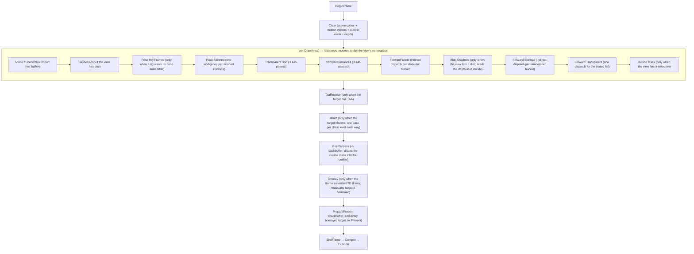

# Passes — the built-in Frame Graph pass catalog

A *pass* is a small type that knows how to add one (or a few) `PassDesc`s to a `FrameGraph`. It
owns whatever GPU objects it needs across frames (kernels, scratch buffers) and exposes an
`AttachToFrameGraph(fg, …)` that declares its resource accesses and sets an `exec` callback. The
graph then culls, orders, derives barriers, and records — see [Frame Graph](docs/framegraph.md) for
that machinery. This page is the catalog of the passes `bgl_extended` ships.

A pass's `Init` does not build its kernels: it requests them from the
[PipelineBatch](libs/bgl_extended/src/pipeline/PipelineBatch.h) in the
[PassInitContext](libs/bgl_extended/src/passes/PassInitContext.h) it is handed -- one argument for
every pass, holding the device, the batch, the resource manager and the draw-bucket table -- naming
the member each
lands in, and `RenderContext` builds each batch's requests at once across threads (see
[RHI](docs/rhi.md) § Design Choices) — the always-on set at construction, and the per-draw-bucket meshlet
kernels in the first `Draw` whose view demands each draw bucket. Anything in a pass that reads a built
kernel — the `BindingNameCheck` of the cbuffer names it binds — lives in `CheckBindings`, which
`RenderContext` calls after every batch.

**This document is a map, not a mirror.** It captures each pass's role, the resources it reads and
writes, and the non-obvious contracts — not full signatures. The header at each linked path is the
source of truth; when this doc disagrees, trust the header, then fix this doc.

---

## The frame

`RenderContext` ([gfx/RenderContext.cpp](libs/bgl_extended/src/gfx/RenderContext.cpp)) drives the frame and
owns the long-lived pass objects (`m_BrdfLut`, `m_Forward`, `m_BlobShadows`, `m_Skybox`, `m_TransparentSort`,
`m_CompactInstances`, `m_RigFrames`, `m_SkinnedPose`, `m_OutlineMask`, `m_TaaResolve`,
`m_BloomPass`, `m_PostProcess`, `m_OverlayPass`, `m_PreparePresentPass`); `Graphics` owns one context and
forwards the frame methods to it. A frame is built between `BeginFrame` and `EndFrame`, with one `Draw` per
view in between; the passes are added in this order and, because the graph never reorders, execute
in it:

```mermaid
flowchart TD
    BF["BeginFrame"] --> CLR["Clear (scene colour + motion vectors + outline mask + depth)"]
    CLR --> D["per Draw(view)"]
    subgraph D["per Draw(view) — resources imported under the view's namespace"]
        IMP["Scene / SceneView import their buffers"] --> SKY["Skybox (only if the view has one)"]
        SKY --> RIG["Pose Rig Frames (only when a rig wants its bone anim table)"]
        RIG --> POSE["Pose Skinned (one workgroup per skinned instance)"]
        POSE --> TS["Transparent Sort (3 sub-passes)"]
        TS --> CI["Compact Instances (3 sub-passes)"]
        CI --> FWW["Forward World (indirect dispatch per static-tier bucket)"]
        FWW --> BLOB["Blob Shadows (only when the view has a disc; reads the depth as it stands)"]
        BLOB --> FWS["Forward Skinned (indirect dispatch per skinned-tier bucket)"]
        FWS --> FWT["Forward Transparent (one dispatch for the sorted list)"]
        FWT --> SM["Outline Mask (only when the view has a selection)"]
    end
    D --> TAA["TaaResolve (only when the target has TAA)"]
    TAA --> BLM["Bloom (only when the target blooms; one pass per chain level each way)"]
    BLM --> PPX["PostProcess (-> backbuffer; dilates the outline mask into the outline)"]
    PPX --> OVL["Overlay (only when the frame submitted 2D draws; reads any target it borrowed)"]
    OVL --> PP["PreparePresent (backbuffer, and every borrowed target, to Present)"]
    PP --> EF["EndFrame → Compile → Execute"]
```

`Clear`, `Skybox`, and `Forward` take the imported `sceneColor` and `motionVectors` textures as
render targets and the imported `depth` texture as their depth attachment — **every pass that binds
the DSV declares `depth` in its `PassDesc`** (`kDepthStencil` / `kDepthWrite`), which is what lets a
later pass read it as a shader resource and have the graph derive the write → read → write cycle;
`TaaResolve` reads `sceneColor`, the velocity buffer, `depth` and the previous accumulation and
writes the next one; `Bloom`, on a target that blooms, reads whichever of the two the last HDR
stage produced and renders its ladder (`bloomDown0..`, `bloomUp0..`); `PostProcess` reads the same
source — plus the finished `bloomUp0` when bloom ran — and writes the backbuffer whole; `Overlay`, on a frame that submitted 2D draws, blends over it, reading the
last-presented backbuffer of any other headless target a draw sampled; `PreparePresent` only
transitions the backbuffer — and each of those borrowed backbuffers — to present; `Compact Instances`
and `Transparent Sort` are pure compute passes that touch no textures at all. All three read the scene/view buffers imported
by [Scene](libs/bgl_extended/src/scene/Scene.cpp)/[SceneView](libs/bgl_extended/src/scene/SceneView.cpp)'s own
`AttachToFrameGraph`. Multiple `Draw`s share one graph by prefixing their imports with the view's
resource namespace, `v{n}:`; a view's **cull outputs** sit one scope further in, at `v{n}:c{k}:`,
one `k` per frustum it is culled against. `Compact Instances`, `Transparent Sort` and `Forward` are
recorded under the frustum's scope and reach the view's own buffers by the outward walk (see
[Frame Graph](docs/framegraph.md)). Today `k` is only ever 0, the camera.

`DrawData` ([passes/DrawData.h](libs/bgl_extended/src/passes/DrawData.h)) is the per-draw parameter bundle
handed to `Skybox`/`Transparent Sort`/`Compact Instances`/`Forward`. Beside the view and its cull
state it carries four groups: `viewState` (viewport, this frame's and the previous frame's
view-projection, jitter, camera position, the derived frustum), `targets` (scene-colour,
motion-vector and depth handles, and the depth's shader-resource view), `lighting` (environment map, exposure, the sun, optional
skybox) and `samplers`. The graph
resource *names* are not in it — they are fixed, so `c_BackbufferName` / `c_MotionVectorsName` /
`c_SceneColorName` / `c_DepthName` in
[constants/constants.h](libs/bgl_extended/src/constants/constants.h) are
what both the importer and the passes name them by.

---

## Scene colour, and where the display curve is applied

Every geometry pass renders into `sceneColor`, an `RGBA16_FLOAT` texture the render target owns, and
`PostProcess` is what turns that into the backbuffer. The buffer holds **linear HDR with exposure already
applied**: exposure is a per-view scale and a target may carry several views, so the geometry passes
fold it in, while the display curve — `AgX` in
[lib/math/Tonemap.slang](libs/bgl_common/shaders/src/lib/math/Tonemap.slang) — belongs to the output and runs once.
`AgX` leaves its result linear, so the sRGB backbuffer view is still what encodes it.

**The curve is Blender 5.2's AgX, and the LUT is Blender's own file.** Blender's `AgX Base sRGB`
view is a 57³ formation LUT applied in FilmLight E-Gamut log2 space, then a Rec.1886 decode, and
that is what `AgX` does: the Rec.709-to-E-Gamut matrix and the 25-stop log encoding are the OCIO
config's view transform written out, the LUT is `AgX_Base_sRGB.cube` from the Blender install
converted by `scripts/gen_agx_lut.py` into
[shaders/src/luts/agx_base_srgb.bin](libs/bgl_extended/shaders/src/luts/agx_base_srgb.bin), and
`TonemapLut` ([postprocess/TonemapLut.h](libs/bgl_extended/src/postprocess/TonemapLut.h)) uploads it once at device
init. The file is a 2D strip of 57 slices rather than a 3D texture because neither backend's
`WriteTexture` fills one yet; `StripLutTaps3D` in the same module is the trilinear read over that
layout, shared so a second renderer's `ITonemapLut` does not re-derive it. The datafile reaches the
tree under Blender's GPL-2-or-later. `AgxCalibration_test` pins the result to a twelve-point sweep
measured off Blender itself, middle grey at display 0.461 — where sRGB puts it, not 0.5 — and
`BlenderParity_test` checks a lit sphere against Blender's Cycles pixels. Regenerate the strip when
the reference Blender changes, and re-measure the sweep with `scripts/blender_probe.py`.

Two consequences worth knowing. Transparent surfaces blend in linear HDR rather than in display
space. And a pixel shader that writes a literal colour — `programs.forward.Null`, `programs.forward.Assert` — is
writing radiance, not a display value, so its `1.0` reaches the screen as the curve's answer for
unit radiance and not as white.

`sceneColor` alpha marks reliable opaque coverage for TAA: opaque and surviving cutout fragments
write one; built-in and game-defined hashed fragments write zero. The shared blend PSO keeps its
premultiplied RGB blend but clears destination alpha with zero alpha blend factors. TAA stores
unavailable history depth for uncertain pixels rather than mistaking stochastic coverage or a
composited surface for an opaque disocclusion. `PostProcess` reads RGB and writes the backbuffer
opaque; the marker never becomes display transparency.

---

## Two-sided surfaces

Every draw bucket that draws a material — opaque, cutout, blend and hashed — is `RasterCullMode::kNone`,
so the pipeline draws both sides of a surface. **Whether a given material's back faces reach the
rasterizer is the material's choice** — `PbrMaterialDesc::doubleSided`, glTF's `doubleSided`, on by
default — and the mesh stage is what honours it: `PrepareMeshlet` reads the flag once per group off
the material record
(`MaterialData::IsMaterialDoubleSided`, by kind), each vertex leaves its clip position in
threadgroup memory beside its output, and `CullBackface` replaces a back-facing triangle of a
single-sided material with a degenerate one — on a draw whose `expansionData.cullBackfaces` says
the pipeline draws both sides, which Forward sets per draw bucket from `DrawBucketCullMode` and the
[Outline Mask](#outline-mask) sets to zero, since the mask is the whole silhouette whichever way
its triangles face. A draw that culls in hardware, and every double-sided material, skips the
record, the barrier and the material read. The rasterizer sets a degenerate triangle up and drops
it without walking a tile, which is the point: a long thin card triangle costs the rasterizer by its
length on screen whether or not a pixel shader ever runs ([Asset Standards § Long thin
triangles](docs/asset_standards.md)), so culling in the mesh stage is the same saving hardware
culling would be. The facing is judged in homogeneous clip space, so a triangle crossing the near
plane is judged as the hardware judges it, and the `[twosided]` cases pin the sign against both
windings. It is the mesh stage and not a second PSO because the transparent phase draws every
material through one pipeline and one sorted dispatch, where no PSO state can vary per material.

Only the materialless Null and Assert draw buckets cull in hardware, since there is no flag to read. An
opaque material is otherwise no exception, so a closed opaque mesh left at the flag's default
rasterizes its hidden inside as well: set `doubleSided = false` where nothing inside is ever seen.

On a back face the interpolated normal still points away from the camera, which sends
the view angle, the irradiance lookup and the reflection vector into the wrong hemisphere — the same
material then shades differently depending on which side happens to be visible.

The seven shading pixel shaders therefore take `bool isFrontFace : SV_IsFrontFace` and hand it to
`CalculateNormal`, which negates the geometric normal before building the tangent frame. **Before,
not after**: the bitangent is `cross(N, T) * tangent.w`, so flipping N carries the frame with it,
where negating the finished shading normal would leave a mirrored bitangent and lean the normal map's
detail the wrong way on every back face.

`programs.forward.Null` and `programs.forward.Assert` take `ForwardVSOut` but never read its normal, so they do not
take the flag.

A **closed** two-sided mesh in the blend draw bucket therefore composites twice: the sort orders instances,
not the triangles inside one, so the far hemisphere blends under the near one in raster order and
brings its own lighting with it. Flipped normals put its terminator somewhere the near hemisphere's
is not, and on a coarse mesh that terminator steps along the triangle rows — a band of horizontal
streaks over an otherwise smooth surface. It is the geometry showing through, not a defect in the
sort: the fix is `doubleSided = false` where a translucent solid has no inside worth drawing, or
`kHashed`, which writes real depth and self-occludes.

---

## Meshlet culling

Below the instance, the static tier culls meshlets, and the unit it culls in is a **group** of
`cMeshletsPerGroup` (8) consecutive ones. `CullInstances` keeps an instance whose sphere meets the
frustum; `programs.forward.StaticMesh`'s amplification stage then tests each of that instance's
meshlet groups against the **same** `cull.view` planes -- built from the jittered view-projection
the raster draws with -- using the group's cooked sphere placed by the same
`MeshInstance::TransformSphere`. A sphere test only rejects geometry wholly outside a plane, and a
group's sphere encloses every vertex under it, so a meshlet with any pixel in view survives, jitter
included, and so does every receiver a blob-shadow decal reads out of the world's depth, which is the
same draw. Forward World's buckets dispatch through it; the skinned tier
and `AnyMesh` (the transparent list, the outline mask) cull nothing below the instance, since a posed
meshlet leaves its bind-pose sphere.

The survivors are **compacted** in the amplification group (`CullMeshlets` in
[lib/forward/mesh_stage.slang](libs/bgl_extended/shaders/src/lib/forward/mesh_stage.slang)): one
lane per group marks a bit, one lane writes a running count per mask word, and the group dispatches
`cMeshletsPerGroup` mesh groups per survivor, each finding its group by a binary search over the
counts and its meshlet within that group by the remainder. They are dispatched in meshlet order, the
order an unculled draw has, and the last group of a submesh whose meshlet count does not divide
stands for meshlets that do not exist -- those mesh groups emit nothing.

**The mesh stage then tests the meshlet it draws**, against the same planes and its own cooked
sphere, and emits nothing when it fails: a kept group is launched whole, so the meshlets of it that
are off screen are rejected here. The vertex work and the raster setup are saved; the mesh-group
launch is not. That is the trade the group makes -- the amplification stage reads an eighth as many
spheres, and pays for it in launches that draw nothing.

**The payload is kept small on purpose.** It is copied out whole for every instance drawn -- on Metal,
Slang lowers `DispatchMesh` to a copy from groupshared memory by every lane -- so its size is paid by
every static instance, visible or not: a 16 KiB list of indices made animal-run six times slower, an
8 KiB one cost 3 ms a pass, 2 KiB nothing. At a bit and a half per *group* it covers
`cMaxCompactedGroups` (8192) of them, which is 65536 meshlets -- more than the 65535 thread groups
one `DispatchMesh` can launch. So every submesh a scene will hold compacts, and there is no
dispatch-everything path: `Scene` refuses a submesh past the largest multiple of the group size a
dispatch can reach.

In `BERNINI_GPU_DEBUG` builds the amplification stage adds to `cull.stats`' `meshletGroupsTested` and
`meshletGroupsCulled`; the mesh stage's own test counts nothing.

The group bounds come from the cook (`buildMeshlets` in
[assetlib/src/bmesh_gltf.cpp](libs/assetlib/src/bmesh_gltf.cpp)), fitted to the vertices themselves
and stored in the `.bmesh` beside the meshlets. Geometry that never passed through a cook -- a
procedural primitive, a `BMesh` built in memory -- has `Scene` fold a bound out of the meshlet
spheres instead, which encloses the same geometry a little less tightly.

## Blended surfaces

`LayerType::kBlend` resolves to a transparent draw bucket — one per (tier, material kind) pair that
can carry it, flagged transparent by the table — and every one of them draws through the one shared
blend kernel, whose PSO blends
**premultiplied** — `SrcBlend = One`, `DestBlend = InvSrcAlpha`. `programs.forward.Transparent` therefore
returns radiance already weighted by its own coverage, rather than radiance the blend then scales,
and the alpha it returns is coverage rather than the material's own.

That is what lets base-colour alpha mean two different things, which one number under a `SrcAlpha`
blend cannot. `PbrMaterial::transmissionFactor` says which:

* **At 0 the alpha is coverage** — how much surface is in the pixel — so it thins the diffuse and
  specular lobes alike. Hair, foliage, a dissolve. The arithmetic collapses to `alpha * (diffuse +
  specular)` against `1 - alpha`, which is exactly what a `SrcAlpha` blend of the unweighted colour
  produces; this end of the range is the behaviour that predates the factor, and it is the default.
* **At 1 the alpha is transmission** — the surface covers the pixel and the alpha says how much light
  passes through it. The diffuse lobe is what is transmitted, so alpha still governs that, while the
  reflection is light coming back off the surface and does not thin with it. Coverage rises with the
  Fresnel reflectance instead, because a reflection replaces the backdrop it sits on: at a grazing
  angle, where Fresnel returns nearly everything, the surface has to hide what is behind it or the
  environment would be added to a backdrop still showing through in full.

**Each lobe carries two lights.** `EvaluateSurface` sums the environment's split-sum answer and the
sun's analytic one into the same `diffuse` and `specular`, so nothing downstream knows there are two:
the diffuse takes a Lambert term and the specular a Cook-Torrance GGX one, both against the `F0` and
the dielectric weight the environment's half already computed. `reflectance` stays the environment's
own ratio — a blended surface raises its coverage by it, and a sun's radiance is not a fraction of
anything. The sun is scaled by neither the material's ambient occlusion nor a shadow, because there
is no shadow pass; what it is scaled by, and in which units, is
[bgl_api.md](bgl_api.md)'s `SetDirectionalLight`.

**Ambient occlusion has two sources, multiplied.** `PbrSurface::orm.r` is the material's own AO,
read through UV0, times its geometry occlusion map — geometry AO baked on a unique second UV set, which a
tiled UV0 cannot hold ([Asset Standards](asset_standards.md)). The PBR records multiply it in
`SurfaceOf`; a game surface takes it through a slot of its own, sampling `IMaterialReader::Uv1`
([Game-Defined Surfaces](game_defined_surfaces.md)), and the engine adds nothing after it returns.
It is sampled on every PBR draw, an absent map reading the white default as every other slot does — about
1.5% of Forward in `[.forwardcost]`, the price of not splitting every pipeline on it. A mesh with no
second UV set decodes `cNoUv1`, which `SampleGeometryOcclusion` reads as unoccluded, so a material shared
with such a mesh draws it as though the map were white. The skinned tier writes `uv1` through the
same decode, so a skinned mesh carrying the set would draw the map, but no test pins that: static
environment art is what it is for, and a bake is only right in the pose it was baked in. The interpolant is `SECONDUV` and never
`TEXCOORD1`: on Metal, Slang names a numbered semantic differently as a mesh output than as a
fragment input, and the pipeline is refused.

The two lobes are kept apart for this: `PbrShading::EvaluateSurface` reads a `PbrSurface` — the
material's half, from the contract tree ([bgl/PbrSurface.slang](libs/bgl/shaders/src/bgl/PbrSurface.slang)) —
and returns a `SurfaceLobes` (diffuse, specular, the reflectance the specular lobe returns, and the
emissive) instead of a summed colour, and the callers weight it. `MaterialData::ShadeSurface` sums
them into RGB radiance; opaque, cutout and hashed callers attach the TAA depth-validity alpha.
`MaterialData::ShadeSurfaceBlended` is the only caller of `BlendedSurface`, the one function that weights them apart, which lives beside `SurfaceLobes` in
[lib/math/PbrShading.slang](libs/bgl_common/shaders/src/lib/math/PbrShading.slang). Those two are the
only BRDF entries; the four shading entry points the programs call (`Shade`, `ShadeBlended`,
`ShadeAlphaTested`, `ShadeHashedAlpha`) each fill a `PbrSurface` from the engine's record and hand it to
one of them. All of it is in
[lib/forward/MaterialShading.slang](libs/bgl_extended/shaders/src/lib/forward/MaterialShading.slang), which
extends the material constant buffer.

Emissive follows the specular lobe, not the diffuse: it is light leaving the surface itself rather
than light that came through from behind, so transmission exempts it from thinning the same way, and
it raises the coverage not at all — emission adds to the backdrop, it does not hide it.

**Only the blend draw bucket is premultiplied.** The opaque, cutout and hashed draw buckets write with no blend
at all, so their pixel shaders return the plain radiance sum. Their alpha is the TAA depth-validity
marker described above; scaling a surviving cutout fragment's radiance by texture alpha would be wrong.

## Hashed alpha

`LayerType::kHashed` ([bgl/LayerType.h](libs/bgl/include/bgl/LayerType.h)) is stochastic coverage:
alpha becomes a per-pixel hashed threshold rather than a cutoff, so every layer of a self-occluding
surface writes depth and participates, and the correct blend is what the ensemble averages to.

It resolves to a hashed draw bucket per (tier, material kind), which is **opaque-shaped** — depth
write, no blend, velocity written like any other geometry — and drawn in the draw-bucketed phase
rather than the depth-sorted one. The pixel shader tests base-colour alpha against a per-pixel hashed
threshold ([lib/math/HashedAlpha.slang](libs/bgl_common/shaders/src/lib/math/HashedAlpha.slang)) instead of the
material's cutoff, so a fragment survives with probability equal to its alpha and every layer of a
self-occluding surface writes real depth.

The material's `alphaCutoff` is deliberately unused there: a cutoff is the thing being replaced.

`MaterialData::alphaHashSeed` advances once per frame so the pattern decorrelates, and is zero on a
target without temporal AA — a pattern that moved with nothing accumulating it is flicker rather than
coverage. **A single frame of this is noise by design**; it is only correct once
[TAA](docs/taa.md) has integrated it.

---

## Motion vectors

The forward pass writes a screen-space velocity buffer alongside colour, as MRT slot 1: for each
pixel, the UV displacement from where its surface sat last frame to where it sits now, so a consumer
samples history at `uv - motion`. Beside it, in BA, is the part of that displacement the surface
made on its own: the velocity less the one the camera alone gives this frame's world position, from
a third clip position (`cameraPrevClip`, the current world position under `prevViewProj`). The two
clip positions are projected by identical math, so anything nobody moved reports an own motion of
exactly zero under any camera, and the sky writes zero outright. The format is `RGBA16_FLOAT`
(`c_MotionVectorFormat`, in `constants/constants.h`). The texture is owned by the render target
beside the depth buffer and cleared to zero each frame, so a pixel nothing drew reads as static.

A placement carries the transform the previous frame drew it with as well as its current one
(`ISceneView::SetInstanceTransform` writes the second and rolls the first), so the mesh shader
places the vertex twice — once through each — and reprojects the two through `viewProj` and
`prevViewProj`, handing the pixel stage both clip positions. The two transforms are the same matrix
on anything nobody moved, so a static surface's motion is still the camera's alone. An animated instance
plugs into that seam by substituting its own previous-frame position for the second of those, with no
change to the pixel stage — a per-instance pose blends by the second half of its palette slice, which
`Pose Skinned` filled at `prevTime` for exactly this, and a crowd instance reads its rig's table at
`prevTime` the same way it reads it at `time`. `SceneView::AdvanceCamera` is what holds the previous frame's matrices; drawing one
view twice in a frame reports the same history to both draws rather than letting the second treat
the first as history.

When the target has `RenderTargetDesc::taaEnabled` set, every projection is offset by a sub-pixel
`HaltonJitter` ([bgl_common/jitter.h](libs/bgl_common/include/bgl_common/jitter.h)) that `RenderContext::Draw`
left-multiplies onto it, so the sample grid walks a *render* pixel's footprint. Across eight frames
where the render and output grids coincide; across more when the output grid is denser and each of
its sub-pixels wants that walk of its own ([Temporal Antialiasing](docs/taa.md)). The client's
`Camera` never sees it. **A velocity is about the surface, not the sample pattern**, so both
clip positions are de-jittered against their own frame's offset before differencing. For geometry
that happens **in the mesh shader**, which subtracts `ViewData::jitter` / `prevJitter` in clip space
as it fills `ForwardVSOut::clip` and `prevClip` — `SV_Position` keeps its offset, those two do not,
and `ComputeMotionVector` stays a plain difference. The sky does the same subtraction in its pixel
shader from the matching pair on `gSkyboxData`, its covering triangle not being jittered to begin
with. `ViewMatrices` carries last frame's offset beside the matrices it already held. With temporal
AA off every offset is zero and the arithmetic collapses to what it was.

**The transparent phase writes no velocity** — a blended surface has no single depth to reproject —
so its PSOs declare one render target and `ForwardPhases::BindTransparentKernel` binds a framebuffer without the velocity
attachment. The skybox does write it, reprojecting the view ray through the previous frame's
rotation-only view-projection; the sky is at infinity, so a camera translation displaces it nowhere.

---

## Catalog

### Clear — [passes/ClearPass.h](libs/bgl_extended/src/passes/ClearPass.h)

Clears a set of color render targets and an optional depth target. Each target — depth included —
is declared as a `TextureArg` in its write state so the graph transitions it; the pass's `exec`
records `ClearRtv`/`ClearDsv` and nothing else. Stateless — it holds no kernel and is constructed
inline each frame. It is the first pass of the frame, added in `BeginFrame`.

* **In:** each color target + the depth target, transitioned to render-target / depth-write.
* **Out:** the cleared attachments (via clears, not declared writes).

### Skybox — [passes/SkyboxPass.{h,cpp}](libs/bgl_extended/src/passes/SkyboxPass.cpp)

Draws the environment cube behind the scene as a single full-screen triangle. Its `MeshletKernel`
is mesh + pixel only (no amplification shader), built from the `programs.env.Skybox` module; `DispatchMesh(1, 1,
1)` emits the one covering triangle. Depth test is `LessOrEqual` with **depth-write off** and no
culling, so it fills only where nothing has been drawn.

* **No-op** when the view has no skybox (`DrawData::lighting.skybox` is empty) — `AttachToFrameGraph` adds
  nothing.
* **In:** the scene-colour and velocity buffers as render targets; samples the skybox cube texture
  through the view's linear-clamp sampler. The `gSkyboxData` cbuffer carries `clipToWorld`,
  `prevWorldToClip`, `cubeTex`, `sampler`, `exposure`, `mipLevel`, `opacity` and `backdrop`; the
  constant-buffer name is matched against Slang reflection, so it must track the declaration in
  `programs/env/Skybox.slang`. `opacity` lerps the sampled sky toward `backdrop` in scene-linear,
  ahead of the display curve and never touching the lighting.
* `prevWorldToClip` is last frame's rotation-only view-projection with the environment rotation
  *last frame's* sky was drawn through divided back out — `ViewMatrices::envRotation`, carried
  beside the jitter — so a turned sky reports the camera's motion and not its own offset, and a sky
  that follows the view (`SkyboxDesc::followsView`, which turns it every frame) reports none, since
  on screen it stands still. The same rotation reaches the forward pass as `envRotation`, a
  world-to-environment matrix the IBL lookup applies (docs/envmaps.md).
* `clipToWorld` is composed from the transposed view rotation (the view is rigid, so its transpose
  is its inverse), the inverse of the *unjittered* projection, and the jitter as an exact
  translation — never the inverse of the jittered product. Inverting the composed matrix mixes the
  projection's near-scaled rows into the rotation, and how the residue rounds depends on the jitter
  folded in — at a 960×540 target with a 45° field of view a still sky reported 0.25 texel of
  motion on average and 0.5 at worst, phase by phase, which the TAA resolve turned into a blur along
  every silhouette against it. `MotionVectors_test` pins the composed form at that size.
* Attached per draw, before `Compact Instances` and `Forward`.

### Compact Instances — [passes/CompactInstancesPass.{h,cpp}](libs/bgl_extended/src/passes/CompactInstancesPass.cpp)

Frustum-culls the view's instances, then groups the survivors by draw bucket into contiguous ranges
and builds the per-draw-bucket indirect dispatch arguments that `Forward` consumes. The ids come
from the renderer's `DrawBucketTable` ([gfx/DrawBucketTable.h](libs/bgl_extended/src/gfx/DrawBucketTable.h)),
dense from 0 in first-use order; nothing in this chain derives or assumes one. Owns four compute kernels, all
under `programs/culling/` (`CullInstances`, `HistogramInstances`, `PrefixSumInstances`,
`CompactInstances`), and one
`ComputeBuffer` it imports globally (namespace-free): `cull.stats`, profiling counters written only
in `BERNINI_GPU_DEBUG` builds -- here per instance, and per meshlet by the static tier's
amplification stage in Forward World ([Meshlet culling](#meshlet-culling)) -- and read by
nothing on the CPU.

The buffers it *writes* belong to the view being culled — `drawBucketPrefixSumBuffer` and
`compactDispatchArgs` (sized `cMaxDrawBuckets`, the ceiling every count-sized structure is built
to) and `cull.view` (one `CullView`: view-proj + frustum
planes, rewritten each draw) live in the `CullState` for the frustum being culled and are imported
under that frustum's scope. The pass reaches them through `DrawData::cullState` and names them by
the same graph names as before, so N frustums of one view carry identical names without aliasing.
Its four sub-pass names are keyed on `(drawIdx, cullIdx)`, since pass names are unique graph-wide
rather than per namespace.

**The ceiling is a policy, not a crash.** A key the table would allocate past `cMaxDrawBuckets` is
refused with one report per key and resolves to draw bucket 0, the unlit fallback -- visibly wrong,
never absent and never out of bounds; registration refuses surfaces past the point where all of
them could draw in one frame. Raising the ceiling is the one constant, up to 1024 (the stride loops
and the asserts hold at any value), because the scan is a single thread group of `cMaxDrawBuckets`
threads; past 1024 that scan has to be replaced first.

It adds **four sub-passes**:

1. **Clear** — zeroes `drawBucketPrefixSumBuffer` and `cull.stats`, uploads this draw's `CullView` into
   `cull.view`, and seeds every `compactDispatchArgs` entry to `{ 0, 1, 1 }` (a group count of 0 with
   Y = Z = 1). The written buffers are declared copy-dest.
2. **Cull Instances** (`CullInstances`, one thread per instance) — builds the instance's world-space
   bounding sphere (the placement's transform × the submesh's local sphere) and writes a per-instance
   **visibility word** to `scene.instanceVisibility`; the histogram, compaction, and transparent
   depth-key passes all gate on it, so a culled instance reaches no draw. A placement whose
   `MeshInstance.flags` carries `MeshInstanceFlag::kHidden` is written 0 before any frustum test and
   counted neither tested nor culled. Skipped when the instance count is 0.
3. **Histogram and Prefix Sum** — the histogram dispatch counts the **visible** instances per draw bucket into
   `drawBucketPrefixSumBuffer`, then the scan rewrites that same buffer in place into **inclusive** prefix
   sums — each reader compensates by indexing one row down, with row 0 special-cased to a base of
   zero. The scan is one thread group of `cMaxDrawBuckets` threads, which is why that constant is a
   hard ceiling. Both dispatches run **in this one pass** sharing the buffer as a UAV, so the graph inserts
   no barrier between them; the pass issues the one intra-pass UAV barrier itself — the sanctioned
   exception to "pass code must not barrier" (see the barrier caveat in
   [Frame Graph](docs/framegraph.md)). Skipped when the view's instance count is 0.
4. **Compact Instances** — scatters each **visible** instance into `scene.compactedInstances` at its
   draw bucket's prefix-sum offset and finalizes each draw bucket's dispatch args. Skipped when the instance count
   is 0.

* **In:** `scene.instanceBuffer`, `scene.meshInstanceBuffer`, `scene.submeshBuffer`, `cull.view`
  (all read).
* **Out:** `scene.instanceVisibility`, `scene.compactedInstances`, `drawBucketPrefixSumBuffer`,
  `compactDispatchArgs` (and `cull.stats` in debug) — all UAV / indirect-args downstream.

### Transparent Sort — [passes/TransparentSortPass.{h,cpp}](libs/bgl_extended/src/passes/TransparentSortPass.cpp)

Depth-sorts the transparent instances on the GPU, in three sub-passes, from two kernels under
`programs/culling/`. Runs **after** `Compact Instances` and depends on it: the depth-key pass reads the per-instance visibility word the cull
sub-pass writes, so a frustum-culled transparent instance takes no slot in the sorted list.

1. **Clear** — zeroes the entry counter and seeds `dispatchArgs` to `{0, 1, 1}`. Seeded rather than
   zeroed because a frame with no transparent instances still has the forward pass issue its
   indirect dispatch, and a zeroed `y`/`z` is an invalid grid.
2. **Depth Keys** (`TransparentDepthKeys`, one thread per instance) — compacts the transparent
   instances into `(key, instanceIndex)` pairs via an `InterlockedAdd` on the counter. The key is
   `~asuint(distanceSquared)`, so one ascending sort emits **farthest-first**. Squared distance is
   non-negative, so its bit pattern already orders like the float; the inversion is what makes
   ascending mean farthest-first.
3. **Sort** (`TransparentSort`, one workgroup) — a bitonic sort in groupshared memory, padded to
   `cTransparentSortCapacity` with `0xFFFFFFFF` keys so the padding sorts to the tail. Writes the
   sorted instance indices to `sortedTransparentInstances` and emits `dispatchArgs`.

**One workgroup caps the list at `cTransparentSortCapacity` (1024) instances.** That is what buys a
single dispatch with no ping-pong buffers and no cross-group scan; a multi-group radix sort is the
scale-up past it, and the buffer contract does not change when it lands.

Past the cap the sort silently orders an arbitrary 1024 of the transparent instances rather than the
nearest ones — a visible artifact, not a memory error. The keys buffer is sized off the view's
instance buffer, not off the capacity, so the depth-key pass cannot append past its end no matter how
many instances turn out to be transparent; only the sort itself is bounded.

* **In:** `scene.instanceBuffer`, `scene.meshInstanceBuffer`, `scene.instanceVisibility`,
  `scene.drawBucketFlags` (one word per draw bucket, owned by the view and uploaded from the
  renderer's `DrawBucketTable` whenever it has grown), the camera position.
* **Out:** `scene.transparentSortEntries`/`Count`, `scene.sortedTransparentInstances` and
  `transparentSort.dispatchArgs` — all owned by the view's `TransparentSortState`, one per view
  rather than per frustum since only a camera sorts transparents, the last two consumed by
  `Forward`. The pass itself owns no buffers, only its two kernels.
* **Skipped** when the view's instance count is 0 — the seeded args make that draw a no-op.

### Pose Skinned — [passes/SkinnedPosePass.{h,cpp}](libs/bgl_extended/src/passes/SkinnedPosePass.cpp)

Writes every skinned instance's bone palette: one workgroup per instance, one thread per bone
(striding when a rig has more bones than `cPoseGroupSize`). Once per group it resolves the record's
`cBlendSlots` weighted slots at `ViewData::time` — each slot's weight from its ramp
([blend_slots.slang](libs/bgl_common/shaders/src/lib/anim/blend_slots.slang)), and each slot's
`node` through the rig's node table, which holds one node per clip in clip order and then the
authored blend spaces.

A clip node contributes one clip at its phase advanced since `tRef`. A space node contributes the
two samples straddling its parameter, at one shared normalized phase — its samples are clips of
different lengths, so a frame number means nothing between them, and what is shared is the fraction
of a cycle. The phase wraps, so every sample cycles with the space whatever its clip's own `loop` says. That phase advances at the reciprocal of the weighted cycle length, which is
itself moving while the parameter ramps, so it is an integral rather than a quotient and is
evaluated in closed form ([blend_space.slang](libs/bgl_common/shaders/src/lib/anim/blend_space.slang))
— exact mid-ramp, and needing no state, which is what keeps a pose a pure function of the clock. A
space therefore costs two of the `cMaxPoseClips` a pose holds, which is why that is twice the slot
count. The live weights are normalized to one across whatever the slots resolved to. Per bone it
samples each live clip (the two frames the fractional position falls between, nlerp with a hemisphere
flip) and blends the samples local to the parent — translation and scale by weighted sum, each
rotation flipped against the running sum, then normalized; one live slot is the plain sample, bit for
bit. Then the group walks the hierarchy **one depth level at a time** with a barrier between levels
and multiplies each result by the bone's inverse bind — all of it **in the palette itself**, which
holds an affine transform in the three rows it reserves for the skin matrix. There is no groupshared
hierarchy array and so no ceiling on a rig's bone count; the price is that the per-level barrier
orders device memory rather than groupshared.

It runs **twice per instance in one dispatch**, at `time` and at `prevTime`, writing two palettes back
to back from `SkinnedState::palette`, and after them, on a rig with legs, each leg's sole as the pose
at `time` stands it: the heel and the ball, world space, read by the blob-shadow pass's foot shadows. The
soles are written after the plant and before the inverse bind is folded in — the one window a slot
holds a model transform — and only for `time`, since the decal is colour only and has no motion
vector to want a previous one. That is how skinned geometry gets a motion vector without a
history buffer — and it holds because time is the sole input to a pose: a record is rewritten only by
`ISceneView::SetSkinnedPlayback`, and a rewrite that leaves the record's value at `prevTime` what the
old one gave reprojects exactly. A rewrite that does not — a slot dropped rather than ramped down —
reprojects through a pose nothing drew, which is the caller's to avoid.

* **Attached under the view's namespace, not a cull namespace.** A palette is per instance, not per
  frustum, so it is posed once however many frustums the view is culled against. It also has to be:
  the graph decides a pass is a root by whether it writes an *imported* resource, and a name resolved
  inside a cull namespace matches no import, which would cull the pass entirely.
* **In:** `scene.posedInstances` (the dense list of placements to pose, each with its foot-IK
  record beside it — a sweep of the arena would pose freed records, and would meet the crowd
  records sharing it), `scene.meshInstanceBuffer`, `scene.playbackBuffer`, `scene.rigBuffer`,
  `scene.skinnedBoneBuffer`, `scene.clipBuffer`, `scene.boneSampleBuffer`,
  `scene.skinnedLegBuffer`, `scene.plantWeightBuffer`, `scene.footIKBuffer`.
* **Out:** `scene.bonePalettes`, the view's `BonePaletteBuffer`, soles included — GPU-only storage with a CPU-side offset
  allocator, because a `RangeBuffer` would re-upload its stale CPU mirror over what this wrote.
* **Skipped** when the view places no skinned instance — and an instance drawing from its rig's bone
  anim table is not one of them. The dense list is built from instances that own a palette, which is
  what this pass writes into; a table instance owns none and is posed by `Pose Rig Frames` once.

### Pose Rig Frames

* **What it is:** the bone anim table's producer. One dispatch per rig that has been given a table
  and not yet posed into it, one workgroup per frame of that rig's clip set, running the same walk
  `Pose Skinned` runs ([pose_walk.slang](libs/bgl_common/shaders/src/lib/anim/pose_walk.slang) is shared by both).
  A crowd instance then reads a pose rather than computing one.
* **In:** `scene.rigBuffer`, `scene.skinnedBoneBuffer`, `scene.clipBuffer`, `scene.boneSampleBuffer`.
* **Out:** `scene.boneAnimTables`, the scene's table arena — a `BonePaletteBuffer` like the view's
  palette, and GPU-only for the same reason.
* **Ordered before `Pose Skinned` and the forward pass**, either of which may read a table this
  frame filled.
* **Absent from the graph on almost every frame**, rather than present and idle: it writes
  `scene.boneAnimTables`, which the scene imports, so `WritesImported` would keep it as a root
  however little it did — and a scene drawing no crowd instance would pay a pass node and a UAV
  transition every frame for a buffer nothing reads. `AttachToFrameGraph` asks the scene first and
  adds nothing on an empty answer. A rig is filled when the first instance drawing from its table
  is spawned, and again only when the arena grows — a growth discards what it held, so every rig
  holding a table is re-queued. Unlike the per-view palette, which is rewritten every frame anyway,
  a table is written once and a discarded one would otherwise stay discarded.

### Forward — [passes/ForwardPhases.{h,cpp}](libs/bgl_extended/src/passes/ForwardPhases.cpp)

The main geometry render: a mesh-shader forward render, attached as one graph pass per
`ForwardPhase`. `ForwardPhases` owns what every phase shares -- the kernels, the uniforms bound to
all of them (`BindKernel`) and the targets -- and composes one phase object per pass, which owns
the rest: which draws it records, what its dispatch reads beyond the shared set, and how it dispatches.
`BucketedForwardPhase` is World and Skinned, one per `GeometryStage`, indirect over the compaction's
output; `TransparentForwardPhase` is the sorted list, one dispatch through the shared blend kernel.
A phase takes its kernels already bound, with the framebuffer that kernel declares -- colour,
velocity and depth for a bucket's, colour and depth for the blend kernel -- and never builds one. The set is fixed and ordered, because
the frame's order is `RenderContext`'s and Blob Shadows draws between two of them, so the phases are
concrete members held by value, and what they have in common is the `ForwardPhaseRecorder` concept
rather than a base class. **Forward World** draws the non-transparent buckets of the static tier -- the
world, which is everything a blob shadow lands on, moving placements included; **Forward Skinned**
the skinned tier's; **Forward Transparent** the depth-sorted list, every tier. After the world the
depth holds it alone -- the seam [Blob Shadows](#blob-shadows) draws at, and where the HZB of
two-phase occlusion culling will be built (ROADMAP.md § Culling). One object owns every phase's kernels, since a kernel is per bucket and a bucket is one
tier. It holds one
`MeshletKernel` per draw bucket, indexed by draw bucket id and grown with the renderer's `DrawBucketTable`, each
configured from the draw bucket's desc by the functions in
[passes/draw_bucket_config.h](libs/bgl_extended/src/passes/draw_bucket_config.h) (pixel-shader module,
mesh-shader module, cull mode). The desc's geometry axis is the renderer's own `GeometryStage`,
not the client's `GeomType`: it names the mesh-stage program a bucket's triangles come from, which a
client's geom kind maps to (`GeometryStageOf`) but need not be one of — each built by the first `Draw` whose view demands the draw bucket
(`RenderContext::EnsureDrawBucketPipelinesExist`), and skipped while unbuilt, which by construction is
only while no instance can be in it. A transparent draw bucket owns no kernel: the whole depth-sorted
list draws through one shared blend kernel, a named member built when any transparent draw bucket is
first demanded.

Each draw bucket names its amplification/mesh module, one per **tier**: `StaticMesh`, and `SkinnedMesh`,
which blends the bind-pose vertex bytes by a pose — the bone palette `Pose Skinned` wrote this
frame, or the rig's shared table, whichever kind of playback record the placement holds. Both are
the same shader with one function swapped: the instance expansion, the meshlet lookup, the triangle
fetch, the vertex decode and the reprojection live in `lib/forward/mesh_stage.slang`, and each
tier's vertex evaluation in its own `lib/forward/{static,skinned}_vertex.slang`. Only the
mesh-output loops are still written out per entry point — Slang's Metal backend crashes on any
function taking `OutputVertices`, so nothing but `MSMain` may index them. `AnyMesh` is the third,
and calls whichever of the two an instance's `MeshInstance` names — see the transparent phase below.

The pixel shader varies per draw bucket instead (`Null`, `PBR`, `PBR_Loose`, `PBR_AlphaTest`,
`PBR_Loose_AlphaTest`, `PBR_HashedAlpha`, `PBR_Loose_HashedAlpha`, `Assert`, and each registered
surface's `GameSlotN` with its `_AlphaTest` and `_HashedAlpha` variants), and is chosen by material
kind and layer —
every tier draws every layer, so the draw buckets are the (tier × layer × material kind) keys a material
actually resolves to, with the loose material type static-only and `kNull`/`kAssert` opaque
whatever the layer. A draw bucket exists only once something resolves to it: the table hands ids out on
first use, so a scene pays for the combinations it draws, not for the product. A surface's
programs, and the shared blend program's arm for it, are generated when it registers, each a call
into [lib/forward/GameSurface.slang](libs/bgl_extended/shaders/src/lib/forward/GameSurface.slang)
on the surface its slot's `game.slotN` binding aliases — the engine-lit family for a surface on
`ISurfaceSource`, the lit family (`ShadeGameLit*`, which never calls `ShadeSurface`) for one on
`ILitSurfaceSource` -- see
[Game-Defined Surfaces](docs/game_defined_surfaces.md). The
two tiers' draw buckets differ only in their geometry stage: a pixel shader reads a `ForwardVSOut` and a
material offset, and neither says which tier filled them.

**Opaque and alpha-test** are draw-bucketed: per draw bucket it populates the cbuffers the kernel declares
— `forwardData` (the scene geometry tables), `viewData` (this frame's and the previous frame's
view-proj, plus the animation clock `time`/`prevTime` that playback and its motion vectors
derive the pose from), `expansionData` (`drawBucketIndex` and the instance-list tables), `materialData`
(samplers, IBL maps, the sun, camera position, exposure) — binds the meshlet state (viewport +
colour/velocity/depth framebuffer), and calls `DispatchMeshIndirectCount`, whose grid comes from
the `compactDispatchArgs` entry that `Compact Instances` produced -- and whose command count is the
same entry's `threadCountX` (`DrawBucketCountIndex`): the args are their own count buffer, so a
built draw bucket with nothing visible this frame issues no command on D3D12 and dispatches its
zero grid on Metal ([RHI](docs/rhi.md) § the count verb), and a zero count can never meet a non-zero
grid.

**Transparent draw buckets are skipped there** — blending needs depth order, not PSO order — and drawn
afterwards by `TransparentForwardPhase`, in Forward Transparent, off the depth-sorted
`sortedTransparentInstances` list that [Transparent Sort](#transparent-sort) built. Every transparent
PSO shares one pipeline and the list is drawn whole, so the transparent phase is **one
`DispatchMeshIndirect`** whose grid is a GPU value the CPU never sees. Their blend state is
premultiplied and their pixel shader returns premultiplied colour to match — see
[Blended surfaces](#blended-surfaces).

That one list holds **every tier at once**, which is why the transparent pipeline's geometry module is
`programs.forward.AnyMesh` rather than a tier's own: it reads the tier off the header of the record the
instance's `MeshInstance.playback` names — a null entry being the static tier, which owns no record — and calls
that tier's vertex evaluation. So a blended rig standing behind a blended window composites in depth
order and not in tier order, which one dispatch per tier could not do. The tier is uniform across a
mesh-shader group, one instance being one group's work, so it is resolved once outside the vertex
loop rather than per vertex. Nothing mirrors the PSO table into Slang for it.

A surface that has to hide its own back layers uses `kHashed` ([Hashed alpha](#hashed-alpha)) rather
than blending: stochastic coverage writes real depth, so it self-occludes in the opaque phase with no
pre-pass. That replaced an `occlude` flag which drew a blend material twice — a depth-only pre-pass,
then a colour draw with `depthFunc == Equal` — and which could only ever resolve one layer.

The depth-sorted path starts at zero; the opaque path reads `drawBucketPrefixSum` indexed by
`drawBucketIndex - 1` (the scan is inclusive; row 0's base is zero). `baseTable` picks between the two.

* **In:** the scene-colour and velocity buffers as render targets; `compactDispatchArgs` and
  `transparentSort.dispatchArgs` as indirect args; the seven `c_ForwardDataBuffers` scene
  buffers, the four `c_SkinnedBuffers` (not Forward World), the two `c_ExpansionBuffers`, `cull.view` and
  `cull.stats` for [meshlet culling](#meshlet-culling), `sortedTransparentInstances` (Forward Transparent), and the
  one `c_MaterialBuffers` (the material arena; its typed view
  is bound off the draw rather than the graph, being a second descriptor onto the same bytes). A cbuffer the shader does not declare is skipped, but a
  scene-buffer key missing from a cbuffer that *is* declared is fatal (`gfatal`); a missing
  `materialData` key is skipped silently.
* **Out:** scene colour (rendered), the velocity buffer (opaque and alpha-test only), depth.
* **Skipped** when the view's instance count is 0.

### Blob Shadows — [passes/BlobShadowPass.{h,cpp}](libs/bgl_extended/src/passes/BlobShadowPass.cpp)

Drawn between Forward's world and skinned phases, it dispatches one mesh-shader group
per disc (`ISceneView::SetBlobShadow`), off the view's dense
`scene.blobShadows` list — the pose list's shape. A placement's own disc is one entry, and
`BlobShadowDesc::feet` adds one per leg; a disc of zero intensity has none. Each group emits a screen-space quad over the
projected bounds of the caster's shadow volume (its footprint swept `fadeHeight` down the ground
normal) once that box is clipped to the near plane, so a volume reaching behind the camera is
bounded by where its edges cross it; a volume wholly outside any
one frustum plane — most often, all of it behind the camera — emits no quad at all
(`lib.math.box_bounds`). The pixel shader reconstructs the surface under each pixel from the scene
depth as Forward World left it -- the world alone, sampled rather than attached -- through the
inverse view-projection, darkening it by a
radial falloff around the caster's axis and fading with the caster's per-pixel height above that
surface (`programs.forward.BlobShadow`) — so the shadow drapes over a crate or a bush top rather
than falling through to the ground plane. The cast point is the instance's origin raised by
`BlobShadowDesc::casterLift`, which is how a ground-standing caster — a tree — casts from above the
foliage around its root instead of from under it. A receiver must also face up: the fragment
reconstructs the surface's normal one-sided, differencing toward whichever neighbouring depth texel
is nearer in depth — a raster-quad derivative would difference across every silhouette and flicker
under the jitter — and ramps the shadow out past ~70° of tilt, so a wall beside the caster keeps
its face while a walkable slope still catches at full strength. There is no depth test and no depth
attachment: the depth the decal reads is exactly what each pixel shows at that point. It is sampled
where it stands rather than copied into a receiver texture of its own: a Metal blit of it at the seam
measured 0.10-0.32 ms in animal-run, on top of everything the sample costs, and would add back the
texture and the depth attachment. Units draw
after the decals, so a unit standing between the camera and a shadowed surface covers it, and the
transparents draw after too, so smoke over a unit composites over its shadow. The transparent phase's
blend state, into scene colour alone; a view with no disc attaches no pass.
Receivers are the world by construction — no unit has drawn yet, so a shadow never smears across
another animal passing beneath, and the receiver is the colour pass's own depth, cutout and hashed
coverage included, texel for texel. The cost of a static caster is that it is its
own receiver — though the facing test bounds it: an underside faces down and is rejected, so what
remains is any upward-facing surface of the caster below its own origin.

A foot's entry casts from its sole rather than from the origin: the heel and the ball, world space,
which [Pose Skinned](#pose-skinned) wrote at the end of the hero's palette slice. The mesh stage reads
the two once per group, off the palette arena the pass declares for them,
and hands them to the pixel stage, which casts from the point of that segment nearest the receiver
across the ground, so a heel raised off a planted toe fades while the toe stays dark. Its lift only
lets a receiver rise that far above the sole; the fade is measured from the sole itself, because a
planted sole is at street level and a lifted cast point would pre-fade exactly the foot that should
be darkest.

* **In:** `scene.blobShadows`, the mesh-instance buffer, the palette arena (the soles), and
  `depth` as a shader resource.
* **Out:** scene colour (blended).
* **Skipped** when the view has no disc.

### Outline Mask — [passes/OutlineMaskPass.{h,cpp}](libs/bgl_extended/src/passes/OutlineMaskPass.cpp)

Draws the view's selected submesh instances (`ISceneView::SetSubmeshSelected`) into the target's
R8 outline mask, which `PostProcess` dilates into the editor's selection outline. The kernel is
the shared `programs.forward.AnyMesh` amplification/mesh shaders with a trivial coverage pixel shader
(`programs/screen/OutlineMask.slang`), dispatched **directly** — `DispatchMesh(count, 1, 1)` over the view's
CPU-built selected list with `baseTable = kDepthSorted`, the same expansion shape as the
transparent phase, so no culling and no indirect args are involved. A selection mixes tiers as freely
as the sorted list does, so it takes the same tier-branching geometry stage and a selected rig
contours the pose it is drawn in.

* **No depth and no culling:** the mask is the full silhouette, through occluders, whichever way
  its triangles face — selection feedback answers "where is the thing I selected".
* **Unjittered:** its `viewData` carries `unjitteredViewProj` and zero jitter. The mask is
  consumed after the TAA resolve and never accumulated, so a jittered contour would shimmer by
  half a pixel.
* Attached per draw, after `Forward`, **only when the view's selection is non-empty and the
  target's outline is enabled** (`IRenderTarget::SetOutlineEnabled`); several
  views drawing into one target union their masks, cleared once in `BeginFrame`.
* **In:** `scene.selectedInstances` (the view's dense selected-drawable list) and the seven
  forward geometry tables.
* **Out:** the outline mask.

### TaaResolve — [passes/TaaResolvePass.{h,cpp}](libs/bgl_extended/src/passes/TaaResolvePass.cpp)

Accumulates the jittered scene colour into the temporal history: reprojects the previous accumulation
through the velocity buffer, clamps it to the 3x3 neighbourhood in YCoCg, and blends. A single
full-screen triangle from the `programs.screen.TaaResolve` module, depth test off. Added in `EndFrame`, before
`PostProcess`, and **only when the target has `taaEnabled`** — a target without it allocates no
history and the pass is never attached.

See [Temporal Antialiasing](docs/taa.md) for why the clamp is in YCoCg, why the blend is luma-weighted
and why the resolve writes history rather than the backbuffer.

**It is the one pass that spans both of a target's grids.** `sceneColor`, `motionVectors` and
`depth` are on the render grid; the history it writes is on the output one, and it rasterizes over
the latter. So a render scale is *reconstructed* here rather than stretched at present: each output
pixel takes the render sample whose jitter landed nearest it, weighted by how near, while the
neighbourhood clamp's 3x3 and the dilation's cross stay on the render grid around that sample. Where
the two grids coincide the weight is identically one and the pass is the render-grid accumulation it
has always been.

* **In:** `sceneColor`, `motionVectors`, `depth` and the previous history as shader resources; a
  point sampler for the three read at their own texel centres and a linear one for the reprojected
  history, both owned by `RenderContext`. Depth is read for the nearest surface in the cross, whose
  vector the pixel reprojects by, and for the view depth history keeps for disocclusion. The
  velocity buffer's own-motion half is what keeps an animating surface out of that test
  ([Temporal Antialiasing](docs/taa.md)).
* **Out:** the current history, at the target's output size. `PostProcess` is then pointed at it
  instead of `sceneColor`.
* **The first frame, and the first after a resize, take the scene colour whole** — `historyValid` is
  false and there is no accumulation to blend against. So does the first frame after the scene's
  shading changed, where the accumulation exists but describes a material that is gone; see
  [Temporal Antialiasing](docs/taa.md).
* The `gTaaResolveData` cbuffer name is matched against Slang reflection, so it must track the
  declaration in `programs/screen/TaaResolve.slang`.

### Bloom — [passes/BloomPass.{h,cpp}](libs/bgl_extended/src/passes/BloomPass.cpp)

Renders the glow the [PostProcess](#postprocess) combine adds: a ladder of half-resolution levels
(`postprocess/BloomChain.h`, starting at half the *output* size, halving to a floor of eight texels or six
levels), walked down with the 13-tap Jimenez downsample and back up with a 9-tap tent, one graph
pass per level in each direction (`BloomDown0..`, `BloomUp0..`), each a full-screen triangle from
the `programs.screen.Bloom` module sharing `programs.screen.FullscreenRect`'s mesh stage. Added in
`EndFrame` between the resolve and `PostProcess`, and **only when the target has
`SetBloomEnabled`** — the chain is created lazily at the first frame that blooms and rebuilt on
resize, so enabling costs nothing at target creation.

The first downsample owns the two scene-facing decisions: the threshold with its quadratic soft
knee (at threshold zero it degenerates to identity, so "bloom everything" is a setting rather than
a branch), and a Karis-weighted quad average, so one firefly the jitter moves every frame cannot
own the whole chain. Each upsample folds the coarser level in by `scatter` as a lerp rather than an
add, which keeps the chain energy-conserving and leaves `intensity` — applied in the combine, not
here — the one brightness knob.

* **In:** whatever the last HDR stage produced — `sceneColor`, or the freshly resolved history on a
  TAA target — and its own levels; the render context's linear-clamp sampler. The
  `gBloomDownsampleData` / `gBloomUpsampleData` cbuffer names are matched against Slang reflection,
  so they must track the declarations in `programs/screen/Bloom.slang`.
* **Out:** `bloomUp0` (or `bloomDown0` on a target too small for a second level), which
  `PostProcess` samples.
* The levels are `RGBA16_FLOAT` like the scene colour, and per target, not per frame in flight:
  consumed within the frame that wrote them.

**What blooms is chosen by brightness alone.** The prefilter reads the scene colour's radiance
against the threshold; no material can say "glow" or "don't glow", because nothing per-material
reaches the chain. On PBR shading that is the standard selector. On flat, banded (toon/cel)
shading it is the wrong one: a sunlit flat region sits at one level, so it either blooms whole —
haze over clothes and faces — or not at all. Stylized engines select per material instead, with a
bloom weight or mask the material writes; this one has none.

The way to control it today is **emissive-only bloom**: set `threshold` above the brightest lit
surface (around 1.0–1.5 at the exposure environments are normalized to) and drive glow through
the surface's `emissive` ([Game-Defined Surfaces](game_defined_surfaces.md)), which lands in the
scene colour at whatever radiance the surface asks for. Specular peaks can still cross a threshold
set this way, so a stylized material wants little specular. Glow colour also goes through AgX,
which pulls very bright colours toward white — a saturated emissive glows paler than it is
authored.

### PostProcess — [passes/PostProcessPass.{h,cpp}](libs/bgl_extended/src/passes/PostProcessPass.cpp)

Turns the linear HDR scene colour into the displayed image, as a single full-screen triangle from
the `programs.screen.PostProcess` module (mesh + pixel, no amplification shader, depth test off). Added in
`EndFrame`, after every draw and before `PreparePresent`.

On a TAA target rendering below a scale of 1, with a nonzero `taaSharpness` (1 by default), it
first sharpens the resolved history with RCAS ([Temporal Antialiasing](docs/taa.md) § The sharpen),
reading four more point taps of it. Otherwise the branch is skipped and the frame is the one it
always was. Then it adds the [Bloom](#bloom) chain's finished level — in linear radiance, scaled by
`BloomSettings::intensity`, behind the target's flag so a bloom-less frame binds nothing — then
applies `AgX` through the LUT above, graded when the target has `SetColorGradeEnabled` (see
[the colour grade](#the-colour-grade) below), then — on a frame where a [Outline Mask](#outline-mask) pass ran —
composites the selection outline: a pixel outside the mask but within the outline width of it
takes the display-space outline colour instead of the tonemapped result. Compositing after the
curve is deliberate: the outline is editor feedback rather than radiance, so exposure and AgX must
not shift it, and TAA (which resolves earlier) can neither eat nor ghost it. The pass is named for
the stage rather than those steps: everything between a resolved scene and the screen — exposure
adaptation next — belongs here as it lands.

The outline width is **4 px at a 2160-line target, scaled by the mask's height** — not a fixed texel
count. The mask is on the render grid while the image around it is reconstructed onto the output
one, so a texel-count outline would thicken on screen as the render scale drops. It is
floored at one texel, so a small viewport still shows a selection, and capped at eight, because the
dilate is a `(2r+1)^2` tap loop and a supersampled target would otherwise pay quadratically for a
contour no thicker on screen.

* **In:** whatever the last HDR stage produced — `sceneColor`, or the freshly resolved history on a
  TAA target — through the `SrvHandle` the render target owns; the outline mask as a shader
  resource, declared and sampled only on a frame whose `outlineEnabled` is set; its own
  point-clamp sampler, created by `RenderContext` because the pass runs outside any `Draw` and the
  per-scene samplers are not reachable there. The `gPostProcessData` cbuffer name is matched
  against Slang reflection, so it must track the declaration in `programs/screen/PostProcess.slang`.
* **Out:** the backbuffer.
* It covers the whole target, which is why `BeginFrame` does not clear the backbuffer.
* **It is the first writer of the backbuffer, and the only other is the overlay below**, which
  blends over what it wrote. `SubmitCapture` reads the last presented backbuffer, so a capture
  describes what was displayed either way — a scene golden simply submits no overlay.

#### The colour grade

`AgXGraded` in [lib/math/ColorGrade.slang](libs/bgl_common/shaders/src/lib/math/ColorGrade.slang)
runs `AgX`'s two halves — `AgXLogEncode` and `AgXFormation` — with the `ColorGradeSettings` steps
between and before them:

1. **White balance**, in scene linear: a von Kries scale in CAT02 LMS. `temperature` and `tint`
   pick a white on the CIE daylight locus as Unity does, and `WhiteBalanceLmsScale`
   ([postprocess/color_grade.h](libs/bgl_extended/src/postprocess/color_grade.h)) turns it into
   three gains on the CPU once per frame.
2. **Vignette**, in scene linear: Unity's frame-shaped falloff, `vignetteIntensity` reaching a black
   corner at 1 and `vignetteSmoothness` the exponent's share of 5.
3. **The ASC CDL**, in the log coordinate the formation LUT reads — where a colourist applies one in
   a scene-referred pipeline and where Blender's looks run. `slope` and `offset` act on a 25-stop
   encoding with 0 at −12.5 EV, so a slope brightens the top of the range more than the bottom;
   `saturation` is about Rec.709 luma, as the CDL defines it.
4. **Contrast**, in the same coordinate, pivoting at middle grey's (0.4), so 0.18 stays where the
   curve put it.

Every default is the identity, and a neutral grade with the toggle on renders the ungraded image
exactly (`ColorGrade_test`). There is no look: Blender's looks run in its `AgX Log` space, which no
CDL in this coordinate reproduces, and a game authors its grade from the controls instead. The
grade is evaluated per pixel rather than baked into a per-frame LUT as Unreal's CombineLUTs and
Unity's LutBuilder do, because a baked LUT is a per-target allocation and a pass of its own for
work this pass does in a few dozen ALU.

### Overlay — [passes/OverlayPass.{h,cpp}](libs/bgl_extended/src/passes/OverlayPass.cpp)

Draws the frame's 2D output — what a client submitted through `IGraphics::DrawOverlay` — onto the
backbuffer after PostProcess, in submission order. Attached only on a frame that submitted draws,
so every other frame is byte-identical to one before the pass existed.

Each draw is one `DispatchMesh` from the `programs.overlay.Overlay` module: a mesh group emits 64
triangles, three unshared vertices each, read by index from the geometry's two bindless buffers
(`IOverlay::CreateGeometry`'s vertices and indices, uploaded by the pass's own flush the first
frame the overlay is drawn), positioned in output pixels through the draw's translation and 4×4
transform and projected to clip with `w` kept. The pixel shader multiplies the sampled texture by
the vertex colour and returns premultiplied linear; the blend is `ONE, INV_SRC_ALPHA` with depth
off, and the backbuffer's opaque alpha stays opaque.

* **In:** the geometry buffers and the draw's texture, bindless, through the `gOverlayDraw`
  cbuffer; a texture-less draw samples the overlay store's opaque white. A texture may be another
  headless target's output (`IOverlay::CreateTexture(target)`): `RenderContext` imports that
  target's last-presented backbuffer as `overlay_source_{n}` with an explicit `kPresent` initial —
  the graph has usually never seen that resource, since it belongs to another target whose own
  frames leave it in present, and an unknown resource resolves to undefined rather than to that —
  and the pass declares it as a shader-resource read, which is where the barrier comes from. Textures are straight
  alpha in whatever format their `ImageData` declared, so an sRGB one decodes on sample; vertex
  colours arrive sRGB-encoded and premultiplied, and the shader un-premultiplies before it decodes
  — decoding the premultiplied value as-is would weight a half-covered edge by `0.5^2.2`. Filtered
  by `RenderContext`'s linear-clamp sampler.
* **Out:** the backbuffer, one scissor rect per draw (the whole target when the draw sets none).
* Vertices are 24 bytes, `{float2 position, float2 uv, uint color, uint reserved}`, defined in the
  IDL (`idl.OverlayVertex`) the shader imports; `Overlay.cpp` asserts the public
  `bgl::OverlayVertex` against the generated struct field by field. The order is the one where
  Metal's natural device-struct layout and the scalar layout D3D12 reads agree.

### PreparePresent — [passes/PreparePresentPass.h](libs/bgl_extended/src/passes/PreparePresentPass.h)

A barrier-only pass with no `exec`: it declares the backbuffer with `BarrierLayout::kPresent` so the
graph transitions it out of render-target state and into present, and every `overlay_source_{n}`
the overlay borrowed with it, so a sampled target is left as its next `BeginFrame` and any
`SubmitCapture` assume — the graph persists an imported resource's final state and restores
nothing. Because it has no attachment and writes no imported resource, it would be culled — it is
pinned with `SetSideEffect()`. Added last, in `EndFrame`, after all draws.

---

## Risky / Non-obvious Contracts

* **`Forward` depends on `Compact Instances` by resource, not by ordering code.** It reads
  `compactedInstances`, `drawBucketPrefixSumBuffer`, and `compactDispatchArgs`; the graph's last-writer
  dependency is what puts the compaction before it. Adding `Forward` without the compaction in the
  same frame leaves its indirect args seeded to zero groups (nothing draws) — not an error.
* **The histogram reuses `drawBucketPrefixSumBuffer` as its output.** The histogram and the scan are the
  same buffer read-modify-written back to back; the intra-pass UAV barrier between them is
  mandatory. Dropping it produces wrong prefix sums that surface only in scenes mixing draw buckets —
  nondeterministic flicker. This is the bug precedent the [Frame Graph](docs/framegraph.md) barrier
  caveat is written from.
* **A bound framebuffer's colour-attachment count must match the PSO's `rtvFormats` count.** The
  forward pass runs two shapes against one depth buffer — opaque (colour + velocity) and
  transparent (colour) — and each builds its own
  `MeshletState`. Handing the opaque framebuffer to a blend PSO binds a render target it does not
  declare; the reverse leaves a declared target unbound. `PsoConfig::blend` is what decides whether
  `BuildForwardKernel` adds the velocity format, so the two sides move together.
* **A draw bucket's program names are strings, resolved the first time the draw bucket is demanded.**
  `draw_bucket_config` maps a desc to module names, and a renamed or deleted program file fails when a
  scene first draws that combination, not at startup. The `[pipeline][demand][bindings]` case builds
  every draw bucket a material can resolve to, which is what turns that into a suite failure.
* **The transparent blend factor and `programs.forward.Transparent`'s return value are one decision made in
  two files.** `SrcBlend = One` is only correct because the shader premultiplies; either one changed
  alone is silently wrong rather than a build error — a `SrcAlpha` factor against premultiplied
  colour squares the alpha, and `One` against unweighted colour ignores it. `PsoConfig::blend` is
  what selects the state, and it selects the shader too, so the pair moves together.
* **`Skybox` and `Forward` cbuffer keys are matched against Slang reflection by name.** A rename on
  one side of the CPU/GPU boundary silently unbinds the resource for the `materialData`/skybox
  optional keys (no assert), so keep the string and the shader declaration in step.
* **Passes are rebuilt every frame; the pass objects are not.** `AttachToFrameGraph` re-adds the
  `PassDesc` (and everything its `exec` lambda captured) each frame, but the kernels and scratch
  buffers on `ForwardPhases`/`SkyboxPass`/`CompactInstancesPass` persist. Release them through their
  `Release(...)` with the queue's fence before destroying the device.
