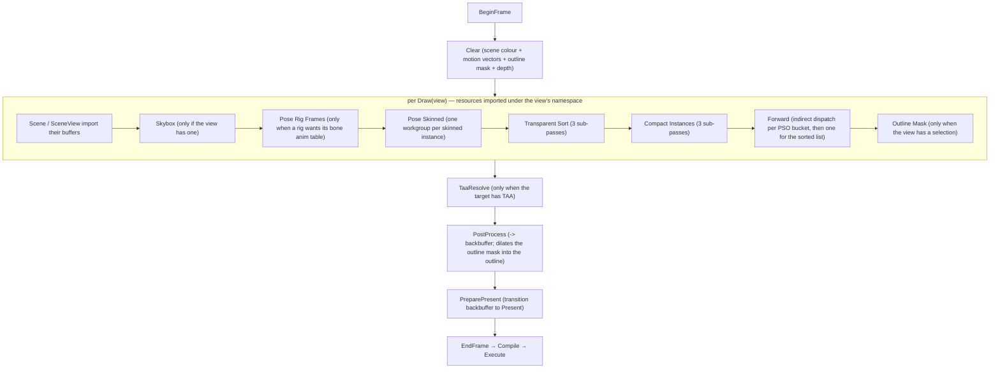

# Passes — the built-in Frame Graph pass catalog

A *pass* is a small type that knows how to add one (or a few) `PassDesc`s to a `FrameGraph`. It
owns whatever GPU objects it needs across frames (kernels, scratch buffers) and exposes an
`AttachToFrameGraph(fg, …)` that declares its resource accesses and sets an `exec` callback. The
graph then culls, orders, derives barriers, and records — see [Frame Graph](docs/framegraph.md) for
that machinery. This page is the catalog of the passes `bgl_extended` ships.

**This document is a map, not a mirror.** It captures each pass's role, the resources it reads and
writes, and the non-obvious contracts — not full signatures. The header at each linked path is the
source of truth; when this doc disagrees, trust the header, then fix this doc.

---

## The frame

`RenderContext` ([gfx/RenderContext.cpp](libs/bgl_extended/src/gfx/RenderContext.cpp)) drives the frame and
owns the long-lived pass objects (`m_Forward`, `m_Skybox`, `m_TransparentSort`,
`m_CompactInstances`, `m_RigFrames`, `m_SkinnedPose`, `m_OutlineMask`, `m_PreparePresentPass`); `Graphics` owns one context and
forwards the frame methods to it. A frame is built between `BeginFrame` and `EndFrame`, with one `Draw` per
view in between; the passes are added in this order and, because the graph never reorders, execute
in it:

```mermaid
flowchart TD
    BF["BeginFrame"] --> CLR["Clear (scene colour + motion vectors + outline mask + depth)"]
    CLR --> D["per Draw(view)"]
    subgraph D["per Draw(view) — resources imported under the view's namespace"]
        IMP["Scene / SceneView import their buffers"] --> SKY["Skybox (only if the view has one)"]
        SKY --> RIG["Pose Rig Frames (only when a rig wants its bone anim table)"]
        RIG --> POSE["Pose Skinned (one workgroup per skinned instance)"]
        POSE --> TS["Transparent Sort (3 sub-passes)"]
        TS --> CI["Compact Instances (3 sub-passes)"]
        CI --> FWD["Forward (indirect dispatch per PSO bucket, then one for the sorted list)"]
        FWD --> SM["Outline Mask (only when the view has a selection)"]
    end
    D --> TAA["TaaResolve (only when the target has TAA)"]
    TAA --> PPX["PostProcess (-> backbuffer; dilates the outline mask into the outline)"]
    PPX --> PP["PreparePresent (transition backbuffer to Present)"]
    PP --> EF["EndFrame → Compile → Execute"]
```

`Clear`, `Skybox`, and `Forward` take the imported `sceneColor` and `motionVectors` textures as
render targets and the imported `depth` texture as their depth attachment — **every pass that binds
the DSV declares `depth` in its `PassDesc`** (`kDepthStencil` / `kDepthWrite`), which is what lets a
later pass read it as a shader resource and have the graph derive the write → read → write cycle;
`TaaResolve` reads `sceneColor`, the velocity buffer, `depth` and the previous accumulation and
writes the next one; `PostProcess` reads whichever of the two the last HDR stage produced and is the **only**
writer of the backbuffer;
`PreparePresent` only transitions the backbuffer to present; `Compact Instances`
and `Transparent Sort` are pure compute passes that touch no textures at all. All three read the scene/view buffers imported
by [Scene](libs/bgl_extended/src/scene/Scene.cpp)/[SceneView](libs/bgl_extended/src/scene/SceneView.cpp)'s own
`AttachToFrameGraph`. Multiple `Draw`s share one graph by prefixing their imports with the view's
resource namespace, `v{n}:`; a view's **cull outputs** sit one scope further in, at `v{n}:c{k}:`,
one `k` per frustum it is culled against. `Compact Instances`, `Transparent Sort` and `Forward` are
recorded under the frustum's scope and reach the view's own buffers by the outward walk (see
[Frame Graph](docs/framegraph.md)). Today `k` is only ever 0, the camera.

`DrawData` ([passes/DrawData.h](libs/bgl_extended/src/passes/DrawData.h)) is the per-draw parameter bundle
handed to `Skybox`/`Transparent Sort`/`Compact Instances`/`Forward`. Beside the view and its cull
state it carries four groups: `viewState` (viewport, this frame's and the previous frame's
view-projection, jitter, camera position, the derived frustum), `targets` (scene-colour, motion-vector
and depth handles), `lighting` (environment map, exposure, optional skybox) and `samplers`. The graph
resource *names* are not in it — they are fixed, so `c_BackbufferName` / `c_MotionVectorsName` /
`c_SceneColorName` / `c_DepthName` in [constants/constants.h](libs/bgl_extended/src/constants/constants.h) are
what both the importer and the passes name them by.

---

## Scene colour, and where the display curve is applied

Every geometry pass renders into `sceneColor`, an `RGBA16_FLOAT` texture the render target owns, and
`PostProcess` is what turns that into the backbuffer. The buffer holds **linear HDR with exposure already
applied**: exposure is a per-view scale and a target may carry several views, so the geometry passes
fold it in, while the display curve — `AgX` in
[lib/math/Tonemap.slang](libs/bgl_common/shaders/src/lib/math/Tonemap.slang) — belongs to the output and runs once.
`AgX` leaves its result linear, so the sRGB backbuffer view is still what encodes it.

Two consequences worth knowing. Transparent surfaces blend in linear HDR rather than in display
space. And a pixel shader that writes a literal colour — `programs.forward.Null`, `programs.forward.Assert` — is
writing radiance, not a display value, so its `1.0` reaches the screen as the curve's answer for
unit radiance and not as white.

`sceneColor`'s alpha never reaches the screen: a surviving hashed or cutout fragment writes its
*texture* alpha there, which is the surface's own coverage and not the pixel's, so `PostProcess`
writes the backbuffer opaque — a capture (or anything compositing the backbuffer) that inherited it
would hold transparency the image does not have.

---

## Two-sided surfaces

Every cutout, blend and hashed bucket is `RasterCullMode::kNone`, so the rasterizer draws both sides
of a surface. On the back one the interpolated normal still points away from the camera, which sends
the view angle, the irradiance lookup and the reflection vector into the wrong hemisphere — the same
material then shades differently depending on which side happens to be visible.

The seven shading pixel shaders therefore take `bool isFrontFace : SV_IsFrontFace` and hand it to
`CalculateNormal`, which negates the geometric normal before building the tangent frame. **Before,
not after**: the bitangent is `cross(N, T) * tangent.w`, so flipping N carries the frame with it,
where negating the finished shading normal would leave a mirrored bitangent and lean the normal map's
detail the wrong way on every back face.

`programs.forward.Null` and `programs.forward.Assert` take `ForwardVSOut` but never read its normal, so they do not
take the flag. The opaque buckets cull back faces and can never see one,
but their shaders share `MaterialData::Shade<M>` with the transparent bucket, which can — so they pass the hardware
value rather than a literal `true`, which would encode an assumption about `c_Psos`' cull mode that
the shader cannot see.

---

## Blended surfaces

`LayerType::kBlend` resolves to the `kTransparent_*` buckets — one per (tier, material type) pair
that can carry it — whose PSOs blend
**premultiplied** — `SrcBlend = One`, `DestBlend = InvSrcAlpha`. `programs.forward.Transparent` therefore
returns radiance already weighted by its own coverage, rather than radiance the blend then scales,
and the alpha it returns is coverage rather than the material's own.

That is what lets base-colour alpha mean two different things, which one number under a `SrcAlpha`
blend cannot. `PbrMaterial::transmissionFactor` says which:

* **At 0 the alpha is coverage** — how much surface is in the pixel — so it thins the diffuse and
  specular lobes alike. Hair, foliage, a dissolve. The arithmetic collapses to `alpha * (diffuse +
  specular)` against `1 - alpha`, which is exactly what a `SrcAlpha` blend of the unweighted colour
  produces; this end of the range is the behaviour that predates the factor, and it is the default.
* **At 1 the alpha is transmission** — the surface covers the pixel and the alpha says how much light
  passes through it. The diffuse lobe is what is transmitted, so alpha still governs that, while the
  reflection is light coming back off the surface and does not thin with it. Coverage rises with the
  Fresnel reflectance instead, because a reflection replaces the backdrop it sits on: at a grazing
  angle, where Fresnel returns nearly everything, the surface has to hide what is behind it or the
  environment would be added to a backdrop still showing through in full.

The two lobes are kept apart for this: `PbrShading::EvaluateSurface` returns a `SurfaceLobes`
(diffuse, specular, and the reflectance the specular lobe returns) instead of a summed colour, and
the callers weight it. `MaterialData::ShadeWithBaseColor` sums the pair, which is the opaque
answer; `MaterialData::ShadeBlended` is the only caller of `BlendedSurface`, the one function that
weights them apart, which lives beside `SurfaceLobes` in
[lib/math/PbrShading.slang](libs/bgl_common/shaders/src/lib/math/PbrShading.slang). Both methods live in
[lib/forward/MaterialShading.slang](libs/bgl_extended/shaders/src/lib/forward/MaterialShading.slang), which
extends the material constant buffer with the four shading entry points.

**Only the blend bucket is premultiplied.** The opaque, cutout and hashed buckets write with no blend
at all, so their pixel shaders keep returning the plain sum and the material's own alpha — a cutout
fragment that survives is fully opaque, and scaling its diffuse by a texture alpha would be wrong.

## Hashed alpha

`LayerType::kHashed` ([bgl/LayerType.h](libs/bgl/include/bgl/LayerType.h)) is stochastic coverage:
alpha becomes a per-pixel hashed threshold rather than a cutoff, so every layer of a self-occluding
surface writes depth and participates, and the correct blend is what the ensemble averages to.

It resolves to the `kHashedAlpha_*` buckets, which are **opaque-shaped** — depth
write, no blend, velocity written like any other geometry — and drawn in the PSO-bucketed phase
rather than the depth-sorted one. The pixel shader tests base-colour alpha against a per-pixel hashed
threshold ([lib/math/HashedAlpha.slang](libs/bgl_common/shaders/src/lib/math/HashedAlpha.slang)) instead of the
material's cutoff, so a fragment survives with probability equal to its alpha and every layer of a
self-occluding surface writes real depth.

The material's `alphaCutoff` is deliberately unused there: a cutoff is the thing being replaced.

`MaterialData::alphaHashSeed` advances once per frame so the pattern decorrelates, and is zero on a
target without temporal AA — a pattern that moved with nothing accumulating it is flicker rather than
coverage. **A single frame of this is noise by design**; it is only correct once
[TAA](docs/taa.md) has integrated it.

---

## Motion vectors

The forward pass writes a screen-space velocity buffer alongside colour, as MRT slot 1: for each
pixel, the UV displacement from where its surface sat last frame to where it sits now, so a consumer
samples history at `uv - motion`. It is `RG16_FLOAT`, owned by the render target beside the depth
buffer, and cleared to zero each frame — a pixel nothing drew reads as static.

Every instance transform is fixed for its lifetime (there is no `SetTransform`), so for static
geometry the camera is the whole of the motion: the mesh shader reprojects one world position through
`viewProj` and `prevViewProj` and hands the pixel stage both clip positions. An animated instance
plugs into that seam by substituting its own previous-frame position for the second of those, with no
change to the pixel stage — a per-instance pose blends by the second half of its palette slice, which
`Pose Skinned` filled at `prevTime` for exactly this, and a crowd instance reads its rig's table at
`prevTime` the same way it reads it at `time`. `SceneView::AdvanceCamera` is what holds the previous frame's matrices; drawing one
view twice in a frame reports the same history to both draws rather than letting the second treat
the first as history.

When the target has `RenderTargetDesc::taaEnabled` set, every projection is offset by a sub-pixel
`HaltonJitter` ([bgl_common/jitter.h](libs/bgl_common/include/bgl_common/jitter.h)) that `RenderContext::Draw`
left-multiplies onto it, so the sample grid walks a *render* pixel's footprint. Across eight frames
where the render and output grids coincide; across more when the output grid is denser and each of
its sub-pixels wants that walk of its own ([Temporal Antialiasing](docs/taa.md)). The client's
`Camera` never sees it. **A velocity is about the surface, not the sample pattern**, so both
clip positions are de-jittered against their own frame's offset before differencing. For geometry
that happens **in the mesh shader**, which subtracts `ViewData::jitter` / `prevJitter` in clip space
as it fills `ForwardVSOut::clip` and `prevClip` — `SV_Position` keeps its offset, those two do not,
and `ComputeMotionVector` stays a plain difference. The sky does the same subtraction in its pixel
shader from the matching pair on `gSkyboxData`, its covering triangle not being jittered to begin
with. `ViewMatrices` carries last frame's offset beside the matrices it already held. With temporal
AA off every offset is zero and the arithmetic collapses to what it was.

**The transparent phase writes no velocity** — a blended surface has no single depth to reproject —
so its PSOs declare one render target and `DrawTransparent` binds a framebuffer without the velocity
attachment. The skybox does write it, reprojecting the view ray through the previous frame's
rotation-only view-projection; the sky is at infinity, so a camera translation displaces it nowhere.

---

## Catalog

### Clear — [passes/ClearPass.h](libs/bgl_extended/src/passes/ClearPass.h)

Clears a set of color render targets and an optional depth target. Each target — depth included —
is declared as a `TextureArg` in its write state so the graph transitions it; the pass's `exec`
records `ClearRtv`/`ClearDsv` and nothing else. Stateless — it holds no kernel and is constructed
inline each frame. It is the first pass of the frame, added in `BeginFrame`.

* **In:** each color target + the depth target, transitioned to render-target / depth-write.
* **Out:** the cleared attachments (via clears, not declared writes).

### Skybox — [passes/SkyboxPass.{h,cpp}](libs/bgl_extended/src/passes/SkyboxPass.cpp)

Draws the environment cube behind the scene as a single full-screen triangle. Its `MeshletKernel`
is mesh + pixel only (no amplification shader), built from the `programs.env.Skybox` module; `DispatchMesh(1, 1,
1)` emits the one covering triangle. Depth test is `LessOrEqual` with **depth-write off** and no
culling, so it fills only where nothing has been drawn.

* **No-op** when the view has no skybox (`DrawData::lighting.skybox` is empty) — `AttachToFrameGraph` adds
  nothing.
* **In:** the scene-colour and velocity buffers as render targets; samples the skybox cube texture
  through the view's linear-clamp sampler. The `gSkyboxData` cbuffer carries `clipToWorld`,
  `prevWorldToClip`, `cubeTex`, `sampler`, `exposure`, and `mipLevel`; the constant-buffer name is
  matched against Slang reflection, so it must track the declaration in `programs/env/Skybox.slang`.
* `prevWorldToClip` is last frame's rotation-only view-projection with the skybox's own `rotationY`
  divided back out, so a rotated sky reports the camera's motion and not its own offset. `rotationY`
  is authoring state, so last frame's spin is taken to be this frame's.
* `clipToWorld` is composed from the transposed view rotation (the view is rigid, so its transpose
  is its inverse), the inverse of the *unjittered* projection, and the jitter as an exact
  translation — never the inverse of the jittered product. Inverting the composed matrix mixes the
  projection's near-scaled rows into the rotation, and how the residue rounds depends on the jitter
  folded in — at a 960×540 target with a 45° field of view a still sky reported 0.25 texel of
  motion on average and 0.5 at worst, phase by phase, which the TAA resolve turned into a blur along
  every silhouette against it. `MotionVectors_test` pins the composed form at that size.
* Attached per draw, before `Compact Instances` and `Forward`.

### Compact Instances — [passes/CompactInstancesPass.{h,cpp}](libs/bgl_extended/src/passes/CompactInstancesPass.cpp)

Frustum-culls the view's instances, then buckets the survivors by PSO into contiguous ranges and
builds the per-PSO indirect dispatch arguments that `Forward` consumes. Owns four compute kernels, all
under `programs/culling/` (`CullInstances`, `HistogramInstances`, `PrefixSumInstances`,
`CompactInstances`), and one
`ComputeBuffer` it imports globally (namespace-free): `cull.stats`, profiling counters written only
in `BERNINI_GPU_DEBUG` builds and read by nothing on the CPU.

The buffers it *writes* belong to the view being culled — `psoPrefixSumBuffer` and
`compactDispatchArgs` (sized `c_PsoCount`) and `cull.view` (one `CullView`: view-proj + frustum
planes, rewritten each draw) live in the `CullState` for the frustum being culled and are imported
under that frustum's scope. The pass reaches them through `DrawData::cullState` and names them by
the same graph names as before, so N frustums of one view carry identical names without aliasing.
Its four sub-pass names are keyed on `(drawIdx, cullIdx)`, since pass names are unique graph-wide
rather than per namespace.

It adds **four sub-passes**:

1. **Clear** — zeroes `psoPrefixSumBuffer` and `cull.stats`, uploads this draw's `CullView` into
   `cull.view`, and seeds every `compactDispatchArgs` entry to `{ 0, 1, 1 }` (a group count of 0 with
   Y = Z = 1). The written buffers are declared copy-dest.
2. **Cull Instances** (`CullInstances`, one thread per instance) — builds the instance's world-space
   bounding sphere (the placement's transform × the submesh's local sphere) and writes a per-instance
   **visibility word** to `scene.instanceVisibility`; the histogram, compaction, and transparent
   depth-key passes all gate on it, so a culled instance reaches no draw. Skipped when the instance
   count is 0.
3. **Histogram and Prefix Sum** — the histogram dispatch counts the **visible** instances per PSO into
   `psoPrefixSumBuffer`, then the scan rewrites that same buffer in place into exclusive prefix
   sums. Both dispatches run **in this one pass** sharing the buffer as a UAV, so the graph inserts
   no barrier between them; the pass issues the one intra-pass UAV barrier itself — the sanctioned
   exception to "pass code must not barrier" (see the barrier caveat in
   [Frame Graph](docs/framegraph.md)). Skipped when the view's instance count is 0.
4. **Compact Instances** — scatters each **visible** instance into `scene.compactedInstances` at its
   bucket's prefix-sum offset and finalizes each PSO's dispatch args. Skipped when the instance count
   is 0.

* **In:** `scene.instanceBuffer`, `scene.meshInstanceBuffer`, `scene.submeshBuffer`, `cull.view`
  (all read).
* **Out:** `scene.instanceVisibility`, `scene.compactedInstances`, `psoPrefixSumBuffer`,
  `compactDispatchArgs` (and `cull.stats` in debug) — all UAV / indirect-args downstream.

### Transparent Sort — [passes/TransparentSortPass.{h,cpp}](libs/bgl_extended/src/passes/TransparentSortPass.cpp)

Depth-sorts the transparent instances on the GPU, in three sub-passes, from two kernels under
`programs/culling/`. Runs **after** `Compact Instances` and depends on it: the depth-key pass reads the per-instance visibility word the cull
sub-pass writes, so a frustum-culled transparent instance takes no slot in the sorted list.

1. **Clear** — zeroes the entry counter and seeds `dispatchArgs` to `{0, 1, 1}`. Seeded rather than
   zeroed because a frame with no transparent instances still has the forward pass issue its
   indirect dispatch, and a zeroed `y`/`z` is an invalid grid.
2. **Depth Keys** (`TransparentDepthKeys`, one thread per instance) — compacts the transparent
   instances into `(key, instanceIndex)` pairs via an `InterlockedAdd` on the counter. The key is
   `~asuint(distanceSquared)`, so one ascending sort emits **farthest-first**. Squared distance is
   non-negative, so its bit pattern already orders like the float; the inversion is what makes
   ascending mean farthest-first.
3. **Sort** (`TransparentSort`, one workgroup) — a bitonic sort in groupshared memory, padded to
   `cTransparentSortCapacity` with `0xFFFFFFFF` keys so the padding sorts to the tail. Writes the
   sorted instance indices to `sortedTransparentInstances` and emits `dispatchArgs`.

**One workgroup caps the list at `cTransparentSortCapacity` (1024) instances.** That is what buys a
single dispatch with no ping-pong buffers and no cross-group scan; a multi-group radix sort is the
scale-up past it, and the buffer contract does not change when it lands.

Past the cap the sort silently orders an arbitrary 1024 of the transparent instances rather than the
nearest ones — a visible artifact, not a memory error. The keys buffer is sized off the view's
instance buffer, not off the capacity, so the depth-key pass cannot append past its end no matter how
many instances turn out to be transparent; only the sort itself is bounded.

* **In:** `scene.instanceBuffer`, `scene.meshInstanceBuffer`, `scene.instanceVisibility`, the camera
  position.
* **Out:** `scene.transparentSortEntries`/`Count`, `scene.sortedTransparentInstances` and
  `transparentSort.dispatchArgs` — all owned by the view's `TransparentSortState`, one per view
  rather than per frustum since only a camera sorts transparents, the last two consumed by
  `Forward`. The pass itself owns no buffers, only its two kernels.
* **Skipped** when the view's instance count is 0 — the seeded args make that draw a no-op.

### Pose Skinned — [passes/SkinnedPosePass.{h,cpp}](libs/bgl_extended/src/passes/SkinnedPosePass.cpp)

Writes every skinned instance's bone palette: one workgroup per instance, one thread per bone
(striding when a rig has more bones than `cPoseGroupSize`). Per bone it samples the instance's clip at
`ViewData::time`, blends the two frames the fractional position falls between (nlerp with a hemisphere
flip), then the group walks the hierarchy **one depth level at a time** with a barrier between levels
and multiplies each result by the bone's inverse bind — all of it **in the palette itself**, which
holds an affine transform in the three rows it reserves for the skin matrix. There is no groupshared
hierarchy array and so no ceiling on a rig's bone count; the price is that the per-level barrier
orders device memory rather than groupshared.

It runs **twice per instance in one dispatch**, at `time` and at `prevTime`, writing two palettes back
to back from `SkinnedState::paletteBase`. That is how skinned geometry gets a motion vector without a
history buffer — and it holds only while time is the sole input to a pose, so a clip switched between
frames would reproject through the wrong clip.

* **Attached under the view's namespace, not a cull namespace.** A palette is per instance, not per
  frustum, so it is posed once however many frustums the view is culled against. It also has to be:
  the graph decides a pass is a root by whether it writes an *imported* resource, and a name resolved
  inside a cull namespace matches no import, which would cull the pass entirely.
* **In:** `scene.posedInstances` (the dense list of byte offsets to pose — a sweep of the arena
  would pose freed records, and would meet the crowd records sharing it), `scene.playbackBuffer`,
  `scene.rigBuffer`,
  `scene.skinnedBoneBuffer`, `scene.clipBuffer`, `scene.boneSampleBuffer`.
* **Out:** `scene.bonePalettes`, the view's `BonePaletteBuffer` — GPU-only storage with a CPU-side offset
  allocator, because a `RangeBuffer` would re-upload its stale CPU mirror over what this wrote.
* **Skipped** when the view places no skinned instance — and an instance drawing from its rig's bone
  anim table is not one of them. The dense list is built from instances that own a palette, which is
  what this pass writes into; a table instance owns none and is posed by `Pose Rig Frames` once.

### Pose Rig Frames

* **What it is:** the bone anim table's producer. One dispatch per rig that has been given a table
  and not yet posed into it, one workgroup per frame of that rig's clip set, running the same walk
  `Pose Skinned` runs ([pose_walk.slang](libs/bgl_common/shaders/src/lib/anim/pose_walk.slang) is shared by both).
  A crowd instance then reads a pose rather than computing one.
* **In:** `scene.rigBuffer`, `scene.skinnedBoneBuffer`, `scene.clipBuffer`, `scene.boneSampleBuffer`.
* **Out:** `scene.boneAnimTables`, the scene's table arena — a `BonePaletteBuffer` like the view's
  palette, and GPU-only for the same reason.
* **Ordered before `Pose Skinned` and the forward pass**, either of which may read a table this
  frame filled.
* **Absent from the graph on almost every frame**, rather than present and idle: it writes
  `scene.boneAnimTables`, which the scene imports, so `WritesImported` would keep it as a root
  however little it did — and a scene drawing no crowd instance would pay a pass node and a UAV
  transition every frame for a buffer nothing reads. `AttachToFrameGraph` asks the scene first and
  adds nothing on an empty answer. A rig is filled when the first instance drawing from its table
  is spawned, and again only when the arena grows — a growth discards what it held, so every rig
  holding a table is re-queued. Unlike the per-view palette, which is rewritten every frame anyway,
  a table is written once and a discarded one would otherwise stay discarded.

### Forward — [passes/ForwardPass.{h,cpp}](libs/bgl_extended/src/passes/ForwardPass.cpp)

The main geometry pass: a mesh-shader forward render, in two phases. It holds `c_PsoCount`
`MeshletKernel`s, one per `PsoType`, built from the `c_Psos` config table (pixel-shader module +
raster/depth/blend state + mesh-shader source).

Each row names its amplification/mesh module, one per **tier**: `StaticMesh`, and `SkinnedMesh`,
which blends the bind-pose vertex bytes by a pose — the bone palette `Pose Skinned` wrote this
frame, or the rig's shared table, whichever kind of playback record the placement holds. Both are
the same shader with one function swapped: the instance expansion, the meshlet lookup, the triangle
fetch, the vertex decode and the reprojection live in `lib/forward/mesh_stage.slang`, and each
tier's vertex evaluation in its own `lib/forward/{static,skinned}_vertex.slang`. Only the
mesh-output loops are still written out per entry point — Slang's Metal backend crashes on any
function taking `OutputVertices`, so nothing but `MSMain` may index them. `AnyMesh` is the third,
and calls whichever of the two an instance's `MeshInstance` names — see the transparent phase below.

The pixel shader varies per bucket instead (`Null`, `PBR`, `PBR_Loose`, `PBR_AlphaTest`,
`PBR_Loose_AlphaTest`, `PBR_HashedAlpha`, `PBR_Loose_HashedAlpha`, `Transparent`, `Assert`), and is chosen by layer
alone — every tier draws every layer, so the buckets are the (tier × layer) product with the loose
material type static-only. **`c_Psos` order must match `PsoType`** — a `static_assert` catches an
empty row but not a misordering.

**Opaque and alpha-test** are PSO-bucketed: per bucket it populates the cbuffers the kernel declares
— `forwardData` (the scene geometry tables), `viewData` (this frame's and the previous frame's
view-proj, plus the animation clock `time`/`prevTime` that playback and its motion vectors
derive the pose from), `expansionData` (`psoIndex` and the instance-list tables), `materialData`
(samplers, IBL maps, camera position, exposure) — binds the meshlet state (viewport +
colour/velocity/depth framebuffer), and calls
`DispatchMeshIndirect(pso)`, whose grid comes from the `compactDispatchArgs` entry that
`Compact Instances` produced.

**Transparent buckets are skipped there** — blending needs depth order, not PSO order — and drawn
afterwards by `DrawTransparent`, inside the same pass, off the depth-sorted
`sortedTransparentInstances` list that [Transparent Sort](#transparent-sort) built. Every transparent
PSO shares one pipeline and the list is drawn whole, so the transparent phase is **one
`DispatchMeshIndirect`** whose grid is a GPU value the CPU never sees. Their blend state is
premultiplied and their pixel shader returns premultiplied colour to match — see
[Blended surfaces](#blended-surfaces).

That one list holds **every tier at once**, which is why the transparent pipeline's geometry module is
`programs.forward.AnyMesh` rather than a tier's own: it reads the tier off the header of the record the
instance's `MeshInstance.playback` names — a null entry being the static tier, which owns no record — and calls
that tier's vertex evaluation. So a blended rig standing behind a blended window composites in depth
order and not in tier order, which one dispatch per tier could not do. The tier is uniform across a
mesh-shader group, one instance being one group's work, so it is resolved once outside the vertex
loop rather than per vertex. Nothing mirrors the PSO table into Slang for it.

A surface that has to hide its own back layers uses `kHashed` ([Hashed alpha](#hashed-alpha)) rather
than blending: stochastic coverage writes real depth, so it self-occludes in the opaque phase with no
pre-pass. That replaced an `occlude` flag which drew a blend material twice — a depth-only pre-pass,
then a colour draw with `depthFunc == Equal` — and which could only ever resolve one layer.

The depth-sorted path starts at zero; the opaque path reads `psoPrefixSum` indexed by `psoIndex`.
`baseTable` picks between the two.

* **In:** the scene-colour and velocity buffers as render targets; `compactDispatchArgs` and
  `transparentSort.dispatchArgs` as indirect args; the seven `c_ForwardDataBuffers` scene
  buffers, the four `c_SkinnedBuffers`, the two `c_ExpansionBuffers`,
  `sortedTransparentInstances`, and the one `c_MaterialBuffers` (the material arena; its typed view
  is bound off the draw rather than the graph, being a second descriptor onto the same bytes). A cbuffer the shader does not declare is skipped, but a
  scene-buffer key missing from a cbuffer that *is* declared is fatal (`gfatal`); a missing
  `materialData` key is skipped silently.
* **Out:** scene colour (rendered), the velocity buffer (opaque and alpha-test only), depth.
* **Skipped** when the view's instance count is 0.

### Outline Mask — [passes/OutlineMaskPass.{h,cpp}](libs/bgl_extended/src/passes/OutlineMaskPass.cpp)

Draws the view's selected submesh instances (`ISceneView::SetSubmeshSelected`) into the target's
R8 outline mask, which `PostProcess` dilates into the editor's selection outline. The kernel is
the shared `programs.forward.AnyMesh` amplification/mesh shaders with a trivial coverage pixel shader
(`programs/screen/OutlineMask.slang`), dispatched **directly** — `DispatchMesh(count, 1, 1)` over the view's
CPU-built selected list with `baseTable = kDepthSorted`, the same expansion shape as the
transparent phase, so no culling and no indirect args are involved. A selection mixes tiers as freely
as the sorted list does, so it takes the same tier-branching geometry stage and a selected rig
contours the pose it is drawn in.

* **No depth and no culling:** the mask is the full silhouette, through occluders, whichever way
  its triangles face — selection feedback answers "where is the thing I selected".
* **Unjittered:** its `viewData` carries `unjitteredViewProj` and zero jitter. The mask is
  consumed after the TAA resolve and never accumulated, so a jittered contour would shimmer by
  half a pixel.
* Attached per draw, after `Forward`, **only when the view's selection is non-empty and the
  target's outline is enabled** (`IRenderTarget::SetOutlineEnabled`); several
  views drawing into one target union their masks, cleared once in `BeginFrame`.
* **In:** `scene.selectedInstances` (the view's dense selected-drawable list) and the seven
  forward geometry tables.
* **Out:** the outline mask.

### TaaResolve — [passes/TaaResolvePass.{h,cpp}](libs/bgl_extended/src/passes/TaaResolvePass.cpp)

Accumulates the jittered scene colour into the temporal history: reprojects the previous accumulation
through the velocity buffer, clamps it to the 3x3 neighbourhood in YCoCg, and blends. A single
full-screen triangle from the `programs.screen.TaaResolve` module, depth test off. Added in `EndFrame`, before
`PostProcess`, and **only when the target has `taaEnabled`** — a target without it allocates no
history and the pass is never attached.

See [Temporal Antialiasing](docs/taa.md) for why the clamp is in YCoCg, why the blend is luma-weighted
and why the resolve writes history rather than the backbuffer.

**It is the one pass that spans both of a target's grids.** `sceneColor`, `motionVectors` and
`depth` are on the render grid; the history it writes is on the output one, and it rasterizes over
the latter. So a render scale is *reconstructed* here rather than stretched at present: each output
pixel takes the render sample whose jitter landed nearest it, weighted by how near, while the
neighbourhood clamp and both motion discriminators stay on the render 3x3 around that sample. Where
the two grids coincide the weight is identically one and the pass is the render-grid accumulation it
has always been.

* **In:** `sceneColor`, `motionVectors`, `depth` and the previous history as shader resources; a
  point sampler for the three read at their own texel centres and a linear one for the reprojected
  history, both owned by `RenderContext`. Depth is read for one thing: what the camera alone would
  move each pixel by, which is subtracted from the written velocity to find a surface's own motion
  ([Temporal Antialiasing](docs/taa.md)).
* **Out:** the current history, at the target's output size. `PostProcess` is then pointed at it
  instead of `sceneColor`.
* **The first frame, and the first after a resize, take the scene colour whole** — `historyValid` is
  false and there is no accumulation to blend against. So does the first frame after the scene's
  shading changed, where the accumulation exists but describes a material that is gone; see
  [Temporal Antialiasing](docs/taa.md).
* The `gTaaResolveData` cbuffer name is matched against Slang reflection, so it must track the
  declaration in `programs/screen/TaaResolve.slang`.

### PostProcess — [passes/PostProcessPass.{h,cpp}](libs/bgl_extended/src/passes/PostProcessPass.cpp)

Turns the linear HDR scene colour into the displayed image, as a single full-screen triangle from
the `programs.screen.PostProcess` module (mesh + pixel, no amplification shader, depth test off). Added in
`EndFrame`, after every draw and before `PreparePresent`.

Today it applies `AgX`, then — on a frame where a [Outline Mask](#outline-mask) pass ran —
composites the selection outline: a pixel outside the mask but within the outline width of it
takes the display-space outline colour instead of the tonemapped result. Compositing after the
curve is deliberate: the outline is editor feedback rather than radiance, so exposure and AgX must
not shift it, and TAA (which resolves earlier) can neither eat nor ghost it. The pass is named for
the stage rather than those steps: everything between a resolved scene and the screen — bloom,
grading, exposure adaptation — belongs here as it lands.

The outline width is **4 px at a 2160-line target, scaled by the mask's height** — not a fixed texel
count. The mask is on the render grid while the image around it is reconstructed onto the output
one, so a texel-count outline would thicken on screen as the render scale drops. It is
floored at one texel, so a small viewport still shows a selection, and capped at eight, because the
dilate is a `(2r+1)^2` tap loop and a supersampled target would otherwise pay quadratically for a
contour no thicker on screen.

* **In:** whatever the last HDR stage produced — `sceneColor`, or the freshly resolved history on a
  TAA target — through the `SrvHandle` the render target owns; the outline mask as a shader
  resource, declared and sampled only on a frame whose `outlineEnabled` is set; its own
  point-clamp sampler, created by `RenderContext` because the pass runs outside any `Draw` and the
  per-scene samplers are not reachable there. The `gPostProcessData` cbuffer name is matched
  against Slang reflection, so it must track the declaration in `programs/screen/PostProcess.slang`.
* **Out:** the backbuffer.
* It covers the whole target, which is why `BeginFrame` does not clear the backbuffer.
* **It is the only pass that writes the backbuffer**, which is what keeps `SubmitCapture` — a
  readback of the last presented backbuffer — describing what was displayed.

### PreparePresent — [passes/PreparePresentPass.h](libs/bgl_extended/src/passes/PreparePresentPass.h)

A barrier-only pass with no `exec`: it declares the backbuffer with `BarrierLayout::kPresent` so the
graph transitions it out of render-target state and into present. Because it has no attachment and
writes no imported resource, it would be culled — it is pinned with `SetSideEffect()`. Added last,
in `EndFrame`, after all draws.

---

## Risky / Non-obvious Contracts

* **`Forward` depends on `Compact Instances` by resource, not by ordering code.** It reads
  `compactedInstances`, `psoPrefixSumBuffer`, and `compactDispatchArgs`; the graph's last-writer
  dependency is what puts the compaction before it. Adding `Forward` without the compaction in the
  same frame leaves its indirect args seeded to zero groups (nothing draws) — not an error.
* **The histogram reuses `psoPrefixSumBuffer` as its output.** The histogram and the scan are the
  same buffer read-modify-written back to back; the intra-pass UAV barrier between them is
  mandatory. Dropping it produces wrong prefix sums that surface only in scenes mixing PSO buckets —
  nondeterministic flicker. This is the bug precedent the [Frame Graph](docs/framegraph.md) barrier
  caveat is written from.
* **A bound framebuffer's colour-attachment count must match the PSO's `rtvFormats` count.** The
  forward pass runs two shapes against one depth buffer — opaque (colour + velocity) and
  transparent (colour) — and each builds its own
  `MeshletState`. Handing the opaque framebuffer to a blend PSO binds a render target it does not
  declare; the reverse leaves a declared target unbound. `PsoConfig::blend` is what decides whether
  `BuildForwardKernel` adds the velocity format, so the two sides move together.
* **`c_Psos` (Forward) is coupled to `PsoType` by position.** The rows are ordered to match the
  enum and indexed by it; a reordering is not caught by the `static_assert`, which only rejects an
  empty pixel-shader row.
* **The transparent blend factor and `programs.forward.Transparent`'s return value are one decision made in
  two files.** `SrcBlend = One` is only correct because the shader premultiplies; either one changed
  alone is silently wrong rather than a build error — a `SrcAlpha` factor against premultiplied
  colour squares the alpha, and `One` against unweighted colour ignores it. `PsoConfig::blend` is
  what selects the state, and it selects the shader too, so the pair moves together.
* **`Skybox` and `Forward` cbuffer keys are matched against Slang reflection by name.** A rename on
  one side of the CPU/GPU boundary silently unbinds the resource for the `materialData`/skybox
  optional keys (no assert), so keep the string and the shader declaration in step.
* **Passes are rebuilt every frame; the pass objects are not.** `AttachToFrameGraph` re-adds the
  `PassDesc` (and everything its `exec` lambda captured) each frame, but the kernels and scratch
  buffers on `ForwardPass`/`SkyboxPass`/`CompactInstancesPass` persist. Release them through their
  `Release(...)` with the queue's fence before destroying the device.
