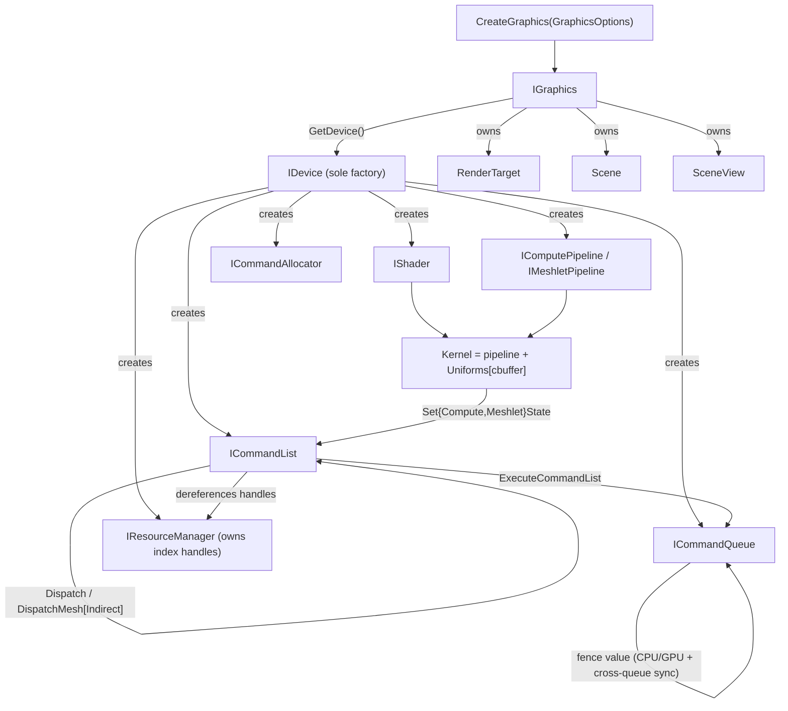

# Bernini Render Hardware Interface

The Render Hardware Interface (RHI) is `bgl`'s API-agnostic graphics abstraction: a set of
pure-virtual interfaces (`bgl::I*`) plus plain-old-data descriptors and state structs. The
concrete backend (`bgl_d3d12`) is linked at runtime and is never visible to callers.

**This document is a map, not a mirror.** It captures the design choices, the object topology,
the synchronization model, and the *non-obvious* method contracts. It deliberately does **not**
reproduce full signatures — the header at each linked path is the source of truth. When this
doc and a header disagree, trust the header, then fix this doc.

---

## Design Choices

* **Resources are index handles, not ref-counted pointers.** `CreateStructBuffer`, `CreateTexture`,
  `CreateRtv`, etc. return a small trivially-copyable handle owned by `IResourceManager`, not a
  `SharedRef`. Copy handles freely; they are values. Every handle is an `{ index, generation }`
  pair: the index locates the slot, and a `generation` counter guards against use-after-free —
  destroying a resource bumps the slot's generation so stale copies fail `Valid*Handle`. A null
  handle has index `0xFFFFFFFF` (`IsNull()`). The slot resolves to a `DescriptorHandle` the shader
  samples through — on D3D12 that handle *is* the descriptor-heap index, a second backend is free to
  make it a native resource id — which keeps GPU resources out of the refcount machinery.

  **Two handle layouts, one meaning.** `BufferHandle` and `TextureHandle` wrap a
  `core::slot_handle` (reached as `.slot.index` / `.slot.generation`); `RtvHandle`, `DsvHandle`, and
  `SamplerHandle` hand-roll the same two fields inline (`.idx` / `.generation`). Both are
  `{ index, generation }` and both null-test through `IsNull()`, but the accessor spelling differs —
  do not assume one field name across handle families.

* **Samplers are descriptor-heap-only handles.** `CreateSampler(SamplerDesc)` returns a
  `SamplerHandle` (same `{idx, generation}` shape) but a sampler has **no backing GPU
  resource** — it owns only a slot in the shader-visible sampler heap (its own `maxSamplers`
  pool, separate from textures). Bind it bindlessly: the slot resolves to a `DescriptorHandle` the
  shader samples through. Texture and sampler are separate handles — `TextureHandle` wraps a
  `Texture2D.Handle`, `SamplerHandle` *is* a `SamplerState.Handle` (a plain typealias), and sampling
  is `TextureHandle.Sample(SamplerHandle, uv)` in the shader IDL. `Scene`
  exposes ready-made presets via `StandardSampler` (`kAnisoLinearWrap`, `kLinearClamp`).

* **Interface objects use intrusive refcounting.** Every `I*` derives from `core::Ref`
  (`AddRef`/`Release`) and is held behind `core::SharedRef<T>` (analogous to
  `Microsoft::WRL::ComPtr`). Each interface exposes a `…Handle` alias
  (`DeviceRef`, `CommandListRef`, …). Interfaces delete copy/move — they are non-value
  types, always held behind a `SharedRef`.

* **`IDevice` is the sole factory.** All objects — shaders, pipelines, kernels, command
  lists/allocators/queues, resource managers, uniforms — are created through `IDevice`. Acquire
  the device from the `IGraphics` façade via `GetDevice()` (borrowed, non-owning `IDevice*`).

* **Kernel = pipeline + reflected uniforms.** A `ComputeKernel` / `MeshletKernel` bundles a
  pipeline with one `Uniforms` CPU-mirror per constant buffer the shader declares, keyed by
  name. `CreateComputeKernel` / `CreateMeshletKernel` build this from slang reflection.

* **Uniforms are a reflection-driven CPU mirror, bound by name.** `Uniforms` lays out one
  constant buffer from the shader's slang reflection. Populate it with chained `operator[]`
  (`kernel["cbuffer"]["member"] = value`); the backend uploads the flat buffer at
  dispatch/draw. Assigning a `BufferHandle` writes the resource's **descriptor index** into the
  slot (bindless).

* **Lifetime is fence-based; destruction is deferred.** `ICommandQueue` owns a monotonic fence.
  Every `Destroy*` takes the queue's current fence value and (by default) defers reclamation;
  `CleanupExpiredResources(completedFenceValue)` frees what the GPU has finished with. This is
  the primary safety mechanism against freeing in-flight resources.

* **Barriers are owned by the FrameGraph, not pass code.** `ICommandList::Barrier(...)` exists
  but the FrameGraph computes and inserts all resource-state transitions. Pass code should
  never call `Barrier` directly. See [Frame Graph](docs/framegraph.md) and
  [Pipeline State](docs/pipeline_state.md).

* **External synchronization; interfaces are not thread-safe.** Methods are `noexcept`. The RHI is
  built for a single render thread: creation and command recording must be externally synchronized,
  and a command list is single-threaded between `Open` and `Close`. Most interfaces take no locks.
  The exception is `ICommandQueue`, which holds two internal mutexes and locks around parts of its
  fence bookkeeping (`ExecuteCommandList`, `Flush`, `WaitForFenceCPUBlocking`); that locking is
  **incomplete** — `PollCurrentFenceValue` does an unlocked read-modify-write of the same cached
  fence value — so it is not a thread-safety guarantee. Synchronize the queue externally like
  everything else.

* **The shader cache is configuration, not an RHI object.** It is an internal optimization, so it
  is **not** an `I*` interface — the only thing crossing the boundary is
  `GraphicsOptions::shaderCacheDir` (empty ⇒ disabled), like the descriptor-heap capacities. The
  backend owns its two layers (a program cache of DXIL + reflection, and an
  `ID3D12PipelineLibrary`); to keep reflection cacheable and backend-agnostic it is decoupled from
  the live Slang object into a serializable `ReflectedLayout` POD. See
  [Shader Cache](docs/shader_cache.md).

---

## Interface Index

| Interface | File | Role |
|---|---|---|
| `IGraphics` | [libs/bgl/include/libs/bgl/IGraphics.h](libs/bgl/include/libs/bgl/IGraphics.h) | Public façade above the RHI; owns the device. `GetDevice()` returns the RHI root. |
| `IDevice` | [libs/bgl/src/device/Device.h](libs/bgl/src/device/Device.h) | Root factory for every RHI object. |
| `IResourceManager` | [libs/bgl/src/resource/ResourceManager.h](libs/bgl/src/resource/ResourceManager.h) | Owns all GPU buffers/textures/views behind index handles; creation, deferred destruction, lookup, readback, clears. |
| `ICommandQueue` | [libs/bgl/src/cmd/CommandQueue.h](libs/bgl/src/cmd/CommandQueue.h) | Submits command lists; owns the fence; all CPU/GPU and cross-queue sync. |
| `ICommandList` | [libs/bgl/src/cmd/CommandList.h](libs/bgl/src/cmd/CommandList.h) | Records uploads, copies, compute and mesh-shading dispatch, barriers, debug markers. |
| `ICommandAllocator` | [libs/bgl/src/cmd/CommandAllocator.h](libs/bgl/src/cmd/CommandAllocator.h) | Backing memory pool for recorded commands. |
| `IShader` | [libs/bgl/src/resource/Shader.h](libs/bgl/src/resource/Shader.h) | Immutable compiled DXIL + slang reflection module. |
| `IComputePipeline` | [libs/bgl/src/pipeline/ComputePipeline.h](libs/bgl/src/pipeline/ComputePipeline.h) | Compute PSO + constant-buffer reflection. |
| `IMeshletPipeline` | [libs/bgl/src/pipeline/MeshletPipeline.h](libs/bgl/src/pipeline/MeshletPipeline.h) | Mesh-shading PSO (amp/mesh/pixel) + render state + reflection. |

### Supporting types (POD / helpers)

| Type | File | Role |
|---|---|---|
| `Uniforms` | [libs/bgl/src/uniforms/Uniforms.h](libs/bgl/src/uniforms/Uniforms.h) | Reflection-driven CPU constant-buffer mirror; name/index `operator[]` access. |
| `ComputeKernel` / `MeshletKernel` | [libs/bgl/src/pipeline/ComputeKernel.h](libs/bgl/src/pipeline/ComputeKernel.h), [MeshletKernel.h](libs/bgl/src/pipeline/MeshletKernel.h) | Move-only pipeline + per-cbuffer `Uniforms` map. |
| `ComputeState` / `MeshletState` | [libs/bgl/src/types/ComputeState.h](libs/bgl/src/types/ComputeState.h), [MeshletState.h](libs/bgl/src/types/MeshletState.h) | Per-dispatch/draw binding; holds a **non-owning** kernel pointer. |
| Buffer descriptors & `BufferHandle` | [libs/bgl/src/resource/Buffer.h](libs/bgl/src/resource/Buffer.h) | `StructBufferDesc`, `ConstantBufferDesc`, `ComputeBufferDesc`, `BufferBarrierDesc`. |
| Texture descriptors & `TextureHandle` | [libs/bgl/src/resource/Texture.h](libs/bgl/src/resource/Texture.h) | `TextureDesc`, `TextureUsage`, `TextureBarrierDesc`. |
| Views | [libs/bgl/src/resource/Rtv.h](libs/bgl/src/resource/Rtv.h), [Dsv.h](libs/bgl/src/resource/Dsv.h) | `RtvDesc`/`RtvHandle`, `DsvDesc`/`DsvHandle`. |
| Sampler descriptors & `SamplerHandle` | [libs/bgl/src/resource/Sampler.h](libs/bgl/src/resource/Sampler.h) | `SamplerDesc` (chained builder), `SamplerAddressMode` (D3D + Vulkan aliases), `SamplerReductionType`; descriptor-heap-only. |
| Readback | [libs/bgl/src/resource/Readback.h](libs/bgl/src/resource/Readback.h) | `ReadbackBufferDesc`, `ReadbackBufferHandle`, `TextureReadbackLayout`. |
| `FrameBuffer` | [libs/bgl/src/resource/FrameBuffer.h](libs/bgl/src/resource/FrameBuffer.h) | Color attachments (RTV) + depth attachment (DSV). |
| Render state | [libs/bgl/src/types/RenderState.h](libs/bgl/src/types/RenderState.h) | `RasterState` + `BlendState` + `DepthStencilState`; baked into `MeshletPipelineDesc`. |
| `ViewportState` | [libs/bgl/src/types/ViewportState.h](libs/bgl/src/types/ViewportState.h) | Viewports + scissor rects. |
| `ClearValue` | [libs/bgl/src/types/ClearValue.h](libs/bgl/src/types/ClearValue.h) | Variant of color or depth/stencil clear. |
| Barrier vocabulary | [libs/bgl/src/types/Barrier.h](libs/bgl/src/types/Barrier.h) | `BarrierSyncFlag`, `BarrierAccessFlag`, `BarrierLayout` (enhanced barriers). |
| `QueueType` | [libs/bgl/src/types/QueueType.h](libs/bgl/src/types/QueueType.h) | `kGraphics`, `kCompute`, `kCopy`. |

---

## Topology



---

## Threading & Synchronization

* **Render thread + external sync.** No interface is thread-safe. Object creation
  (`IDevice`, `IResourceManager`) and recording (`ICommandList`) run on the render thread.
  `ICommandQueue` takes internal locks on some fence operations, but the coverage is incomplete
  (see Design Choices) — do not treat it as thread-safe.
* **One recorder per command list**, between `Open` and `Close`. Never share an open list.
* **Fences are the only sync primitive.** `ExecuteCommandList` returns a monotonic fence value.
  CPU waits (`WaitForFenceCPUBlocking`, `IsFenceComplete`) and GPU-side waits
  (`InsertWaitForQueue`, `InsertWaitForQueueFence`) are all expressed against fence values.
* **Deferred destruction** ties resource lifetime to fences (see design choices).
* **Barriers via FrameGraph**, not pass code.

---

## Risky / Non-obvious Method Contracts

Only the methods where misuse causes corruption, crashes, or silent GPU hazards are listed.
Everything else is self-explanatory from the header.

### IResourceManager

* **`Create*` can return a null handle** on pool exhaustion (heap capacities come from
  `ResourceManagerDesc`). Check `IsNull()` — do not assume success.
* **`CreateRtv` / `CreateDsv`** require the source texture to have been created with the
  matching usage flag (`TextureUsageFlag::kRenderTarget` / `kDepthStencil`).
* **`CreateSampler` / `DestroySampler` / `GetSampler`** — samplers draw from their own
  `maxSamplers` heap (exhaustion → null handle) and follow the same deferred-destruction and
  generation rules as other resources. A `Sampler` has no `ID3D12Resource`, so it needs **no
  barriers and no state**; there is no readback or clear path for it.
* **`Destroy*(handle, currentFenceValue, deferred = true)`** — pass the queue's *current*
  (submitted) fence value. With `deferred == true` the resource is freed only once
  `CleanupExpiredResources` runs with a completed value `>= currentFenceValue`. Passing
  `deferred == false` frees immediately — **only safe when the GPU is idle for that resource.**
  The handle's generation is bumped either way; stale copies then fail validation.
* **`Get*(handle)`** — precondition: `handle` is valid. Returns a reference into
  manager-owned storage that is **invalidated when the resource is destroyed**; do not cache it
  across a destroy. Validate first with `Valid*Handle` if unsure.
* **`MapReadback(handle)`** — the GPU copy into the buffer must have **already completed**
  (wait on the copy's fence first, e.g. `WaitForFenceCPUBlocking`). Pointer is valid only until
  the matching `UnmapReadback`.
* **`ClearRtv` / `ClearDsv`** — `cmdList` must be open and the target already in the correct
  layout (the FrameGraph arranges this).

### ICommandList

* **`Open` / `Close` ordering.** Record only between them (`IsOpen()` reports state). `Open`
  requires a non-null queue and allocator; the **allocator must already be reset** if reused.
* **`WriteBuffer(handle, data, [gpuBufferOffset,] byteSize)`** — the destination buffer must be in
  a writable state and the range must fit. Staged through the list's upload ring
  (`CommandListDesc::uploadChunkSize`). `data` points at the region's own bytes; the offset
  applies to the destination only.
* **`WriteBufferSlice(handle, cpuMirror, offset, byteSize)`** — for a CPU mirror that shadows the
  buffer byte-for-byte, where `offset` applies to both sides. Prefer it over `WriteBuffer` for
  dirty-region flushes: passing a mirror's base to `WriteBuffer` uploads the mirror's *first*
  bytes into a later region, corrupting whatever range lives there.
* **`CopyBufferToReadback` / `CopyTextureToReadback`** — source must already be in a
  copy-source state/layout. Texture copy uses subresource 0's linear footprint
  (`GetTextureReadbackLayout`).
* **`SetComputeState` / `SetMeshletState`** — the kernel's `Uniforms` must be **fully populated
  before** binding (all buffer handles and scalars assigned), and the kernel object must
  **outlive** the recorded dispatch (state holds a non-owning pointer). For meshlet draws, the
  pipeline's RTV/DSV formats must match the bound `FrameBuffer`, and attachments must be in
  render-target/depth layout.
* **`DispatchMeshIndirect(argIdx)`** — reads its grid from the bound state's `indirectArgs`
  buffer, which must be valid and in indirect-argument state.
* **`Barrier(...)`** — **do not call from pass code.** The FrameGraph owns transitions. Batched
  overloads require `handles.size() == barriers.size()`.
* **`BeginEvent` / `EndEvent`** must be balanced.
* **`SetActiveDebugBuffer`** — only compiled under `BERNINI_GPU_DEBUG`; binds the buffer that
  subsequent compute dispatches auto-wire into the shader's implicit `gDebug` cbuffer.

### ICommandQueue

* **`ExecuteCommandList`** — the list must be **closed** and of a compatible type. Returns the
  fence value that will signal on completion.
* **`WaitForFenceCPUBlocking`** — blocks the calling CPU thread. Use before freeing
  non-deferred resources or mapping readback.
* **`InsertWaitForQueue` / `InsertWaitForQueueFence`** — GPU-side cross-queue waits (non-null
  queue pointer required); do not confuse with the CPU-blocking wait.
* **`GetLastCompletedFence`** returns the cached value from the last `PollCurrentFenceValue`;
  call `PollCurrentFenceValue` to refresh from the GPU.

### ICommandAllocator

* **`ResetAllocator`** — all command lists recorded from this allocator must have **completed
  on the GPU** (caller waited on their fences). Resetting with work in flight is undefined.

### IDevice

* **`CreateShader(module, entry)`** — references a Slang module + entry point by name; `entry`
  defaults to `"main"`. No source is read here: the Slang module is **loaded lazily** on the first
  `GetSlangModule()`, which only happens when a PSO must actually compile (a shader-cache miss). The
  module source is resolved through the device's Slang session search paths (`./shaders/src`,
  `./shaders/tests`), so run binaries with cwd set to their output dir (see project scripts). The
  DXIL and reflection are generated per-PSO at pipeline creation: `BuildPipelineLayout` links all of
  a PSO's entry points into one program and pulls both the bytecode (`getEntryPointCode`) and the
  reflection/root-signature from that single linked program, so bindings always agree (no per-shader
  `register(bN, spaceM)` needed). On a **shader-cache hit** none of this runs — the DXIL and
  reflection come straight off disk and no Slang module is loaded at all.

### Uniforms / Kernel

* **`operator[]` throws** on an unknown member/cbuffer or a type mismatch
  (`std::runtime_error`); `Kernel::operator[]` throws `std::out_of_range` for a cbuffer the
  shader doesn't declare. Guard optional members with `Accessor::IsValid()`.
* **Assigning a `BufferHandle`** writes a descriptor index, not data: for a "smart buffer"
  struct the index lands in whichever of `entryBuffer` / `packedBuffer` / `rangeBuffer` exists;
  for a `kDescriptorHandle` value it is written directly; otherwise it throws.
* **Assigning a `SamplerHandle` / `TextureHandle`** likewise writes a `DescriptorHandle` (bindless).
  The shader-side `TextureHandle` / `TextureCubeHandle` are IDL structs holding a single `.Handle`, so
  the write lands in that sole member; `SamplerHandle` is a bare `SamplerState.Handle`, so it is
  written directly. Assigning throws if the target is neither.

---

## Usage Sketch

```cpp
// Setup (render thread)
IDevice*               device = graphics->GetDevice();
ResourceManagerRef  rm     = device->CreateResourceManager(ResourceManagerDesc{});
CommandQueueRef     queue  = device->CreateGraphicsCommandQueue();
CommandAllocatorRef alloc  = device->CreateCommandAllocator();
CommandListRef      cmd    = device->CreateCommandList({QueueType::kGraphics}, alloc, rm);

ComputeKernel kernel = device->CreateComputeKernel(
    ComputePipelineDesc()
        .SetShader(device->CreateShader("Histogram"))
        .SetDebugName("Histogram"));

// Per dispatch
kernel["gUniforms"]["instanceBuffer"] = someBufferHandle;   // bind resource by descriptor index
kernel["gUniforms"]["count"]          = instanceCount;       // scalar (type must match reflection)

cmd->Open(queue.Get(), alloc.Get());

ComputeState state; state.kernel = &kernel;                  // kernel must outlive the dispatch
cmd->SetComputeState(state);
cmd->Dispatch(core::div_ceil(instanceCount, 256), 1, 1);

cmd->Close();
uint64_t fence = queue->ExecuteCommandList(cmd.Get());
queue->WaitForFenceCPUBlocking(fence);                      // only if the CPU needs the results now
rm->CleanupExpiredResources(queue->PollCurrentFenceValue());
```

For a full runnable example, see
[examples/bgl_gpu_assert/src/main.cpp](examples/bgl_gpu_assert/src/main.cpp).
