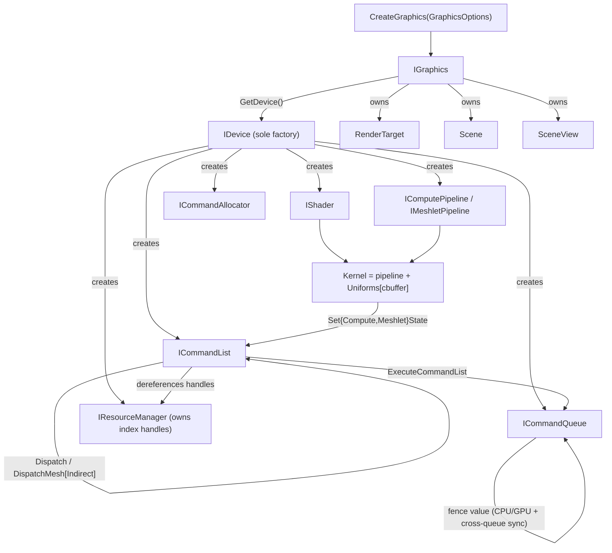

# Bernini Render Hardware Interface

The Render Hardware Interface (RHI) is `bgl`'s API-agnostic graphics abstraction: a set of
pure-virtual interfaces (`bgl::I*`) plus plain-old-data descriptors and state structs. The
concrete backend (`bgl_d3d12`) is linked at runtime and is never visible to callers.

**This document is a map, not a mirror.** It captures the design choices, the object topology,
the synchronization model, and the *non-obvious* method contracts. It deliberately does **not**
reproduce full signatures — the header at each linked path is the source of truth. When this
doc and a header disagree, trust the header, then fix this doc.

---

## Design Choices

* **Resources are `uint32_t` index handles, not ref-counted pointers.** `CreateStructBuffer`,
  `CreateTexture`, `CreateRtv`, etc. return a small trivially-copyable handle
  (`{ uint32_t idx; uint32_t generation; }`) owned by `IResourceManager`, not a
  `SharedRef`. Copy handles freely; they are values. A `generation` counter guards against
  use-after-free: destroying a resource bumps the slot's generation so stale handle copies
  fail `Valid*Handle`. `idx == 0xFFFFFFFF` denotes null (`IsNull()`). This keeps GPU resources
  out of the refcount machinery and enables bindless-style binding (the index *is* the
  descriptor).

* **Interface objects use intrusive refcounting.** Every `I*` derives from `core::Ref`
  (`AddRef`/`Release`) and is held behind `core::SharedRef<T>` (analogous to
  `Microsoft::WRL::ComPtr`). Each interface exposes a `…Handle` alias
  (`DeviceHandle`, `CommandListHandle`, …). Interfaces delete copy/move — they are non-value
  types, always held behind a `SharedRef`.

* **`IDevice` is the sole factory.** All objects — shaders, pipelines, kernels, command
  lists/allocators/queues, resource managers, uniforms — are created through `IDevice`. Acquire
  the device from the `IGraphics` façade via `GetDevice()` (borrowed, non-owning `IDevice*`).

* **Kernel = pipeline + reflected uniforms.** A `ComputeKernel` / `MeshletKernel` bundles a
  pipeline with one `Uniforms` CPU-mirror per constant buffer the shader declares, keyed by
  name. `CreateComputeKernel` / `CreateMeshletKernel` build this from slang reflection.

* **Uniforms are a reflection-driven CPU mirror, bound by name.** `Uniforms` lays out one
  constant buffer from the shader's slang reflection. Populate it with chained `operator[]`
  (`kernel["cbuffer"]["member"] = value`); the backend uploads the flat buffer at
  dispatch/draw. Assigning a `BufferHandle` writes the resource's **descriptor index** into the
  slot (bindless).

* **Lifetime is fence-based; destruction is deferred.** `ICommandQueue` owns a monotonic fence.
  Every `Destroy*` takes the queue's current fence value and (by default) defers reclamation;
  `CleanupExpiredResources(completedFenceValue)` frees what the GPU has finished with. This is
  the primary safety mechanism against freeing in-flight resources.

* **Barriers are owned by the FrameGraph, not pass code.** `ICommandList::Barrier(...)` exists
  but the FrameGraph computes and inserts all resource-state transitions. Pass code should
  never call `Barrier` directly. See [Frame Graph](docs/framegraph.md) and
  [Pipeline State](docs/pipeline_state.md).

* **No internal synchronization.** Methods are `noexcept`; interfaces provide no locking.
  Creation and command recording run on the render thread and must be externally synchronized.
  A command list is single-threaded between `Open` and `Close`.

---

## Interface Index

| Interface | File | Role |
|---|---|---|
| `IGraphics` | [bgl/include/bgl/IGraphics.h](bgl/include/bgl/IGraphics.h) | Public façade above the RHI; owns the device. `GetDevice()` returns the RHI root. |
| `IDevice` | [bgl/src/device/Device.h](bgl/src/device/Device.h) | Root factory for every RHI object. |
| `IResourceManager` | [bgl/src/resource/ResourceManager.h](bgl/src/resource/ResourceManager.h) | Owns all GPU buffers/textures/views behind index handles; creation, deferred destruction, lookup, readback, clears. |
| `ICommandQueue` | [bgl/src/cmd/CommandQueue.h](bgl/src/cmd/CommandQueue.h) | Submits command lists; owns the fence; all CPU/GPU and cross-queue sync. |
| `ICommandList` | [bgl/src/cmd/CommandList.h](bgl/src/cmd/CommandList.h) | Records uploads, copies, compute and mesh-shading dispatch, barriers, debug markers. |
| `ICommandAllocator` | [bgl/src/cmd/CommandAllocator.h](bgl/src/cmd/CommandAllocator.h) | Backing memory pool for recorded commands. |
| `IShader` | [bgl/src/resource/Shader.h](bgl/src/resource/Shader.h) | Immutable compiled DXIL + slang reflection module. |
| `IComputePipeline` | [bgl/src/pipeline/ComputePipeline.h](bgl/src/pipeline/ComputePipeline.h) | Compute PSO + constant-buffer reflection. |
| `IMeshletPipeline` | [bgl/src/pipeline/MeshletPipeline.h](bgl/src/pipeline/MeshletPipeline.h) | Mesh-shading PSO (amp/mesh/pixel) + render state + reflection. |

### Supporting types (POD / helpers)

| Type | File | Role |
|---|---|---|
| `Uniforms` | [bgl/src/uniforms/Uniforms.h](bgl/src/uniforms/Uniforms.h) | Reflection-driven CPU constant-buffer mirror; name/index `operator[]` access. |
| `ComputeKernel` / `MeshletKernel` | [bgl/src/pipeline/ComputeKernel.h](bgl/src/pipeline/ComputeKernel.h), [MeshletKernel.h](bgl/src/pipeline/MeshletKernel.h) | Move-only pipeline + per-cbuffer `Uniforms` map. |
| `ComputeState` / `MeshletState` | [bgl/src/types/ComputeState.h](bgl/src/types/ComputeState.h), [MeshletState.h](bgl/src/types/MeshletState.h) | Per-dispatch/draw binding; holds a **non-owning** kernel pointer. |
| Buffer descriptors & `BufferHandle` | [bgl/src/resource/Buffer.h](bgl/src/resource/Buffer.h) | `StructBufferDesc`, `ConstantBufferDesc`, `ComputeBufferDesc`, `BufferBarrierDesc`. |
| Texture descriptors & `TextureHandle` | [bgl/src/resource/Texture.h](bgl/src/resource/Texture.h) | `TextureDesc`, `TextureUsage`, `TextureBarrierDesc`. |
| Views | [bgl/src/resource/Rtv.h](bgl/src/resource/Rtv.h), [Dsv.h](bgl/src/resource/Dsv.h) | `RtvDesc`/`RtvHandle`, `DsvDesc`/`DsvHandle`. |
| Readback | [bgl/src/resource/Readback.h](bgl/src/resource/Readback.h) | `ReadbackBufferDesc`, `ReadbackBufferHandle`, `TextureReadbackLayout`. |
| `FrameBuffer` | [bgl/src/resource/FrameBuffer.h](bgl/src/resource/FrameBuffer.h) | Color attachments (RTV) + depth attachment (DSV). |
| Render state | [bgl/src/types/RenderState.h](bgl/src/types/RenderState.h) | `RasterState` + `BlendState` + `DepthStencilState`; baked into `MeshletPipelineDesc`. |
| `ViewportState` | [bgl/src/types/ViewportState.h](bgl/src/types/ViewportState.h) | Viewports + scissor rects. |
| `ClearValue` | [bgl/src/types/ClearValue.h](bgl/src/types/ClearValue.h) | Variant of color or depth/stencil clear. |
| Barrier vocabulary | [bgl/src/types/Barrier.h](bgl/src/types/Barrier.h) | `BarrierSyncFlag`, `BarrierAccessFlag`, `BarrierLayout` (enhanced barriers). |
| `QueueType` | [bgl/src/types/QueueType.h](bgl/src/types/QueueType.h) | `kGraphics`, `kCompute`, `kCopy`. |

---

## Topology



---

## Threading & Synchronization

* **Render thread + external sync.** No interface is thread-safe. Object creation
  (`IDevice`, `IResourceManager`) and recording (`ICommandList`) run on the render thread.
* **One recorder per command list**, between `Open` and `Close`. Never share an open list.
* **Fences are the only sync primitive.** `ExecuteCommandList` returns a monotonic fence value.
  CPU waits (`WaitForFenceCPUBlocking`, `IsFenceComplete`) and GPU-side waits
  (`InsertWaitForQueue`, `InsertWaitForQueueFence`) are all expressed against fence values.
* **Deferred destruction** ties resource lifetime to fences (see design choices).
* **Barriers via FrameGraph**, not pass code.

---

## Risky / Non-obvious Method Contracts

Only the methods where misuse causes corruption, crashes, or silent GPU hazards are listed.
Everything else is self-explanatory from the header.

### IResourceManager

* **`Create*` can return a null handle** on pool exhaustion (heap capacities come from
  `ResourceManagerDesc`). Check `IsNull()` — do not assume success.
* **`CreateRtv` / `CreateDsv`** require the source texture to have been created with the
  matching usage flag (`TextureUsageFlag::kRenderTarget` / `kDepthStencil`).
* **`Destroy*(handle, currentFenceValue, deferred = true)`** — pass the queue's *current*
  (submitted) fence value. With `deferred == true` the resource is freed only once
  `CleanupExpiredResources` runs with a completed value `>= currentFenceValue`. Passing
  `deferred == false` frees immediately — **only safe when the GPU is idle for that resource.**
  The handle's generation is bumped either way; stale copies then fail validation.
* **`Get*(handle)`** — precondition: `handle` is valid. Returns a reference into
  manager-owned storage that is **invalidated when the resource is destroyed**; do not cache it
  across a destroy. Validate first with `Valid*Handle` if unsure.
* **`MapReadback(handle)`** — the GPU copy into the buffer must have **already completed**
  (wait on the copy's fence first, e.g. `WaitForFenceCPUBlocking`). Pointer is valid only until
  the matching `UnmapReadback`.
* **`ClearRtv` / `ClearDsv`** — `cmdList` must be open and the target already in the correct
  layout (the FrameGraph arranges this).

### ICommandList

* **`Open` / `Close` ordering.** Record only between them (`IsOpen()` reports state). `Open`
  requires a non-null queue and allocator; the **allocator must already be reset** if reused.
* **`WriteBuffer(handle, data, [offset,] byteSize)`** — the destination buffer must be in a
  writable state and the range must fit. Staged through the list's upload ring
  (`CommandListDesc::uploadChunkSize`).
* **`CopyBufferToReadback` / `CopyTextureToReadback`** — source must already be in a
  copy-source state/layout. Texture copy uses subresource 0's linear footprint
  (`GetTextureReadbackLayout`).
* **`SetComputeState` / `SetMeshletState`** — the kernel's `Uniforms` must be **fully populated
  before** binding (all buffer handles and scalars assigned), and the kernel object must
  **outlive** the recorded dispatch (state holds a non-owning pointer). For meshlet draws, the
  pipeline's RTV/DSV formats must match the bound `FrameBuffer`, and attachments must be in
  render-target/depth layout.
* **`DispatchMeshIndirect(argIdx)`** — reads its grid from the bound state's `indirectArgs`
  buffer, which must be valid and in indirect-argument state.
* **`Barrier(...)`** — **do not call from pass code.** The FrameGraph owns transitions. Batched
  overloads require `handles.size() == barriers.size()`.
* **`BeginEvent` / `EndEvent`** must be balanced.
* **`SetActiveDebugBuffer`** — only compiled under `BERNINI_GPU_DEBUG`; binds the buffer that
  subsequent compute dispatches auto-wire into the shader's implicit `gDebug` cbuffer.

### ICommandQueue

* **`ExecuteCommandList`** — the list must be **closed** and of a compatible type. Returns the
  fence value that will signal on completion.
* **`WaitForFenceCPUBlocking`** — blocks the calling CPU thread. Use before freeing
  non-deferred resources or mapping readback.
* **`InsertWaitForQueue` / `InsertWaitForQueueFence`** — GPU-side cross-queue waits (non-null
  queue pointer required); do not confuse with the CPU-blocking wait.
* **`GetLastCompletedFence`** returns the cached value from the last `PollCurrentFenceValue`;
  call `PollCurrentFenceValue` to refresh from the GPU.

### ICommandAllocator

* **`ResetAllocator`** — all command lists recorded from this allocator must have **completed
  on the GPU** (caller waited on their fences). Resetting with work in flight is undefined.

### IDevice

* **`CreateShader(path, module, entry)`** — reads the `.dxil` relative to the executable's
  working directory. Run binaries with cwd set to their output dir (see project scripts).

### Uniforms / Kernel

* **`operator[]` throws** on an unknown member/cbuffer or a type mismatch
  (`std::runtime_error`); `Kernel::operator[]` throws `std::out_of_range` for a cbuffer the
  shader doesn't declare. Guard optional members with `Accessor::IsValid()`.
* **Assigning a `BufferHandle`** writes a descriptor index, not data: for a "smart buffer"
  struct the index lands in whichever of `entryBuffer` / `packedBuffer` / `rangeBuffer` exists;
  for a `kDescriptorHandle` value it is written directly; otherwise it throws.

---

## Usage Sketch

```cpp
// Setup (render thread)
IDevice*               device = graphics->GetDevice();
ResourceManagerHandle  rm     = device->CreateResourceManager(ResourceManagerDesc{});
CommandQueueHandle     queue  = device->CreateGraphicsCommandQueue();
CommandAllocatorHandle alloc  = device->CreateCommandAllocator();
CommandListHandle      cmd    = device->CreateCommandList({QueueType::kGraphics}, alloc, rm);

ComputeKernel kernel = device->CreateComputeKernel(
    ComputePipelineDesc()
        .SetShader(device->CreateShader("shaders/Histogram.dxil", "Histogram"))
        .SetDebugName("Histogram"));

// Per dispatch
kernel["gUniforms"]["instanceBuffer"] = someBufferHandle;   // bind resource by descriptor index
kernel["gUniforms"]["count"]          = instanceCount;       // scalar (type must match reflection)

cmd->Open(queue.Get(), alloc.Get());

ComputeState state; state.kernel = &kernel;                  // kernel must outlive the dispatch
cmd->SetComputeState(state);
cmd->Dispatch(core::div_ceil(instanceCount, 256), 1, 1);

cmd->Close();
uint64_t fence = queue->ExecuteCommandList(cmd.Get());
queue->WaitForFenceCPUBlocking(fence);                      // only if the CPU needs the results now
rm->CleanupExpiredResources(queue->PollCurrentFenceValue());
```

For a full runnable example, see
[examples/bgl_gpu_assert/src/main.cpp](examples/bgl_gpu_assert/src/main.cpp).
