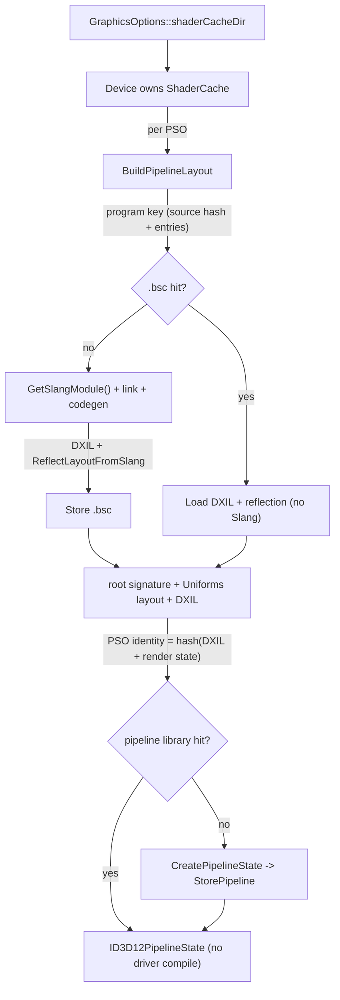

# Shader Cache — skipping shader compilation across runs

Compiling shaders dominates startup and is otherwise paid on every launch: the Slang front-end
parse alone is the majority of per-shader compile time, and the driver's DXIL→ISA compile is paid
again on top. The shader cache is a persistent, backend-owned store that skips both. It is enabled
by one knob, [GraphicsOptions::shaderCacheDir](libs/bgl/include/bgl/IGraphics.h) (empty ⇒ disabled),
and is otherwise transparent — pipeline creation consults it with no change to any interface.

**This document is a map, not a mirror.** It captures the design choices, the data flow, and the
non-obvious contracts — not full signatures. The source at each linked path is the source of truth;
when this doc disagrees, trust the source, then fix this doc.

---

## Design Choices

* **The cache is configuration, not an RHI object.** It is an internal optimization, so it is
  **not** a `bgl::I*` interface — see [Render Hardware Interface](docs/rhi.md). The only thing that
  crosses the RHI boundary is `GraphicsOptions::shaderCacheDir`, like the descriptor-heap
  capacities. The `Device` owns the cache and threads it through pipeline creation. A future Vulkan
  backend reads the same directory and backs it with `VkPipelineCache`; the on-disk formats are the
  backend's private business.

* **Two layers, each skipping a different compile stage.** The *program cache* (`<dir>/*.bsc`)
  holds DXIL bytecode + serialized reflection for one PSO's shader composition, skipping the entire
  Slang pipeline (front-end parse + DXIL codegen). The *pipeline library* (`<dir>/pipelines.psolib`,
  an `ID3D12PipelineLibrary`) holds driver-compiled PSOs, skipping the driver's DXIL→GPU-ISA
  compile. A warm launch that hits both touches neither Slang nor the driver compiler — except
  under GPU-based validation, which drops the pipeline library entirely (see Risky Contracts).

* **Module loading is lazy so a hit never parses source.** `IShader` no longer loads its Slang
  module in its constructor; `GetSlangModule()` compiles on first call, which only happens on a
  program-cache miss. On a hit, `BuildPipelineLayout` rebuilds the root signature, reflection, and
  bytecode straight from the `.bsc` and never calls `GetSlangModule()`.

* **Reflection is decoupled from the live Slang object.** A raw `slang::TypeLayoutReflection*` can't
  be serialized. So reflection is walked once, at pipeline build, into a serializable
  [ReflectedLayout](libs/bgl/src/uniforms/ReflectedLayout.h) POD, owned via `shared_ptr` in the
  pipeline's `UniformLayoutEntry`. `Uniforms` is built from that POD, not from Slang — which is both
  what makes reflection cacheable and why the pipeline no longer retains the linked Slang program.

* **Invalidation is coarse, content-based, and automatic.** A single salt folds the shader compiler
  version, the compile options (matrix layout, `BERNINI_GPU_DEBUG`), the cache format version, and a
  hash of the content of *every* shader source file. It is combined with the PSO's (module,
  entry-point) pairs to form each program key. Any change to any of those flips every key, so a
  stale entry is **missed and recompiled, never misread**. The pipeline library additionally
  self-invalidates against the driver and adapter — D3D12 rejects a foreign blob, and the cache
  falls back to an empty library.

* **Precompiled Slang IR modules (`.slang-module`) are deliberately not used.** They were the
  obvious tool for the reflection half but do not survive contact with this shader layer: Slang
  2026.7.x cannot resolve cross-module generic specializations from separately serialized modules,
  and generics are pervasive here (`idl.Entry`, `idl.Range`, the `types.*Buffer` bindless
  primitives). Worse, a `.slang-module` on the search path is preferred over source and hard-errors
  with no fallback, so one stale precompiled module poisons every consumer. The program cache
  (our own DXIL + reflection blob) sidesteps this entirely.

---

## Components

| Piece | File | Role |
|---|---|---|
| `ShaderCache` | [libs/bgl/src/d3d12/shadercache/ShaderCache_d3d12.h](libs/bgl/src/d3d12/shadercache/ShaderCache_d3d12.h) | Owns both layers; keying, load/store, PSO identity hashing. |
| `BuildPipelineLayout` | [libs/bgl/src/d3d12/pipeline/util.cpp](libs/bgl/src/d3d12/pipeline/util.cpp) | The hit/miss fork: load from cache, or compile with Slang and store. |
| `ReflectedLayout` | [libs/bgl/src/uniforms/ReflectedLayout.h](libs/bgl/src/uniforms/ReflectedLayout.h) | Serializable, API-agnostic constant-buffer layout tree. |
| `ReflectLayoutFromSlang` | [libs/bgl/src/uniforms/SlangReflection.h](libs/bgl/src/uniforms/SlangReflection.h) | The one place Slang reflection is read; emits `ReflectedLayout`. |
| `ByteReader` / `ByteWriter` | [libs/core/include/core/io/ByteReader.h](libs/core/include/core/io/ByteReader.h) | Shared binary IO for the `.bsc` serialization (also used by assetlib). |
| `shaderCacheDir` knob | [libs/bgl/include/bgl/IGraphics.h](libs/bgl/include/bgl/IGraphics.h) | The sole RHI-visible surface. |

---

## Topology



Under GPU-based validation the `PLIB` layer is absent: no pipeline library exists, so every PSO
takes the `CreatePipelineState` path and none is stored (see Risky Contracts).

---

## Risky / Non-obvious Contracts

* **PSO identity must be deterministic across runs.** The pipeline-library key hashes each entry
  point's DXIL plus the render-state structs. Those structs are hashed as raw bytes, which is only
  safe because they are zero-initialized before the `Convert*` helpers fill them — so padding is a
  deterministic `0`. @pre any new render-state field added to the PSO stream must be included in the
  identity, and its struct must remain zero-initialized, or warm runs will spuriously miss.

* **The cache grows by one orphaned generation per shader edit.** Because the salt folds all shader
  source content, editing any `.slang` flips every key; the next run writes a fresh `.bsc` set and
  the previous generation is never read or deleted. The directory is disposable (delete it → a
  one-time recompile). There is currently no eviction.

* **A corrupt or truncated `.bsc` is treated as a miss, not an error.** `TryLoad` deserializes
  through a bounds-checked reader that throws on truncation; the throw is caught and the entry is
  recompiled. Never assume a present file is valid.

* **Pipeline-library round-trip is the driver's prerogative.** Whether a given PSO reloads from the
  library is driver/environment-dependent (some PSOs miss and get re-stored). A miss only falls back
  to `CreatePipelineState`, so it never affects correctness — but do not assert that a warm run
  leaves `pipelines.psolib` unrewritten. The program cache (`.bsc`), by contrast, is deterministic
  and *is* safe to assert on.

* **The pipeline library is disabled under GPU-based validation.** A PSO replayed from the library
  carries the instrumentation it was built with, so replaying one into a GBV-enabled device would
  skip the shader patching that run exists to apply. When `enableGPUValidationLayer` is on, the
  `ShaderCache` is constructed with `usePipelineLibrary=false` and no `pipelines.psolib` is created
  or read; every PSO goes through `CreatePipelineState`. The program cache (`.bsc`) is unaffected —
  the DXIL is identical either way — so only the driver's DXIL→ISA compile is repaid, not the Slang
  front-end.

* **`GetSlangModule()` is a lazy, memoizing const getter** (`mutable` module handle). @pre it may
  front-end-compile on first call (the slow path) and `gfatal` on a shader error; it does nothing on
  a program-cache hit because it is never called.

---

## Usage Sketch

```cpp
auto opts           = bgl::GraphicsOptions();
opts.shaderCacheDir = "shadercache";   // relative to cwd; empty disables the cache
auto gfx            = bgl::CreateGraphics(opts);
// First run compiles and populates ./shadercache; later runs load it.
```

See [examples/bgl_base/src/main.cpp](examples/bgl_base/src/main.cpp) for a full runnable example,
and [libs/bgl/tests/src/ShaderCache_test.cpp](libs/bgl/tests/src/ShaderCache_test.cpp) for the
cold/warm/corrupt behaviour the cache guarantees.

---

> **Maintenance:** the component table links rot silently if files move. When the shader-cache file
> layout changes, re-check every link and the topology diagram.
