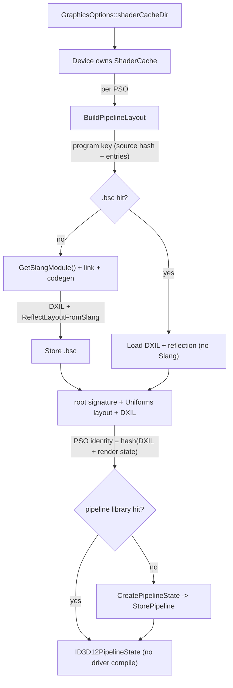

# Shader Cache — skipping shader compilation across runs

Compiling shaders dominates startup and is otherwise paid on every launch: the Slang front-end
parse alone is the majority of per-shader compile time, and the driver's DXIL→ISA compile is paid
again on top. The shader cache is a persistent, backend-owned store that skips both. It is enabled
by one knob, [GraphicsOptions::shaderCacheDir](libs/bgl/include/bgl/IGraphics.h) (empty ⇒ disabled),
and is otherwise transparent — pipeline creation consults it with no change to any interface.

**This document is a map, not a mirror.** It captures the design choices, the data flow, and the
non-obvious contracts — not full signatures. The source at each linked path is the source of truth;
when this doc disagrees, trust the source, then fix this doc.

---

## Design Choices

* **The cache is configuration, not an RHI object.** It is an internal optimization, so it is
  **not** a `bgl::I*` interface — see [Render Hardware Interface](docs/rhi.md). The only thing that
  crosses the RHI boundary is `GraphicsOptions::shaderCacheDir`, like the descriptor-heap
  capacities. The `Device` owns the cache and threads it through pipeline creation. A future Vulkan
  backend reads the same directory and backs it with `VkPipelineCache`; the on-disk formats are the
  backend's private business.

* **Two layers, each skipping a different compile stage.** The *program cache* (`<dir>/*.bsc`)
  holds generated code + serialized reflection for one PSO's shader composition, skipping the entire
  Slang pipeline (front-end parse + codegen). The *pipeline library* (`<dir>/pipelines.psolib`)
  holds driver-compiled pipelines, skipping the driver's bytecode→GPU-ISA compile. A warm launch
  that hits both touches neither Slang nor the driver compiler — except under GPU-based validation,
  which drops the pipeline library entirely (see Risky Contracts).

* **Both backends implement it; the entry contents differ.** D3D12 stores DXIL and a root parameter
  index per cbuffer, and backs the library with an `ID3D12PipelineLibrary`. Metal stores MSL per
  *stage* and that stage's `[[buffer(N)]]` indices, and backs the library with an
  `MTL::BinaryArchive`. The split is why the shared code
  ([shadercache/util.h](libs/bgl/src/shadercache/util.h)) is only the salt, the key, the
  `ReflectedLayout` encoding and the atomic write, while each backend owns a `ShaderCache` of its
  own. A cache directory is written by one backend and is not portable between them — the
  salt differs, so the other backend misses every key rather than misreading one.

* **Metal caches per stage because it compiles per stage.** A meshlet PSO is three separate Slang
  links (object/mesh/fragment), each with its own MSL and its own buffer-index space, so a cache
  entry carries a `CachedStage` per stage rather than one blob. A mesh-only pipeline — reflection
  with nothing to rasterize — caches its cbuffers and a mesh stage holding only the threadgroup
  size, and builds no pipeline state.

* **Module loading is lazy so a hit never parses source.** `IShader` no longer loads its Slang
  module in its constructor; `GetSlangModule()` compiles on first call, which only happens on a
  program-cache miss. On a hit, `BuildPipelineLayout` rebuilds the root signature, reflection, and
  bytecode straight from the `.bsc` and never calls `GetSlangModule()`.

* **The Slang session itself is lazy, and is dropped once the renderer is built.** Creating a
  global session loads Slang's core module, which costs a few hundred megabytes that then stay
  resident for the process — so `Device` creates one only when a compile actually reaches it, which
  on a fully warm cache is never. `BuildPipelineLayout` therefore takes no session: it is reached
  only through `Shader::GetSlangModule()`, down the miss path. Everything the renderer draws with
  is built inside the `Graphics` constructor, which ends by calling `Device::ReleaseSlangSession()`;
  a pipeline created later (every `bgl_tests` case that builds its own kernel) transparently gets a
  new session. The salt reads the compiler version through the free `spGetBuildTagString()` rather
  than `IGlobalSession::getBuildTagString()` — the two return the same string, and only the free
  one avoids creating a session just to key the cache.

  Metal does the same: its `Device` creates the session lazily on the first compile and
  `Graphics` releases it once every renderer PSO is built.

* **Reflection is decoupled from the live Slang object.** A raw `slang::TypeLayoutReflection*` can't
  be serialized. So reflection is walked once, at pipeline build, into a serializable
  [ReflectedLayout](libs/bgl/src/uniforms/ReflectedLayout.h) POD, owned via `shared_ptr` in the
  pipeline's `UniformLayoutEntry`. `Uniforms` is built from that POD, not from Slang — which is both
  what makes reflection cacheable and why the pipeline no longer retains the linked Slang program.

* **Invalidation is coarse, content-based, and automatic.** A single salt folds the shader compiler
  version, the compile options (matrix layout, `BERNINI_GPU_DEBUG`), the cache format version, and a
  hash of the content of *every* shader source file, chained through `core::hash_bytes`. It is
  combined with the PSO's (module, entry-point) pairs to form each program key. Any change to any of those flips every key, so a
  stale entry is **missed and recompiled, never misread**. The pipeline library additionally
  self-invalidates against the driver and adapter — D3D12 rejects a foreign blob and Metal refuses
  an archive from another GPU, and both fall back to an empty library.

* **Precompiled Slang IR modules (`.slang-module`) are deliberately not used.** They were the
  obvious tool for the reflection half but do not survive contact with this shader layer: Slang
  2026.7.x cannot resolve cross-module generic specializations from separately serialized modules,
  and generics are pervasive here (`idl.Entry`, `idl.Range`, the `types.*Buffer` bindless
  primitives). Worse, a `.slang-module` on the search path is preferred over source and hard-errors
  with no fallback, so one stale precompiled module poisons every consumer. The program cache
  (our own bytecode + reflection blob) sidesteps this entirely.

---

## Components

| Piece | File | Role |
|---|---|---|
| `shader_cache::` util | [libs/bgl/src/shadercache/util.h](libs/bgl/src/shadercache/util.h) | Backend-agnostic core: salt, key, `ReflectedLayout` encoding, atomic write. |
| `core::hash_bytes` | [libs/core/include/core/hash.h](libs/core/include/core/hash.h) | The FNV-1a chain the salt and every key are built from. |
| `ShaderCache` (D3D12) | [libs/bgl/src/d3d12/shadercache/ShaderCache_d3d12.h](libs/bgl/src/d3d12/shadercache/ShaderCache_d3d12.h) | Owns both layers; keying, load/store, PSO identity hashing. |
| `ShaderCache` (Metal) | [libs/bgl/src/metal/shadercache/ShaderCache_metal.h](libs/bgl/src/metal/shadercache/ShaderCache_metal.h) | The same, over MSL stages and an `MTL::BinaryArchive`. |
| `BuildPipelineLayout` | [libs/bgl/src/d3d12/pipeline/PipelineLayout_d3d12.cpp](libs/bgl/src/d3d12/pipeline/PipelineLayout_d3d12.cpp) | The D3D12 hit/miss fork: load from cache, or compile with Slang and store. |
| `CompileProgram` | [libs/bgl/src/metal/pipeline/MeshletPipeline_metal.cpp](libs/bgl/src/metal/pipeline/MeshletPipeline_metal.cpp) | The Metal miss path: one composed link for reflection, one per stage for MSL. |
| `ReflectedLayout` | [libs/bgl/src/uniforms/ReflectedLayout.h](libs/bgl/src/uniforms/ReflectedLayout.h) | Serializable, API-agnostic constant-buffer layout tree. |
| `ReflectLayoutFromSlang` | [libs/bgl/src/uniforms/SlangReflection.h](libs/bgl/src/uniforms/SlangReflection.h) | The one place Slang reflection is read; emits `ReflectedLayout`. |
| `ByteReader` / `ByteWriter` | [libs/core/include/core/io/ByteReader.h](libs/core/include/core/io/ByteReader.h) | Shared binary IO for the `.bsc` serialization (also used by assetlib). |
| `shaderCacheDir` knob | [libs/bgl/include/bgl/IGraphics.h](libs/bgl/include/bgl/IGraphics.h) | The sole RHI-visible surface. |

---

## Topology


```mermaid
flowchart TD
    OPT["GraphicsOptions::shaderCacheDir"] --> DEV["Device owns ShaderCache"]
    DEV -- "per PSO" --> BPL["BuildPipelineLayout"]

    BPL -- "program key (source hash + entries)" --> HIT{".bsc hit?"}
    HIT -- "no" --> SLANG["GetSlangModule() + link + codegen"]
    SLANG -- "DXIL + ReflectLayoutFromSlang" --> STORE["Store .bsc"]
    HIT -- "yes" --> LOAD["Load DXIL + reflection (no Slang)"]

    STORE --> ROOT["root signature + Uniforms layout + DXIL"]
    LOAD --> ROOT

    ROOT -- "PSO identity = hash(DXIL + render state)" --> PLIB{"pipeline library hit?"}
    PLIB -- "yes" --> PSO["ID3D12PipelineState (no driver compile)"]
    PLIB -- "no" --> CREATE["CreatePipelineState -> StorePipeline"]
    CREATE --> PSO
```

Under GPU-based validation the `PLIB` layer is absent: no pipeline library exists, so every PSO
takes the `CreatePipelineState` path and none is stored (see Risky Contracts).

---

## Risky / Non-obvious Contracts

* **PSO identity must be deterministic across runs.** The pipeline-library key hashes each entry
  point's DXIL plus the render-state structs. Those structs are hashed as raw bytes, which is only
  safe because they are zero-initialized before the `Convert*` helpers fill them — so padding is a
  deterministic `0`. @pre any new render-state field added to the PSO stream must be included in the
  identity, and its struct must remain zero-initialized, or warm runs will spuriously miss.

* **The cache grows by one orphaned generation per shader edit.** Because the salt folds all shader
  source content, editing any `.slang` flips every key; the next run writes a fresh `.bsc` set and
  the previous generation is never read or deleted. The directory is disposable (delete it → a
  one-time recompile). There is currently no eviction.

* **A corrupt or truncated `.bsc` is treated as a miss, not an error.** `TryLoad` deserializes
  through a bounds-checked reader that throws on truncation; the throw is caught and the entry is
  recompiled. Never assume a present file is valid.

* **No Slang object may be held past pipeline construction.** A `slang::IModule` keeps its session
  alive, so one cached ref re-pins the core module and `ReleaseSlangSession` reclaims nothing. This
  is why `Shader` does *not* memoize its module and calls `loadModule` each time — the session
  already caches modules by name, so the repeat call is a lookup. @pre anything new that stores a
  `slang::` pointer must drop it before the `Graphics` constructor returns.

* **Pipeline-library round-trip is the driver's prerogative.** Whether a given PSO reloads from the
  library is driver/environment-dependent (some PSOs miss and get re-stored). A miss only falls back
  to `CreatePipelineState`, so it never affects correctness — but do not assert that a warm run
  leaves `pipelines.psolib` unrewritten. The program cache (`.bsc`), by contrast, is deterministic
  and *is* safe to assert on.

* **The pipeline library is disabled under GPU validation, on both backends.** A PSO replayed from
  the library carries the instrumentation it was built with, so replaying one into a validating
  device would skip the shader patching that run exists to apply. The `ShaderCache` is constructed
  with `usePipelineLibrary=false` and no driver-pipeline file is created or read; every PSO goes
  through the driver. The program cache (`.bsc`) is unaffected — the generated code is identical
  either way — so only the driver's compile is repaid, not the Slang front-end.

  On Metal this is not merely an optimisation to skip: `newBinaryArchive` **segfaults inside Metal**
  loading an archive written by an uninstrumented run, so before this gate existed a GPU-validation
  run crashed at device creation unless the cache directory was deleted first. That is why nobody had
  run one.

  **Metal's validation is turned on by the environment, not by `GraphicsOptions`** —
  `MTL_SHADER_VALIDATION` / `METAL_DEVICE_WRAPPER_TYPE` are read by the Metal runtime before the
  process gets a say. `Graphics_metal` therefore reads both variables as well as
  `enableGPUValidationLayer`, or the flag would say "off" during a validating run.

* **`GetSlangModule()` is a lazy, memoizing const getter** (`mutable` module handle). @pre it may
  front-end-compile on first call (the slow path) and `gfatal` on a shader error; it does nothing on
  a program-cache hit because it is never called.

---

## Usage Sketch

```cpp
auto opts           = bgl::GraphicsOptions();
opts.shaderCacheDir = "shadercache";   // relative to cwd; empty disables the cache
auto gfx            = bgl::CreateGraphics(opts);
// First run compiles and populates ./shadercache; later runs load it.
```

See [examples/bgl_base/src/main.cpp](examples/bgl_base/src/main.cpp) for a full runnable example,
and [libs/bgl/tests/src/ShaderCache_test.cpp](libs/bgl/tests/src/ShaderCache_test.cpp) for the
cold/warm/corrupt behaviour the cache guarantees.

---

> **Maintenance:** the component table links rot silently if files move. When the shader-cache file
> layout changes, re-check every link and the topology diagram.
