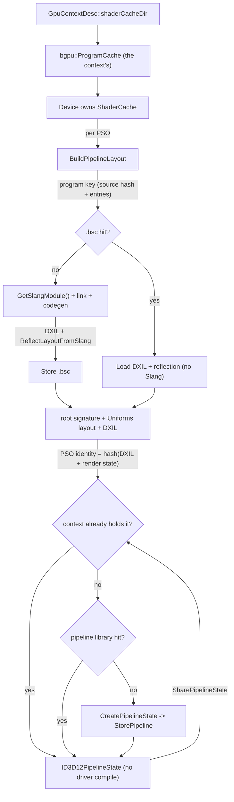

# Shader Cache — skipping shader compilation across runs

Compiling shaders dominates startup and is otherwise paid on every launch: the Slang front-end
parse alone is the majority of per-shader compile time, and the driver's DXIL→ISA compile is paid
again on top. The shader cache is a persistent store that skips both. It is enabled by one knob,
[GpuContextDesc::shaderCacheDir](libs/bgpu/include/bgpu/GpuContext.h) (empty ⇒ disabled), and is
otherwise transparent — pipeline creation consults it with no change to any interface.

**This document is a map, not a mirror.** It captures the design choices, the data flow, and the
non-obvious contracts — not full signatures. The source at each linked path is the source of truth;
when this doc disagrees, trust the source, then fix this doc.

---

## Design Choices

* **The cache is configuration, not an RHI object.** It is an internal optimization, so it is
  **not** a `bgpu::I*` interface — see [Render Hardware Interface](docs/rhi.md). Nothing about it
  crosses the RHI boundary: the directory is the GPU context's, beside its `clientShaderDir`, whose
  files are in the salt. The `Device` builds a `ShaderCache` when the context has a program cache
  and threads it through pipeline creation. The Vulkan backend reads the same directory, and its driver
  layer, when it has one, is a `VkPipelineCache`; what an entry holds is the backend's private
  business.

* **The program layer is the GPU context's, and every owner of the device shares it.** The salt
  describes what the context's Slang sessions compile, so it is `bgpu`'s:
  [bgpu::ProgramCache](libs/bgpu/include/bgpu/ProgramCache.h) keys, stores and loads compiled
  programs for the renderer's backends and for any other owner that compiles through the sessions
  ([bgpu.md](docs/bgpu.md)) — crowdlib's kernel beside the renderer's pipelines
  ([crowdlib.md](docs/crowdlib.md)). It keeps bytes; each owner encodes its own entry, and a
  `ProgramCacheOwner` tag and format version in every key keep one owner from reading another's.
  The driver layer is not shared: it needs the native device and one writer per directory.

* **Two layers, each skipping a different compile stage.** The *program cache* (`<dir>/*.bsc`)
  holds generated code + serialized reflection for one PSO's shader composition, skipping the entire
  Slang pipeline (front-end parse + codegen). The *pipeline library* (`<dir>/pipelines.psolib`)
  holds driver-compiled pipelines, skipping the driver's bytecode→GPU-ISA compile. A warm launch
  that hits both touches neither Slang nor the driver compiler — except under GPU-based validation,
  which drops the pipeline library entirely (see Risky Contracts).

* **Both backends implement it; the entry contents differ.** D3D12 stores DXIL and a root parameter
  index per cbuffer, and backs the library with an `ID3D12PipelineLibrary`. Metal stores MSL per
  *stage* and that stage's `[[buffer(N)]]` indices, and backs the library with an
  `MTL::BinaryArchive`. Vulkan, whose RHI is the compute half so far, stores SPIR-V and each
  cbuffer's binding and set, and keeps no driver library yet
  ([ShaderCache_vulkan.h](libs/bgpu/src/vulkan/shadercache/ShaderCache_vulkan.h)). The split is why the backends' shared code
  ([bgpu/src/shadercache/util.h](libs/bgpu/src/shadercache/util.h)) is only
  the `ReflectedLayout` encoding, while each backend owns a `ShaderCache` of its own: its entry
  encoding and its driver library. A cache directory is written by one backend and is not portable
  between them — the target is in the salt and the backend is the owner tag, so the other backend
  misses every key rather than misreading one.

* **Metal caches per stage because it compiles per stage.** A meshlet PSO is three separate Slang
  links (object/mesh/fragment), each with its own MSL and its own buffer-index space, so a cache
  entry carries a `CachedStage` per stage rather than one blob. A mesh-only pipeline — reflection
  with nothing to rasterize — caches its cbuffers and a mesh stage holding only the threadgroup
  size, and builds no pipeline state.

* **Module loading is lazy so a hit never parses source.** `IShader` no longer loads its Slang
  module in its constructor; `GetSlangModule()` compiles on first call, which only happens on a
  program-cache miss. On a hit, `BuildPipelineLayout` rebuilds the root signature, reflection, and
  bytecode straight from the `.bsc` and never calls `GetSlangModule()`.

* **Slang sessions are per thread, lazy, and dropped after every pipeline batch.** A global
  session and everything created from it are not thread-safe, but distinct global sessions may run
  in parallel (`slang.h`, `IGlobalSession`) — so
  [SlangSessions](libs/bgpu/src/SlangSessions.h) — the GPU context's, reached through
  `bgpu::GpuContext::LoadModule` and shared by every owner of the device — hands each thread that
  compiles a global session and a session of its own, created on that thread's first compile. Creating a global
  session loads Slang's core module, a few hundred megabytes that then stay resident, so none
  exists until a compile actually reaches it — which on a fully warm cache is never. The compile
  paths therefore take no session: they reach one only through `Shader::GetSlangModule()`, down the
  miss path, and read it back off the module. The renderer builds in batches — the always-on set
  inside the `Graphics` constructor, then one batch per `Draw` that demands draw buckets with no
  kernels yet — and each batch ends by calling `Device::ReleaseSlangSession()`; a pipeline created
  outside a batch (every `bgl_tests` case that builds its own kernel) transparently gets a new
  session on whichever thread asks. The salt reads the compiler version through the free
  `spGetBuildTagString()` rather than `IGlobalSession::getBuildTagString()` — the two return the
  same string, and only the free one avoids creating a session just to key the cache.

  Both backends share the one `SlangSessions`, and with it the one `Shader`: the session
  description (target, search paths, matrix layout, `BERNINI_GPU_DEBUG`) is built in one place, and
  a backend contributes only its target format.

* **Reflection is decoupled from the live Slang object.** A raw `slang::TypeLayoutReflection*` can't
  be serialized. So reflection is walked once, at pipeline build, into a serializable
  [ReflectedLayout](libs/bgpu/include/bgpu/reflection/ReflectedLayout.h) POD, owned via `shared_ptr` in the
  pipeline's `UniformLayoutEntry`. `Uniforms` is built from that POD, not from Slang — which is both
  what makes reflection cacheable and why the pipeline no longer retains the linked Slang program.

* **Invalidation is coarse, content-based, and automatic.** A single salt folds the shader compiler
  version, the compile options (target, profile, matrix layout, the macros — `BERNINI_GPU_DEBUG`),
  and a hash of the content of *every* shader source file under every search path — the client's
  `GpuContextDesc::clientShaderDir` included — chained through `core::hash_bytes`, and taken once
  per context. Each key adds the context's registered source modules, the owner's tag and format
  version, and the PSO's (module, entry-point) pairs. Any change to any of those flips every key it
  reaches, so a stale entry is **missed and recompiled, never misread**. The pipeline library additionally
  self-invalidates against the driver and adapter — D3D12 rejects a foreign blob and Metal refuses
  an archive from another GPU, and both fall back to an empty library.

* **Precompiled Slang IR modules (`.slang-module`) are deliberately not used.** They were the
  obvious tool for the reflection half but do not survive contact with this shader layer: Slang
  2026.7.x cannot resolve cross-module generic specializations from separately serialized modules,
  and generics are pervasive here (`idl.Entry`, `idl.Range`, the `types.*Buffer` bindless
  primitives). Worse, a `.slang-module` on the search path is preferred over source and hard-errors
  with no fallback, so one stale precompiled module poisons every consumer. The program cache
  (our own bytecode + reflection blob) sidesteps this entirely.

---

## Components

| Piece | File | Role |
|---|---|---|
| `ProgramCache` | [libs/bgpu/include/bgpu/ProgramCache.h](libs/bgpu/include/bgpu/ProgramCache.h) | The GPU context's store: salt, key, the checked `.bsc` entries, the directory. Shared by every owner. |
| `shader_cache::` util | [libs/bgpu/src/shadercache/util.h](libs/bgpu/src/shadercache/util.h) | The `ReflectedLayout` encoding both backends' entries carry. |
| `core::hash_bytes` | [libs/core/include/core/hash.h](libs/core/include/core/hash.h) | The FNV-1a chain the salt and every key are built from. |
| `ShaderCache` (D3D12) | [libs/bgpu/src/d3d12/shadercache/ShaderCache_d3d12.h](libs/bgpu/src/d3d12/shadercache/ShaderCache_d3d12.h) | The entry encoding over the context's store, the pipeline library, PSO identity hashing. |
| `ShaderCache` (Metal) | [libs/bgpu/src/metal/shadercache/ShaderCache_metal.h](libs/bgpu/src/metal/shadercache/ShaderCache_metal.h) | The same, over MSL stages and an `MTL::BinaryArchive`. |
| `BuildPipelineLayout` | [libs/bgpu/src/d3d12/pipeline/PipelineLayout_d3d12.cpp](libs/bgpu/src/d3d12/pipeline/PipelineLayout_d3d12.cpp) | The D3D12 hit/miss fork: load from cache, or compile with Slang and store. |
| `CompileProgram` | [libs/bgpu/src/metal/pipeline/MeshletPipeline_metal.cpp](libs/bgpu/src/metal/pipeline/MeshletPipeline_metal.cpp) | The Metal miss path: one composed link for reflection, one per stage for MSL. |
| `SlangSessions` | [libs/bgpu/src/SlangSessions.h](libs/bgpu/src/SlangSessions.h) | One global session + session per compiling thread, behind `bgpu::GpuContext`; created lazily, released after the renderer is built. |
| `Shader` | [libs/bgpu/include/bgpu/resource/Shader.h](libs/bgpu/include/bgpu/resource/Shader.h) | The one `IShader` for both backends: a module name and entry point, loaded on the calling thread's session. |
| `ReflectedLayout` | [libs/bgpu/include/bgpu/reflection/ReflectedLayout.h](libs/bgpu/include/bgpu/reflection/ReflectedLayout.h) | Serializable, API-agnostic constant-buffer layout tree. |
| `ReflectLayoutFromSlang` | [libs/bgpu/include/bgpu/reflection/SlangReflection.h](libs/bgpu/include/bgpu/reflection/SlangReflection.h) | The one place Slang reflection is read; emits `ReflectedLayout`. |
| `ByteReader` / `ByteWriter` | [libs/core/include/core/io/ByteReader.h](libs/core/include/core/io/ByteReader.h) | Shared binary IO for the `.bsc` serialization (also used by assetlib). |
| `shaderCacheDir` | [libs/bgpu/include/bgpu/GpuContext.h](libs/bgpu/include/bgpu/GpuContext.h) | Where the cache lives, for every owner of the context. |
| `clientShaderDir` | [libs/bgpu/include/bgpu/GpuContext.h](libs/bgpu/include/bgpu/GpuContext.h) | The one client directory whose files join every owner's salt. |

---

## Topology


```mermaid
flowchart TD
    OPT["GpuContextDesc::shaderCacheDir"] --> PC["bgpu::ProgramCache (the context's)"]
    PC --> DEV["Device owns ShaderCache"]
    DEV -- "per PSO" --> BPL["BuildPipelineLayout"]

    BPL -- "program key (source hash + entries)" --> HIT{".bsc hit?"}
    HIT -- "no" --> SLANG["GetSlangModule() + link + codegen"]
    SLANG -- "DXIL + ReflectLayoutFromSlang" --> STORE["Store .bsc"]
    HIT -- "yes" --> LOAD["Load DXIL + reflection (no Slang)"]

    STORE --> ROOT["root signature + Uniforms layout + DXIL"]
    LOAD --> ROOT

    ROOT -- "PSO identity = hash(DXIL + render state)" --> SHARED{"context already holds it?"}
    SHARED -- "yes" --> PSO["ID3D12PipelineState (no driver compile)"]
    SHARED -- "no" --> PLIB{"pipeline library hit?"}
    PLIB -- "yes" --> PSO
    PLIB -- "no" --> CREATE["CreatePipelineState -> StorePipeline"]
    CREATE --> PSO
    PSO -- "SharePipelineState" --> SHARED
```

The first layer is in memory and the GPU context's, not the renderer's: every PSO a renderer on
the context built, kept until the context dies (`bgpu::FindPipelineState` /
`SharePipelineState`). A second renderer on the same context reuses those objects instead of
building its own. That is the only layer that saves anything under GPU-based validation: the
debug layer patches each new PSO object on first use, so without sharing every test case repays
the patching (tens of seconds a case). D3D12 only; Metal renderers build their own.

Under GPU-based validation the `PLIB` layer is absent: no pipeline library exists, so a PSO the
context does not already hold takes the `CreatePipelineState` path and none is stored (see Risky
Contracts). A library built under validation would not help anyway: a PSO loaded from one is
still a new object and is patched again.

---

## Risky / Non-obvious Contracts

* **PSO identity must be deterministic across runs.** The pipeline-library key hashes each entry
  point's DXIL plus the render-state structs. Those structs are hashed as raw bytes, which is only
  safe because they are zero-initialized before the `Convert*` helpers fill them — so padding is a
  deterministic `0`. @pre any new render-state field added to the PSO stream must be included in the
  identity, and its struct must remain zero-initialized, or warm runs will spuriously miss.

* **The cache grows by one orphaned generation per shader edit.** Because the salt folds all shader
  source content, editing any `.slang` flips every key; the next run writes a fresh `.bsc` set and
  the previous generation is never read or deleted. The directory is disposable (delete it → a
  one-time recompile). There is currently no eviction.

* **A corrupt or truncated `.bsc` is treated as a miss, not an error.** The context's store checks
  every entry's header — magic, key, payload size and hash — before handing it back, and the
  backend then decodes through a bounds-checked reader whose throw is caught too; either way the
  entry is recompiled. Never assume a present file is valid.

* **No Slang object may be held past pipeline construction.** A `slang::IModule` keeps its session
  alive, so one cached ref re-pins the core module and `ReleaseSlangSession` reclaims nothing. This
  is why `Shader` does *not* memoize its module and calls `loadModule` each time — the session
  already caches modules by name, so the repeat call is a lookup — and why a module must never
  cross threads: it belongs to the session of the thread that loaded it. @pre anything new that stores a
  `slang::` pointer must drop it before the batch that compiled it releases the sessions -- the
  `Graphics` constructor's batch and every later demand batch alike.

* **A module loaded from source shadows the file of its name, and is in the salt.**
  `IDevice::AddSourceModule` hands the sessions a module as text under a name spelled as an import
  spells it; every session loads it, under the path form the loader keys a dotted import by, before
  it compiles anything, so an `import` of that name resolves to the text before any search path is
  consulted — which is how a surface's generated programs resolve its `game.slotN` binding. A
  module no `import` names (`SlangSourceModule::imported` false: every generated program) is not
  loaded up front but from its text the first time a shader names it, so a session parses only
  the programs it builds; that is also how the generated `programs.forward.Transparent` shadows
  the shipped file. A name maps to one text per GPU context: the same text again changes
  nothing, a new one replaces the old and drops every live session, since a session that has already
  resolved the name keeps that answer. The context folds every registered name and text into a
  source salt (`bgpu::GpuContext::GetSourceSalt`) that each owner's cache mixes into every key, so
  the program compiled against the file and the one compiled against the text never share a key,
  and a key follows a text another owner changed.

* **Pipeline-library round-trip is the driver's prerogative.** Whether a given PSO reloads from the
  library is driver/environment-dependent (some PSOs miss and get re-stored). A miss only falls back
  to `CreatePipelineState`, so it never affects correctness — but do not assert that a warm run
  leaves `pipelines.psolib` unrewritten. The program cache (`.bsc`), by contrast, is deterministic
  and *is* safe to assert on.

* **The pipeline library is disabled under GPU validation, on both backends.** A PSO replayed from
  the library carries the instrumentation it was built with, so replaying one into a validating
  device would skip the shader patching that run exists to apply. The `ShaderCache` is constructed
  with `usePipelineLibrary=false` and no driver-pipeline file is created or read; every PSO goes
  through the driver. The program cache (`.bsc`) is unaffected — the generated code is identical
  either way — so only the driver's compile is repaid, not the Slang front-end.

  On Metal this is not merely an optimisation to skip: `newBinaryArchive` **segfaults inside Metal**
  loading an archive written by an uninstrumented run, so before this gate existed a GPU-validation
  run crashed at device creation unless the cache directory was deleted first. That is why nobody had
  run one.

  **Neither backend can decide this from its own options alone.** On Metal the switches are
  environment variables — `MTL_SHADER_VALIDATION` / `METAL_DEVICE_WRAPPER_TYPE`, read by the Metal
  runtime before the process gets a say — so the context reads both as well as
  `enableGPUValidationLayer`. On D3D12 `SetEnableGPUBasedValidation` sets it on the *debug layer*,
  which belongs to the process and not to the `ID3D12Debug1` that called it: every device created
  afterwards is instrumented, including one whose desc never asked and one created after that
  context was dropped. `bgpu::GpuContext::GpuValidationActive` therefore answers for the process
  rather than reading the desc back, or a successor context would report "off" while running
  instrumented and its owners would cache driver pipelines built without the instrumentation —
  which is the case this gate exists to prevent.

* **One writer per directory holds the pipeline library.** The library is serialized and
  replaced *whole* by whoever writes it last, so two writers on one directory — `just test`
  runs four shards against the suite's `shadercache`, and a process may hold two renderers —
  would each discard the other's. The first to open `pipelines.psolib.lock` unshared owns the
  library; the rest run with none, paying PSO creation and nothing else, since the program
  cache beside it is content-keyed and shared safely. The lock is delete-on-close, so a killed
  process releases it with nothing to clean up.

* **The cache is called from several threads at once.** The renderer builds its pipelines in
  parallel, so `TryLoad`/`Store` run concurrently — safe because each key is its own file and
  `core::file::write_atomic` renames a uniquely named temp into place — and the driver pipeline library
  (`ID3D12PipelineLibrary`, `MTL::BinaryArchive`) is reached only under the cache's own mutex. Two
  PSOs with the same shader composition may both miss and both compile on a cold run; the second
  `Store` replaces the first with identical bytes.

* **`GetSlangModule()` front-end-compiles on the calling thread's session.** @pre it may
  front-end-compile on first call (the slow path) and `core::fatal` on a shader error; it does nothing on
  a program-cache hit because it is never called.

---

## Usage Sketch

```cpp
auto desc           = bgpu::GpuContextDesc();
desc.shaderCacheDir = "shadercache";   // relative to cwd; empty disables the cache for every owner
auto context        = bgpu::CreateGpuContext(desc);
auto gfx            = bgl::CreateGraphics(context, bgl::GraphicsOptions());
// First run compiles and populates ./shadercache; later runs load it.
```

See [examples/bgl_base/src/main.cpp](examples/bgl_base/src/main.cpp) for a full runnable example,
and [libs/bgl/tests/src/ShaderCache_test.cpp](libs/bgl/tests/src/ShaderCache_test.cpp) for the
cold/warm/corrupt behaviour the cache guarantees.

---

> **Maintenance:** the component table links rot silently if files move. When the shader-cache file
> layout changes, re-check every link and the topology diagram.
