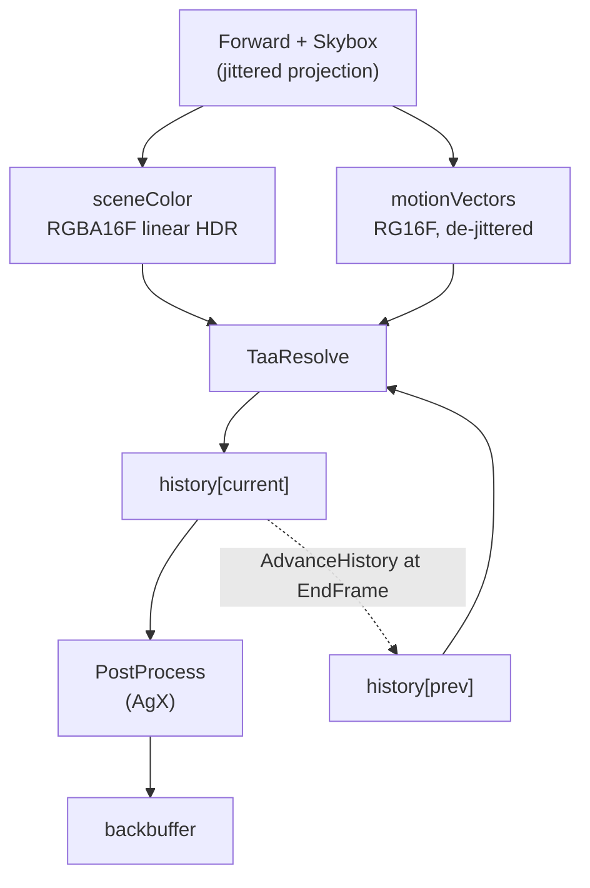

# Temporal Antialiasing

TAA trades a sub-pixel offset per frame for an antialiased image: the projection is jittered so the
sample grid walks the pixel footprint, and an accumulation buffer averages the results. Motion
vectors are what let the average survive a moving camera — last frame's colour is fetched from where
each surface *was*, not from where the pixel is.

It is **opt-in per render target** (`RenderTargetDesc::taaEnabled`) and off by default, because it
makes a frame depend on the frames before it. A caller that renders a fixed small number of frames —
a thumbnail, a render test — cannot converge, so it must not silently get an unconverged image. In
the editor that split is the viewport windows (which redraw continuously) against the thumbnail
cache, which renders one frame per asset and does not opt in at all: its private asset manager
loads each hashed-alpha material as the blend material its coverage converges to
(`AssetManagerOptions::hashedAsBlend`), so the converged look is drawn directly rather than
accumulated. Each viewport reads its own `temporalAA` key in `config.json` — under `levelEditor`,
`materialEditor` and `animationEditor`, beside the other things that size that window's render target, rather than
under `graphics`, which is where `GraphicsOptions` lives.

The desc flag decides **allocation**; `IRenderTarget::SetTaaEnabled` decides whether it **runs**, so
a viewport can be compared against itself without recreating anything. Enabling it on a target that
allocated nothing throws — there is no history to accumulate into, and silently ignoring the call
would leave a caller wondering why the image never resolves.

The two are not interchangeable, which is why the editor exposes both. A `temporalAA: false` viewport
never creates its history buffers, so that is what actually gives back the memory and the two RTV
slots; the Render menu's toggle only stops the work. The menu is offered when *any* viewport
allocated a history and is disabled otherwise — rather than hidden, so the answer to "why can I not
turn this on" is in the place that asks the question — and a viewport configured without it ignores
the call instead of throwing.

What TAA leaves behind is **resolution-dependent**: the jitter walks a pixel footprint, so how much
of an edge or a hashed strand falls inside one pixel decides how much the neighbourhood clamp has to
throw away, and a flicker that is obvious at 1080p can be invisible on a 4K panel. The editor's
Render menu carries a **Render Scale** for that: it multiplies each viewport's render resolution on
top of the display's device pixel ratio, and the resolve reconstructs the window's own resolution
back out of the jittered frames. Half scale on a 2× display is a 1080p sample grid inside a 4K
window, which is what makes the artifact reproducible on the machine that does not have the display
it was reported on. `renderScale` under `levelEditor`,
`materialEditor` and `animationEditor` in `config.json` sets the value the editor starts at; the menu moves every viewport
from there, live, because the comparison is what shows a temporal artifact.

Beside it is **TAA Reconstruction Width** (`taaReconstructionWidth`, same three keys, 0.4 by
default): how wide a kernel the resolve rebuilds each output pixel with, in output pixels. It is the
one number in the resolve whose trade a still image only half shows — narrower keeps sharpening a
held frame, and what it costs is the frames a moving pixel waits for the jitter phase that serves it
— so it is swept by eye on a scene rather than fixed at whatever a test measured. At a render scale
of 1 it does nothing at all: each output pixel has a sample of its own there.

**The resolve is deliberately the standard recipe** — jittered accumulation, YCoCg variance
clipping, Catmull-Rom history, luma-weighted blending, silhouette dilation — and nothing else. It
once carried a bespoke resting shelter (a per-pixel variance store that widened the clamp box and
deepened the blend at rest, guarding converged stochastic coverage), removed 2026-08-22: it
ghosted on any surface that rested and then moved faster than its neighbourhood could witness, and
holding it correct cost machinery a standard resolve does not need. What the removal spends is
resting stochastic quality — a converged hashed patch flickers at roughly the level it does
mid-pan (measured 60–80× the sheltered figure), and sub-pixel strands at distance, hashed *and*
alpha-tested, read dimmer — judged acceptable by eye against keeping the machinery.

**This document is a map, not a mirror.** The headers at each linked path are the source of truth.

---

## Design Choices

* **The client's `Camera` never carries the jitter.** `RenderContext::Draw` left-multiplies a
  clip-space translation onto the projection it builds, so the public
  [Camera](libs/bgl/include/bgl/Camera.h) a caller reads back for picking or gizmo placement is the
  one they set. A translation rather than a poke at the projection's own terms: it adds
  `jitter * clip.w` to `clip.xy`, which lands as a constant NDC offset after the divide and is
  correct for an orthographic camera too.

* **A velocity describes the surface, not the sample pattern.** `SV_Position` keeps its jitter — that
  is the whole point of it — but `ForwardVSOut::clip` / `prevClip` have each frame's offset removed
  in the mesh shader, so `ComputeMotionVector` is a plain difference. Without this a static camera
  reports a full pixel of motion every frame, which is exactly the reprojection error TAA is least
  able to hide. The subtraction is in the *mesh* shader deliberately: see the shared-module hazard in
  [Slang Shaders](docs/slang_shaders.md).

* **Halton(2, 3), eight terms per output sub-pixel, indexed by the target's own frame count.** Long
  enough to cover the footprint, short enough that the ghosting tail stays inside what the blend
  weight forgives. Eight is the length where one render sample serves one output pixel; a denser
  output grid multiplies it by the sub-pixels one render pixel covers, capped at thirty-two, because
  each of those sub-pixels wants the same walk. It is derived per target rather than raised for
  everyone — raising it would change which offset frame N renders with at scale 1.0, where every
  figure this document quotes was measured. The offset spans a *render* pixel either way. The
  sequence is 1-based, because term 0 of every radical inverse is 0 — a frame that samples exactly
  where an unjittered one does contributes nothing new. The index is `RenderTargetBase::GetFrameCount`,
  not the renderer's frame counter, for the reason the history ping-pong is per target (below): two
  viewports drawn by one renderer would otherwise each see every second term — four lopsided
  positions instead of the footprint — and a third would change what the first two converge to.
  The alpha hash seed advances on the same count.

* **The accumulation lives on the output grid, not the render one.** A target carries two sizes:
  scene colour, depth, velocity and the outline mask follow `RenderTargetDesc::renderScale`, while
  the backbuffer and both histories are the size the target presents at. The resolve is the only
  pass that spans them. This is what makes a render scale a *reconstruction* rather than a stretch —
  and what attacks the loss a render-grid accumulation cannot: a moving mesh re-fetches its history
  at a fractional texel offset every frame, Catmull-Rom sheds a little contrast per fetch near
  Nyquist, and the features that fall inside that band are exactly the pixel-scale ones. Accumulating
  on a finer grid puts them outside it. Measured on slats about one render pixel across at half
  scale: mean squared distance from the full-scale image 5.8e-5 held and 7.4e-5 under a drift,
  against 5.2e-4 and 2.2e-4 for the filtered upscale it replaces.

* **An output pixel takes the render sample whose jitter landed nearest it, weighted by how near.**
  A Gaussian of `RenderTargetDesc::taaReconstructionWidth` *output* pixels, 0.4 by default,
  normalized over the sub-pixel phases one render sample serves.
  Both halves matter. Unnormalized, the kernel would scale the blend by the jitter's phase even where
  there is nothing to choose between, and would change the image at scale 1.0, where there is one
  phase and its weight is its own mean — exactly one, and *returned* as one rather than divided out,
  because a backend may implement that division as an approximate reciprocal and land either side of
  it. Measured at a *render* pixel's width instead of
  an output pixel's, the reconstruction gives an output pixel a strong share of a sample a whole
  output pixel away and comes out softer than a plain filtered upscale (1.3e-4 against that same
  5.8e-5). Narrower still keeps improving a *held* frame without limit and is not the default: what it
  costs is the frames a moving pixel waits for the phase that serves it, which no still measurement
  can see.

* **The clamp box, the depth read and the object-motion discriminator all stay on the render 3×3.**
  A 3×3 on the output grid is nine taps of a reconstruction — it can report no colour the render
  neighbourhood did not already contain. Only the history fetch and its Catmull-Rom taps are in
  output texels.

* **The resolve writes history and nothing else.** `PostProcess` reads what it produced and applies
  the display curve. Merging the two would save a full-screen pass and cost the seam: bloom, grading
  and exposure adaptation belong between a resolved scene and the screen, and each would otherwise
  arrive as a change to the TAA shader.

* **History is HDR, and so is the accumulation.** Both `sceneColor` and the two history buffers are
  `RGBA16_FLOAT` linear radiance with exposure already folded in. The display curve is the last thing
  that happens, never something baked into the accumulator.

* **The history is fetched with Catmull-Rom, not bilinear.** The reprojected position is off texel
  centres every frame the camera moves, and a bilinear fetch convolves the accumulation with a tent
  each time — under sustained motion the softening compounds, and snaps sharp again on stopping,
  which reads as motion blur. Five bilinear taps stand in for the 4×4 kernel; at rest the fetch
  lands on texel centres and is exact, so a still image is bit-identical. Measured on a moving
  mid-grey fence: 0.60 of the still image's detail with bilinear, 0.66 with Catmull-Rom — the clamp
  bounds how much softness can survive, so the gap is modest, but it is the visible part.

* **Neighbourhood clamping in YCoCg, not RGB.** The bounds are an axis-aligned box, and in RGB that
  box is a poor fit to the colours an edge actually produces — it admits history the pixel could not
  have come from, which is what ghosting looks like. History is *clamped* rather than rejected: a
  merely stale sample still carries sub-pixel detail worth keeping once pulled inside the box.

* **The blend is weighted by inverse luma above a knee of 1, linearly below it.** A single bright
  sample would otherwise dominate the average and smear across frames. But weighting each operand
  by its own luma converges a bimodal signal below its true mean — a hashed strand's pixel
  alternates bright and dark, and the biased average measured as a fifth of the strand's surviving
  coverage on a distant card — so only genuine HDR outliers pay the compression. The weighting is
  undone afterwards, so what is stored stays linear.

* **A change *no motion vector describes* drops the accumulation.** Reprojection answers "where was
  this surface last frame", and a material rewritten, rebound or deleted moves nothing — the pixel's
  velocity is zero and the history is fetched from exactly where it was written, so the resolve
  blends the old material with the new one for as long as the clamp lets it.
  `Scene::GetTemporalEpoch` and its per-view counterpart count those changes,
  `SceneView::AdvanceTemporalEpoch` reports one to the frame that draws after it, and the resolve
  then takes the scene colour whole exactly as the first frame does. The cost is one unaccumulated
  frame per edit; the alternative is a ghost lasting tens.

  It counts **discrete rebinds only** — a material's contents, a submesh's binding, a texture's
  release, an environment map, the scene's ground plane. Anything a caller moves every frame (the
  camera, a transform, the exposure) stays out of it: reprojection already follows that, and an epoch that moved with it
  would leave a moving scene permanently unaccumulated. A rewrite that lands on the bytes already
  there still counts, since the entries are GPU-layout mirrors whose padding no comparison can
  trust — a material editor rewriting on every keystroke pays one unaccumulated frame per rewrite,
  which is a frame it was going to pay anyway for the edits that did change something.

  **Placing or deleting an instance counts too**, and that is what carries the Animation panel's
  clip switch. A mesh that was not on screen last frame has no history to reproject from; an
  animated one is worse than absent, because the pose *and* the motion vector it writes come from
  the clip it now holds, so the frame after a switch reprojects along a velocity computed inside a
  clip that was never drawn — the ghost is of a pose the vector points nowhere near. There is no
  mutate-instance API by design, so a clip switch, a pose-source switch and a mesh load all
  reach this through destroy + respawn and need no call of their own. Scrubbing the timeline does
  not: no instance churns, the pose moves within one clip, and the vector written across the jump
  is the one reprojection wants. This is the boundary that keeps the rule affordable — a caller
  that spawned or despawned every frame would never accumulate, and would need a batched-placement
  API rather than a wider epoch.

* **Depth is read for one thing only: what the camera alone would move a pixel by.** Depth-based
  disocclusion rejection — store linear depth in history alpha, reject history whose stored depth belongs to a
  surface nearer than the neighbourhood shows — was built and measured once the SRV existed, and
  rejected on those measurements. Every ghost instrument scored it at parity: the wake a receding
  occluder leaves is already scrubbed by the neighbourhood clamp within a frame or two, over empty
  *and* detailed backgrounds (the wake-over-slats test measures 1.2e-4 with and without it). What
  it did move was flicker on stochastic coverage — a grazing hashed pan trebled, 0.0024 → 0.0067 —
  because a hashed pixel's depth flips between strand and backdrop every frame, so single-frame
  depth cannot tell "the strand left" from "the strand's coin came up tails", and the ghost halo
  that *is* visible on hair hugs the sprinkle zone where that ambiguity lives. What the resolve
  does read depth for is the next bullet's discriminator — reconstructing a pixel's world position
  and reprojecting it through last frame's unjittered camera, so a written vector minus that is
  the surface's *own* motion — which never gates on depth flipping frame to frame, only on the
  velocity a surviving fragment wrote against its own depth. The SRV and its frame-graph tracking
  are in [Passes Overview](docs/passes.md).

* **Velocity-dilated by the neighbour that moves most on its own.** Reprojecting by the longest
  velocity in the 3×3 — the no-depth stand-in for closest-fragment dilation — was first measured on
  pans and rejected: panning over a hashed patch went from 0.0029 to 0.0040–0.0073 of frame-to-frame
  noise, because a discarded hashed fragment carries the backdrop's motion and an exact-texel fetch
  by it *pins* the noise field, where "correcting" it to the strand's velocity re-samples that field
  at a fresh fractional offset every frame. What dilation exists for is a mesh **animating** — a
  silhouette pixel half covered by the mesh carries either its velocity or the backdrop's, by which
  fragment won its centre, so the edge mixture reprojects from the wrong place on alternate pixels
  and the outline doubles, which is what the Animation panel showed under a still camera and under
  an orbit. The two are told apart by **object motion**: each tap's written vector minus what the
  camera alone gives a surface at that tap's depth (`CameraMotion`), and the pixel borrows the
  vector of whichever neighbour moves most on its own, above `c_ObjectTexels`. A static surface, a
  hashed strand's survivor or its discard, and the sky all measure zero object motion under any
  camera, so the hashed pan never dilates and every pan and resting figure is bit-identical; only a
  genuinely animating surface does, still camera or moving.

  Three things make the reconstruction exact enough to trust at a twentieth of a texel, each
  measured on the exact history readback of static geometry under an orbit, sky and no sky, close
  and grazing: it goes through this frame's inverse *projection* and then a rigid view-to-previous
  -clip matrix, never the inverse view-projection, whose w row cancels catastrophically towards the
  far plane while its xyz rows round independently of it, so a point reconstructed through it
  wanders off its own view ray by up to half a texel — which under any camera reads as motion; it
  reconstructs at the pixel centre *less the jitter*, where the fragment whose depth was written
  actually sits, since on an oblique surface the depth slope times the jitter reads as parallax;
  and the far plane counts as no object motion at all — it is the sky or nothing, neither of which
  animates, and at infinity a translation's parallax and an emptied pixel's zero would both read as
  motion of their own (reprojecting it as a direction was tried, and a rotated skybox's own
  reprojection differs from it enough to dilate every silhouette against the sky). A frame of
  several draws has no one camera to reconstruct with and reprojects by each pixel's own vector.

  Measured on the tilted skinned quad sweeping over a flat backdrop, animated-against-held under TAA
  with the raw pair at exactly 0: still camera 6.9e-4 → 1.1e-4, drifting camera 8.8e-4 → 1.8e-4.
  Off the suite, on the test project's coyote through a throwaway headless harness, against the
  still-camera converged image of the same pose: its ears in close-up 1.16 → 0.98 (mean |Δ|/255)
  under a still camera — the dilation-alone figure; the #372 harness measured lower with the
  since-removed resting shelter stacked on top.

* **The clamp box is mean ± σ, always, kept inside the min/max box.** A plain min/max box has a
  blind spot that is exactly the visible artifact — on hashed coverage at a distance one strand
  texel and one backdrop texel put the corners at the extremes, so under a pan every dragged
  mixture is admitted, and hair trails a smear. The σ box tightens with the mixture and recentres
  on the majority population. It stays clamped inside the min/max box, which nine bounded samples
  can otherwise escape. What always-on tightness costs is the other blind spot's shelter: on the
  frames where none of a sparse strand's 3×3 wins its coin flip, the box collapses onto the
  backdrop and wipes the accumulated mixture — a rebuild cycle that reads as resting flicker and
  converges distant coverage below an alpha-blended reference (survived ratio ~0.4 at the mid
  rung). That is the trade the standard-recipe note above records: the resting shelter that once
  bridged those frames also ghosted on any surface that rested and then left faster than a 3×3
  witnesses, and its correctness cost more machinery than the resting quality bought.

---

## Interface Index

| Type | File | Role |
|---|---|---|
| `RenderTargetDesc::taaEnabled` | [bgl/IRenderTarget.h](libs/bgl/include/bgl/IRenderTarget.h) | The opt-in, and what allocates. Off by default. |
| `IRenderTarget::SetTaaEnabled` | [bgl/IRenderTarget.h](libs/bgl/include/bgl/IRenderTarget.h) | Runs or stops it at runtime, on a target that allocated. |
| `HaltonJitter` | [bgl_common/jitter.h](libs/bgl_common/include/bgl_common/jitter.h) | The sub-pixel offset for a frame, in NDC. |
| `TaaResolvePass` | [passes/TaaResolvePass.h](libs/bgl_extended/src/passes/TaaResolvePass.h) | Binds the frame and writes the new history. |
| `TaaResolve<I : IResolveInputs>` | [lib/math/taa.slang](libs/bgl_common/shaders/src/lib/math/taa.slang) | The resolve itself -- clamp, reprojection, blend -- generic over what it samples, so both renderers run one body. |
| `Scene::GetTemporalEpoch` | [scene/Scene.h](libs/bgl_extended/src/scene/Scene.h) | Counts the changes to the scene that no motion vector can carry. |
| `SceneView::AdvanceTemporalEpoch` | [scene/SceneView.h](libs/bgl_extended/src/scene/SceneView.h) | Reports one to the frame drawing this view, and records that it has. |
| `PostProcessPass` | [passes/PostProcessPass.h](libs/bgl_extended/src/passes/PostProcessPass.h) | Applies the display curve to whatever the last HDR stage produced. |
| `ViewData::jitter` / `prevJitter` | [lib/data/ViewData.slang](libs/bgl_common/shaders/src/lib/data/ViewData.slang) | What the mesh shader subtracts back out. |
| History accessors | [gfx/RenderTargetBase.h](libs/bgl_extended/src/gfx/RenderTargetBase.h) | The ping-pong pair, its index, and its validity. |
| `RenderTargetWindow::SetRenderScale` | [RenderTargetWindow.h](apps/editor/src/Windows/RenderTarget/RenderTargetWindow.h) | Drives a viewport at another display's pixel density, to reproduce the artifact. |

---

## Topology

With `taaEnabled` false the middle disappears: `PostProcess` reads `sceneColor` directly, and neither
history buffer is allocated.

---

## Hashed alpha depends on this

`LayerType::kHashed` ([passes.md](docs/passes.md)) turns alpha into stochastic coverage, which is
noise in any one frame and only correct once this has averaged it.

**It is not the default answer for every alpha texture.** What hashed buys is unsorted,
depth-writing transparency — layers occlude each other correctly with no sorting, which neither
blend nor a cutoff gives. What it costs is that every texel of partial alpha is a coin flipped per
frame, so content authored as wide soft gradients — hair painted for alpha blending is the common
case — becomes a large stochastic region that this resolve must hold steady, and camera motion is
where that shows. A card-hair asset usually reads better as the alpha *test* under TAA: the
silhouette is deterministic, the jitter still antialiases its edges, and the bake's
coverage-preserving mips are keyed to the authored cutoff, so strands hold at distance. Reach for
hashed when the content genuinely self-occludes in depth and needs soft coverage — dense foliage,
layered interior hair — not because a texture has an alpha channel.

Two couplings worth knowing:

* **The hash seed is not the jitter index.** Eight seeds means eight distinct coverage patterns, and
  averaging eight binary masks converges to nine grey levels rather than to smooth coverage. It
  advances on its own longer cycle, which only has to outrun the history's memory.
* **The hash cell must be sub-pixel, and that is the clamp's requirement rather than the hash's.**
  The neighbourhood clamp admits history only within the range of a 3×3 of the current frame. A hash
  cell wider than a pixel makes those nine samples share a value, the range collapses towards a
  point, and the clamp snaps the accumulation back onto the noise every frame — which reads as
  flicker, and on a surface that self-occludes as seeing through it, because the resolve is then
  showing a single stochastic frame rather than the average of many. `c_HashScale` is the *lower*
  bound of a 2× range, since the octave selection rounds down to a power of two.

* **Its base colour must keep its alpha and preserve coverage down the mips, and the bake does
  both.** A hashed material's alpha would otherwise be destroyed outright — the alpha-less block
  format renders opaque cards — and plain box mips dilute a sub-texel strand's alpha, which under
  stochastic coverage is expected coverage lost: the strand fades out with distance rather than
  thinning. `bakeMaterial` keeps hashed base colour in BC7 and rescales its mips against the
  material's cutoff, exactly as the alpha test always had ([material_bake.cpp](libs/assetlib/src/material_bake.cpp)).

* **Near pixel size on both axes, which is what bounds the anisotropy.** The cell is isotropic on
  the surface and the projection is not, so `c_MaxAnisotropy` decides how wide a cell may get across
  the compressed screen axis — the axis a grazing surface, which is most of a hair card, is
  compressed along. Through the octave rounding the bound leaves a cell of half-to-one times it in
  pixels: at 4 that is two to four, the shared thresholds collapsed the clamp's box exactly as
  above, and it measured seven times the head-on frame-to-frame flicker — at grazing incidence
  only, which is why the head-on flicker test never saw it. At 2 the cell is one to two pixels and
  the flicker measures at parity with head-on, so there is nothing left for a finer cell to buy.
  The cost is single-frame grain — the accumulation removes grain; it cannot remove a pattern that
  does not move.

* **The alpha driving the hash is read one level finer than the footprint, then steepened about its
  own local mean.** Once a strand is sub-texel at the active mip the sampled alpha is many strands
  averaged, and stochastic coverage that honestly reproduces that mean converges to a mixture the
  backdrop swallows -- energy-true rendering of a sub-pixel feature *is* its disappearance. Two
  mechanisms answer that. `c_HashedAlphaLodBias` reads the hash's alpha one level finer than the
  hardware's pick, where the strand still has shape: alpha near 0 or 1 makes the survival decision
  nearly deterministic, so the strand draws as a crisp stroke instead of a coin flip -- fewer
  flips is also less flicker, still and moving. The aliasing a finer read brings back is exactly
  what the jitter walks and the accumulation averages, which makes this the one renderer where a
  negative alpha bias is free; the shading colour stays at the footprint level. Then
  `SharpenMinifiedAlpha` steepens that read about the content's own local mean in proportion to the
  minification, measured in the sampled level's own texels -- the footprint's would be an octave
  too steep and saturate diluted strands past their area -- leaving magnified alpha, where soft
  self-occluding coverage is the point of hashed, alone.

  The centre it steepens about is the content's own local mean, read one octave coarser through
  `Texture2D.Handle::SampleBias` so it inherits the hardware's LOD choice and its anisotropy. A constant
  centre was tried first and is what the cutoff-based version used: it cannot be right at every
  level, because a chain whose levels average above it saturates to opaque while one that averages
  below collapses to nothing, and which of the two happens is a property of the asset rather than of
  the renderer. The local mean is the steepening's fixed point, so energy survives wherever the
  result does not clip.

  A level the filter has flattened to one value has no shape left to recover, so such a level is
  lifted bodily instead -- bounded at twice the mean and ceilinged at 0.5 coverage, so however deep
  the chain goes a grating can never reach a solid block. The lift is gated on flatness
  (`c_FlatBand`): a genuinely flattened level sits at the mean up to filtering residue, while a
  shaped level's aliased partials scatter well outside it, and ungated the lift inflated those
  partials past the strands' area. Where shape exists the ceiling is the steepened value's own
  coverage, since capping a restored strand at 0.5 would clip exactly what the steepening
  recovered. The coverage ladder measures 0.75 near through 0.42 mid of the blend reference under
  the standard resolve, whose collapsed box on no-survivor frames spends part of the accumulated
  mixture (the trade recorded at the top of this document), inside a bracket that guards hair
  which vanishes outright and hair which doubles -- and the far card's adjacent-pixel contrast
  still reads about 1.8x the alpha test's, so the sharpening's far-field work survives the trade.

  The minification is the *smaller* screen axis, since a grazing card minifies along the view axis at
  any distance and anisotropic filtering resolves that axis.

* **The base blend weight trades flicker against settling time, not against ghosting.** This is
  the opposite of the intuition and it is measured: at an equal convergence budget, halving the
  weight from 0.1 to 0.05 takes the frame-to-frame difference from 0.0020 to 0.0013 and moves the
  trail left behind an empty-background pan by 2% — nothing. Ghosting is bounded by the neighbourhood clamp, which is doing
  essentially all of that work; bypassing it sends the trail from 0.0066 to 0.090. What a lower weight
  actually costs is the time constant, 10 frames to 20, so an edge takes longer to resolve after the
  camera stops. 0.025 is where that starts to show.

---

## Risky / Non-obvious Contracts

* **The history buffers are never cleared, so the first frame must not read them.** The resolve
  returns the scene colour by an early `return`, not by blending with a weight of 1 — `lerp(NaN, c,
  1.0)` is NaN, because a zero coefficient does not discard its operand, and a NaN written into the
  accumulation stays for the life of the target. This was live for a while and invisible: the
  neighbourhood clamp happens to launder NaN, since IEEE `min`/`max` return the non-NaN operand.
  Deleting the clamp turned every resolved frame black, which is how it surfaced.

* **The history's alpha carries nothing, and it is not scene alpha.** The resolve writes it as
  zero and never reads it; nothing downstream sees scene alpha through it either (`PostProcess`
  writes the backbuffer opaque). It once carried the removed resting shelter's variance store,
  which is why the channel exists at all — anything revived there must remember the no-history
  early return writes zero.

* **The ping-pong is per target, not per frame counter — and so is the jitter index.**
  `GetCurrentHistoryIndex()` is state the target owns and `AdvanceHistory()` flips at `EndFrame`;
  `GetFrameCount()` is the target's and `BeginFrame` advances it. Deriving either from a
  context-wide frame counter breaks the moment two targets are drawn per frame or at different
  rates — each target's history has to alternate on *its* frames, and its jitter has to walk the
  whole sequence on them.

* **Turning it off discards the accumulation; it does not pause it.** The frames the history would
  have to bridge are never rendered, so resuming across the gap would reproject a stale image. The
  first frame after turning it back on takes the scene colour whole, exactly as the first frame ever
  does.

* **The change is recorded on the view, so the target that draws first consumes it.** The
  epoch sits beside the previous frame's camera, which is per-view for the same reason, and
  `AdvanceTemporalEpoch` reports the change once. One view drawn to two targets therefore leaves the
  second still holding the old material. Every viewport in the editor owns its view, which is what
  makes that fine; sharing one would mean moving the record onto the target.

* **A resize discards the accumulation, and so does a render-scale change.** The buffers are
  screen-sized and the history cannot be rescaled into, so the backend's attachment teardown clears
  `m_HistoryValid` and the next frame takes the scene colour whole. Resizing into a stale history
  reprojects garbage for one frame. A scale change is the same event for a different reason: the
  history is still the right size, but it was gathered from samples the new render grid does not
  take.

* **The two halves are imported under separate graph names** (`taaHistory0` / `taaHistory1`). The
  frame graph tracks resource state by name, so a single name for both would have the pass declaring
  the same resource as an SRV and a render target at once.

* **Nothing transitions the two halves by hand — the graph does it, and it does it every frame.**
  The resolve declares the half it reads with `BarrierAccessFlag::kShaderResource` /
  `BarrierLayout::kShaderResource` and the half it writes as a render target; `PostProcess` then
  declares the written half as a shader resource. `DeriveBarriers` emits exactly those transitions
  ahead of each pass, and `Execute` persists each imported resource's end state into `m_LastState`,
  so next frame — when the roles swap — the graph sees the half it is about to write sitting in
  shader-resource state and transitions it back. That is why the roles can alternate without any
  `ICommandList::Barrier` call in the pass code, and why both halves are imported every frame even
  though a given frame only touches one as a target. See
  [Frame Graph](docs/framegraph.md) for the state-persistence rule this leans on.

* **The velocity buffer needs an SRV, and did not have one until this landed.** It was allocated
  `kSRV`-capable from the start against a future reader; TAA is that reader.

* **`PostProcess` is the *first* writer of the backbuffer**, and the only other is the overlay,
  which blends over what it wrote ([Passes](docs/passes.md) § PostProcess). The capture path reads
  back the last presented backbuffer, so a screenshot describes what was displayed either way — a
  TAA golden simply submits no overlay. It also fixes a capture's size at the target's *output*
  size, whatever the render scale: a supersampled viewport hands back the window's resolution, not
  twice it.

* **A converged TAA frame is not reproducible in one frame.** Any test that asserts on TAA output has
  to drive a fixed number of frames first; a golden captured on frame 1 asserts nothing about the
  algorithm. `TaaResolve_test.cpp` converges for 100 — several times the blend's time constant,
  not merely a pass or two over the eight-term sequence.

* **A moving mesh is measured against itself held, never against a still frame.** The animating
  cases render the same pose twice — sweeping into it and held on it — and read the resolve's
  difference; the unresolved pair is the guard that the poses are pixel-identical. A difference
  against a *converged* still would score the honest sub-pixel gap between a history accumulated
  along a moving path and one accumulated at rest as though it were a ghost.
