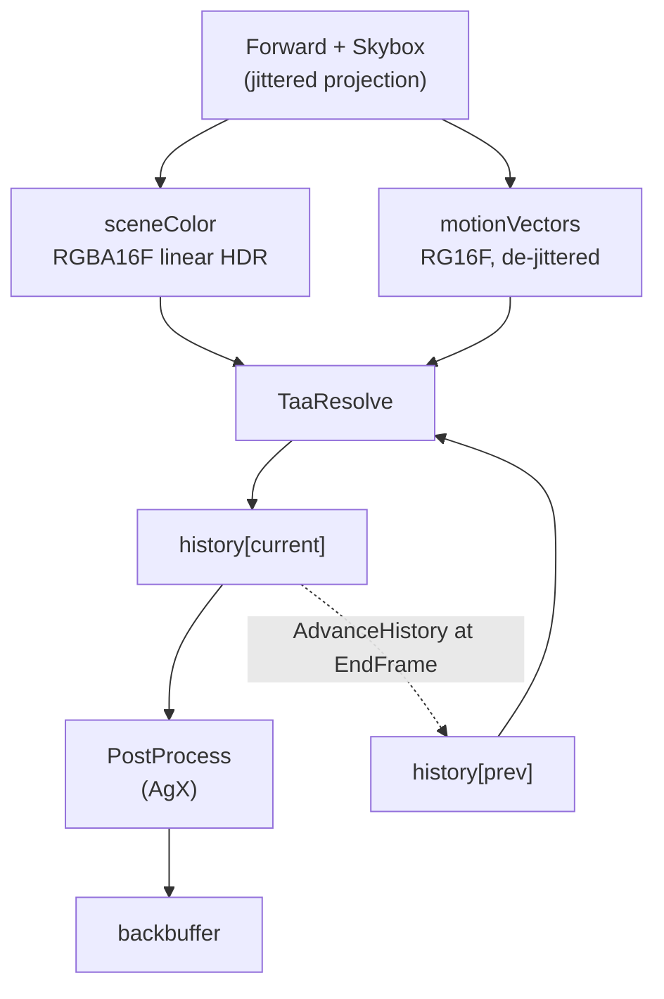

# Temporal Antialiasing

TAA trades a sub-pixel offset per frame for an antialiased image: the projection is jittered so the
sample grid walks the pixel footprint, and an accumulation buffer averages the results. Motion
vectors are what let the average survive a moving camera — last frame's colour is fetched from where
each surface *was*, not from where the pixel is.

It is **opt-in per render target** (`RenderTargetDesc::taaEnabled`) and off by default, because it
makes a frame depend on the frames before it. A caller that renders a fixed small number of frames —
a thumbnail, a render test — cannot converge, so it must not silently get an unconverged image. In
the editor that split is the viewport windows (which redraw continuously) against the thumbnail
cache, which renders one frame per asset and does not opt in at all: its private asset manager
loads each hashed-alpha material as the blend material its coverage converges to
(`AssetManagerOptions::hashedAsBlend`), so the converged look is drawn directly rather than
accumulated. Each viewport reads its own `temporalAA` key in `config.json` — under `levelEditor`
and `materialEditor`, beside the other things that size that window's render target, rather than
under `graphics`, which is where `GraphicsOptions` lives.

The desc flag decides **allocation**; `IRenderTarget::SetTaaEnabled` decides whether it **runs**, so
a viewport can be compared against itself without recreating anything. Enabling it on a target that
allocated nothing throws — there is no history to accumulate into, and silently ignoring the call
would leave a caller wondering why the image never resolves.

The two are not interchangeable, which is why the editor exposes both. A `temporalAA: false` viewport
never creates its history buffers, so that is what actually gives back the memory and the two RTV
slots; the Render menu's toggle only stops the work. The menu is offered when *any* viewport
allocated a history and is disabled otherwise — rather than hidden, so the answer to "why can I not
turn this on" is in the place that asks the question — and a viewport configured without it ignores
the call instead of throwing.

What TAA leaves behind is **resolution-dependent**: the jitter walks a pixel footprint, so how much
of an edge or a hashed strand falls inside one pixel decides how much the neighbourhood clamp has to
throw away, and a flicker that is obvious at 1080p can be invisible on a 4K panel. The editor's
Render menu carries a **Render Scale** for that: it multiplies each viewport's render resolution on
top of the display's device pixel ratio, and the result is stretched back over the window on present
(`DXGI_SCALING_STRETCH`; a `CAMetalLayer` drawable smaller than its bounds). Half scale on a 2×
display is a 1080p sample grid inside a 4K window, which is what makes the artifact reproducible on
the machine that does not have the display it was reported on. `renderScale` under `levelEditor` and
`materialEditor` in `config.json` sets the value the editor starts at; the menu moves every viewport
from there, live, because the comparison is what shows a temporal artifact.

**This document is a map, not a mirror.** The headers at each linked path are the source of truth.

---

## Design Choices

* **The client's `Camera` never carries the jitter.** `RenderContext::Draw` left-multiplies a
  clip-space translation onto the projection it builds, so the public
  [Camera](libs/bgl/include/bgl/Camera.h) a caller reads back for picking or gizmo placement is the
  one they set. A translation rather than a poke at the projection's own terms: it adds
  `jitter * clip.w` to `clip.xy`, which lands as a constant NDC offset after the divide and is
  correct for an orthographic camera too.

* **A velocity describes the surface, not the sample pattern.** `SV_Position` keeps its jitter — that
  is the whole point of it — but `ForwardVSOut::clip` / `prevClip` have each frame's offset removed
  in the mesh shader, so `ComputeMotionVector` is a plain difference. Without this a static camera
  reports a full pixel of motion every frame, which is exactly the reprojection error TAA is least
  able to hide. The subtraction is in the *mesh* shader deliberately: see the shared-module hazard in
  [Slang Shaders](docs/slang_shaders.md).

* **Halton(2, 3), eight terms.** Long enough to cover the footprint, short enough that the ghosting
  tail stays inside what the blend weight forgives. The sequence is 1-based, because term 0 of every
  radical inverse is 0 — a frame that samples exactly where an unjittered one does contributes
  nothing new.

* **The resolve writes history and nothing else.** `PostProcess` reads what it produced and applies
  the display curve. Merging the two would save a full-screen pass and cost the seam: bloom, grading
  and exposure adaptation belong between a resolved scene and the screen, and each would otherwise
  arrive as a change to the TAA shader.

* **History is HDR, and so is the accumulation.** Both `sceneColor` and the two history buffers are
  `RGBA16_FLOAT` linear radiance with exposure already folded in. The display curve is the last thing
  that happens, never something baked into the accumulator.

* **The history is fetched with Catmull-Rom, not bilinear.** The reprojected position is off texel
  centres every frame the camera moves, and a bilinear fetch convolves the accumulation with a tent
  each time — under sustained motion the softening compounds, and snaps sharp again on stopping,
  which reads as motion blur. Five bilinear taps stand in for the 4×4 kernel; at rest the fetch
  lands on texel centres and is exact, so a still image is bit-identical. Measured on a moving
  mid-grey fence: 0.60 of the still image's detail with bilinear, 0.66 with Catmull-Rom — the clamp
  bounds how much softness can survive, so the gap is modest, but it is the visible part.

* **Neighbourhood clamping in YCoCg, not RGB.** The bounds are an axis-aligned box, and in RGB that
  box is a poor fit to the colours an edge actually produces — it admits history the pixel could not
  have come from, which is what ghosting looks like. History is *clamped* rather than rejected: a
  merely stale sample still carries sub-pixel detail worth keeping once pulled inside the box.

* **The blend is weighted by inverse luma above a knee of 1, linearly below it.** A single bright
  sample would otherwise dominate the average and smear across frames. But weighting each operand
  by its own luma converges a bimodal signal below its true mean — a hashed strand's pixel
  alternates bright and dark, and the biased average measured as a fifth of the strand's surviving
  coverage on a distant card — so only genuine HDR outliers pay the compression. The weighting is
  undone afterwards, so what is stored stays linear.

* **Depth has an SRV now, and the resolve still does not read it.** Depth-based disocclusion
  rejection — store linear depth in history alpha, reject history whose stored depth belongs to a
  surface nearer than the neighbourhood shows — was built and measured once the SRV existed, and
  rejected on those measurements. Every ghost instrument scored it at parity: the wake a receding
  occluder leaves is already scrubbed by the neighbourhood clamp within a frame or two, over empty
  *and* detailed backgrounds (the wake-over-slats test measures 1.2e-4 with and without it). What
  it did move was flicker on stochastic coverage — a grazing hashed pan trebled, 0.0024 → 0.0067 —
  because a hashed pixel's depth flips between strand and backdrop every frame, so single-frame
  depth cannot tell "the strand left" from "the strand's coin came up tails", and the ghost halo
  that *is* visible on hair hugs the sprinkle zone where that ambiguity lives. What stands is the
  depth SRV and its frame-graph tracking ([Passes Overview](docs/passes.md)), which any future
  depth reader starts from.

* **Not velocity-dilated either.** Reprojecting by the longest velocity in the 3×3 — the no-depth
  stand-in for closest-fragment dilation — measured worse everywhere it was meant to help: panning
  over a hashed patch went from 0.0029 to 0.0040–0.0073 of frame-to-frame noise. On stochastic
  coverage a pixel whose fragment was discarded carries zero motion, and an exact-texel fetch by
  zero *pins* the noise field; "correcting" it to the surface's velocity re-samples that field at a
  fresh fractional offset every frame, which is flicker. The thin-feature case it exists for is
  better served by keeping the hash cell near pixel size (below), which attacks the cause.

* **The clamp box is min/max at rest and tightens to mean ± σ under motion.** Always-on variance
  clipping was tried first and rejected: tighter everywhere means snapping converged stochastic
  coverage back onto each frame's noise, +49% resting flicker for −8% trail. But the wide box has
  a blind spot that is exactly the visible artifact — on hashed coverage at a distance one strand
  texel and one backdrop texel put the min/max corners at the extremes, so under a pan every
  dragged mixture is admitted, and hair trails a smear. The σ box tightens with the mixture and
  recentres on the majority population, which is the grip the clamp lacks there. Gating the
  tightening on the pixel's own motion (fully tight from one texel per frame) takes the resting
  image out of the trade entirely: motion has the jitter removed, so a still camera reads exactly
  zero and every resting figure is bit-identical to min/max. Measured on a panned hashed-alpha
  ramp over a lit backdrop: trailing-band error 1.73e-3 → 1.30e-3 against a 1.7e-4 still floor,
  leading-band 2.58e-3 → 2.28e-3, grazing pan flicker 0.0024 → 0.0021, every resting bound
  unchanged. The σ box stays clamped inside the min/max box, which nine bounded samples can
  otherwise escape.

* **Not velocity-scaled either.** A blend weight ramped by reprojection distance — long accumulation
  at rest, short under motion — is the standard answer to wanting both, and measured no better than a
  constant: the trail moved 0.00669 → 0.00673, which is nothing. It buys nothing here because the
  clamp already bounds ghosting, so there is no second problem for the weight to solve.

* **At rest the box is widened by remembered stochastic spread.** The min/max box has a second
  blind spot on stochastic coverage, opposite the smear: on the frames where none of a sparse
  strand's 3×3 wins its coin flip, the box collapses onto the backdrop and wipes the accumulated
  mixture — a rebuild cycle that reads as flicker and converges far below the true coverage
  (measured at 0.23 of an alpha-blended reference of the same texels). The history's alpha channel
  carries a running average of the 3×3's own luma variance, and the box is widened by its excess
  over the present frame's sigma: on a no-survivor frame that excess is the whole memory, and at a
  standing contrast edge — where widening would shelter whatever a pan dragged past — it cancels
  to zero. Spatial spread averaged over time rather than temporal deviation, because a ghost's
  history deviates from the frame under it exactly as a real mixture does, but only real
  stochastic coverage keeps producing spread *inside* single frames. The widening exists only at
  true rest, gated on the pixel's motion being zero **and** the CPU comparing this frame's
  unjittered view-projection bitwise against last frame's — a pixel's motion alone cannot gate it,
  since empty pixels report zero velocity under any camera and would bank a passing edge's
  contrast during a pan. Resting history reprojects onto itself and cannot ghost, so the widening
  is free there: converged distant coverage 0.23 → 0.97–0.98 of the blend reference, resting
  flicker 7× down, and the pan trail bit-identical to the unwidened resolve.

---

## Interface Index

| Type | File | Role |
|---|---|---|
| `RenderTargetDesc::taaEnabled` | [bgl/IRenderTarget.h](libs/bgl/include/bgl/IRenderTarget.h) | The opt-in, and what allocates. Off by default. |
| `IRenderTarget::SetTaaEnabled` | [bgl/IRenderTarget.h](libs/bgl/include/bgl/IRenderTarget.h) | Runs or stops it at runtime, on a target that allocated. |
| `HaltonJitter` | [util/jitter.h](libs/bgl/src/util/jitter.h) | The sub-pixel offset for a frame, in NDC. |
| `TaaResolvePass` | [passes/TaaResolvePass.h](libs/bgl/src/passes/TaaResolvePass.h) | Reprojects, clamps, blends into the new history. |
| `PostProcessPass` | [passes/PostProcessPass.h](libs/bgl/src/passes/PostProcessPass.h) | Applies the display curve to whatever the last HDR stage produced. |
| `ViewData::jitter` / `prevJitter` | [forward/ViewData.slang](libs/bgl/shaders/src/forward/ViewData.slang) | What the mesh shader subtracts back out. |
| History accessors | [gfx/RenderTargetBase.h](libs/bgl/src/gfx/RenderTargetBase.h) | The ping-pong pair, its index, and its validity. |
| `RenderTargetWindow::SetRenderScale` | [RenderTargetWindow.h](apps/editor/src/Windows/RenderTarget/RenderTargetWindow.h) | Drives a viewport at another display's pixel density, to reproduce the artifact. |

---

## Topology

With `taaEnabled` false the middle disappears: `PostProcess` reads `sceneColor` directly, and neither
history buffer is allocated.

---

## Hashed alpha depends on this

`LayerType::kHashed` ([passes.md](docs/passes.md)) turns alpha into stochastic coverage, which is
noise in any one frame and only correct once this has averaged it.

**It is not the default answer for every alpha texture.** What hashed buys is unsorted,
depth-writing transparency — layers occlude each other correctly with no sorting, which neither
blend nor a cutoff gives. What it costs is that every texel of partial alpha is a coin flipped per
frame, so content authored as wide soft gradients — hair painted for alpha blending is the common
case — becomes a large stochastic region that this resolve must hold steady, and camera motion is
where that shows. A card-hair asset usually reads better as the alpha *test* under TAA: the
silhouette is deterministic, the jitter still antialiases its edges, and the bake's
coverage-preserving mips are keyed to the authored cutoff, so strands hold at distance. Reach for
hashed when the content genuinely self-occludes in depth and needs soft coverage — dense foliage,
layered interior hair — not because a texture has an alpha channel.

Two couplings worth knowing:

* **The hash seed is not the jitter index.** Eight seeds means eight distinct coverage patterns, and
  averaging eight binary masks converges to nine grey levels rather than to smooth coverage. It
  advances on its own longer cycle, which only has to outrun the history's memory.
* **The hash cell must be sub-pixel, and that is the clamp's requirement rather than the hash's.**
  The neighbourhood clamp admits history only within the range of a 3×3 of the current frame. A hash
  cell wider than a pixel makes those nine samples share a value, the range collapses towards a
  point, and the clamp snaps the accumulation back onto the noise every frame — which reads as
  flicker, and on a surface that self-occludes as seeing through it, because the resolve is then
  showing a single stochastic frame rather than the average of many. `c_HashScale` is the *lower*
  bound of a 2× range, since the octave selection rounds down to a power of two.

* **Its base colour must keep its alpha and preserve coverage down the mips, and the bake does
  both.** A hashed material's alpha would otherwise be destroyed outright — the alpha-less block
  format renders opaque cards — and plain box mips dilute a sub-texel strand's alpha, which under
  stochastic coverage is expected coverage lost: the strand fades out with distance rather than
  thinning. `bakeMaterial` keeps hashed base colour in BC7 and rescales its mips against the
  material's cutoff, exactly as the alpha test always had ([material_bake.cpp](libs/assetlib/src/material_bake.cpp)).

* **Near pixel size on both axes, which is what bounds the anisotropy.** The cell is isotropic on
  the surface and the projection is not, so `c_MaxAnisotropy` decides how wide a cell may get across
  the compressed screen axis — the axis a grazing surface, which is most of a hair card, is
  compressed along. Through the octave rounding the bound leaves a cell of half-to-one times it in
  pixels: at 4 that is two to four, the shared thresholds collapsed the clamp's box exactly as
  above, and it measured seven times the head-on frame-to-frame flicker — at grazing incidence
  only, which is why the head-on flicker test never saw it. At 2 the cell is one to two pixels and
  the flicker measures at parity with head-on, so there is nothing left for a finer cell to buy.
  The cost is single-frame grain — the accumulation removes grain; it cannot remove a pattern that
  does not move.

* **Minified alpha is steepened about its own local mean before the hash, and the lift is bounded.**
  Once a strand is sub-texel at the active mip the sampled alpha is many strands averaged, and
  stochastic coverage that honestly reproduces that mean converges to a mixture the backdrop
  swallows -- energy-true rendering of a sub-pixel feature *is* its disappearance. `ShadeHashedAlpha`
  therefore steepens alpha in proportion to the minification (`SharpenMinifiedAlpha`), leaving
  magnified alpha -- where soft self-occluding coverage is the point of hashed -- alone.

  The centre it steepens about is the content's own local mean, read one level coarser through
  `TextureHandle::SampleBias` so it inherits the hardware's LOD choice and its anisotropy. A constant
  centre was tried first and is what the cutoff-based version used: it cannot be right at every
  level, because a chain whose levels average above it saturates to opaque while one that averages
  below collapses to nothing, and which of the two happens is a property of the asset rather than of
  the renderer. The local mean is the steepening's fixed point, so energy survives wherever the
  result does not clip.

  A level the filter has flattened to one value has no shape left to recover, and that is exactly
  where a sub-pixel strand lives, so such a level is lifted bodily instead -- bounded at twice the
  mean and ceilinged at 0.5 coverage, so however deep the chain goes a grating can never reach a
  solid block. The bounds are what the coverage ladder measures: 0.91 near, 1.11 mid and 1.32 far of
  the blend reference, inside a [0.6, 1.4] bracket that guards hair which vanishes and hair which
  doubles.

  The minification is the *smaller* screen axis, since a grazing card minifies along the view axis at
  any distance and anisotropic filtering resolves that axis. The cost is at the reference density,
  where the lift trades some contrast for the far-field behaviour: frame-to-frame flicker on the
  distant card measures 7.7e-5 against 3.2e-5 for the cutoff-centred version, inside every pinned
  bound but not free.

* **The blend weight trades flicker against settling time, not against ghosting.** This is the
  opposite of the intuition and it is measured: at an equal convergence budget, halving the weight
  from 0.1 to 0.05 takes the frame-to-frame difference from 0.0020 to 0.0013 and moves the trail left
  behind a pan by 2% — nothing. Ghosting is bounded by the neighbourhood clamp, which is doing
  essentially all of that work; bypassing it sends the trail from 0.0066 to 0.090. What a lower weight
  actually costs is the time constant, 10 frames to 20, so an edge takes longer to resolve after the
  camera stops. 0.025 is where that starts to show.

---

## Risky / Non-obvious Contracts

* **The history buffers are never cleared, so the first frame must not read them.** The resolve
  returns the scene colour by an early `return`, not by blending with a weight of 1 — `lerp(NaN, c,
  1.0)` is NaN, because a zero coefficient does not discard its operand, and a NaN written into the
  accumulation stays for the life of the target. This was live for a while and invisible: the
  neighbourhood clamp happens to launder NaN, since IEEE `min`/`max` return the non-NaN operand.
  Deleting the clamp turned every resolved frame black, which is how it surfaced.

* **The history's alpha is the variance store, not scene alpha.** The resolve writes the running
  spatial-variance average there and reads it back next frame; nothing downstream ever saw scene
  alpha through it (`PostProcess` writes the backbuffer opaque). The no-history early return
  writes it as zero — the store must start empty, and a scene alpha of 1 would decode as a huge
  variance.

* **The ping-pong is per target, not per frame counter.** `GetCurrentHistoryIndex()` is state the target
  owns and `AdvanceHistory()` flips at `EndFrame`. Deriving it from a context-wide frame counter
  would break the moment two targets are drawn at different rates — each target's history has to
  alternate on *its* frames.

* **Turning it off discards the accumulation; it does not pause it.** The frames the history would
  have to bridge are never rendered, so resuming across the gap would reproject a stale image. The
  first frame after turning it back on takes the scene colour whole, exactly as the first frame ever
  does.

* **A resize discards the accumulation.** The buffers are screen-sized and the history cannot be
  rescaled into, so the backend's attachment teardown clears `m_HistoryValid` and the next frame
  takes the scene colour whole. Resizing into a stale history reprojects garbage for one frame.

* **The two halves are imported under separate graph names** (`taaHistory0` / `taaHistory1`). The
  frame graph tracks resource state by name, so a single name for both would have the pass declaring
  the same resource as an SRV and a render target at once.

* **Nothing transitions the two halves by hand — the graph does it, and it does it every frame.**
  The resolve declares the half it reads with `BarrierAccessFlag::kShaderResource` /
  `BarrierLayout::kShaderResource` and the half it writes as a render target; `PostProcess` then
  declares the written half as a shader resource. `DeriveBarriers` emits exactly those transitions
  ahead of each pass, and `Execute` persists each imported resource's end state into `m_LastState`,
  so next frame — when the roles swap — the graph sees the half it is about to write sitting in
  shader-resource state and transitions it back. That is why the roles can alternate without any
  `ICommandList::Barrier` call in the pass code, and why both halves are imported every frame even
  though a given frame only touches one as a target. See
  [Frame Graph](docs/framegraph.md) for the state-persistence rule this leans on.

* **The velocity buffer needs an SRV, and did not have one until this landed.** It was allocated
  `kSRV`-capable from the start against a future reader; TAA is that reader.

* **`PostProcess` is still the only writer of the backbuffer.** The capture path reads back the last
  presented backbuffer, so anything that inserts itself after the post-process breaks the
  screenshot's claim to be what was displayed.

* **A converged TAA frame is not reproducible in one frame.** Any test that asserts on TAA output has
  to drive a fixed number of frames first; a golden captured on frame 1 asserts nothing about the
  algorithm. `TaaResolve_test.cpp` uses 24 — two passes of the eight-term sequence.
