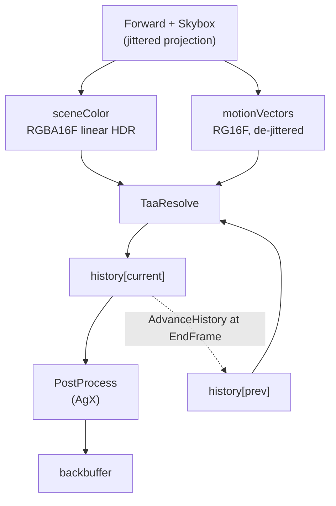

# Temporal Antialiasing

TAA trades a sub-pixel offset per frame for an antialiased image: the projection is jittered so the
sample grid walks the pixel footprint, and an accumulation buffer averages the results. Motion
vectors are what let the average survive a moving camera — last frame's colour is fetched from where
each surface *was*, not from where the pixel is.

It is **opt-in per render target** (`RenderTargetDesc::taaEnabled`) and off by default, because it
makes a frame depend on the frames before it. A caller that renders a fixed small number of frames —
a thumbnail, a render test — cannot converge, so it must not silently get an unconverged image. In
the editor that split is exactly the viewport windows (which redraw continuously) against the
thumbnail cache (which does not).

The desc flag decides **allocation**; `IRenderTarget::SetTaaEnabled` decides whether it **runs**, so
a viewport can be compared against itself without recreating anything. Enabling it on a target that
allocated nothing throws — there is no history to accumulate into, and silently ignoring the call
would leave a caller wondering why the image never resolves.

**This document is a map, not a mirror.** The headers at each linked path are the source of truth.

---

## Design Choices

* **The client's `Camera` never carries the jitter.** `RenderContext::Draw` left-multiplies a
  clip-space translation onto the projection it builds, so the public
  [Camera](libs/bgl/include/bgl/Camera.h) a caller reads back for picking or gizmo placement is the
  one they set. A translation rather than a poke at the projection's own terms: it adds
  `jitter * clip.w` to `clip.xy`, which lands as a constant NDC offset after the divide and is
  correct for an orthographic camera too.

* **A velocity describes the surface, not the sample pattern.** `SV_Position` keeps its jitter — that
  is the whole point of it — but `ForwardVSOut::clip` / `prevClip` have each frame's offset removed
  in the mesh shader, so `ComputeMotionVector` is a plain difference. Without this a static camera
  reports a full pixel of motion every frame, which is exactly the reprojection error TAA is least
  able to hide. The subtraction is in the *mesh* shader deliberately: see the shared-module hazard in
  [Slang Shaders](docs/slang_shaders.md).

* **Halton(2, 3), eight terms.** Long enough to cover the footprint, short enough that the ghosting
  tail stays inside what the blend weight forgives. The sequence is 1-based, because term 0 of every
  radical inverse is 0 — a frame that samples exactly where an unjittered one does contributes
  nothing new.

* **The resolve writes history and nothing else.** `PostProcess` reads what it produced and applies
  the display curve. Merging the two would save a full-screen pass and cost the seam: bloom, grading
  and exposure adaptation belong between a resolved scene and the screen, and each would otherwise
  arrive as a change to the TAA shader.

* **History is HDR, and so is the accumulation.** Both `sceneColor` and the two history buffers are
  `RGBA16_FLOAT` linear radiance with exposure already folded in. The display curve is the last thing
  that happens, never something baked into the accumulator.

* **Neighbourhood clamping in YCoCg, not RGB.** The bounds are an axis-aligned box, and in RGB that
  box is a poor fit to the colours an edge actually produces — it admits history the pixel could not
  have come from, which is what ghosting looks like. History is *clamped* rather than rejected: a
  merely stale sample still carries sub-pixel detail worth keeping once pulled inside the box.

* **The blend is weighted by inverse luma.** A single bright sample would otherwise dominate the
  average and smear across frames. The weighting is undone afterwards, so what is stored stays
  linear.

* **No depth.** The depth buffer is allocated depth-stencil-only, so reading it means an SRV over a
  depth format in both backends. The neighbourhood clamp removes the bulk of ghosting on its own;
  closest-fragment velocity dilation and depth-based disocclusion rejection are refinements that land
  when the images ask for them.

---

## Interface Index

| Type | File | Role |
|---|---|---|
| `RenderTargetDesc::taaEnabled` | [bgl/IRenderTarget.h](libs/bgl/include/bgl/IRenderTarget.h) | The opt-in, and what allocates. Off by default. |
| `IRenderTarget::SetTaaEnabled` | [bgl/IRenderTarget.h](libs/bgl/include/bgl/IRenderTarget.h) | Runs or stops it at runtime, on a target that allocated. |
| `HaltonJitter` | [util/jitter.h](libs/bgl/src/util/jitter.h) | The sub-pixel offset for a frame, in NDC. |
| `TaaResolvePass` | [passes/TaaResolvePass.h](libs/bgl/src/passes/TaaResolvePass.h) | Reprojects, clamps, blends into the new history. |
| `PostProcessPass` | [passes/PostProcessPass.h](libs/bgl/src/passes/PostProcessPass.h) | Applies the display curve to whatever the last HDR stage produced. |
| `ViewData::jitter` / `prevJitter` | [forward/ViewData.slang](libs/bgl/shaders/src/forward/ViewData.slang) | What the mesh shader subtracts back out. |
| History accessors | [gfx/RenderTargetBase.h](libs/bgl/src/gfx/RenderTargetBase.h) | The ping-pong pair, its index, and its validity. |

---

## Topology

With `taaEnabled` false the middle disappears: `PostProcess` reads `sceneColor` directly, and neither
history buffer is allocated.

---

## Risky / Non-obvious Contracts

* **The ping-pong is per target, not per frame counter.** `GetCurrentHistoryIndex()` is state the target
  owns and `AdvanceHistory()` flips at `EndFrame`. Deriving it from a context-wide frame counter
  would break the moment two targets are drawn at different rates — each target's history has to
  alternate on *its* frames.

* **Turning it off discards the accumulation; it does not pause it.** The frames the history would
  have to bridge are never rendered, so resuming across the gap would reproject a stale image. The
  first frame after turning it back on takes the scene colour whole, exactly as the first frame ever
  does.

* **A resize discards the accumulation.** The buffers are screen-sized and the history cannot be
  rescaled into, so `ReleaseAttachments` clears `m_HistoryValid` and the next frame takes the scene
  colour whole. Resizing into a stale history reprojects garbage for one frame.

* **The two halves are imported under separate graph names** (`taaHistory0` / `taaHistory1`). The
  frame graph tracks resource state by name, so a single name for both would have the pass declaring
  the same resource as an SRV and a render target at once.

* **Nothing transitions the two halves by hand — the graph does it, and it does it every frame.**
  The resolve declares the half it reads with `BarrierAccessFlag::kShaderResource` /
  `BarrierLayout::kShaderResource` and the half it writes as a render target; `PostProcess` then
  declares the written half as a shader resource. `DeriveBarriers` emits exactly those transitions
  ahead of each pass, and `Execute` persists each imported resource's end state into `m_LastState`,
  so next frame — when the roles swap — the graph sees the half it is about to write sitting in
  shader-resource state and transitions it back. That is why the roles can alternate without any
  `ICommandList::Barrier` call in the pass code, and why both halves are imported every frame even
  though a given frame only touches one as a target. See
  [Frame Graph](docs/framegraph.md) for the state-persistence rule this leans on.

* **The velocity buffer needs an SRV, and did not have one until this landed.** It was allocated
  `kSRV`-capable from the start against a future reader; TAA is that reader.

* **`PostProcess` is still the only writer of the backbuffer.** The capture path reads back the last
  presented backbuffer, so anything that inserts itself after the post-process breaks the
  screenshot's claim to be what was displayed.

* **A converged TAA frame is not reproducible in one frame.** Any test that asserts on TAA output has
  to drive a fixed number of frames first; a golden captured on frame 1 asserts nothing about the
  algorithm. `TaaResolve_test.cpp` uses 24 — two passes of the eight-term sequence.
