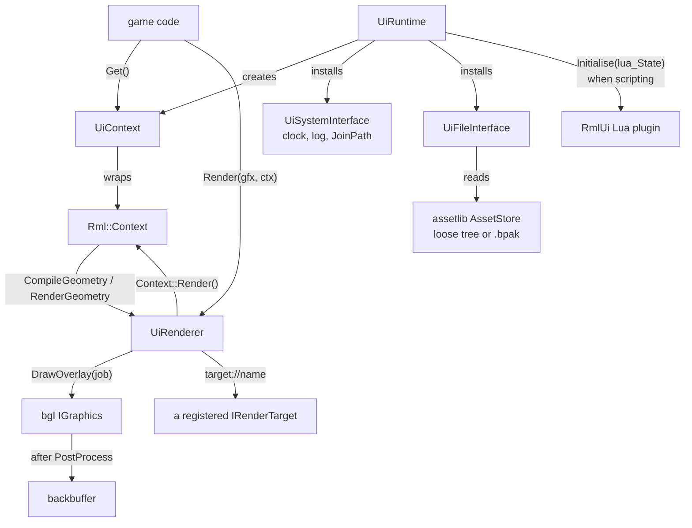

# UI Runtime — RmlUi documents drawn through bgl's 2D overlay

The in-game UI: HTML/CSS-shaped documents, laid out and scripted by
[RmlUi](https://mikke89.github.io/RmlUiDoc/) 6.2, drawn as flat triangles through `bgl`'s
renderer-neutral overlay. `gamelib` is where it lives, because a document is read from the project
mount (`assetlib`) and drawn by the renderer (`bgl`) and nothing else in the tree may link both.

This is the **game's** UI. The editor's is Qt Widgets and always will be
([apps/editor/CLAUDE.md](apps/editor/CLAUDE.md) § UI).

**This document is a map, not a mirror.** It captures the design choices, the layer boundaries and
the non-obvious contracts — not full signatures. The header at each linked path is the source of
truth; when this doc disagrees, trust the header, then fix this doc.

---

## Design Choices

* **A client is handed `Rml::Context&`, and drives RmlUi's own API.** `UiContext::Get()` returns the
  context; data models, event listeners and input are registered with RmlUi as its documentation
  describes. There is no facade. A facade would be a second surface to keep in step with the
  library, and it would forbid exactly the corpus — documentation, examples, community answers —
  that RmlUi was chosen for. What `gamelib` owns instead is the three things RmlUi cannot know:
  lifetime, the mount, and the clock. See *Replacing RmlUi* below for what this costs.

* **`Rml::` reaches a client through gamelib's two `ui/` headers, neither of which includes an
  RmlUi header.** [libs/gamelib/include/gamelib/ui/UiRuntime.h](libs/gamelib/include/gamelib/ui/UiRuntime.h)
  forward-declares `Rml::Context`, `Rml::ElementDocument`, `Rml::RenderInterface` and `lua_State`,
  and includes no RmlUi header. A client that drives a context includes `<RmlUi/Core.h>` itself.
  `UiRenderer`'s RmlUi half is behind an implementation its header does not name, so a client that
  only *draws* a UI compiles no RmlUi header at all. The target is linked `PUBLIC` with its includes
  imported as SYSTEM, so `enable_strict_compiler`'s warnings-as-errors never compile them — which is
  why `apps/editor`, which links `gamelib` and never touches a context, pays only the link.

* **Every path is a mount key, never a host path.** `UiFileInterface` reads through the
  `AssetStore`'s `core::file::IFileSystem`, so `Authored/UI/menu.rml` resolves identically from a
  loose tree and from a `.bpak`, and nothing reaches `std::filesystem`. `.rml`, `.rcss` and `.ttf`
  are `AssetType`s the project knows ([Asset Containers](docs/asset_containers.md)), which is what
  makes `assetlib_cli pack` ship them and the editor able to delete and rename them.

* **The reference graph does not read a document.** `.rml`, `.rcss` and `.ttf` are stored, packed,
  deleted and renamed like any other asset, but `assetlib` parses none of them — so a stylesheet a
  document `<link>`s, or a font or image it names, has no referrers recorded and deletes or renames
  **unguarded**, unlike every other authored kind. The runtime resolves those references itself at
  load; nothing checks them offline.

* **The clock is the client's.** `UiRuntime::AdvanceTime` is what `SystemInterface::GetElapsedTime`
  reports; nothing reads a wall clock. A headless test steps a transition exactly, and a paused game
  pauses its UI by not calling it.

* **Input is RmlUi's vocabulary; the engine declares no event type.** A client calls
  `Context::ProcessMouseMove` and friends itself. The SDL translation lives beside the window that
  produces the events, in [examples/util/RmlInput.h](examples/util/RmlInput.h) — not in a library,
  because an engine event type that both SDL and Qt map onto is the Input Engine designed by
  accident, with no game to shape it.

* **One `UiRuntime` per process, enforced by a throw.** `Rml::Initialise`, the three interfaces and
  the context registry are all global; a second instance would install over the first and free them
  under it.

* **The public shape is not yet validated by a game.** This shipped with `examples/bgl_ui` as its
  only client: the trigger the design was written against — a real HUD, with a real game's
  requirements — has not arrived, so these seams are informed guesses and the first game to use them
  may well move them. Settled enough to build on; not proven.

* **The renderer is the client's, and is built first.** `UiRenderer` needs an `IGraphics` the runtime
  knows nothing about, so a client constructs it and hands it to `UiRuntime`. A headless test
  substitutes a stub, which is how the layout, styling, data-model and input cases run with no
  device at all.

---

## The layer stack

| Layer | Owns | Knows about |
|---|---|---|
| `bgl` — [IOverlay](libs/bgl/include/bgl/IOverlay.h) | compiled 2D geometry, its textures | nothing about documents; general 2D output |
| `assetlib` | `.rml` / `.rcss` / `.ttf` as asset kinds | nothing about RmlUi; it stores and packs, never parses |
| `gamelib` — [ui/](libs/gamelib/include/gamelib/ui) | RmlUi's lifetime, the mount, the clock, the render translation | both of the above |
| the game | documents, data models, event handling, the frame loop | `Rml::Context` |

`bgl` never learns what a document is: the overlay takes pixel-space triangle lists and textures.
That is what makes the renderer half reusable and the UI library half replaceable.

## Interface Index

| Interface | File | Role |
|---|---|---|
| `UiRuntime` | [libs/gamelib/include/gamelib/ui/UiRuntime.h](libs/gamelib/include/gamelib/ui/UiRuntime.h) | RmlUi's process-global lifetime, the system and file interfaces, the clock, font faces. One per process. |
| `UiContext` | [libs/gamelib/include/gamelib/ui/UiRuntime.h](libs/gamelib/include/gamelib/ui/UiRuntime.h) | One context sized in pixels; hands out `Rml::Context&` and loads documents by mount key. |
| `UiRenderer` | [libs/gamelib/include/gamelib/ui/UiRenderer.h](libs/gamelib/include/gamelib/ui/UiRenderer.h) | What RmlUi draws through: geometry becomes `bgl::OverlayDraw`s, textures become the overlay's. Registers `target://` sources. |
| `IOverlay` | [libs/bgl/include/bgl/IOverlay.h](libs/bgl/include/bgl/IOverlay.h) | The renderer-side surface: compiled triangle lists and straight-alpha textures, drawn after post-processing. Not UI-specific. |

### Supporting types

| Type | File | Role |
|---|---|---|
| `UiRuntimeOptions` | [libs/gamelib/include/gamelib/ui/UiRuntime.h](libs/gamelib/include/gamelib/ui/UiRuntime.h) | `scripting` (off by default) and the `lua_State` to add RmlUi's bindings to. |
| `UiContextPtr` | [libs/gamelib/include/gamelib/ui/UiRuntime.h](libs/gamelib/include/gamelib/ui/UiRuntime.h) | `unique_ptr<UiContext>`; the runtime it came from must outlive it. |
| `OverlayVertex`, `OverlayDraw`, `OverlayJob` | [libs/bgl/include/bgl/IOverlay.h](libs/bgl/include/bgl/IOverlay.h) | A 24-byte pixel-space vertex; one draw with its texture, translation, optional transform and scissor; the job one `DrawOverlay` submits. |

## Topology



## Threading & Synchronization

RmlUi guarantees no thread safety, and `IGraphics` is thread-affine
([bgl Public API](docs/bgl_api.md)). **The whole of this runs on one thread** — the same one that
owns the frame. There is no worker path here and none is planned; the load doors (`LoadDocument`,
`LoadFontFace`, and each texture a document names) are synchronous.

## Risky / Non-obvious Method Contracts

### UiRuntime

* **constructor** — @pre no other `UiRuntime` exists in this process; `store` and `renderer` outlive
  it. @throws `std::runtime_error` on a second instance, which leaves the live one untouched.
* **`AdvanceTime(seconds)`** — the only thing that moves the UI clock. A document with a transition
  or an `Rml::Timer` does nothing at all until a client calls it.

### UiContext

* **`Get()`** — the returned reference is valid for the `UiContext`'s lifetime. Everything RmlUi
  offers is reached through it; nothing is wrapped.
* **`LoadDocument(key)`** — @pre `key` is a mount key, not a host path. @throws `std::runtime_error`
  when absent or unparseable — it does **not** return null, so a caller need not check. @post the
  document is **not** shown; call `ElementDocument::Show` when ready.

### UiRenderer

* **`Render(graphics, context)`** — @pre a frame is open on `graphics` (between `BeginFrame` and
  `EndFrame`). RmlUi walks the document and calls back into the render interface; everything it
  produces is submitted as **one** overlay job, after the scene and after post-processing.
* **`RegisterTarget(name, target)`** — @pre `name` non-empty and `target` non-null, which is all
  this door checks. A **windowed** target registers here and is refused later, by the overlay, when
  a document first resolves it: the failure is a logged error and a white box rather than a throw at
  the call site. @post the target is retained until replaced or the renderer is destroyed. Register
  *before* the document that names it loads: a document already resolved keeps the texture it
  resolved to.

### The failure a UI author meets first

**A texture that fails to load draws a white box, not nothing.** RmlUi keeps the element and hands
over its null handle, which the overlay samples as opaque white — the same rule that gives an
untextured `<div>` its vertex colour. A misspelled `src` is therefore loud rather than silent. The
log line beside it names the key and the reason.

## Live 3D inside the UI

A document shows a render target with `"/>`, where `<name>` was registered
on the renderer. That resolves to what the target **last presented**, so the pattern is:

1. draw the scene into a headless target of its own, every tick;
2. draw the window's frame, whose document samples it.

Submission order is what makes this sound — one queue, the preview submitted first — not a fence.
The frame that samples imports the borrowed backbuffer explicitly and returns it to `kPresent`
before `EndFrame`, because the frame graph persists an imported resource's final state and restores
nothing. A target that has never presented samples opaque white rather than an uninitialised slot.

The alternative — an underlay drawn before the scene — does not work: post-processing covers the
backbuffer whole and writes alpha 1, so nothing drawn before the scene survives it.

## Document scripting

`UiRuntimeOptions::scripting` installs RmlUi's stock Lua plugin. Documents then carry `<script>`
blocks, inline handlers, the element and event API, and data models declared from Lua tables — UI
logic living in the asset tree beside the markup rather than in the binary, which is the split
Scaleform drew with ActionScript, without a second language.

**It is off by default, and what it is not matters as much as what it is:**

* **It is the UI's VM, not the engine's.** No engine object is bound to Lua and nothing outside a
  document runs it. Engine-wide scripting is a separate, undecided item — see `ROADMAP.md`.
* **A scripted document is trusted code.** The plugin opens Lua's standard libraries, `io`, `os`
  and `package` among them, so a `<script>` reaches the host directly. The mount confinement above
  bounds which files the document *loader* resolves; it does not extend to what a script does once
  it runs. Turn scripting on for documents the project ships, not for documents it receives.
* **`luaState` is the seam an engine VM arrives through.** Pass one and RmlUi adds its bindings to
  it instead of keeping its own; that state is then yours to close, *after* the runtime is
  destroyed, and it must arrive with its standard libraries already opened — RmlUi opens them only
  for a state it created itself, and a document that hits a missing one raises outside any
  protected call, which aborts the process rather than failing the load.
* It writes into the globals of whatever state it is given: `rmlui`, `DocumentModal`,
  `DocumentFocus`, `EVENTLISTENERFUNCTIONS`, `ELEMENTINSTANCERFUNCTIONS` — and it **replaces
  `print`**. There is one state per process, not one per context.

With scripting off a `<script>` block is inert markup and an inline `onclick` does nothing, so a
game that binds everything from C++ never creates a VM.

## RCSS is not CSS

RmlUi's style language is CSS-shaped, and the gaps are where a web author loses time:

* **`decorator: image(...)`, not `background-image`.** *Images* and *gradients* are decorators.
  `background-color`, `border-width`, `border-color` and `border-radius` are ordinary properties
  spelled as in CSS — the fixture stylesheets use them directly.
* **No `grid`.** `display: flex` exists; `block` and `inline-block` do the rest.
* **`dp`** — and the physical units `in`, `cm`, `mm`, `pt`, `pc` — scales with the context's
  dp-ratio; `px` is a real pixel and does not. `vw` and `vh` are viewport percentages, tracking the
  context's size rather than its dp-ratio.
* **`data-*` attributes are the binding surface** — `data-model`, `data-event-click`,
  `data-style-<property>`, `{{ expression }}` in text. They are RmlUi's, not a framework's.
* **`border-radius` does not clip** in this build. Rounded clipping goes through
  `EnableClipMask`, and the render interface implements the eight required methods plus
  `SetTransform`, leaving clip masks, layers, filters and shaders at RmlUi's no-op defaults. Moving
  past that is its own decision, because the layer column needs a destination read and chasing it
  would make `IOverlay` an RmlUi-shaped API rather than a general 2D one.
* **`opacity` on a parent flattens per element** rather than compositing the group, so two
  overlapping children under one `opacity` double-darken where a browser would not. This is *not*
  the clip-mask decision above, and implementing layers would not change it: RmlUi premultiplies
  `opacity` into each element's own colours, and pushes a layer only for `filter`, `mask-image`
  and `backdrop-filter`.
* **Controller and focus navigation are RCSS `nav` properties driven through
  `Context::ProcessKeyDown`** — and nothing in the tree forwards a key event yet, so they are
  present and unwired. IME, clipboard and cursors are `SystemInterface`'s defaults, likewise
  unwired.

RmlUi's own documentation is the reference for everything else; it is accurate, and this runtime
changes none of the language.

## Replacing RmlUi

RmlUi is not a AAA-proven library, and the exit is kept cheap by **counting the doors**, not by
hiding it behind a facade. Everything engine-side is library-neutral:

| Stays | Goes |
|---|---|
| `bgl`'s `IOverlay`, the overlay pass and its shader | the three interface translations in [libs/gamelib/src/ui](libs/gamelib/src/ui) |
| the asset kinds, the mount and the packing | the markup dialect of the documents themselves |
| `target://` and the render-target mechanism | the game's own data-model and event module |
| the test machinery (`UiTree`, the stub renderer, the goldens) | |
| the SDL input translation's *shape* (its calls change, its place does not) | |

Concretely, the RmlUi-facing code in the engine is four files — `UiRuntime.cpp` (the lifetime, the
plugin, the context registry and the font faces, and the largest single concentration of the API),
`UiSystemInterface`, `UiFileInterface` and `UiRenderer::Impl` — plus the forward declarations in the
two public `ui/` headers, which move with them. Gameface, Ultralight
and Noesis all expose the same render-backend shape — compile geometry, render geometry with a
texture and a transform, scissor — so a replacement rewrites those three files and the game's UI
module, and touches nothing under `bgl` or `assetlib`.

What does **not** survive is the documents. That is the real cost of a swap, and it is a content
cost rather than an engineering one.

## Usage Sketch

```cpp
// The renderer is built first: the runtime is constructed with it.
game::UiRenderer renderer(*graphics, assets.GetStore());
renderer.RegisterTarget("preview", previewTarget);   // a headless target drawn every tick

game::UiRuntime runtime(assets.GetStore(), renderer.Interface());
runtime.LoadFontFace("Authored/Fonts/Lato-Regular.ttf");

game::UiContextPtr context = runtime.CreateContext("menu", width, height);

// Data models are registered before the document that binds to them loads.
int plays = 0;
Rml::DataModelConstructor model = context->Get().CreateDataModel("menu");
model.Bind("plays", &plays);

context->LoadDocument("Authored/UI/menu.rml")->Show();

while (running)
{
    demo::PumpEvents([&](const SDL_Event& e) { demo::ForwardToUi(context->Get(), e); });

    runtime.AdvanceTime(dt);
    graphics->DrawFrame(previewTarget, previewJob);   // the live 3D, into its own target

    context->Get().Update();

    graphics->BeginFrame(windowTarget);
    renderer.Render(*graphics, *context);             // the UI over it, one overlay job
    graphics->EndFrame();
}
```

See [examples/bgl_ui/src/main.cpp](examples/bgl_ui/src/main.cpp) for the whole thing — a styled
menu, a live 3D preview inside it, and controls over the top. `--screenshot <path>` draws a few
frames and writes one out.

---

**Maintenance.** The interface tables above are this doc's load-bearing part and their links rot
silently when files move. Re-check them whenever `libs/gamelib/ui` or `libs/bgl/include/bgl` is
reorganised.
