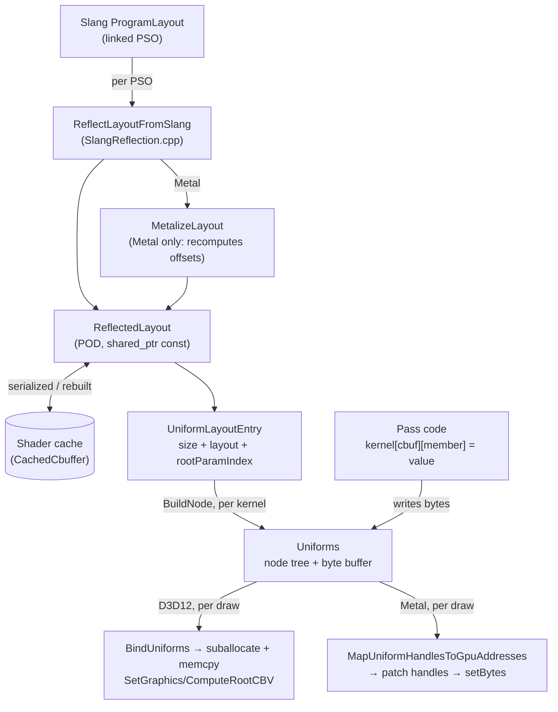

# Uniforms — the reflection-driven CPU mirror of a constant buffer

The uniforms layer is the CPU side of every constant buffer a shader declares. One `Uniforms` holds
a flat byte mirror of one cbuffer plus the reflected tree used to address it, so pass code writes
`kernel["cbuffer"]["member"] = value` and the backend uploads the bytes at draw or dispatch time. It
covers **constant buffers only** — structured-buffer contents go through `bgl_idlgen` instead, and
[Design Choices](#design-choices) is where that split is justified.

**This document is a map, not a mirror.** It captures design choices, topology, and the non-obvious
contracts — not full signatures. The header at each linked path is the source of truth; when this
doc disagrees, trust the header, then fix this doc.

---

## Design Choices

* **Bernini solves CPU/GPU layout parity twice, deliberately. Do not unify them.** Structured
  buffers go through [bgl_idlgen](docs/idlgen.md): one Slang IDL struct becomes a generated C++
  mirror carrying `static_assert(sizeof(...))` and per-field `static_assert(offsetof(...))`, and the
  CPU `memcpy`s it straight into the buffer — parity is proven at compile time. Constant buffers do
  **not** work this way, and a change that "fixes" them to match would remove capability. Three
  reasons:

  1. **The layouts genuinely differ.** An `EntryBuffer<T>` element is laid out under
     `ScalarDataLayout` ([libs/bgl/shaders/src/types/EntryBuffer.slang](libs/bgl/shaders/src/types/EntryBuffer.slang)),
     which is what makes the IDL mirror `memcpy`-compatible. A `ConstantBuffer<T>` is not: its rules
     round vectors up to 16-byte boundaries and pad between members. The generated IDL mirror's
     layout is simply not the cbuffer's layout, so the same struct cannot serve both.

  2. **Cbuffer contents change constantly during development.** A reflected mirror absorbs an added,
     removed or reordered field with no codegen round-trip and no CMake edit.

  3. **Reflection lets one CPU binding routine serve a family of PSO variants.** This is the
     load-bearing reason. The pass *asks the layout* whether a field exists rather than being
     compiled against a fixed struct, so variants that declare different subsets of the same uniform
     set share one binder. [ForwardPass::BindKernel](libs/bgl/src/passes/ForwardPass.cpp) binds all
     `c_PsoCount` kernels through a single function even though
     [Forward_Null.slang](libs/bgl/shaders/src/Forward_Null.slang) imports no `MaterialData` and so
     has no `materialData` cbuffer at all, while every `Forward_PBR*` variant does. A `memcpy`'d IDL
     struct structurally cannot express "this variant has no such field".

* **The two regimes meet inside one shader struct.** A cbuffer may embed an IDL-governed smart
  buffer: [MaterialData.slang](libs/bgl/shaders/src/forward/MaterialData.slang) holds
  `EntryBuffer<PbrMaterial>` alongside ordinary `float3`/`float2` members. The outer struct is
  reflected and addressed by name; the elements the handle points at are compile-time-proven. A
  reader tracing one field to the other regime should expect the guarantees to change at that
  boundary.

* **Layout is reflected once per PSO and shared; the mirror is per kernel.**
  `ReflectLayoutFromSlang` ([libs/bgl/src/uniforms/SlangReflection.h](libs/bgl/src/uniforms/SlangReflection.h))
  walks Slang's cbuffer type layout into `ReflectedLayout`, an API-agnostic POD tree held by
  `shared_ptr<const>` in a `UniformLayoutEntry`. Because it is a POD and carries no Slang pointers,
  it survives into the [shader cache](docs/shader_cache.md) and is rebuilt from disk without loading
  a Slang module. Each `Uniforms` then builds its own private node tree from that shared layout and
  owns its own byte buffer.

* **Resources are bound as bindless indices written into the cbuffer, not as descriptor bindings.**
  Assigning a `BufferHandle` / `SrvHandle` / `SamplerHandle` / `TextureAssetHandle` writes that
  handle's `bindlessIndex` into an 8-byte `DescriptorHandle` field. D3D12's shader indexes a
  directly-indexed heap with it; Metal rewrites it to a native address at dispatch (see
  [The Metal layout hazard](#the-metal-layout-hazard)). The root signature therefore carries only
  CBVs — one root parameter per cbuffer, no descriptor tables
  ([PipelineLayout_d3d12.cpp](libs/bgl/src/d3d12/pipeline/PipelineLayout_d3d12.cpp)).

* **A kernel is a pipeline plus one `Uniforms` per declared cbuffer, keyed by name.**
  `IDevice::CreateComputeKernel` / `CreateMeshletKernel`
  ([libs/bgl/src/device/Device.cpp](libs/bgl/src/device/Device.cpp)) enumerate the pipeline's cbuffer
  names and construct a mirror for each. Pass code reaches uniforms only through the kernel.

---

## Interface Index

| Type | File | Role |
|---|---|---|
| `Uniforms` | [libs/bgl/src/uniforms/Uniforms.h](libs/bgl/src/uniforms/Uniforms.h) | One cbuffer's CPU mirror: byte buffer + reflected tree, `operator[]` by name or index. Move-only. |
| `Uniforms::Accessor` / `ConstAccessor` | [libs/bgl/src/uniforms/Uniforms.h](libs/bgl/src/uniforms/Uniforms.h) | Cursor into the mirror: chainable `operator[]`, typed read/assign, `IsValid()`. Non-owning. |
| `FindUnknownMembers` | [libs/bgl/src/uniforms/Uniforms.h](libs/bgl/src/uniforms/Uniforms.h) | Resolves a binder's names against a whole PSO family, returning those no variant declares. Call once at family construction. |
| `ComputeKernel` / `MeshletKernel` | [libs/bgl/src/pipeline/ComputeKernel.h](libs/bgl/src/pipeline/ComputeKernel.h), [MeshletKernel.h](libs/bgl/src/pipeline/MeshletKernel.h) | Pipeline + per-cbuffer `Uniforms` map. `MeshletKernel` also offers `FindUniforms` / `ContainsUniforms`. |

### Supporting types

| Type | File | Role |
|---|---|---|
| `ReflectedLayout` / `ReflectedField` | [libs/bgl/src/uniforms/ReflectedLayout.h](libs/bgl/src/uniforms/ReflectedLayout.h) | Serializable POD tree of one cbuffer's members: kind, value type, size, array count/stride, `handleKind`. |
| `UniformLayoutEntry` / `UniformLayoutMap` | [libs/bgl/src/uniforms/UniformLayoutEntry.h](libs/bgl/src/uniforms/UniformLayoutEntry.h) | Shared layout + size + root parameter index, keyed by cbuffer name. Returned by the pipelines. |
| `UniformType` / `UniformValueType` | [libs/bgl/src/uniforms/UniformValueType.h](libs/bgl/src/uniforms/UniformValueType.h) | Node kind (array/struct/value/null) and leaf scalar type. |
| `DescriptorHandle` | [libs/bgl/src/uniforms/DescriptorHandle.h](libs/bgl/src/uniforms/DescriptorHandle.h) | The 8 bytes a bindless handle occupies. `alignas(8)` on Metal only. |
| `HandleSlot` / `MetalHandleOffsetMap` | [libs/bgl/src/metal/pipeline/MetalPipelineReflection.h](libs/bgl/src/metal/pipeline/MetalPipelineReflection.h) | Metal-only side table: byte offset + pool kind of every handle field in a cbuffer. |
| `c_SmartBufferUniformIndices` / `c_HandleUniformMember` | [libs/bgl/src/constants/constants.h](libs/bgl/src/constants/constants.h) | The member names and the member index the resource-assignment operators search for. |
| `c_UnboundDescriptorIndex` | [libs/bgl/src/constants/constants.h](libs/bgl/src/constants/constants.h) | The bindless index every allocator reserves, so a zero-filled mirror cannot address a live resource. |

---

## Topology



---

## Threading & Synchronization

* **`Uniforms` is not thread-safe and is mutated in place.** It is owned by the kernel, written by
  pass code on the render thread, and read by the command list during recording. Two threads
  recording draws from one kernel would race on the same mirror. This is a design expectation, not
  an enforced one — nothing in the type asserts it.

* **The mirror is not double-buffered.** The bytes are copied into a per-frame upload suballocation
  at bind time ([CommandList_d3d12.cpp](libs/bgl/src/d3d12/cmd/CommandList_d3d12.cpp)), so the mirror
  itself may be rewritten immediately afterwards; it is the suballocation, not the mirror, that the
  GPU reads.

---

## Risky / Non-obvious Contracts

### Addressing and misses

* **`Uniforms::operator[]` does not throw on an unknown member.** @post an unresolved name or an
  out-of-range index yields an accessor over a shared null node, whose `IsValid()` is false. Only a
  subsequent read or assignment throws (`std::runtime_error`, from `AssertIsValue`). A bare
  `uniforms["typo"];` is silent. `Kernel::operator[]` is the exception — it is a map `at()` and
  throws `std::out_of_range` for a cbuffer the shader does not declare; `MeshletKernel::FindUniforms`
  is the non-throwing form.

* **`IsValid() == false` is ambiguous at the call site, and only a family can disambiguate it.** It
  means *either* "this PSO variant does not declare this field", the routine case the design exists
  to serve, *or* "the name is wrong / the shader renamed the member", a bug. One accessor cannot tell
  them apart. `FindUnknownMembers` can: a name absent from *every* variant of a shader family is a
  typo, and a name absent from only some is a legitimate per-variant field. @pre resolve a binder's
  names once when the family is built — `ForwardPass::Init` is the worked example — and keep
  `IsValid()` for the per-draw guard. A binder whose names are never validated this way has no
  protection against a shader rename.

* **`Uniforms::operator[]` on an empty or `Reset()` instance dereferences a null root.** @pre
  `IsEmpty()` is false. The accessor's null checks happen after the first `Traverse` call, so they
  do not cover this.

### Resource assignment

Each handle type finds its destination differently, and the rules are not symmetric:

* **`BufferHandle` into a struct** — @pre the struct is exactly 8 bytes; the operator then searches
  members **by name** against `c_SmartBufferUniformIndices` (`entryBuffer` / `packedBuffer` /
  `rangeBuffer`) and writes the first that resolves. @post throws if the struct is 8 bytes but
  carries none of those names. A new smart-buffer wrapper in Slang needs its member name added to
  that array in [constants.h](libs/bgl/src/constants/constants.h) or binding it will throw.
* **`BufferHandle` into a value** — written directly when the leaf is `kDescriptorHandle`. This is
  the path a bare `ComputeBuffer<T>` takes, since it is a `typealias` for `RWStructuredBuffer<T>.Handle`
  and reflects as a value, not a struct.
* **`SrvHandle` and `TextureAssetHandle` into a struct** — write member **index 0**
  (`c_HandleUniformMember`), addressed by position because the member is spelled differently across
  handle structs (`texture`, `sampler`). @post **there is no type discrimination**: assigning an
  `SrvHandle` to an `EntryBuffer<T>` uniform writes the SRV index into `entryBuffer` and succeeds.
* **`SamplerHandle`** — handles only the bare-value case. A struct wrapping a sampler is not
  supported and throws.

`ReflectedLayout::handleKind` carries exactly the information that would make these checkable, but
it is **populated on Metal only**. On D3D12 a handle reflects as a bare `uint2` and the declared type
is lost, so `handleKind` stays `kNone` there
([SlangReflection.cpp](libs/bgl/src/uniforms/SlangReflection.cpp)).

### Values and types

* **`UniformValueType::kDescriptorHandle` is an alias for `kUInt2`.** @post a genuine `uint2`
  uniform and a bindless handle are the same value to the type check: `AssertType<glm::uvec2>()`
  accepts a handle field, and a `uint2` field accepts a resource handle. The alias also means the
  enum cannot be switched over both spellings.

* **Index 0 is the unbound sentinel and no resource is ever allocated there.** The mirror is
  zero-filled at construction, so a handle field no pass assigns reads index 0. `bgl` reserves that
  index in every allocator that feeds a bindless handle — the D3D12 descriptor heaps
  ([DescriptorAllocator_d3d12.cpp](libs/bgl/src/d3d12/resource/DescriptorAllocator_d3d12.cpp)) and the
  Metal buffer, texture and sampler pools
  ([ResourceManager_metal.cpp](libs/bgl/src/metal/resource/ResourceManager_metal.cpp)) — so
  "never bound" cannot collide with "bound to the first resource handed out". @pre a new
  bindless-addressable pool must reserve `c_UnboundDescriptorIndex` too, or that pool reopens the
  hole. Metal's dispatch rewrite treats the sentinel exactly like `core::slot_handle::invalid_index`
  and writes a null id.

### Lifetime and binding

* **Uniforms persist across frames.** @post a value written last frame stands until overwritten —
  which is what keeps a partially-bound kernel from failing loudly, and what makes a stale value
  possible when a pass stops writing a field. [docs/rhi.md](docs/rhi.md) states that a kernel's
  uniforms must be fully populated before `SetComputeState` / `SetMeshletState`; nothing enforces or
  reports on it.

* **The whole cbuffer is re-uploaded on every draw and dispatch.** `BindUniforms` suballocates and
  `memcpy`s each of the kernel's cbuffers unconditionally; there is no dirty tracking. Metal copies
  the buffer a second time to patch handles.

* **`GetRootParamIndex()` is a D3D12 concept.** @post Metal leaves it at `0xFFFFFFFF` and resolves
  the per-stage `[[buffer(N)]]` index through `MetalStageBindingMap` instead, because each meshlet
  stage is compiled as its own program and the same cbuffer can sit at different indices in two
  stages. Do not read it on Metal.

* **`Reset()` clears the buffer, the root and the size, but leaves `m_RootParamIndex` stale.**

---

## The Metal layout hazard

Metal reflection cannot report a handle-bearing cbuffer's byte layout: a bindless handle is a
resource, invisible to the ordinary-data category, so such a cbuffer measures zero bytes there while
the emitted MSL lays each handle out as an 8-byte device pointer. `MetalizeLayout`
([libs/bgl/src/metal/pipeline/MetalPipelineReflection.cpp](libs/bgl/src/metal/pipeline/MetalPipelineReflection.cpp))
therefore **discards the offsets, sizes and strides `ReflectLayoutFromSlang` produced and recomputes
them from a hand-written model of MSL's alignment rules.**

The consequence a reader must carry: **`ReflectedField::offset` has two different provenances.** On
D3D12 it is what Slang reported. On Metal it is what bgl *predicted* the Metal compiler will do.
There is no `static_assert` equivalent here — the IDL layer proves its parity, this one asserts it,
and only the golden-image tests in `bgl_tests` catch drift.

**`bool` is rejected rather than guessed at.** Slang's MSL `bool` ABI is unverified here, and a wrong
alignment displaces every member after the field rather than just that one, so `MetalAlign` calls
`gfatal` on `kBool` instead of falling through to its 4-byte default. @post declaring a `bool` in a
constant buffer aborts on Metal with a message naming the fix — use `uint` or `float`, as
[TaaResolve.slang](libs/bgl/shaders/src/TaaResolve.slang) does with `float historyValid` and
`float cameraStill`. Lifting the restriction needs a test that pins the emitted offsets against the
GPU; until then a loud stop is the honest behaviour, since nothing else in the layer would catch the
mislayout. Note that `detail::ValueTypeSize(kBool)` remains `sizeof(bool)` == 1 while a D3D12 cbuffer
`bool` occupies 4 — harmless there, because the write is little-endian into a zeroed slot.

**The Metalized layout is what gets serialized into the shader cache** (`CachedCbuffer` in
[ShaderCache_metal.h](libs/bgl/src/metal/shadercache/ShaderCache_metal.h)). @pre a change to
`MetalizeLayout` or `MetalAlign` must be accompanied by a bump of `c_CacheFormatVersion` in
[ShaderCache_metal.cpp](libs/bgl/src/metal/shadercache/ShaderCache_metal.cpp), or every machine with
a warm cache keeps the old layout and the change appears not to work.

---

## Known gaps

Things a reader should not mistake for working:

* **Members can be probed but not enumerated.** `HasMember` answers one name and `GetLayout` hands
  back the whole `ReflectedLayout` to walk, which is what `FindUnknownMembers` is built on — but
  `Uniforms` itself offers no iteration, so listing a cbuffer's members means walking the layout
  tree directly.
* **Array length cannot be queried.** `UniformArrayNode::GetCount()` is not on the `UniformsNode`
  base and `AccessorBase` holds only a base pointer, so it is unreachable through the public API.
  `GetLayout()->arrayCount` is the way to it.
* **The layer cannot be tested without a GPU.** `Uniforms` is constructible only from a pipeline, so
  exercising the pure-CPU traversal and accessor logic requires `CreateGraphics` plus a shader
  compile.
* **Arrays and nested structs are unverified.** `SECTION("Array")` and `SECTION("Struct")` in
  [libs/bgl/tests/src/Uniforms_test.cpp](libs/bgl/tests/src/Uniforms_test.cpp) are empty, and no live
  shader cbuffer declares an array — so array stride, nested-struct traversal, `MetalizeLayout`'s
  array path and `CollectHandleOffsets`' array path have never run.

---

## Usage Sketch

```cpp
// Setup: the kernel builds one Uniforms per cbuffer the linked program declares.
MeshletKernel kernel = device->CreateMeshletKernel(desc);

// Once per family, not per draw: a name no variant declares is a typo, and binding cannot
// report it. gfatal here rather than rendering with an unbound field for a release.
constexpr std::array names = { "viewProj"sv, "prevViewProj"sv };
const Uniforms*      variants[] = { kernel.FindUniforms("viewData") };
gassert(FindUnknownMembers(variants, names).empty(), "viewData binder names a missing member");

// Required members: assign directly. A wrong name throws on assignment, not on lookup.
kernel["viewData"]["viewProj"] = draw.viewState.viewProj;

// Optional members: guard with IsValid(). False means either "this PSO variant has no such
// field" or "the name is wrong" -- the layer cannot tell you which.
if (auto found = kernel.FindUniforms("materialData"))
{
    auto& matData = *found;

    // Assigning a handle writes its bindless index, not data.
    matData["pbrMaterials"] = resources.GetBuffer("scene.pbrMaterialBuffer");

    if (auto u = matData["irradianceMap"]; u.IsValid())
    {
        u = draw.lighting.env.irradiance;
    }
}

// The mirror uploads when the state is bound; the kernel must outlive the recorded draw.
state.kernel = &kernel;
cmd->SetMeshletState(state);
cmd->DispatchMeshIndirect(pso);
```

For a table-driven binder over a fixed set of scene buffers — the form to prefer over repeated
guarded assignments — see `BindSceneBuffers` in
[libs/bgl/src/passes/SceneBindings.h](libs/bgl/src/passes/SceneBindings.h), which resolves by name
and `gfatal`s on a miss rather than skipping it. The fullest call site is
[libs/bgl/src/passes/ForwardPass.cpp](libs/bgl/src/passes/ForwardPass.cpp); the offset and type
expectations are pinned in [libs/bgl/tests/src/Uniforms_test.cpp](libs/bgl/tests/src/Uniforms_test.cpp)
and [BindlessIndex_test.cpp](libs/bgl/tests/src/BindlessIndex_test.cpp).

---

> **Maintenance:** the interface tables and the file links throughout are load-bearing and rot
> silently when files move. The contracts above also track specific constants —
> `c_SmartBufferUniformIndices`, `c_HandleUniformMember`, `c_CacheFormatVersion` — and the empty test
> sections; re-check them when the layer changes, and delete the "Known gaps" entries as they are
> closed rather than leaving them to mislead.
