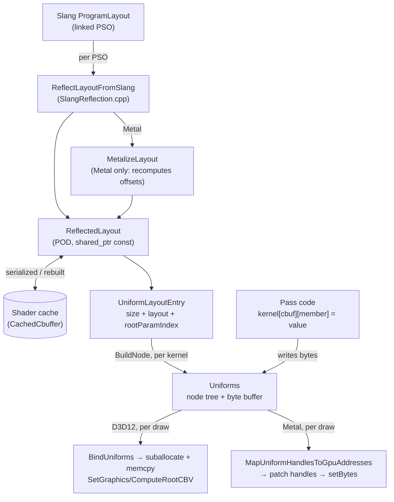

# Uniforms — the reflection-driven CPU mirror of a constant buffer

The uniforms layer is the CPU side of every constant buffer a shader declares. One `Uniforms` holds
a flat byte mirror of one cbuffer plus the reflected tree used to address it, so pass code writes
`kernel["cbuffer"]["member"] = value` and the backend uploads the bytes at draw or dispatch time. It
covers **constant buffers only** — structured-buffer contents go through `bgl_idlgen` instead, and
[Design Choices](#design-choices) is where that split is justified.

**This document is a map, not a mirror.** It captures design choices, topology, and the non-obvious
contracts — not full signatures. The header at each linked path is the source of truth; when this
doc disagrees, trust the header, then fix this doc.

---

## Design Choices

* **Bernini solves CPU/GPU layout parity twice, deliberately. Do not unify them.** Structured
  buffers go through [bgl_idlgen](docs/idlgen.md): one Slang IDL struct becomes a generated C++
  mirror carrying `static_assert(sizeof(...))` and per-field `static_assert(offsetof(...))`, and the
  CPU `memcpy`s it straight in — parity proven at compile time. Constant buffers do **not** work this
  way, and a change that "fixes" them to match would remove capability. Three reasons:

  1. **The layouts genuinely differ.** An `EntryBuffer<T>` element uses `ScalarDataLayout`
     ([EntryBuffer.slang](libs/bgl/shaders/src/types/EntryBuffer.slang)), which is what makes the IDL
     mirror `memcpy`-compatible. A `ConstantBuffer<T>` rounds vectors to 16-byte boundaries and pads
     between members, so the same struct cannot serve both.

  2. **Cbuffer contents change constantly during development.** A reflected mirror absorbs an added,
     removed or reordered field with no codegen round-trip.

  3. **Reflection lets one binder serve a family of PSO variants.** The load-bearing reason. The pass
     *asks the layout* whether a field exists instead of being compiled against a fixed struct, so
     variants declaring different subsets share one binder.
     [ForwardPass::BindKernel](libs/bgl/src/passes/ForwardPass.cpp) binds all `c_PsoCount` kernels
     through one function even though [Forward_Null.slang](libs/bgl/shaders/src/Forward_Null.slang)
     imports no `MaterialData` and has no `materialData` cbuffer at all. A `memcpy`'d IDL struct
     structurally cannot express "this variant has no such field".

* **The two regimes meet inside one shader struct.**
  [MaterialData.slang](libs/bgl/shaders/src/forward/MaterialData.slang) holds an
  `RawBuffer` of material records alongside ordinary `float3`/`float2` members: the outer struct is
  reflected and addressed by name, the elements the handle points at are compile-time-proven. Expect
  the guarantees to change at that boundary.

* **Layout is reflected once per PSO and shared; the mirror is per kernel.** `ReflectLayoutFromSlang`
  ([SlangReflection.h](libs/bgl/src/uniforms/SlangReflection.h)) walks Slang's cbuffer type layout
  into `ReflectedLayout`, a POD tree held by `shared_ptr<const>`. Carrying no Slang pointers is what
  lets it survive into the [shader cache](docs/shader_cache.md) and be rebuilt from disk without
  loading a Slang module. Each `Uniforms` then builds its own node tree and owns its own bytes.

* **Resources are bound as bindless indices written into the cbuffer, not as descriptor bindings.**
  Assigning a `BufferHandle` / `SrvHandle` / `SamplerHandle` / `TextureAssetHandle` writes that
  handle's `bindlessIndex` into an 8-byte `DescriptorHandle` field. D3D12 indexes a directly-indexed
  heap with it; Metal rewrites it to a native address at dispatch. The root signature therefore
  carries only CBVs — one root parameter per cbuffer, no descriptor tables
  ([PipelineLayout_d3d12.cpp](libs/bgl/src/d3d12/pipeline/PipelineLayout_d3d12.cpp)).

* **A kernel is a pipeline plus one `Uniforms` per declared cbuffer, keyed by name.**
  `IDevice::CreateComputeKernel` / `CreateMeshletKernel`
  ([Device.cpp](libs/bgl/src/device/Device.cpp)) enumerate the pipeline's cbuffer names and build a
  mirror for each. Pass code reaches uniforms only through the kernel.

---

## Interface Index

| Type | File | Role |
|---|---|---|
| `Uniforms` | [Uniforms.h](libs/bgl/src/uniforms/Uniforms.h) | One cbuffer's CPU mirror: byte buffer + reflected tree, `operator[]` by name or index, `HasMember` / `GetLayout` to introspect. Move-only. |
| `Uniforms::Accessor` / `ConstAccessor` | [Uniforms.h](libs/bgl/src/uniforms/Uniforms.h) | Cursor into the mirror: chainable `operator[]`, typed read/assign, `SetIfValid` for an optional write, `IsValid()`. Non-owning. |
| `FindUnknownMembers` | [Uniforms.h](libs/bgl/src/uniforms/Uniforms.h) | Resolves a binder's names against a whole PSO family, returning those no variant declares. Call once at family construction. |
| `ComputeKernel` / `MeshletKernel` | [ComputeKernel.h](libs/bgl/src/pipeline/ComputeKernel.h), [MeshletKernel.h](libs/bgl/src/pipeline/MeshletKernel.h) | Pipeline + per-cbuffer `Uniforms` map. `MeshletKernel` also offers `FindUniforms` / `ContainsUniforms`. |

### Supporting types

| Type | File | Role |
|---|---|---|
| `ReflectedLayout` / `ReflectedField` | [ReflectedLayout.h](libs/bgl/src/uniforms/ReflectedLayout.h) | Serializable POD tree of one cbuffer: kind, value type, size, array count/stride, `handleKind`. |
| `UniformLayoutEntry` / `UniformLayoutMap` | [UniformLayoutEntry.h](libs/bgl/src/uniforms/UniformLayoutEntry.h) | Shared layout + size + root parameter index, keyed by cbuffer name. |
| `UniformType` / `UniformValueType` | [UniformValueType.h](libs/bgl/src/uniforms/UniformValueType.h) | Node kind (array/struct/value/null) and leaf scalar type. |
| `DescriptorHandle` | [DescriptorHandle.h](libs/bgl/src/uniforms/DescriptorHandle.h) | The 8 bytes a bindless handle occupies. `alignas(8)` on Metal only. |
| `HandleSlot` / `MetalHandleOffsetMap` | [MetalPipelineReflection.h](libs/bgl/src/metal/pipeline/MetalPipelineReflection.h) | Metal-only side table: byte offset + pool kind of every handle field. |
| `c_SmartBufferUniformIndices` / `c_UnboundDescriptorIndex` | [constants.h](libs/bgl/src/constants/constants.h) | The member names the assignment operators search for, and the bindless index every allocator reserves. |

---

## Topology



---

## Threading & Synchronization

**`Uniforms` is not thread-safe and is mutated in place** — owned by the kernel, written by pass code
on the render thread, read by the command list during recording. Two threads recording draws from one
kernel would race on the same mirror; this is a design expectation, not an enforced one. The mirror is
not double-buffered either, but the bytes are copied into a per-frame upload suballocation at bind
time, so it is the suballocation the GPU reads and the mirror may be rewritten immediately after.

---

## Risky / Non-obvious Contracts

### Addressing and misses

* **`Uniforms::operator[]` does not throw on an unknown member.** @post it yields an accessor over a
  shared null node; only a later read or assignment throws (`std::runtime_error`). A bare
  `uniforms["typo"];` is silent. `Kernel::operator[]` is the exception — a map `at()` that throws
  `std::out_of_range` for an undeclared cbuffer; `MeshletKernel::FindUniforms` is the non-throwing
  form.

* **`IsValid() == false` is ambiguous at the call site; only a family disambiguates it.** It means
  *either* "this variant does not declare the field" (routine, the reason the design exists) *or*
  "the name is wrong" (a bug). `FindUnknownMembers` separates them: absent from *every* variant is a
  typo, absent from some is a per-variant field. @pre resolve a binder's names once when the family
  is built — `BinderNames` ([BinderNames.h](libs/bgl/src/passes/BinderNames.h)) is what every pass
  checks its cbuffers through from `Init`, and `SetIfValid` is the per-draw guard it licenses. A
  binder never validated this way has no protection against a shader rename.

* **Which of the two write spellings a member uses is the statement of whether it is optional.**
  `accessor.SetIfValid(v)` writes a member a variant may not declare and does nothing when it is
  absent; a bare `accessor = v` writes one that must exist and throws when it does not. There is no
  third form, so a member with no guard is a claim that every variant declares it.

* **`Uniforms::operator[]` on an empty or `Reset()` instance dereferences a null root.** @pre
  `IsEmpty()` is false; the accessor's null checks run after the first `Traverse`.

### Resource assignment

Each handle type finds its destination differently, and the rules are not symmetric:

* **`BufferHandle` into a struct** — @pre the struct is exactly 8 bytes; members are then searched
  **by name** against `c_SmartBufferUniformIndices` (`entryBuffer` / `packedBuffer` / `rangeBuffer` /
  `rawBuffer` / `handleBuffer`).
  @post throws if 8 bytes but carrying none of those names, so a new smart-buffer wrapper in Slang
  needs its member name added to that array.
* **`BufferHandle` into a value** — written directly when the leaf is `kDescriptorHandle`. The path a
  bare `ComputeBuffer<T>` takes, being a `typealias` for `RWStructuredBuffer<T>.Handle`.
* **`SrvHandle` / `TextureAssetHandle` / `SamplerHandle`** — bare-value only: written directly when
  the leaf is `kDescriptorHandle`, which is what a `Texture2D.Handle` / `TextureCube.Handle` /
  `SamplerState.Handle` member reflects as. @post a struct wrapping one throws — there is no member
  search, so nothing binds a texture into a smart-buffer wrapper by position.
* **`BufferSrvHandle`** — a second, structured view of a buffer, written by the same rule as a
  `BufferHandle`: only its `bindlessIndex` travels, so it lands in whichever smart-buffer member the
  target names.
* **`RawArenaBinding`** — a raw arena and the typed view of the *same* allocation, written as a
  pair: it assigns `["raw"]` and `["handles"]`, each of which is a struct of one handle and so lands
  through the `BufferHandle` rule above. One write rather than two because the two descriptors
  describe one buffer, and separate members can be handed different ones. `constants.h` gained
  `handleBuffer` for the second half.

`ReflectedLayout::handleKind` carries what would make these checkable, but is **populated on Metal
only** — on D3D12 a handle reflects as a bare `uint2` and the declared type is lost.

### Values and types

* **`UniformValueType::kDescriptorHandle` is an alias for `kUInt2`.** @post a genuine `uint2` and a
  bindless handle are the same value to the type check, in both directions.

* **Index 0 is the unbound sentinel; no resource is ever allocated there.** The mirror is zero-filled,
  so an unassigned handle field reads index 0. Every allocator feeding a bindless handle reserves it —
  the D3D12 descriptor heaps
  ([DescriptorAllocator_d3d12.cpp](libs/bgl/src/d3d12/resource/DescriptorAllocator_d3d12.cpp)) and the
  Metal buffer/texture/sampler pools
  ([ResourceManager_metal.cpp](libs/bgl/src/metal/resource/ResourceManager_metal.cpp)) — so "never
  bound" cannot collide with "bound to the first resource handed out". @pre a new bindless-addressable
  pool must reserve `c_UnboundDescriptorIndex` too, or it reopens the hole.

### Lifetime and binding

* **Uniforms persist across frames.** @post a value written last frame stands until overwritten,
  which both keeps a partially-bound kernel from failing loudly and makes a stale value possible.
  [docs/rhi.md](docs/rhi.md) requires a kernel's uniforms be fully populated before
  `SetComputeState` / `SetMeshletState`; nothing enforces it.

* **The whole cbuffer is re-uploaded on every draw and dispatch** — no dirty tracking, and Metal
  copies it a second time to patch handles.

* **`GetRootParamIndex()` is a D3D12 concept.** @post Metal leaves it invalid and resolves per-stage
  `[[buffer(N)]]` indices through `MetalStageBindingMap`, because each meshlet stage is compiled as
  its own program. Do not read it on Metal. `Reset()` also leaves it stale.

---

## The Metal layout hazard

Metal reflection cannot report a handle-bearing cbuffer's byte layout: a bindless handle is a
resource, invisible to the ordinary-data category, so the cbuffer measures zero bytes there while the
emitted MSL lays each handle out as an 8-byte device pointer. `MetalizeLayout`
([MetalPipelineReflection.cpp](libs/bgl/src/metal/pipeline/MetalPipelineReflection.cpp)) therefore
**discards the offsets, sizes and strides `ReflectLayoutFromSlang` produced and recomputes them from
a hand-written model of MSL's alignment rules.**

The consequence to carry: **`ReflectedField::offset` has two provenances** — what Slang reported on
D3D12, what bgl *predicted* the Metal compiler will do on Metal. There is no `static_assert`
equivalent; the IDL layer proves its parity, this one asserts it, and only golden-image tests catch
drift.

**`bool` is rejected rather than guessed at.** Slang's MSL `bool` ABI is unverified and a wrong
alignment displaces every member after the field, so `MetalAlign` calls `gfatal` on `kBool` instead of
falling through to its 4-byte default. @post a `bool` in a constant buffer aborts on Metal with a
message naming the fix — use `uint` or `float`, as [TaaResolve.slang](libs/bgl/shaders/src/TaaResolve.slang)
does. Lifting it needs a test pinning the emitted offsets against the GPU.

**The Metalized layout is what the shader cache stores.** @pre a change to `MetalizeLayout` or
`MetalAlign` must bump `c_CacheFormatVersion` in
[ShaderCache_metal.cpp](libs/bgl/src/metal/shadercache/ShaderCache_metal.cpp), or a warm cache keeps
the old layout and the change appears not to work.

---

## Usage Sketch

```cpp
MeshletKernel kernel = device->CreateMeshletKernel(desc);

// Once per family, not per draw: a name no variant declares is a typo that binding cannot report.
constexpr std::array c_Names     = { "viewProj"sv, "prevViewProj"sv };
const Uniforms*      variants[]  = { kernel.FindUniforms("viewData") };
gassert(FindUnknownMembers(variants, c_Names).empty(), "viewData binder names a missing member");

kernel["viewData"]["viewProj"] = draw.viewState.viewProj;

// Optional members: guard with IsValid(), which is false for a variant that omits the field.
if (auto found = kernel.FindUniforms("materialData"))
{
    auto& matData = *found;
    matData["materials"] = resources.GetBuffer("scene.materialArenaBuffer");  // writes an index

    if (auto u = matData["irradianceMap"]; u.IsValid())
    {
        u = draw.lighting.env.irradiance;
    }
}

state.kernel = &kernel;  // must outlive the recorded draw
cmd->SetMeshletState(state);
```

For a table-driven binder over a fixed set of scene buffers — preferable to repeated guarded
assignments — see `BindSceneBuffers` in
[SceneBindings.h](libs/bgl/src/passes/SceneBindings.h). The fullest call site is
[ForwardPass.cpp](libs/bgl/src/passes/ForwardPass.cpp); offsets and types are pinned in
[Uniforms_test.cpp](libs/bgl/tests/src/Uniforms_test.cpp) and
[BindlessIndex_test.cpp](libs/bgl/tests/src/BindlessIndex_test.cpp).

---

> **Maintenance:** the tables and file links above rot silently when files move, and the contracts
> track specific constants (`c_SmartBufferUniformIndices`, `c_CacheFormatVersion`). Re-check both
> when the layer changes.
