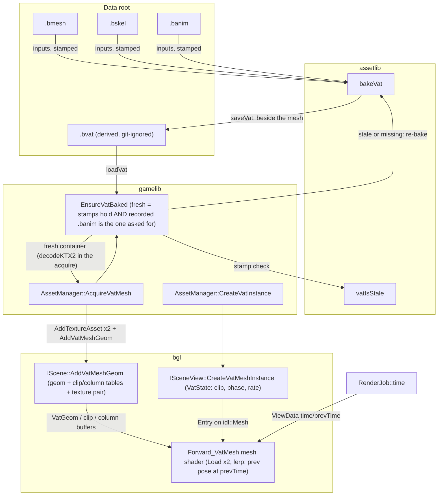

# Vertex Animation Textures — a rig's clips baked to textures, drawn as crowds

VAT trades per-unit animation cost for texture memory: every vertex of every submesh is
CPU-skinned once, offline, at every frame of every clip, and the results land in a position/normal
texture pair. At draw time the mesh shader fetches the pose by (vertex column, frame row) instead
of reading vertex bytes or skinning — no bones on the GPU, no per-instance CPU work, and the only
per-frame input is a clock. The subsystem spans all three layers: `assetlib` bakes and stores
(`.bvat`), `bgl` draws, and `gamelib` is the seam that loads one into a scene.

**This document is a map, not a mirror.** It captures design choices, topology, and the
non-obvious contracts — not full signatures. The header at each linked path is the source of
truth; when this doc disagrees, trust the header, then fix this doc.

---

## Design Choices

* **Playback state is GPU-resident; time is the only per-frame input.** An instance's record
  (clip, phase, rate) is written once at spawn into a `VatState` entry; the shader derives the
  frame as `phase + time * rate * sampleRate` from the clock in `RenderJob::time`. Nothing touches
  instances per frame — crowd variation (stagger, rate jitter) falls out of the spawn fields. The
  clock is caller input by design: pause, slow-motion, scrubbing and replay are the application's
  policies, and the renderer only draws *at* a time.
* **One `.bvat` per (rig, clip set), textures embedded.** The texture pair is a pure derivative
  of one rig's clip set, never shared, so it is embedded in the container as KTX2 payload chunks
  rather than referenced as files — nothing to hash-name, nothing for prune to learn, deleting the
  asset is deleting the file. Positions are `R16G16B16A16_UNORM`, unorm-packed in **one AABB closed over
  every frame of every clip**; normals `R8G8B8A8_UNORM` as `xyz * 0.5 + 0.5`.
* **A `.bvat` is a build product, not an asset.** Wholly derived from the three inputs it stamps
  (`.bmesh`, `.bskel`, `.banim`), git-ignored, written beside its mesh and named for the pair —
  `<mesh>@<clips>-<hash>.bvat`, `assetlib::vatPathFor` — so each clip set bakes once and switching
  between them re-bakes nothing. Re-baked — never errored — when `vatIsStale` says an input moved,
  when it was baked from a different `.banim` than the one requested, *or* when it will not parse at
  all, which a container written before a major bump does not (`game::EnsureVatBaked` owns that
  rule). The editor's Content Explorer does not list it, and deleting any of its inputs
  sweeps it rather than being blocked by it (`DeletionPlan::derived`). `SourceStamp` is
  `{size, content-hash}`, so a checkout that rewrites mtimes without changing bytes re-bakes
  nothing.
* **Clips stack along V; each is padded with a duplicate of its *last* frame.** Frame `f` of a
  clip is row `firstRow + f`; the pad row exists so fractional-frame blending never bleeds into
  the clip stacked below. It is clamp-shaped: a looping clip's seam must **wrap the upper row
  index onto frame 0**, never read the pad — which the `Load`-based fetch makes a one-index
  select ([Forward_VatMesh.slang](libs/bgl/shaders/src/Forward_VatMesh.slang)).
* **Fetch is `TextureHandle::Load` by exact texel, not a sampler.** A vertex's column is always
  exact, so filtering buys nothing along U — and a `SamplerState.Handle` inside a mesh-stage
  cbuffer creates a Mixed-category parameter Metal's stage-binding path mis-indexes. Fractional
  frames are two Loads and a lerp.
* **The linkage rides `idl::Mesh`, not the sort key.** Each placement's GPU record carries an
  `Entry<VatState>` (null for static meshes — it occupies alignment padding, so `sizeof` is
  unchanged); `SubmeshInstance` keeps its 16 bytes, and its `pso` remains the one derived sort key
  (`SubmeshPso(geomType, material)`). The geometry family is `GeomType::kVatMesh`, one PSO bucket
  (`kOpaque_VatMesh_PBR`) sharing the PBR pixel stage untouched — the same arrangement the skinned
  tier uses for `kOpaque_SkinnedMesh_PBR`.
* **Every VAT door demands opaque `kPBR`.** No null, cutout or loose variant of the VAT pipeline
  exists, so `AddVatMeshGeom`, `SetSubmeshMaterial` and `SetSubmeshMaterialOverride` all refuse
  anything else — which is what keeps the single bucket total.
* **Motion vectors are the pose re-evaluated at `prevTime`.** The instance transform is
  immutable, so the previous frame's clip-space position is one extra position fetch through
  `prevViewProj` — real velocity from day one, because TAA ghosting on the majority path is not
  optional. `time`/`prevTime` ride `ViewMatrices`, so the camera pair and the clock pair advance
  atomically.
* **Culling bounds come from the bake's box, not the bind pose.** Every submesh's sphere is the
  all-clips AABB's — conservative for any frame of any clip; bind-pose bounds pop the moment a
  limb moves.
* **No baked tangent.** The import does derive bind-pose tangents into the mesh's vertex bytes,
  but a bind-pose basis is wrong the moment a limb rotates — so the VAT path deliberately ignores
  them, emits the degenerate tangent, and the pixel guard falls back to the geometric normal.
  Normal maps are inert on this tier by design.
* **The skeletal side-channel ships in the container.** Each real frame's skinning palette is
  baked (`BVat::palettes`, addressed per clip) for future attachments/GPU consumers; nothing on
  the GPU reads it yet.

## Interface Index

### assetlib — bake and container
| Interface | File | Role |
|---|---|---|
| `bakeVat` (in-memory + `VatBakeDesc` overloads) | [libs/assetlib/include/assetlib/vat_bake.h](libs/assetlib/include/assetlib/vat_bake.h) | CPU-skin every vertex at every frame; pack, pad and encode the texture pair |
| `vatIsStale` / `normalizePath` | [libs/assetlib/include/assetlib/vat_bake.h](libs/assetlib/include/assetlib/vat_bake.h) | Compare the container's input stamps against the disk — the stamp half of the bake-on-demand trigger — and the path form the container records |
| `saveVat` / `loadVat` / `loadVatTables` / `loadVatRefs` | [libs/assetlib/include/assetlib/bvat_io.h](libs/assetlib/include/assetlib/bvat_io.h) | Container round-trip; tables-only and refs-only seek reads for scans |
| `vatPathFor` | [libs/assetlib/include/assetlib/vat_bake.h](libs/assetlib/include/assetlib/vat_bake.h) | Where a (mesh, clip set) pair's bake lives — one file per pair, moved by renameAsset when a rename changes the derivation |
| `assetlib_cli bakevat` | [libs/assetlib/cli](libs/assetlib/cli) | The CLI door over `bakeVat` + `saveVat` |

### bgl — draw path
| Interface | File | Role |
|---|---|---|
| `IScene::AddVatMeshGeom` (BMesh overload) | [libs/bgl/include/bgl/IScene.h](libs/bgl/include/bgl/IScene.h) | One cooked mesh as VAT geometry: per-submesh column bases, all-clips culling spheres |
| `IScene::AddVatMeshGeom` (array overload) | [libs/bgl/include/bgl/IScene.h](libs/bgl/include/bgl/IScene.h) | The procedural door: raw bind-pose vertices, single submesh — what tests synthesize through |
| `ISceneView::CreateVatMeshInstance` | [libs/bgl/include/bgl/ISceneView.h](libs/bgl/include/bgl/ISceneView.h) | Place an instance spawned on a clip/phase/rate |
| `RenderJob::time` | [libs/bgl/include/bgl/RenderJob.h](libs/bgl/include/bgl/RenderJob.h) | The animation clock, in seconds |

### gamelib — the seam
| Interface | File | Role |
|---|---|---|
| `AssetManager::AcquireVatMesh` | [libs/gamelib/include/gamelib/AssetManager.h](libs/gamelib/include/gamelib/AssetManager.h) | Load the `.bvat` beside a mesh — or bake it there — and stand the geom up with its materials |
| `EnsureVatBaked` | [libs/gamelib/include/gamelib/vat_freshness.h](libs/gamelib/include/gamelib/vat_freshness.h) | The freshness rule's one home: return the pair's `.bvat` fresh, re-baking in place when stale — pure assetlib, safe off the render thread |
| `AssetManager::CreateVatInstance` | [libs/gamelib/include/gamelib/AssetManager.h](libs/gamelib/include/gamelib/AssetManager.h) | `CreateInstance`'s VAT twin; same reference edges, same `DestroyInstance` |

### editor — the Animation panel

The panel is the worked example of the clock design choice above: the *application* owns the
clock, and here the application is the panel. Its transport advances by wall time while playing,
and every change — tick, scrub, frame step, clip switch — reaches the viewport through
`RenderTargetWindow::SetTime`, the seam that feeds `RenderJob::time` the way `SetCamera` feeds the
camera. The preview's instances are always `{clip, phase 0, rate 1}`, which is what lets the
transport be pure time arithmetic: seconds are the whole story, a clip switch is destroy +
recreate (there is no mutate-instance API), and a `.banim` switch reloads the mesh naming the new
file, releasing the geom to zero — which is what a live geom's refusal of a different clip set
requires. A viewport nobody clocks
draws at time zero, freezing VAT instances on their phase — the level viewport's state today,
until placement playback gives it a clock of its own.

| Interface | File | Role |
|---|---|---|
| `RenderTargetWindow::SetTime` | [apps/editor/src/Windows/RenderTarget/RenderTargetWindow.h](apps/editor/src/Windows/RenderTarget/RenderTargetWindow.h) | The `RenderJob::time` seam a panel clocks its viewport through |
| `ResolveAnimationBindings` | [apps/editor/src/Windows/AnimationEditor/animation_bindings.h](apps/editor/src/Windows/AnimationEditor/animation_bindings.h) | A mesh's `.banim` candidates, as a query over the reference graph's `kClipSkeleton` edges |
| `AnimationPreviewWindow` | [apps/editor/src/Windows/AnimationEditor/AnimationPreviewWindow.h](apps/editor/src/Windows/AnimationEditor/AnimationPreviewWindow.h) | The viewport: skinned entries as VAT instances, statics beside them, bind pose when no clip file resolves or the pipeline refuses one |

### Supporting types
| Type | File | Role |
|---|---|---|
| `BVat`, `VatClip`, `VatColumns` | [libs/assetlib_structs/include/assetlib_structs/BVat.h](libs/assetlib_structs/include/assetlib_structs/BVat.h) | The container: bounds, tables, palettes, embedded KTX2 payloads |
| `VatGeomDesc`, `VatClipDesc`, `VatVertex` | [libs/bgl/include/bgl/IScene.h](libs/bgl/include/bgl/IScene.h) | What a decoded `.bvat` (or a test) hands the scene — bgl never reads the container itself |
| `ISceneView::VatInstanceDesc` | [libs/bgl/include/bgl/ISceneView.h](libs/bgl/include/bgl/ISceneView.h) | The spawn record: clip, phase (fractional frames), rate (0 freezes) |
| `AssetManager::VatMesh`, `VatClipInfo` | [libs/gamelib/include/gamelib/AssetManager.h](libs/gamelib/include/gamelib/AssetManager.h) | An acquire's result: the geom plus the clip table to pick from |
| `idl::VatGeom`, `idl::VatState` | [libs/bgl/idl/src](libs/bgl/idl/src) | The GPU records (IDL-generated; regenerate with `just idl`) |
| `idl::Clip` | [libs/bgl/idl/src/Clip.slang](libs/bgl/idl/src/Clip.slang) | One clip's frame span and rate, **shared with the skinned tier** — `firstFrame` is a texture row here. Both tiers allocate out of one `scene.clipBuffer`. |

## Topology



## Risky / Non-obvious Method Contracts

### `assetlib::bakeVat`
* **Refuses what cannot animate** — @pre at least one submesh carries joint indices, the clip set
  is non-empty and signature-matched to the skeleton; @post the texture dimensions are within
  `c_MaxVatTextureDim` (16384) or it throws naming the count that broke it. The desc overload
  records the three input paths and stamps; the in-memory one leaves them empty — a `BVat` that
  was never stamped is *always* stale.

### `IScene::AddVatMeshGeom`
* **Textures must be live assets of this scene** — @pre both handles came from `AddTextureAsset`
  and are undeleted; the record bakes their descriptors, and on Metal a retired slot aborts the
  next frame, not just misrenders.
* **`columnBases` is positional truth** — @pre one entry per submesh, in submesh order, from the
  bake's `VatColumns`. bgl cannot cross-check them against the texture; wrong bases read wrong
  columns silently.
* **Deleting the geom does not delete the textures** — they were the caller's `AddTextureAsset`
  handles and remain the caller's to delete, *after* `DeleteGeom` (gamelib's release chain does
  this in order: geom → materials → texture pair).

### `ISceneView::CreateVatMeshInstance`
* **`desc.clip` is validated against the geom's clip table** at creation; phase and rate are not
  clamped — the shader wraps or clamps per clip at sample time. `rate = 0` (or a caller that
  never sets `RenderJob::time`) freezes the instance at `phase`.

### `AssetManager::AcquireVatMesh`
* **Bake-on-demand writes to the data root** — @post a missing or stale `.bvat` is baked from
  `relPath` + `animationsRelPath` and saved beside the mesh. The bake is seconds of CPU skinning;
  call it accordingly (load screens, not per-frame). `game::EnsureVatBaked` is that step alone —
  no upload, no bgl — for a caller that wants the bake on a worker thread first and the acquire
  after.
* **Stale includes the animations path** — a container whose recorded `.banim` is not the one
  requested is never returned. With one bake file per pair the mismatch only arises from a name
  collision or a hand-copied file, and it degrades to a re-bake, never to loading wrong clips.
* **A live geom refuses a different `.banim`** — @pre while the geom is shared, every acquire must
  name the clip set it was first acquired with, or it throws: the fast path returns the cached
  clip table without reading the container. Switching clip sets means releasing the geom to zero
  first — the eviction is what lets the freshness check see the new request.
* **A mesh with non-opaque or loose materials cannot be acquired as VAT** — the per-submesh
  opaque-`kPBR` rule surfaces here as a throw *after* the bake and material acquires; the unwind
  releases everything taken, so a failed acquire owns nothing.

## Usage Sketch

```cpp
auto assets = game::AssetManager(scene, dataRoot);

// Loads the pair's bake beside the mesh, or bakes it from the mesh + clips if missing/stale.
const auto vat = assets.AcquireVatMesh("Meshes/coyote.bmesh", "Animations/coyote.banim");

for (uint32_t i = 0; i < c_CrowdSize; ++i)
{
	auto spawn  = bgl::ISceneView::VatInstanceDesc();
	spawn.clip  = c_RunClip;             // index into vat.clips
	spawn.phase = float(i % 30);         // stagger identical units for free
	spawn.rate  = 0.9f + 0.2f * Rand01();
	assets.CreateVatInstance(view, vat.geom, WorldOf(i), spawn);
}

// Per frame: the clock is the only input. Nothing touches instances.
job.time = appClock.Seconds();
gfx->DrawFrame(target, job);
```

The end-to-end test at
[libs/gamelib/tests/src/VatAcquire_test.cpp](libs/gamelib/tests/src/VatAcquire_test.cpp) is the
runnable reference: rig synthesized to disk, baked on demand, drawn and asserted on pixels.

---

Maintenance: the file links above rot silently if files move — re-check them when the layout
changes.
