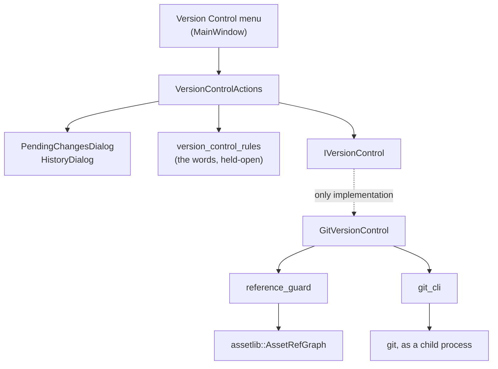

# Version Control in the editor

An artist submits their work, gets everybody else's, and undoes a mistake, without leaving the
editor and without learning what a commit is. The menu says **Version Control** — *Get Latest*,
*Submit Changes…*, *History…*, *Revert All Unsubmitted Changes…* — and nothing it shows says *git*.

**This document is a map, not a mirror.** The source at each linked path is the source of truth;
when this doc disagrees, trust the source, then fix this doc.

---

## Design Choices

* **The `git` command line, driven through `QProcess`.** Not `libgit2`, which vcpkg carries and
  which would link cleanly: it has a filter API but no LFS filter, so a commit made through it
  stores raw binary where a pointer belongs and a checkout leaves pointer text in place of a mesh
  ([lfs.md](lfs.md)). The command line inherits `.gitattributes`, the credential helper and this
  project's standalone transfer agent for nothing. It also keeps a parser of untrusted repository
  data out of `editor.exe`.

  There is no Qt git panel to drop in, either — the survey found standalone GPL applications, IDE
  plugins welded to their host, and libgit2 wrappers, and nothing embeddable.

* **The UI never learns the vocabulary.** *Get Latest*, *Submit*, *Revert*, *History*, *Undo* — the
  words artists already have from Perforce. A backend swap must not rename a menu, so no message any
  implementation produces reaches the user: the seam hands the UI a **status and a list of assets**,
  and [`version_control_rules`](../apps/editor/src/Windows/VersionControl/version_control_rules.h)
  writes every sentence. That file is where the words live, and a test walks every status asserting
  each has words of its own and that none of them says "git", "commit", "push" or "HEAD".

* **Submit is one action.** It records and publishes together, and checks the shared project has not
  moved **before** recording anything. A local commit that cannot be pushed is work that looks saved
  and is not, which is the one failure an artist cannot diagnose.

* **Get Latest fast-forwards or refuses.** Never a merge, never a rebase. A fast-forward is the only
  update that *cannot* produce a conflicted tree, so "refuse rather than strand" is achievable rather
  than aspirational. Two people who have both submitted need a person, not a dialog.

* **Undo makes a new submission.** Restoring an earlier state is recorded as the newest entry; the
  undone one stays in the history. Rewriting instead would diverge the project from the shared one,
  and under fast-forward-only a diverged project can never publish again — the undo would be the
  last thing that artist ever managed to do.

* **Nothing deletes an asset another still needs.** Two people can each be right and break the
  project between them: one drops a texture nothing of theirs uses, the other has a material routing
  from it. Every verb that removes anything asks
  [`assetlib::AssetRefGraph`](../libs/assetlib/include/assetlib/asset_refs.h) first — the same graph
  the Content Explorer's delete consults — and refuses, naming each asset it would have removed
  *and* what still needs it: `Squirrel.bskel (used by Squirrel.banim)`. The two are carried in
  separate lists rather than one, because a referrer is staying put and listing it among the
  removals says the opposite.

* **Reverting is the one thing with no way back.** Every other action can be undone from the
  history; throwing away unsubmitted work cannot, because there is nowhere it was ever kept. It is
  offered twice — per asset in the Submit dialog, and for the whole project from the menu — and both
  ask the same question, written once in `version_control_rules`.

* **Nothing writes over an asset a window has open.** A window writes its copy back on its next
  Save, so a change made underneath it silently reverts. The windows are asked afresh before each
  change, so there is no cached answer to go stale.

* **An existing repository only.** Whoever set the project up cloned it and configured LFS and
  credentials. On a project that is not in one, the menu still opens and its entries are greyed out,
  each saying why in the status bar — the answer belongs where the question is asked, which is what
  the Render menu's disabled entries already do.

---

## What is where

| | |
|---|---|
| [`git_cli`](../apps/editor/src/VersionControl/git_cli.h) | runs `git`, finds the repository |
| [`contained_path`](../apps/editor/src/VersionControl/contained_path.h) | the one containment check: is this path inside that root |
| [`IVersionControl`](../apps/editor/src/VersionControl/IVersionControl.h) | the seam: seven verbs, `VersionControlOutcome`, `PendingChange`, `Submission` |
| [`GitVersionControl`](../apps/editor/src/VersionControl/GitVersionControl.h) | the only implementation |
| [`reference_guard`](../apps/editor/src/VersionControl/reference_guard.h) | which deletions would leave a reference dangling |
| [`open_version_control`](../apps/editor/src/VersionControl/open_version_control.h) | the one place a backend is chosen |
| [`version_control_rules`](../apps/editor/src/Windows/VersionControl/version_control_rules.h) | every sentence the user reads, and the held-open check |
| [`VersionControlActions`](../apps/editor/src/Windows/VersionControl/VersionControlActions.h) | what the menu does |
| `PendingChangesDialog`, `HistoryDialog` | passive: they decide, the caller acts |

---

## The refusals

A **refusal** is an ordinary answer the user acts on, and rides in the return value. An **exception**
means the project could not be read at all — not something the user chose, and reported by the
loading screen as a failure.

| status | what happened |
|---|---|
| `kNoIdentity` | nobody has said who is submitting |
| `kNothingToDo` | nothing chosen, or nothing to get |
| `kCouldNotReachShared` | the shared project could not be reached |
| `kWorkHasMovedOn` | Submit / Undo: somebody else submitted first |
| `kWouldNotFastForward` | Get Latest: both sides have submitted |
| `kAssetsInTheWay` | unsubmitted work would be written over |
| `kAssetsStillInUse` | a removal would leave something pointing at nothing |
| `kAssetsChangedSince` | Undo: later submissions changed the same assets |

---

## Contracts worth knowing

**`RunGit` takes paths in their own parameter**, appended after `--`. An artist may name an asset
`-o`, and git reads a leading dash as an option. Passing paths inside `arguments` is the one way to
lose that guarantee, and every path should have crossed `RepositoryRelativePath` first.

**`git` is resolved once to an absolute path.** On Windows `CreateProcess` searches the working
directory before `PATH`, and the working directory here is a project root full of files that arrived
with the assets.

**Roots are resolved before they are compared.** `git rev-parse --show-toplevel` reports a path with
its symlinks already resolved and the project does not, so comparing them as written puts every asset
outside its own data root — and a guard that finds nothing permits everything.

**A `RunGit` result is never discarded.** A failed stage reads as "nothing to submit"; a failed
unrecord leaves work that looks published. `src/VersionControl/*.cpp` compiles with
`-Werror=unused-result` (`/we4834`) for exactly this, since `editor_lib` as a whole does not turn
warnings into errors.

**Every asset in the project must be readable** once a deleting verb runs, because the reference
graph refuses to guess at a container it cannot parse. One corrupt `.bmaterial` blocks Get Latest
until it is fixed. That is `assetlib`'s deliberate choice — edges nobody can see are edges an update
would delete through — inherited here.

---

## Testing

`just run editor_tests -- "[vcs]"`. The suite builds real repositories in a temp directory with the
git command line — a bare origin and two clones, so one publishes and the other finds out. Nothing
is mocked; `RunGit` is exercised on the way in as well as on the way out.

The dialogs are passive, so they are driven directly: construct one with a list of changes, tick
boxes, click buttons, read what it decided. No repository is involved, and `exec()` is never called.

A stub asset is not enough for anything that reaches a deleting verb — the reference graph reads
every mesh and material in the project. Write a real container (`assetlib::save(BMesh{}, …)`) or use
a texture, which the scan never parses.
