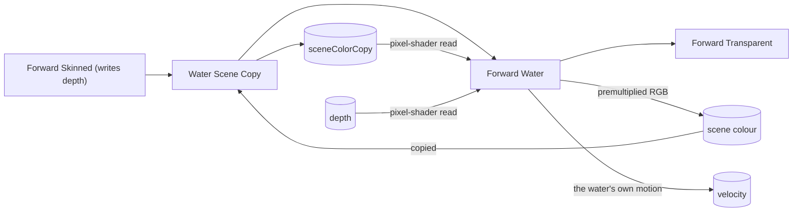

# Water

A water body is a static mesh drawn through a water surface: a plane for a lake or a sea, a ribbon
for a river, placed like any other instance. The game writes the look, as it writes a terrain's; the
engine draws it over the scene in a phase of its own, and hands the surface the things of the frame
a stylised water is made of: how far the scene behind it is, how deep the ground under it is, the
clock, and the scene behind it seen through a displacement the surface chooses. This page is the
map: the contract, the pass, what the reader measures, how it refracts, and what is deliberately not
here. The test project's `Authored/Shaders/ToonWater.slang` is a reference look;
`examples/bgl_water` draws it as a sea over generated hills, and `bgl_ai_viewer --terrain hilly
--water <bmaterial>` renders and times it ([AI Viewer](ai_viewer.md)).

## The contract

[bgl/WaterSurfaceSource.slang](../libs/bgl/shaders/include/bgl/WaterSurfaceSource.slang) is the
fourth surface contract beside those in [Game-Defined Surfaces](game_defined_surfaces.md):

| Contract | Reader | Returns | Document model |
|---|---|---|---|
| `IWaterSurfaceSource` | `IWaterMaterialReader` | `float4`: pre-exposure radiance, and how much of the scene behind it hides | `waterSurface` |

The parameter struct keeps every rule a surface's does: values and slots, `[Default]`, `[Color]`,
registration by file stem in `Authored/Shaders/`. There is no `Coverage`: water has no alpha
layer, so a water material is opaque-moded and `CreateSurfaceMaterial` refuses it `mask`, `hashed`
or `blend` -- the blend is the pass's, from `Shade`'s alpha. `doubleSided` reads as for any surface:
off for a plane seen from above, on for a river ribbon seen from the bank. It is lit through the
same `ISurfaceLight` as a lit surface: the sun, the irradiance, the blurred environment.

`IWaterMaterialReader` is `IMaterialReader` and four methods more:

| | measures | from |
|---|---|---|
| `ViewDepth()` | metres from the water to the opaque scene behind it, along the view ray | the depth buffer, reconstructed through the view's jittered `invViewProj` |
| `GroundDepth()` | metres from the water straight down to the terrain | `TerrainHeightAt` ([Terrain § Reading the ground](terrain.md#reading-the-ground)) |
| `Time()` | the view's clock, in seconds | the draw's clock |
| `Behind(offset)` | the opaque scene behind the pixel displaced by `offset` in viewport UV: its colour before exposure, and its `ViewDepth` | Water Scene Copy's copy of scene colour, and the depth buffer ([Refraction](#refraction)) |

Where there is nothing to measure to -- the sky behind the water, or no terrain under it -- both
depths return 1e6. `GroundDepth` gives a shore band one width in the world from any angle; a band
by `ViewDepth` thins as the view grazes the water, but it is the one that sees what is not ground:
the ring around a unit wading, the foot of a rock. That ring is widest on the side facing the
camera, because its reach is measured along the ray. `GroundDepth` reads the first of up to four of
the view's terrains whose footprint holds the pixel; a fifth terrain is not read.

Which surfaces may not draw water: a terrain, a grass look and skinned geometry all refuse a water
surface by name, and the shared blend program has no arm for one.

## The pass

**Forward Water** ([passes/WaterForwardPhase.cpp](../libs/bgl/src/passes/WaterForwardPhase.cpp))
draws between Forward Skinned and Forward Transparent ([Passes](passes.md)), when the view has
placed water at all. By then the depth holds the terrain, the world, the grass and the characters.

* **No depth is attached.** The transparent pipeline attaches depth for its test, bgpu has no
  read-only depth view, and Metal cannot sample the attachment being drawn to, so the water pass
  does what Blob Shadows does: it reads `depth` as a texture and discards where the scene is
  nearer than the water. The depth is not copied; scene colour is, for refraction.
* **Its buckets are the static tier's,** keyed like any surface's, `(kStaticMesh, slot, kOpaque)`:
  what marks one as water is its slot's contract (`ForwardPhases::IsWaterBucket`), and Forward World
  skips those. Culling, compaction, levels of detail and the dissolve lane are the world's; each
  bucket is one indirect dispatch per lane over the compaction's output.
* **Colour blends premultiplied, alpha masked out.** `GameWaterProgram` weights `Shade`'s rgb by
  its alpha; scene colour's alpha is the TAA marker its ground wrote, and since the depth it
  vouches for is still the ground's, the marker is left as it was.
* **Velocity is the water surface's own,** unblended: a still lake under a still camera writes
  zero motion, and under a moving one reprojects as any static surface does.
* **`waterData`** is the one constant buffer only water programs carry
  ([lib/forward/WaterData.slang](../libs/bgl/shaders/src/lib/forward/WaterData.slang)): the depth,
  its reconstruction, the scene colour copy, the clock and the view's terrains. `ForwardPhases::BindKernel` binds it into
  every kernel that declares it.

A sea covering more than half of a 1920x1080 frame over the viewer's hilly field (`--water-level
30 --terrain-eye 120`), drawn through the test project's refracting `ToonWater`, costs 0.39 ms
median on an M3 Pro: Water Scene Copy 0.09 ms and Forward Water 0.29 ms. The same sea before
refraction cost Forward Water alone 0.24 ms, and the terrain's share is unchanged.

`WaterRender_test` proves it at the pixel: the depth bands where the ground puts them, dry ground
hiding the water, foam at the shore and around a sunk ball, zero motion, the TAA marker left as the
ground's, and a second view's water reading the scene's terrain.

## Refraction

Forward Water draws into scene colour, so it cannot sample it. **Water Scene Copy**
([Passes](passes.md#water-scene-copy)) copies it first, after everything opaque has drawn, into a
texture the target owns at the render size. The copy is made the first frame the target draws water,
so a target that never does allocates nothing, and the pass runs only on a view that places water.
What the copy holds is what refraction can show: the terrain, the world, the grass, the blob shadows
and the characters. Transparents draw after water and are not in it, and neither is another water
body, because one copy serves the whole phase.

`Behind(offset)` reads the copy at the pixel displaced by `offset`, a fraction of the viewport in
each axis, x right and y down. How far to bend is the surface's call: a look typically takes its
ripples' normal and scales it down with distance, so a far lake does not swim. The colour comes back
before exposure, so it composes with `Shade`'s own radiance, and a surface that refracts tints it
itself and returns the result with an `a` of 1: the blend then leaves the water's colour alone on
the screen. Two guarantees hold:

* **Nothing in front bleeds in.** Where the displaced pixel shows something nearer than the water,
  such as a leg standing in it, `Behind` reads the pixel straight behind instead, which is never
  nearer, or the water would have been discarded there.
* **The read stays on the view.** The displaced pixel is clamped to the view's own viewport, so a
  bend at the edge of one view never reads another view of the same target.

`viewDepth` is measured at the displaced pixel, so a look that tints by depth tints what it shows.

## Not here

Each is a decision, not an omission:

* **No view from under the water**: no fog, and no refraction looking up through the surface.
* **No screen-space or planar reflections.** The sky tint is the environment, blurred.
* **No vertex displacement, simulation, splashes or caustics.**
* **Water writes no depth**, so a transparent drawn below the surface composites over it.
* **A blob shadow lands on the lake bed** and shows through the water, tinted by it.
* **No received sun shadow**: the engine has no shadow maps, and `ISurfaceLight` carries none.

## Where the next pieces go

* **Simulation**: a displacement texture and a water mesh stage building patches from it, as
  `programs/forward/Terrain.slang` builds them from the height texture, drawing through the same
  pixel contract.
* **Splashes**: the GPU particle system on the roadmap, composited in the transparent phase, which
  already runs after water.
* **A simulated foam mask** replacing the depth band, through a slot.
* **Buoyancy**: the simulation's height read on the CPU, as `terrain::HeightAt` reads the ground.
